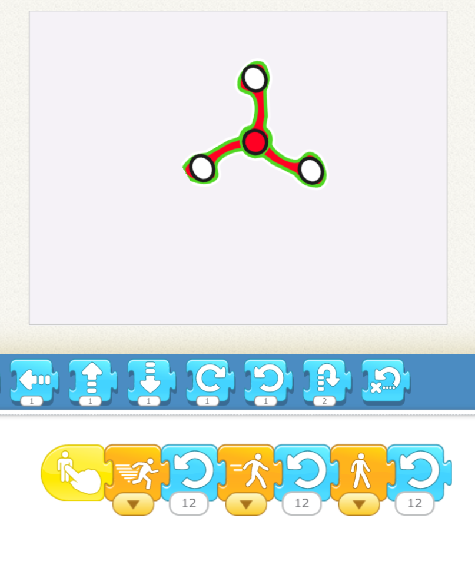

## July 10th

## July 10th

### Review the Under the Sea

We reviewed the homework projects. 

[Download](./scratchProjects/Y1Q15UndertheSea.sjr)

### Initializiing a character

To set the initial position, visibility, or size of a character:

* **manually** change the position of the character. 

  
Note in the gif above, if I use a block to change the position, it returns when I press the return button. If I manually move it, it stays.

* **manually** change the visibility 

* **manually** change the size 

This is useful if you want a character to start off small, or in a certain position. 

* Rotation **doesn't work**

### Repeats 

#### Repeat the Repeat

I briefly discussed repeats within repeats:

1. Put some actions in a repeat block.
2. Add something to that, and put that in a repeat block
3. Repeat step 2

Not so interesting at this point.

### Drawing Backgrounds and characters

We reviewed the Drawing Editor to:

* Create circles, squares, and lines 
* Use different thicknesses
* Fill in drawings
* Move drawings
* Change the shape of blocks
* Delete drawings

### Face Spinner

<iframe width="100%" height="315" src="https://www.youtube.com/embed/4r-WH7c5w0M" frameborder="0" allow="accelerometer; autoplay; encrypted-media; gyroscope; picture-in-picture" allowfullscreen></iframe>

[Download](./scratchProjects/Y1R16Fidgetspinner.sjr)

To practice using the editor, the kids reverse engineered the project above, but then, for fun, we put each other's pictures in the circles to make cool **Face Spinner**. 

Then they made the spinner spin. As a challenge, I proposed making the spinner go fast at first and slower later. Most kids did it this way:

{: height~"200px"}

### July 10th Hangman

At the end we had a little time left and we played Hangman. For some kids it was their first time playing this children's classic spelling game!

### July 10 Homework: "Outer Space"

<iframe width="100%" height="315" src="https://www.youtube.com/embed/EQ8FqqIM_Rc" frameborder="0" allow="accelerometer; autoplay; encrypted-media; gyroscope; picture-in-picture" allowfullscreen></iframe>

The homework is to try to make this project just from watching the video. The stars and sun are just like we did in class. The Green Cat is a little different and you might have to think about it. The Astronaut is a new trick we will learn next time! 

