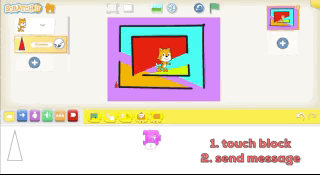

## Sept. 4th 

## Sept. 4th 

### Sept. 4th Homework

The homework for this class is to continue working on the Dragon Maze with Buttons (see below). The homework is to make 4 buttons, one for each direction. Then add the cake and dragon, like last week.

### Review first maze

As a class, we revised last week's homework project.
* We moved the cake and added a dragon.
* If we touch cake the the dragon disappears. 

Here is an  example with pictures. This example has some things we didn't do in class. You can ignore them. We will go over it in class next week.

1.  Cake sends a message using a yellow "bump" block. (In the example, cake also receives the **same** green message, and says goodbye to the dragon)

{:height="59px"}

2. Dragon gets the message and disappears. (In the picture, the dragon waits, gets bigger, says something, gets smaller, says something, and then, **finally disappears**..)

{:height="59px"}

3. A receive block on the cat makes the cat step off the cake (no picture, sorry)

### Improved Dragon Maze with Buttons

We next improved the above project using buttons to control the cat. 

#### Making the Maze in the Background

First we made the maze in the background. The maze is a bunch of "squares" with "openings" cut out. 

See the images below, but the steps we did in class are:

1. Draw the maze. Make the maze "square"

{: width="100%" height="auto"  .gif}

1. Color the background. This is just for fun.

{: width="100%" height="auto"  .gif}

3. Draw buttons. 

{: width="100%" height="auto"  .gif}

4. The buttons send messages to the cat to make it move. 

{: width="100%" height="auto"  .gif}

### Sept 11 Preview

Messages are very important in ScratchJr.. Next week we will use "messages" to make conversations between characters.

### Add a Dragon and a Cake.

Add a dragon and a cake as in the original project. 

