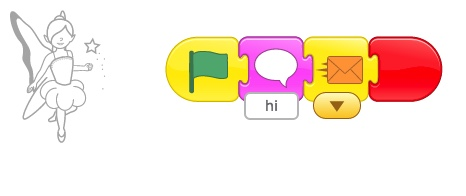
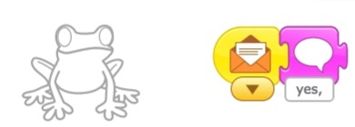
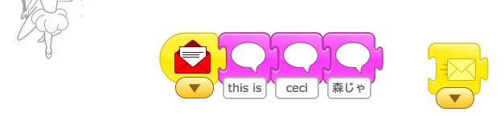

video



A quick guide to Basic Blocks:



-- go over how to send messages

-- go over buttons

Make cat, cake and dragon talk. 

### Sending Messages by Making a Conversation

The main topic today was how to send a message and receive a message to start a conversation.

-   First, Fairy says something and **then** sends (ORANGE) message

-   The Frog receives it and responds

### Continue the conversation

We also talked about how to make a longer conversation:

1. Fairy Starts (speaks and sends ORANGE message. You need to connect it!)
   
1. Froggie replies
   
1. Then Sends a New RED Message (remember to connect it!)
   
1. Fairy receives the red message. Says something. Then she continues by sending a YELLOW message back to Froggie (connect it).
   

### The KEYS to Messages

-   Each message has 2 parts, sending and receiving.
-   One character sends. The other receives, and acts.
-   They can send a new message back....

#### Advanced Keys

-   One character can send more than one message, for example to different characters, or the same character.
-   The same message can go to more than one character, too. That is, more than one character can receive the message when it is sent.
-   Sometimes you even send messages to yourself!

See [Dragon Maze Part 2](../lessons/DragonMazePart2.html) for examples.

### April 20 Homework

The homework was to make a longer conversation by sending several messages back and forth between characters as above. If you need something for the characters to say, [here are some jokes](../lessons/JokesForBadJokes.html) to use.

