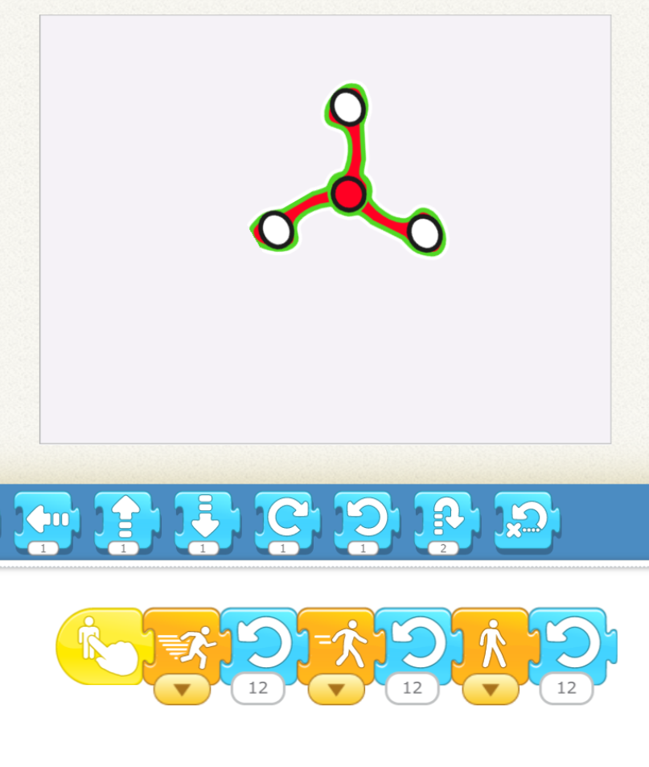

<!-- 
- [ ] Proceed to [Archives](./a_mon0500pm-Archives.html) 》 
- [ ] {: style="float: right;"}
- [ ] -->

<br clear="both">

<div id="toc">

* [February 26th](#february-26th)
  * [Homework due March 5th](#homework-due-march-5th)
  * [Recap for February 26th](#recap-for-february-26th)
* [February 19th](#february-19th)
  * [Homework due February 26th](#homework-due-february-26th)
  * [Recap for February 19th](#recap-for-february-19th)
* [February 12th](#february-12th)
  * [Homework due February 19th](#homework-due-february-19th)
  * [Recap for February 12th](#recap-for-february-12th)
    * [ScratchJr.](#scratchjr)
    * [Tynker](#tynker)
* [February 5th](#february-5th)
  * [Recap for February 5th](#recap-for-february-5th)
    * [February 5th Tynker](#february-5th-tynker)
    * [February 5th ScratchJr.](#february-5th-scratchjr)
* [January 29th](#january-29th)
  * [Recap for January 29th](#recap-for-january-29th)
* [January 22nd](#january-22nd)
  * [Homework due January 29th](#homework-due-january-29th)
  * [Recap for January 22nd](#recap-for-january-22nd)
* [January 15th](#january-15th)
  * [Homework due January 22nd](#homework-due-january-22nd)
  * [Recap for January 15th](#recap-for-january-15th)
* [January 8th](#january-8th)
  * [Homework due January 15th](#homework-due-january-15th)
  * [Recap for January 8th](#recap-for-january-8th)
* [New Year's Day, 2021](#new-years-day-2021)
  * [Homework due January 8th](#homework-due-january-8th)
  * [Recap for New Year's Day, 2021](#recap-for-new-years-day-2021)
* [December 18th](#december-18th)
  * [Homework due Next Year](#homework-due-next-year)
  * [Recap for December 18th](#recap-for-december-18th)
* [December 11th](#december-11th)
  * [Homework due December 18th](#homework-due-december-18th)
  * [Recap for December 11th](#recap-for-december-11th)
* [December 4th](#december-4th)
  * [Homework due December 11th](#homework-due-december-11th)
  * [Recap for December 4th](#recap-for-december-4th)
* [November 27th](#november-27th)
  * [Homework due December 4th](#homework-due-december-4th)
  * [Recap for November 27th](#recap-for-november-27th)
    * [Animate and keypress](#animate-and-keypress)
    * [An epiphany](#an-epiphany)
    * [Problem solving](#problem-solving)
    * [Drawing a Spirograph](#drawing-a-spirograph)
* [November 20th](#november-20th)
  * [Homework due November 27th](#homework-due-november-27th)
  * [Recap for November 20th](#recap-for-november-20th)
* [November 13th](#november-13th)
  * [Homework due November 20th](#homework-due-november-20th)
  * [Recap for November 13th](#recap-for-november-13th)
* [November 6th](#november-6th)
  * [Homework due November 13th](#homework-due-november-13th)
  * [Recap for November 6th](#recap-for-november-6th)
* [October 30th](#october-30th)
  * [Homework due November 6th](#homework-due-november-6th)
  * [October 30th Recap](#october-30th-recap)
* [October 23rd](#october-23rd)
  * [Homework due October 30th](#homework-due-october-30th)
  * [October 23rd Class Summary](#october-23rd-class-summary)
    * [What to do when you run out of messages?](#what-to-do-when-you-run-out-of-messages)
    * [Other Scratch Limitations](#other-scratch-limitations)
  * [Tynker Pattern Maker Tutorial](#tynker-pattern-maker-tutorial)
  * [Plan before you code](#plan-before-you-code)
  * [Lots of spelling questions](#lots-of-spelling-questions)
* [October 16th](#october-16th)
  * [Homework due October 23rd](#homework-due-october-23rd)
  * [October 13th Class Summary](#october-13th-class-summary)
  * [Emailing Projects](#emailing-projects)
* [October 9th](#october-9th)
  * [Homework due October 16th](#homework-due-october-16th)
  * [October 9th Class Summary](#october-9th-class-summary)
  * [Emailing Projects](#emailing-projects-1)
* [October 2nd](#october-2nd)
  * [Homework due October 9th](#homework-due-october-9th)
  * [October 2nd Class Summary](#october-2nd-class-summary)
  * [Upcoming Plans: Tynker](#upcoming-plans-tynker)
* [September 25th](#september-25th)
  * [Homework Due Oct. 2nd](#homework-due-oct-2nd)
  * [Daily Routines and Halloween Project](#daily-routines-and-halloween-project)
* [September 18th](#september-18th)
  * [Finishing Knock Knock Joke Project](#finishing-knock-knock-joke-project)
  * [Next Week: Finish Family Wake Up Story Project](#next-week-finish-family-wake-up-story-project)
* [September 11th](#september-11th)
  * [September 18th Homework](#september-18th-homework)
  * [Class Summary](#class-summary)
  * [Sending Messages by Making a Conversation](#sending-messages-by-making-a-conversation)
  * [Continue the conversation](#continue-the-conversation)
  * [The KEYS to Messages](#the-keys-to-messages)
    * [Knock Knock Joke Project](#knock-knock-joke-project)
* [September 4th](#september-4th)
  * [September 4th Homework](#september-4th-homework)
  * [Review first maze](#review-first-maze)
  * [Improved Dragon Maze with Buttons](#improved-dragon-maze-with-buttons)
    * [Making the Maze in the Background](#making-the-maze-in-the-background)
  * [Sept 11 Preview](#sept-11-preview)
  * [Add a Dragon and a Cake.](#add-a-dragon-and-a-cake)
* [August 28th](#august-28th)
  * [August 28th Homework Challenge](#august-28th-homework-challenge)
  * [August 28th Recap](#august-28th-recap)
  * [Making the Maze in the Background](#making-the-maze-in-the-background-1)
  * [Walking The Path](#walking-the-path)
* [July 17th](#july-17th)
  * [July 17th Homework](#july-17th-homework)
  * [July 17th Homework Review: Outer Space](#july-17th-homework-review-outer-space)
    * [Debugging: Outer Space](#debugging-outer-space)
    * [Debugging: Outer Space Answers](#debugging-outer-space-answers)
  * [July 17 Break](#july-17-break)
  * [Animal House](#animal-house)
    * [Debugging: Animal House](#debugging-animal-house)
    * [Debugging: Animal House Answers](#debugging-animal-house-answers)
* [July 10th](#july-10th)
  * [Review the Under the Sea](#review-the-under-the-sea)
  * [Initializiing a character](#initializiing-a-character)
  * [Repeats](#repeats)
    * [Repeat the Repeat](#repeat-the-repeat)
  * [Drawing Backgrounds and characters](#drawing-backgrounds-and-characters)
  * [Face Spinner](#face-spinner)
  * [July 10th Hangman](#july-10th-hangman)
  * [July 10 Homework: "Outer Space"](#july-10-homework-outer-space)
* [July 3rd](#july-3rd)
  * [July 3rd Sharing Time](#july-3rd-sharing-time)
  * [July 3rd Homework: Under the Sea](#july-3rd-homework-under-the-sea)
* [June 27th](#june-27th)
  * [Game: Black](#game-black)
  * [Game Teacher Says](#game-teacher-says)
  * [ScratchJr Intro](#scratchjr-intro)
  * [June 28th homework](#june-28th-homework)

</div>

-   Click on the [> Date]() or <span style="color: #3399cc;  border-left: 9px solid #3399cc!important;border-radius: 4px 4px; font-weight: bold">BLUE</span> borders to toggle the <span style="background-color:#ffeca0; border-left: 10px solid #3399cc !important;border-radius: 4px 4px;"><b> &nbsp;<span style="font-size: 70%">▶︎</span>&nbsp;&nbsp;Details&nbsp;&nbsp;&nbsp;&nbsp;</b></span> 

   
<details markdown=1>
<summary markdown=1>## February 26th
</summary>

## February 26th

### Homework due March 5th

Work on the Beach Candy Game

### Recap for February 26th

Today we focused on planning. As a group, the class came up with a project. 

<style>
ol li ul li ol {
    margin-bottom: 0px;
</style>
1. First we decided on the type fo project, a game. 
2. Setting: The beach
3. Story/Goal: Find and collect candy hidden in the sand.
4. Actors/Actions:
   * Protagonist(s) ("Good guys"): Sheep walks, jumps, digs, picks things up 
   * Antagonist(s) ("Bad guys"): 
      1. Insect attacks and bites 
      2. Skunk sprays 
   * Macguffins (sought-for items) 
      1. Good Candy give points: 
         * Lollipops
         * Chocolate
         * Gummy Bears
         * Cookies
         * Hi-chew
         * Hot Chocolate
      2. Bad Candy loses points, or send actor back to beginning. 
         * old shoes
         * old chocolate
         * smelly socks
         * smelly lollipop
         * coffee
{: style="margin-bottom: 0px;"}

The kids then started working on programming it. So far, the project is a simplified, modified version of the above.

ScratchJr.
  : The game was simplified for ScratchJr. For the protagonist, we used a little girl, for the antagonist, we used an Elephant, and for the MacGuffin we used starfish. In addition, we could only have one piece of candy on the screen.

In Scratch Jr. the kids also needed to make a way for the actor to move, so we learned how to create buttons that send messages, as we had done a few weeks ago.

From there, we use bump blocks on the starfish, so that when the girl touches the starfish, the start fish says something, and then we move to the next screen.

The project is underway and should be completed next week.

Tynker
  : In Tynker the focus was on choosing actors. 

Kids worked on making the characters the right size and placing them in various places.

Some kids started coding movement using **when key pressed** blocks


After making the girl moved, the question was how to know if she had found the candy. The **touching?** block:


can be used to send a message to the actor touched. (The break stops the motion of the girl.) Once the message touched is send, the good or bad candy can respond.


We will work on this next week.

</details>

<details markdown=1>
<summary markdown=1>## February 19th
</summary>

## February 19th

### Homework due February 26th

Keep working on your projects

### Recap for February 19th

ScratchJr.
  : Today in ScratchJr. we worked on the the 3 little pigs story. This involves all the skills we have been working on so far, especially sending messages and all the movement and control blocks.

I showed the kids the sample project, which was derived from a student project done last year.

{: .jsgif}

After a brief explanation, one student turned this out, with barely any help from me. 

{: .jsgif}

Impressive job!

The second part of the project was to retell any well-known story. One child asked how to make it appear as if a character were walking, and I showed her a simple trick of moving the background instead of the character to give the appearance of movement:

{: .jsgif}

Tynker
  : In Tynker one student continued a whirlwind tour of sample projects. She spent some time working with the characters in the Animation Board project, but it was a bit difficult, so she settled on the Underwater Arcade. 

<iframe width="100%" height="408" src="//www.tynker.com/ide/embedded?p=602f727721db5e499a719fd9&controls=true&autostart=false" frameborder="0" allowfullscreen></iframe>{: .jsgif}

In this project, her challenge was to make the fish move down. Unfortunately she had put the loop in the wrong place

{: .jsgif}

but after some work she was able to debug it.

{: .jsgif}

</details>


<details markdown=1>
<summary markdown=1>## February 12th
</summary>

## February 12th

### Homework due February 19th

Keep working on knock knock jokes.

### Recap for February 12th

Today I taught kids about [Knock Knock Jokes](../lessons/KnockKnockJokes.html) and [Bad Jokes](../lessons/JokesForBadJokes.html) 


#### ScratchJr.

For the ScratchJr. kids, I showed them this project, and then they worked to create it themselves. They then added their own screens with more jokes.

This is the joke I started with. Notice the color of the [**Send and Receive Blocks**{: style="color: darkgreen;background-color: yellow"}]. 

A: [**Green Flag**{: style="color: darkgreen;background-color: yellow"}] Knock Knock [**Send ORANGE**{: style="color: orange;background-color: yellow"}]
<br>B: [**Receive ORANGE**{: style="color: orange;background-color: yellow"}] Who's there? [**Send BLUE**{: style="color: blue;background-color: yellow"}]

A: [**Receive BLUE**{: style="color: blue;background-color: yellow"}] Wooden Shoe [**Send GREEN**{: style="color: green;background-color: yellow"}]
<br>B: [**Receive GREEN**{: style="color: green;background-color: yellow"}] Wooden Shoe who? [**Send PURPLE**{: style="color: purple;background-color: yellow"}]

A: [**Receive PURPLE**{: style="color: purple;background-color: yellow"}] Wooden Shoe like me to tell you another joke? 
<br />&nbsp;&nbsp;&nbsp;&nbsp;&nbsp;= *(Wouldn't you like me to tell you another joke?.)*

Here is what the code looks like for A in ScratchJr. 

{: .jsgif}

And how it looks when running:

{: .jsgif}

#### Tynker 

For the tynker group, I did the same joke and basic project. We used different blocks though. Here is the first (Germy) actor's code:

{: .jsgif}

This is what the final project will look like.

<iframe width="100%" height="408" src="//www.tynker.com/ide/embedded?p=602608f13fa97e46070d6e5f&controls=true&autostart=false" frameborder="0" allowfullscreen></iframe>{: .jsgif}

The kids started working on it but it was a bit more difficult that in ScratchJr. We'll work on it some more next week.
</details>


<details markdown=1>
<summary markdown=1>## February 5th
</summary>

## February 5th

### Recap for February 5th

#### February 5th Tynker

Tutorials
  : One student started out on tutorials but then decided to try the cake decorating project. In the project there are various kinds of icing we can put on a cake. We walked through the code step by step together for the first few types of icing. She was very focused and learned a lot. By the time we were done she was able to code new icing by herself and her homework is to finish the project.

Fruit Frog
  : One student spent her time exploring various projects tutorials. Some of them needed explanation and I sat with her to show her what was involved. One of the projects she did was "Fruit Frog" where a frog prince eats fruit with its tongue. She changed the frog to a lizard, but had to add some code to make the lizard show up and be the right size.

{: .jsgif}

<iframe width="100%" height="408" src="//www.tynker.com/ide/embedded?p=601cf9ba6b35d11ad000957e&controls=true&autostart=false" frameborder="0" allowfullscreen></iframe>
{: .jsgif}


"walking guy" Game
  : One student continued working on her "walking guy" Game. She needed a little help figuring out how to add a new character. She really enjoyed trying to make the fairy escape from all the villains.
  
#### February 5th ScratchJr. 

Race to the Finish
  : Today's ScratchJr. project was a variation of the race to the finish project. This served as a gentle introduction to using messages and making buttons. They both make a lot of progress but had a bit to finish for homework.
  
{: .jsgif}

{: .jsgif} 


</details>


<details markdown=1>
<summary markdown=1>## January 29th
</summary>

## January 29th


### Recap for January 29th

Technical problems

  : Today class was a bit hectic. Some students have been using new computers and some still have some technical problems with them, such as logging in a getting internet. We also had a trial student.

ScratchJr.
  : Today's project was an animate your name project. Kids did a great job with it. They added their own name or other word as characters and created movements with both the green flag and for touch actions.

 

 


Tutorials
  : Some students are still working on tutorials. Using loops is still challenging, so we worked together on that. 


Walking Guy
  : One student discovered how to make a basic Platformer game and explored making different characters.

Peep Nature Walk
  : A student came up with a story about going shopping Peep Nature Walk. Today she worked mostly on deciding the layouts and actors and she drew a basic background for the store and we ended at the point where we could begin adding this to her project.


</details>


<details markdown=1>
<summary markdown=1>## January 22nd
</summary>

## January 22nd

### Homework due January 29th

### Recap for January 22nd


ScratchJr.
  : We looked at some sample projects, and students copied and modified the projects.
  : For example, an aquarium with various fish that moved in various ways. The student worked carefully to make two characters move in sync. 
  : Another student used the touch block to make the player choose between two different levels. 

Cake Decorator
  : Student worked on a cake decorator project. This ```when actor clicked :: events hat ```{: .msb}  block selects the icing to put on the cake by changing the "stamper" costume. The student wanted to be able to unselect the icing, which involved a bit of complicated code. To get a little more understanding of if statements, the student continued working on some releavant Barbie tutorials.

{: .jsgif}

Christmas Project
  : Work continued on the Christmas Project. The student learned how to make say blocks a little more interesting.

{: .jsgif}

Peep Nature Walk
  : Another student explored a couple of projects. Then she worked a bit on the Peep nature walk project. She changed the appearance one on of the characters, and her homework is to make a plan to continue the story.

{: .jsgif}

</details>

<details markdown=1>
<summary markdown=1>## January 15th
</summary>

## January 15th

### Homework due January 22nd

### Recap for January 15th

New Students and ScratchJr.
  : Two students joined our class today, and we continued with the introduction to ScratchJr from their trial lesson. We reviewed their homework project, and then did a basic review of the purple, green and orange blocks. At this point I challenged them to explore freely what they could do with the blocks they knew at this point, and this is their homework for next week. In class one project was notable for making three characters move together in unison and stopping at the edge of the screen. 

 

Knock Knock Jokes
  : After doing many tutorials in Tynker, one girl started to work on a basic project, a knock knock joke project. She decided she wanted to change the stock actor the project came with, and got very excited at all the characters, especially the mermaids, that are available in the media library. After exploring this for a while she asked if we could make the Mermaid King's flippers move as if he were swimming. This is actually hard to do in Tynker, but I walked through the simple cut, paste, and rotate actions that are part of partially creating that effect. She also made some other modifications to the Mermaid King, like changing the color of his sword.

Tutorials
  : Lastly, another student worked independently on finishing up the Barbie Pets Tutorial, and continuing on a Christmas-themed project. She had a small question about one section of the tutorial, but eventually got it. The ability to work independently is a sign of increased confidence and mastery.


</details>


<details>
<summary>## January 8th
</summary>

## January 8th

### Homework due January 15th

Keep working on tutorials or projects

### Recap for January 8th


Kids were very motivated today, and worked hard.

Tutorials
  : Barbie tutorials are a lot of fun. One child worked very hard on a barbie pet tutorial. One challenge she had was understanding repeat blocks. Instead of walking then jumping then walking then jumping then walking then jumping, we can just repeat the walk-jump three times. I used some playing cards to map out the differences, and suddenly, "click", she got it. It's a big step, because loops are, of course, a central concept in coding. 
  
  : The student then went on to create a new project and created  characters. C
  
  : Another student also working through tutorials had some issues using the trackpad on her new computer. Using the trackpad is  probably worth a lesson, and maybe I will spend some time on it next week.

Making characters bigger. 
  : Several students asked about how to make Smaller too.  
  
Birthday card
  : Lastly, one student Lucy made a birthday card for her mom that came out really well. Based on a tutorial project, she changed the background, and the costumes of various characters, including drawing her own birthday present, and recording a birthday song. We also worked together to make the present hop along the bottom of the screen. We used some of the ideas from last class about x and y position to figure out where the present would glide to to make it look like it was jumping. This included working out how many times it would jump to get across the screen, and how to jump back to the other side. Of course, I made a **classic mistake** of forgetting that the x and y position change after each step, so I have to calculate the **relative** position, but the exercise was worth it. Here is the final project:

<iframe width="100%" height="408" src="//www.tynker.com/ide/embedded?p=5ff8069b2220644dd30ca6fa&controls=true&autostart=false" frameborder="0" allowfullscreen></iframe>

Here is the code for the jumping birthday present.

{: .jsgif}

</details>


<details>
<summary>## New Year's Day, 2021
</summary>

## New Year's Day, 2021

### Homework due January 8th

Keep working on your individual projects. 

### Recap for New Year's Day, 2021

Today, instead of working on individual projects, we worked on a basic tutorial that leads to a keyboard-based game. The tutorial focuses on:

x, y, and positive and negative numbers,
  : because these a core concepts, we spent a lot of time learning about the four quadrants, and how to tell where an actor or the mouse is.

"go to" versus "glide"
  : go to magically transports the actor to the new position, "glide" moves through the intervening space.


<iframe width="660" height="408" src="//www.tynker.com/ide/embedded?p=5fe9dd92fc762c07fc1acfd0&controls=true&autostart=false" frameborder="0" allowfullscreen></iframe>
{: .jsgif }

<https://www.tynker.com/play/block-heads-version-2-partially-completed/5fe9dd92fc762c07fc1acfd0-788525XlWhzbbxd4ml.IpdPRLJ3Xsk>


In the games, kids collect coins by moving or gliding the actor to places in different quadrants. Once they understood the concepts above, they have to code the correct blocks. The only way to collect some blocks is by gliding, and others they need "go to" for. They also have to work out which position is in which quadrant. 

At first, these mathematical ideas are a bit challenging, but once they could see how it played in a real game they really understood it, and were able to work out the correct blocks all by themselves. A job well done!!

</details>


<details>
<summary>## December 18th
</summary>

## December 18th

### Homework due Next Year

Keep working on your project and MAKE A PLAN!!!

### Recap for December 18th

Naturally the theme this week was Christmas. We learned how to use google to find good images, this time of a bed fit for a princess. After finding a magnificent example, we learned how to import it into our project, and began our plan out what the story would be. 

<iframe width="660" height="408" src="//www.tynker.com/ide/embedded?p=5fdc68d5bf47275f677baa24&controls=true&autostart=false" frameborder="0" allowfullscreen></iframe>
{: .jsgif }

The other student thought about her story. She had a basic story. This is enough to start with. 

Next time I will try to talk more about planning: 

Who are the characters?
  : Give them names

What do they look like? 
  : Color, shape, size, clothes, and so on

What clothes and expression do they have?
  : Make a rough drawing.
  : Will you use a drawing, the character builder, a photograph?

What objects are there? 
  : Again, draw them. Even a simple drawing is enough.

What is the stage or other locations?
  : You will need one stage costume for each

What happens? How will you show this action?
  : Movement, color, shape, size, sound?

Who says what, in what order? 
  : When do they say it?

Who moves and where?
  : When, why? How will you show it?

</details>


<details>
<summary>## December 11th
</summary>

## December 11th

### Homework due December 18th

Complete the Barbie Tutorial

### Recap for December 11th

Only one student today. We worked mostly on mastering the Image Editor. The stamp tool and paint bucket tools were especially fun. 

{: .jsgif}

These tools are sometimes not intuitive, and can react slowly or inconsistently. It takes some practice to be able to use them to get desired results, and sometimes the best way to learn is just experiment with it. I also demonstrated how to make a basic animation from several images in sequence. 

After that the student started in on the Barbie Hour of Code project that just became available on Tynker this month. The project is easy but cute, and the student seemed to enjoy it and be able to do it without much assistance despite a difference in language. The final part was left as homework.

We finished up with a few games of hangman. Even if kids have some English proficiency, if they learned English as a second language some basic skills such as vocabulary, writing characters correctly, pronunciation,  or spelling tricks can have gaps, and the way we play hangman is modified to help support these. 

</details>

<details>
<summary>## December 4th
</summary>

## December 4th

### Homework due December 11th

The homework is keep revising your projects. What happens when you press a key? What happens when you click a character? Can you use random numbers to make it interesting?


### Recap for December 4th


Today kids worked mostly on their own projects. 

1. **Animating a story with key presses**

The when key pressed block makes something happen when a key is pressed.

When the right arrow key is pressed, the character moves right. 


{: .jsgif}


We used this to make the character do different animations (dance, attack, fall down) when the key was pressed. This allowed the character to act out a story by pressing different keys. 

2. **When actor clicked**

Another way to make things happen is when the actor is clicked. In this project, clicking the 2nd robot makes him jump up. For next week, make him come down, and make the other actors move as well.


{: .jsgif}

3. **Funny Circles**

Continuing on the idea of drawing circles, one student played with changing the pen color and pen size using random values. This created some cool effects.


{: .jsgif}

</details>


<details>
<summary>## November 27th

</summary>

## November 27th


### Homework due December 4th

Students received individual assignments such as plan out your story, or keep working on adding keypress actions, or keep paying with the spirograph.

### Recap for November 27th

#### Animate and keypress

Starting with last week's move and animate project, we worked on understanding some basic blocks: 

* Making character move with keypress. This included how to use the animate button.


{: .jsgif}

* Using the move by block to move a character around the screen. We worked understanding what the x and y values should be:


{: .jsgif}

For example, to move 300 steps in various directions:

Up
: y=300

Down
: y=300

Left
: x=-300

Right
: x=300

#### An epiphany

Using animate was a lot of fun. For one student, after a bit of experimentation there was a bit of an epiphany: the various actions became a mini story. Another character was added, more fun with the character editor. The challenge for next week will be to put all these actions together in sequence to tell the story. 

#### Problem solving 

A bit of problem solving: The character is facing in wrong direction at first. 

Answer:


{: .jsgif}

#### Drawing a Spirograph

Another student began working on variations of a spirograph. This shows some stages of what we did.

<iframe width="660" height="408" src="//www.tynker.com/ide/embedded?p=5fc13992f06e0306d63a6115&controls=false&autostart=false" frameborder="0" allowfullscreen></iframe>
{: .jsgif}


The key blocks are a repeat loop and a turn. We then varied this by changing the color to make a rainbow, and then by adding some random values. We explored varying the values and seeing what happened. For example:


or:


</details>


<details>
<summary>## November 20th
</summary>

## November 20th

### Homework due November 27th

Keep working on your flying project.

### Recap for November 20th

Today we worked on our first Tynker Project together. A lot of time was learning to navigate Tynker, such as finding the dashboard, opening projects, and so on.

We learned how to share projects with each other and sending messages to each other. I used this to send a student some blocks to use in her projects. In addition to being fun, this is a handy way for me to be able to help students with their projects in real time.


You can sees what the project will be on the first screen of this video:

<iframe width="660" height="408" src="//www.tynker.com/ide/embedded?p=5fb857b532cb6a2dcb3be2f7&controls=false&autostart=false" frameborder="0" allowfullscreen></iframe>
{: .jsgif}

[Direct link (be sure to **login** and save)](https://www.tynker.com/ide/?p=5fb857b532cb6a2dcb3be2f7)

We use this block set to move the character around:


{: .jsgif}

The move by block do the motion, the animate and wait blocks animate the character. The wait for blocks are required. They also make sure the movement finishes before the next one is done.

Next week we might use functions and ask blocks to make the project more interesting. See Level 2 to see how it could work.

</details>

<details>
<summary>## November 13th
</summary>

## November 13th

### Homework due November 20th

Play in Tynker and get used to the interface. 

### Recap for November 13th
Today we worked on a final ScratchJr. project. We made a basic video game, that involved the idea of a hero, and obstacle, and a collision. These concepts will help us in Tynker.

The project was very simple: 

* A moving obstacle and code for its movement. At first the character just moved in one direction, but then we added crazy movements. This is the fun part of the project. 
* A main character the player controls
* Buttons to control the main character. As above we made the movements a bit crazy and unpredictable.
* Code to say what happens when character and obstacle collide, like playing a sound. What kind of game it is depends on this. Maybe the goal is to hit the obstacle, or maybe it is to avoid the obstacle.

The kids went through it like pros! 

Then we moved onto Tynker as a class. My main goal was to give an overview of the interface (the UX). The key point was to get everyone to find the classroom page so they could see the tutorials and class assignments. We also covered how to:

* Open a project
* Give a project a name
* Change a character's appearance
* Share a project in the stream. 

This was a quick overview, but this will become second nature soon enough. 

</details>

<details>
<summary>## November 6th
</summary>

## November 6th

### Homework due November 13th

The homework is continue what you can. If you are starting Tynker, I suggest doing the "Programming 100" and "Barbie" activities that you can see by choosing "Friday and Monday Tynker Class" on your dashboard. [This link may go there directly](https://www.tynker.com/dashboard/student/#/my-classes/). 

### Recap for November 6th

This week we finished the outstanding ScratchJr Projects. I have been impressed with how diligent and patient the kids have been. 

By the end of the class all the students were ready to or had started on Tynker. Kids are mostly able to do the exercises but need some help reading and understanding the instructions at first. Also, there were some technical difficulties with Tynker related to scrolling on certain ipads, though some don't have the problem. This is a problem on Tynker's end that I need to troubleshoot. 

For this reason, next week, instead of working individually, we will work as a group on doing the tutorials. 

Tynker has pros and cons. The pros are that:

* The quality of the graphics is much better.
* It has capabilities that scratch and scratch junior doesn't have, such are ready-made tools for Mario type and other games. 
* This means students can make more satisfying and realistic games and projects.
* It still has all the capabilities tha scratch/scratchjr have
* I can follow student progress more easily, including giving help in real | times: 1

Some of the cons:

* A bit of a learning curve. It is a new interface, and is less visual than scratchjr.
* Not as well documented. The positive view is that this encourages experimentation.
* Some bugs, quirks, and compatibility issues. In the long run these should be minor problems (I hope).

Since this is a transition, there will be some bumps, but I am confident about the end goal of the journey. Hang in there!!


</details>


<details>
<summary>## October 30th
</summary>

## October 30th

### Homework due November 6th

The homework this week is have fun! Play with ScratchJr. or Tynker and see if you can discover new things. 

### October 30th Recap

Only two kids today. At first they continued working on ScratchJr. As per last week, we ran up against some of the limitations of scratch, and got a chance to work on problem solving strategies. 

For example, sometimes we end up with parallel actions both having send message blocks. This can make the action jerky because the message is sent twice.

{: height="200px" style="width:auto!important" .jsgif }

We discovered using only one message block on the longest one let the program run smoothly.

{: height="200px" style="width:auto!important" .jsgif }

Also, what can we do when the text in a text bubble has too many characters? We worked through how to figure out how many characters the bubble can hold and how to split it up into separate messages. 

Sometimes students get frustrated when things don't work as quickly or the way they expect. The limitation could be in the software or in the hardware, like a touch screen or mouse not working the way we would like. But having problem solving strategies can give students some control over the situation and help build patience and reduce frustration. 

I offered Tynker as an option for the kids, which doesn't have some of ScratchJr.'s limitations. One student took me up on it and made great progress on the tutorials. I always encourage students to go at their own pace and follow their own interests. The other student decided she wasn't ready yet. I could see she felt comfortable with the decision, and I think when she is ready she will try it. 

</details>


<details>
<summary>## October 23rd
</summary>

## October 23rd

### Homework due October 30th

Continue working on projects. Keep up the good work.

### October 23rd Class Summary 

Everyone was hard at work on finishing projects in ScratchJr. this week. 

#### What to do when you run out of messages?

One limitation in ScratchJr. is that there are only 6 message colors available per scene. Sometimes however, you want more, which is what happened in one project. The trick to solving it is to create a **duplicate scene** that picks up where the old one left off. 

1. create a new scene 
2. copy the background of the previous scene 
3. copy the characters from the last position of the old scene 
4. move them to their last position using the grid 
5. switch to the new scene after the last action in the old scene


#### Other Scratch Limitations 

  1. The canvas is too small

Drawing in the character/background editor is difficult in ScratchJr. One trick that helps is using a two finger gesture to expand and contract the canvas so you can draw in details. 

  2. Copying shapes

Another limitation a student faced today was that the editor can copy shapes, but sometimes the copy ends up too close to the original and they get merged. There is no workaround for this other than redrawing the shape to copy it.


  2. Too many characters

It also turns out that scratchJr. gets very slow when a scene goes on for too long. Another good reason to use the duplicate scene trick.

### Tynker Pattern Maker Tutorial

Another student worked in Tynker, which doesn't have these limitations. She asked for a little help with the Pattern Maker Tutorial that involved drawing shapes like stars and squares.


* Repeat blocks

One requirement of the tutorial is to use repeat blocks. I showed her how to write out all the actions she plans to do to find out which actions have to be repeated and how many times. 

* Geometry and Angles

Using the grid the student has to figure out how far to walk along each edge. She also had to learn how angles work so that the character can turn the right amount. For a square the character turns 90 degrees, but for other shapes the angles is not so easy to guess, so a bit of trial and error was involved. This is good practice. Also, since the available angles were limited, she had to combine several turns to get to the right angle. 

### Plan before you code 

Students tend to want to jump right in on coding once they have an idea, but if an idea is complicated enough they need a little help planning out what is going to happen before trying to code it. This is counterintuitive, so students often need a reminder to take this step. Planning her activity before she coded it also helped her overcome a bit of "coders block" when she was starting out.

### Lots of spelling questions 

In addition to coding, there were a lot of spelling questions this week. The kids seemed to be enjoying learning English as well as coding. 

</details>


<details>
<summary>## October 16th
</summary>

## October 16th

### Homework due October 23rd

The homework is to continue to work on unfinished projects, especially The Halloween ("Use all the blocks") Project. Remember, the Halloween project must use each ScratchJr. blocks at least once. 

### October 13th Class Summary

As per last week, students continued working through the Family Conversation and Halloween Projects. 

Students starting a new project spent time designing each screen and the characters and actions in it on paper first, before coding. This usually saves a lot of time and makes coding smoother. It also helps them understand how their project will be experienced by the user. 

Kids like to be able to record sounds as part of their videos. But a common problem with this is that it is hard to tell who is speaking, so another theme in today's class was getting kids to think about this. Common solutions kids are using are:

* Have a text balloon open at the same time 
* Have the character move as they speak 
* Have an object move in a way that shows teh action, for example having actors pass a ball

We also did some problem solving to overcome some of scratchJr.'s limitations. With a little imagination we were able to make a character seem like they had turned around by editing their character's hair appropriately. 

### Emailing Projects

Thank you for emailing me projects. Please be sure your ScratchJr. app is up to date, as there was a bug in a recent version that prevented files from being opened.


</details>

<details>
<summary>## October 9th
</summary>

## October 9th


### Homework due October 16th

The homework is to continue to work on unfinished projects, especially The Halloween ("Use all the blocks") Project. 

### October 9th Class Summary

Today, students were mostly at different stages of our progress, working towards completing the Halloween Project. 

One child was reworking her Family Conversation Project, which helped her reinforce the idea of sending messages and parallel actions. In this case that meant planning out simultaneous text to the recorded sounds as the characters spoke. 

Another student worked first on pre-planning her Halloween project and once we reviewed her outline,  she began programming it.

Another student was well along on the Halloween project, but continued to add more to the story.

Meanwhile, another student has moved on to Scratch, and completed the Pong tutorial. 

### Emailing Projects

As I mentioned in person, it would be helpful to me if students could email me projects they complete or are working on so I can review them and get a better sense of their progress and the support they need. I did a brief review with students of how to do this in ScratchJr, though the final step (complete the email) requires adult help. Full details of how to do this are available here: <https://www.scratchjr.org/learn/tips/share-projects>. The email to use is [teacher@kyotolesson.com](mailto:teacher@kyotolesson.com).


</details>

<details>
<summary>## October 2nd
</summary>

## October 2nd

### Homework due October 9th

The homework is to continue to work on unfinished projects, specifically The Family Conversation and Halloween ("Use all the blocks") Projects. 

### October 2nd Class Summary

Students continued to work on unfinished projects. 

One student has a small bug in her Family Conversation. Her characters were not speaking in the correct order. This gave her a good experience at debugging and carefully working through the code and message logic (with help) to find the source of the problem. 

Another student worked on adding simultaneous text to the recorded sounds the character spoke.

Students also learned that since ScratchJr limits each character to 5 recorded sounds, it is better to record continuous recordings as one. This is a kind of "refactoring" that comes up often in programming as the limits of a given framework are reached. 

### Upcoming Plans: Tynker

All the students in this class are familiar with all the ScratchJr blocks. Once they finished with these or a few more projects, I think we will actually be ready to move onto Scratch. In fact, I am considering moving to an improved version of Scratch I recently discovered called "Tynker". Tynker is almost identical to Scratch, but also has some improvements. It has additional blocks that are easier to understand. It has better images and drawing. 

It also allows me to observe and collaborate with students as they work in real time. As a result, it is easier to give students individual support, especially for kids who are at different levels. It is easier to create tutorials and exercises. 

Tynker is web-based and does not require installation of software. In addition, it is similar enough to Scratch that learning one effectively allows you to use the other. 

One advanced student did a trial run of Tynker with me this class and gave a favorable review. 

One issue is that students need at least a keyboard, and perhaps a mouse to use it fully. I mentioned this to parents, but please let me know if you any questions about requirements for your situation. Tynker is free to use, though it also offers (and sells somewhat aggressively) paid upgrades, which I don't plan to use in this class. They are not necessary at this point and have the potential at this point to be distracting rather than enlightening. Tynker, like Scratch and ScratchJr, does have some bugs and quirks, but so far none has been critical.

You do not need to sign up, as I have created accounts for the students already, and will provide login information at the right time.


</details>


<details>
<summary>## September 25th
</summary>

## September 25th

### Homework Due Oct. 2nd

The homework is to make a Halloween project using every single block. 

### Daily Routines and Halloween Project

Today we had only one student. The student made a wonderful series of projects devoted to daily routines, such as playing soccer and going to school. The projects showed great mastery of how to:

* send and receive messages*
* create new characters and objects using the picture editor and how to 
* weave these together to tell a story.

</details>


<details>
<summary>## September 18th
</summary>

## September 18th


We started coding this screen in class. 
* For example, in my version:
  1. the mother (father) enters the bedroom 
  2. She tell the daughters to get up (using messages). 
  3. They each reply in turn.


If students finish screen 1, they can continue to the next few screens (see [Next Week: Finish Family Wake Up Story Project](#next-week-finish-family-wake-up-story-project) below)

### Finishing Knock Knock Joke Project

We finished the Knock Knock Joke Project. Some kids still are getting the hang of sending and receiving messages, but in the end they were all able to make the project work. 

As an added challenge for those that finished early, I had them copy the same code, but in parallel


This clever trick allows many actions to be performed together at the same time instead of one after the other.

### Next Week: Finish Family Wake Up Story Project

To reinforce the idea of sending messages, our next project was the Family Wake Up Story.

Screen 1 (in the homework above) introduces the family.

Screen 2. The daughters loved to sing.

* This could be done in many ways.
* For example, the daughters could take turns singing.
* Or they could sing together. 
* Or Sing and Dance.

Screen 3. One day there was a storm. Their house got broken.

Screen 4 is for you to end the story the way you would like.


</details>


<details>
<summary>## September 11th
</summary>

## September 11th

### September 18th Homework 

The homework for next week is to continue the Knock Knock Joke Project, by adding the joke below. The Receiving block has to match the color of the Sending block before it. Making these colors **match** is the main point of the exercise.


A: [**Green Flag**{: style="color: darkgreen;background-color: yellow"}] Knock Knock [**Send ORANGE**{: style="color: orange;background-color: yellow"}]
<br>B: [**Receive ORANGE**{: style="color: orange;background-color: yellow"}] Who's there? [**Send BLUE**{: style="color: blue;background-color: yellow"}]

A: [**Receive BLUE**{: style="color: blue;background-color: yellow"}] Ice Cream soda [**Send GREEN**{: style="color: green;background-color: yellow"}]
<br>B: [**Receive GREEN**{: style="color: green;background-color: yellow"}] Ice Cream soda who? [**Send PURPLE**{: style="color: purple;background-color: yellow"}]

A: [**Receive PURPLE**{: style="color: purple;background-color: yellow"}] Ice Cream so the other people can hear me. 
<br />&nbsp;&nbsp;&nbsp;&nbsp;&nbsp;= *(I scream so the other people can hear me.)*


### Class Summary

The class went well. Below is a summary of what we covered.


### Sending Messages by Making a Conversation

The main topic today was how to send a message and receive a message to start a conversation.

-   First, Fairy says something and then [**Sends**{: style="color: orange;background-color: yellow"}] (an orange) message


-   The Frog [**Receives**{: style="color: orange;background-color: yellow"}] it (**SAME COLOR**) and responds


Key Point:
: The **color**  of the [**Receive**{: style="color: orange;background-color: yellow"}] on the Frog matches the color of the [**Send**{: style="color: orange;background-color: yellow"}] before it on the Fairy.

### Continue the conversation

We also talked about how to make a longer conversation:

1. As before, the Fairy starts (speaks and sends ORANGE message. You need to connect it!)
   
1. Froggie replies
   
1. Then Sends a New RED Message (remember to connect it!)
   
1. Fairy receives the **red** message. Says something. Then she continues by sending a YELLOW message back to Froggie (connect it).
   
1. What color message does Froggie Receive?

### The KEYS to Messages

-   Each message has 2 parts, sending and receiving.
-   They have to be the SAME color! (did I mention that?)
-   One character sends. The other receives, and acts.
-   They can send a new message back....

#### Knock Knock Joke Project

We made a Knock knock Joke project. The joke is below. Notice the color of the [**Send and Receive Blocks**{: style="color: darkgreen;background-color: yellow"}]. 

A: [**Green Flag**{: style="color: darkgreen;background-color: yellow"}] Knock Knock [**Send ORANGE**{: style="color: orange;background-color: yellow"}]
<br>B: [**Receive ORANGE**{: style="color: orange;background-color: yellow"}] Who's there? [**Send BLUE**{: style="color: blue;background-color: yellow"}]

A: [**Receive BLUE**{: style="color: blue;background-color: yellow"}] Wooden Shoe [**Send GREEN**{: style="color: green;background-color: yellow"}]
<br>B: [**Receive GREEN**{: style="color: green;background-color: yellow"}] Wooden Shoe who? [**Send PURPLE**{: style="color: purple;background-color: yellow"}]

A: [**Receive PURPLE**{: style="color: purple;background-color: yellow"}] Wooden Shoe like me to tell you another joke? 
<br />&nbsp;&nbsp;&nbsp;&nbsp;&nbsp;= *(Wouldn't you like me to tell you another joke?.)*


</details>

<details>
<summary>## September 4th 
</summary>

## September 4th 


### September 4th Homework

The homework for this class is to continue working on the Dragon Maze with Buttons (see below). The homework is to make 4 buttons, one for each direction. Then add the cake and dragon, like last week.


### Review first maze

As a class, we revised last week's homework project.
* We moved the cake and added a dragon.
* If we touch cake the the dragon disappears. 


Here is an  example with pictures. This example has some things we didn't do in class. You can ignore them. We will go over it in class next week.

1.  Cake sends a message using a yellow "bump" block. (In the example, cake also receives the **same** green message, and says goodbye to the dragon)

{:height="59px"}

2. Dragon gets the message and disappears. (In the picture, the dragon waits, gets bigger, says something, gets smaller, says something, and then, **finally disappears**..)

{:height="59px"}


3. A receive block on the cat makes the cat step off the cake (no picture, sorry)

### Improved Dragon Maze with Buttons

We next improved the above project using buttons to control the cat. 

#### Making the Maze in the Background

First we made the maze in the background. The maze is a bunch of "squares" with "openings" cut out. 

See the images below, but the steps we did in class are:


1. Draw the maze. Make the maze "square"

 

1. Color the background. This is just for fun.

 

1. Draw buttons. 

 

1. The buttons send messages to the cat to make it move. 


 


### Sept 11 Preview

Messages are very important in ScratchJr.. Next week we will use "messages" to make conversations between characters.

### Add a Dragon and a Cake.

Add a dragon and a cake as in the original project. 

</details>


<details>
<summary>## August 28th
</summary>

## August 28th

### August 28th Homework Challenge

The homework for next week is to make a maze like the one we did today, except it has two exits and two cakes. Can you stop to eat one cake and then move on to the other. This might be challenging, so don't despair. If it is difficult, just do your best. 

Next week will use that to send messages and make dragon mazes. 

### August 28th Recap

Today we worked on Simple Mazes. Skills we practiced included:

-   Drawing lines
-   Removing "dots" to make the lines straight
-   Moving dots to change the shape, direction, and position of the line
-   Using the blue blocks to make the characters move
-   Adding New Characters
-   Adding New Screens
-   Moving from one screen to the next

### Making the Maze in the Background

1. First click the select arrow and then click a line.
2. The line will appear with dots.
3. Click on a dot to remove it.
4. Remove all the dots except 2 to make a perfectly straight line.
5. Drag the dots to modify the path of the line.
6. Using a series of lines, make a maze in the background.

### Walking The Path

1. Use the blue movement blocks to make the character walk the along or within the lines.
2. When the character reaches the end they said "Victory"
3. Add a cake at the end of the path.
4. Then, using yellow "bump" blocks, when the character touches the cake, the cake disappears.
5. Add another screen.
6. Go back to original screen and using a red block make screen change when cake disappears.
7. Design a 2nd screen like the first, with a different maze.
8. Have it loop back to the first screen


</details>

<details>
<summary>## July 17th
</summary>

## July 17th

### July 17th Homework

The homework for next class is:

1. Finish the Animal House Project
2. Do the Outer Space and Animal debugging exercises above.

Below is a summary of what we did in class.

### July 17th Homework Review: Outer Space

We reviewed and developed the [Outer Space project](./scratchProjects/Y1R17Outerspace.sjr). Kids watched the project run and tried to make their own similar code. One key idea was **having two or more actions happen at the same time**. For example, click the astronaut link below, and you can see the astronaut does 3 actions at the same time:

1. He turns,
2. moves up, and
3. shrinks then disappears.

This creates the effect of him spinning off into space and disappearing. This trick is very important in ScratchJr.



#### Debugging: Outer Space

Here are some problems to solve:



1. Why doesn’t the sun spin when pressed?
2. Why does the alien stay in the air and not hop back down?
3. Why doesn’t the shooting star hide after it shrinks?
4. Why doesn’t the astronaut fly up when pressed?

<details>
<summary>#### Debugging: Outer Space Answers
</summary>

#### Debugging: Outer Space Answers

1. It needs the start on tap trigger
2. The move up block needs to be replaced with a hop block
3. The show block needs to be replaced with a hide block
4. The number (parameter) on the move up block needs to be greater than 0

</details>

### July 17 Break

We played Hangman during the break, and it was a lot of fun. For a change, the kids worked together to choose a word ("Doctor") that I had to guess. They almost stumped me!

### Animal House

We then moved to making characters talk, either by recording sounds, or adding text bubbles. Our model was the Animal House Project from BootUp.



The kids worked on their own version of the project, and the homework was to finish the project.

#### Debugging: Animal House

Here are some debugging exercises.



1. Why does the barn get bigger and not bigger, then smaller?

2. Why does the chicken play a pop sound and not the recorded sound?

3. Why does the horse play the same recording twice instead of two different recordings?

<details>
<summary>#### Debugging: Animal House Answers
</summary>

#### Debugging: Animal House Answers

1. The second grow block should be a shrink block

2. The pop block sound be a play recorded sound block

3. The second play recorded sound block should have a number 2 and not a number 1

</details>

</details>

<details>
<summary>## July 10th
</summary>

## July 10th

### Review the Under the Sea

We reviewed the homework projects. The original Under teh Sea project can be [downloaded here](./scratchProjects/Y1Q15UndertheSea.sjr).

### Initializiing a character

To set the initial position, visibility, or size of a character:

-   **manually** change the position of the character.


Note in the gif above, if I use a block to change the position, it returns when I press the return button. If I manually move it, it stays.

-   **manually** change the visibility


-   **manually** change the size


This is useful if you want a character to start off small, or in a certain position.

-   Rotation **doesn't work**


### Repeats

#### Repeat the Repeat

I briefly discussed repeats within repeats:

1. Put some actions in a repeat block.
2. Add something to that, and put that in a repeat block
3. Repeat step 2

Not so interesting at this point.

### Drawing Backgrounds and characters

We reviewed the Drawing Editor to:

-   Create circles, squares, and lines
-   Use different thicknesses
-   Fill in drawings
-   Move drawings
-   Change the shape of blocks
-   Delete drawings

### Face Spinner



[Download here](./scratchProjects/Y1R16Fidgetspinner.sjr)

To practice using the editor, the kids reverse engineered the project above, but then, for fun, we put each other's pictures in the circles to make cool **Face Spinner**.

Then they made the spinner spin. As a challenge, I proposed making the spinner go fast at first and slower later. Most kids did it this way:

{: height~"200px"}

### July 10th Hangman

At the end we had a little time left and we played Hangman. For some kids it was their first time playing this classic children's spelling game!

### July 10 Homework: "Outer Space"



The homework is to try to make this project just from watching the video. The stars and sun are just like we did in class. The Green Cat is a little different and you might have to think about it. The Astronaut is a new trick we will learn next time!

</details>

<details>
<summary>## July 3rd
</summary>

## July 3rd

This week we continued working on learning basic ScratchJr Blocks.

### July 3rd Sharing Time

The kids shared the work they had done by themselves during the week. Kids learned a lot.

Children explored using the various motion blocks to create interesting dances. They created their own versions of projects similar to the following Bootup Projects:

1.  Dance Alone



2. Can't Stop Dancing

Uses repeat block to repeat motion



3.  Dance Party: several sprites perform at the same time.



[Download](./scratchProjects/Y1Q13DanceParty.sjr)

4. Starry Night; Putting it all together



[Starry Night from Bootup](./scratchProjects/Y1Q14StarryNight.sjr)

### July 3rd Homework: Under the Sea

The homework was to create a project like the following.



</details>

<details>
<summary>## June 27th
</summary>

## June 27th

### Game: Black

We played the game called [Black](../lessons/gameBlack.html). The game teachers kids several concepts related to coding, including making choices, thinking about future steps, and logical reasoning.

### Game Teacher Says

We played the [Teacher Says](../lessons/TeacherSays.md) game. This game helps us learn each other's name, as well as teaching about sequencing event and following instructions.

### ScratchJr Intro

I did a simple introduction to the ScratchJr. interface. We covered:

-   The home button
-   The green flag/start block
-   The settings
-   The blue motion buttons
-   The purple size buttons
-   The say nd record buttons

We also talked about the image interface:

-   Changing the color of elements
-   Undoing actions

Kids then spent some time experimenting with these. Kids shared their "discoveries".

We will review all these again next class.


### June 28th homework

The homework is for kids to teach parents how to play [Black](../lessons/gameBlack.html).

Also kids should play with ScratchJr and try to discover new things about how it works.

</details>
