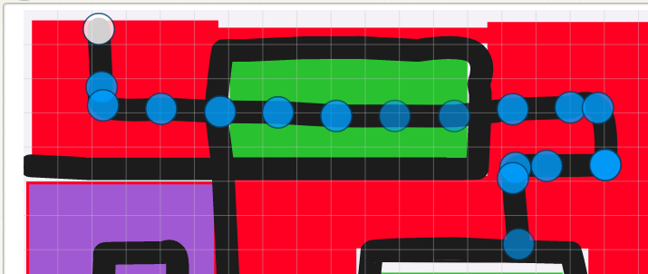

Proceed to [Archives](./RoseClassNotesArchived.html) 》 
{: style="float: right;"}
<br clear="both">

<div id="toc">

* [November 5th](#november-5th)
  * [Recap for November 5th](#recap-for-november-5th)
* [October 29th](#october-29th)
  * [Recap for October 29th](#recap-for-october-29th)
* [October 22nd](#october-22nd)
  * [Recap for October 22nd](#recap-for-october-22nd)
* [October 15th](#october-15th)
  * [Recap for October 15th](#recap-for-october-15th)
* [October 8th](#october-8th)
  * [Recap for October 8th](#recap-for-october-8th)
* [October 1st](#october-1st)
  * [Recap for October 1st](#recap-for-october-1st)
* [September 24th](#september-24th)
  * [Recap for September 24th](#recap-for-september-24th)
* [September 17th](#september-17th)
  * [Recap for September 17th](#recap-for-september-17th)
* [September 10th](#september-10th)
  * [Recap for September 10th](#recap-for-september-10th)
* [September 3rd](#september-3rd)
  * [Recap for September 3rd](#recap-for-september-3rd)
* [August 27th](#august-27th)
  * [Recap for August 27th](#recap-for-august-27th)
* [August 23rd Makeup](#august-23rd-makeup)
  * [Recap for August 23rd](#recap-for-august-23rd)
* [August 20th](#august-20th)
  * [Recap for August 20th](#recap-for-august-20th)
* [August 14th Makeup](#august-14th-makeup)
  * [Recap for August 14th](#recap-for-august-14th)
* [August 13th](#august-13th)
  * [Recap for August 13th](#recap-for-august-13th)
* [August 6th](#august-6th)
  * [Recap for August 6th](#recap-for-august-6th)
* [August 2nd (Make-up)](#august-2nd-make-up)
  * [Recap for August 2nd (Make-up)](#recap-for-august-2nd-make-up)
* [July 30th](#july-30th)
  * [Recap for July 30th](#recap-for-july-30th)
* [July 16th](#july-16th)
  * [Reminder](#reminder)
  * [Recap for July 16th](#recap-for-july-16th)
* [July 9th](#july-9th)
  * [Recap for July 9th](#recap-for-july-9th)
* [July 2nd](#july-2nd)
  * [Recap for June 2nd](#recap-for-june-2nd)
* [June 25th](#june-25th)
  * [Recap for June 25th](#recap-for-june-25th)
  * [Updated on June 2nd](#updated-on-june-2nd)
* [June 18th](#june-18th)
  * [Recap for June 18th](#recap-for-june-18th)
* [June 11th](#june-11th)
  * [Recap for June 11th](#recap-for-june-11th)
  * [Complicated Maze](#complicated-maze)
  * [Mario project](#mario-project)
  * [Changing Directions](#changing-directions)
  * [Move Gus](#move-gus)
  * [Jumping Princess](#jumping-princess)
  * [Mermaid Layers](#mermaid-layers)
* [June 4th](#june-4th)
  * [Recap for June 4th](#recap-for-june-4th)
* [May 28th](#may-28th)
  * [Recap for May 28th](#recap-for-may-28th)
* [May 21st](#may-21st)
  * [Recap for May 21st](#recap-for-may-21st)
* [May 14th](#may-14th)
  * [Putting the bad candy in a basket](#putting-the-bad-candy-in-a-basket)
  * [Snowboarder](#snowboarder)
  * [Easy Training Game](#easy-training-game)
  * [Soccer Game](#soccer-game)
  * [Drawing a Complex Maze](#drawing-a-complex-maze)
  * [Disappearing Characters](#disappearing-characters)
* [May 7th](#may-7th)
  * [Recap for May 7th](#recap-for-may-7th)
* [April 23rd](#april-23rd)
  * [Recap for April 23rd](#recap-for-april-23rd)
  * [Happy Golden Week](#happy-golden-week)
* [April 16th](#april-16th)
  * [Recap for April 16th](#recap-for-april-16th)
* [April 9th](#april-9th)
  * [Recap for April 9th](#recap-for-april-9th)
* [April 2nd](#april-2nd)
  * [Homework due April 9th](#homework-due-april-9th)
  * [Recap for April 2nd](#recap-for-april-2nd)
* [March 25th](#march-25th)
  * [Recap for March 25th](#recap-for-march-25th)
* [March 19th](#march-19th)
  * [Homework due March 26th](#homework-due-march-26th)
  * [Recap for March 19th](#recap-for-march-19th)
* [March 12th](#march-12th)
  * [Recap for March 12th](#recap-for-march-12th)
* [March 5th](#march-5th)
  * [Homework due March 12th](#homework-due-march-12th)
  * [Recap for March 5th](#recap-for-march-5th)
* [February 26th](#february-26th)
  * [Homework due March 5th](#homework-due-march-5th)
  * [Recap for February 26th](#recap-for-february-26th)
* [February 19th](#february-19th)
  * [Homework due February 26th](#homework-due-february-26th)
  * [Recap for February 19th](#recap-for-february-19th)
* [February 12th](#february-12th)
  * [Homework due February 19th](#homework-due-february-19th)
  * [Recap for February 12th](#recap-for-february-12th)
    * [ScratchJr.](#scratchjr)
    * [Tynker](#tynker)
* [February 5th](#february-5th)
  * [Recap for February 5th](#recap-for-february-5th)
    * [February 5th Tynker](#february-5th-tynker)
    * [February 5th ScratchJr.](#february-5th-scratchjr)
* [January 29th](#january-29th)
  * [Recap for January 29th](#recap-for-january-29th)
* [January 22nd](#january-22nd)
  * [Homework due January 29th](#homework-due-january-29th)
  * [Recap for January 22nd](#recap-for-january-22nd)
* [January 15th](#january-15th)
  * [Homework due January 22nd](#homework-due-january-22nd)
  * [Recap for January 15th](#recap-for-january-15th)
* [January 8th](#january-8th)
  * [Homework due January 15th](#homework-due-january-15th)
  * [Recap for January 8th](#recap-for-january-8th)
* [New Year's Day, 2021](#new-years-day-2021)
  * [Homework due January 8th](#homework-due-january-8th)
  * [Recap for New Year's Day, 2021](#recap-for-new-years-day-2021)

</div>

-   Click on the [> Date]() or <span style="color: #3399cc;  border-left: 9px solid #3399cc!important;border-radius: 4px 4px; font-weight: bold">BLUE</span> borders to toggle the <span style="background-color:#ffeca0; border-left: 10px solid #3399cc !important;border-radius: 4px 4px;"><b> &nbsp;<span style="font-size: 70%">▶︎</span>&nbsp;&nbsp;Details&nbsp;&nbsp;&nbsp;&nbsp;</b></span> 


<details markdown=1>
<summary markdown=1>## November 5th 
</summary>

## November 5th 


### Recap for November 5th 

Kimetsu No Yaiba
  : Two classes ago we made a water breath that jumps in a parabola across the screen. This week we modified it so the fire breath gets larger and then smaller as it moves along the parabola. The key is understanding that the velocity is positive as it rises, and negative as it falls. So it changes size along with the velocity.


  
  


Harry Potter
  : Student Y worked on improving Voldermort's death ray. His goal was to make the ray get larger and larger until it turned totally white. We were finally able to create the effect using the brightness and invert effects. When Harry survives the curse, he 
  gets a scar. He also added some trees to add texture to the project.

  


</details>


<details markdown=1>
<summary markdown=1>## October 29th
</summary>

## October 29th


### Recap for October 29th

Harry Potter
  : Today we used clones to send a death ray to Baby Harry Potter. We modified the shape of the bullet and controlled how many bullets and where they came and went to. As always, very precise work from Student Y.




Kimetsu no Yaiba 
  : Student K worked on making the sword, tanjiro, and water breath all move together. This involved making all of them respond to  a flash broadcast, as well as making sure they were properly positioned together in relation to each other with change x and y blocks before the main movement started. Next week we will add a fire breath.



</details>


<details markdown=1>
<summary markdown=1>## October 22nd
</summary>

## October 22nd

### Recap for October 22nd


Kimetsu no Yaiba Game
  : Something really special happened in our class today. Today's goal was to make a character move when the first button was clicked. The student chose a path for the character like a slanted letter N. To show how to make the character glide slowly up and to the right, I was effectively teaching the student simple (cartesian) geometry. And, by using variables to code it I was introducing simple algebra. What was amazing that this would normally be considered several years beyond this student's math level, but by using Scratch (and going in small incremental steps) he was able to understand the basic concepts **naturally**. It was really great! This was a perfect example of how learning coding can enhance, even accelerate, learning in other fields. 





Harry Potter
  : This week worked on creating a better green flash of light for Voldermort's spell against Baby Harry Potter. First I showed how we could use clones to create the effect:



We added a wand to the Voldemort character, which involved good paint tool practice, carefully reshaping and positioning the wand. Then we identified the start and stop points of the spell and were able to make it go to the end of the wand.



Duel to the Death
  : During the break we all had a lot of fun playing Harry Potter Death Duel together.




</details>

<details markdown=1>
<summary markdown=1>## October 15th
</summary>

## October 15th

### Recap for October 15th

Kimetsu no Yaiba
  : Today Student K aimed to make his character jump across the stream in a parabola. I showed him how to make gravity and I gave him the code for small loop that makes a parabola. He spent some time carefully copying it which I think was a very good practice using the interface, for example, typing, finding blocks, and distinguishing blocks from each other, as well as getting a sense of what the blocks do. 
  
  : Once he got that coded, we had to do a little troubleshooting. Instead of jumping in a parabola, his character jumped up and down. I prompted him to describe carefully what had gone wrong and what block would have an effect on that. By doing this, he was able to notice that he had used a set block instead of a change block. 

Harry Potter
  : Student Y took to the blackboard and in very good detail gave a broad picture of his entire project especially the final section that involves a game between Voldemort and Dumbledore. 


  : In the game, people use the keyboard to increase the strength of different aspects of the actor, such as the wand, the "thoughts", the bravery, and the strength of the character. When you press the space key the two characters cast a spell and attack each other with a flash of light. 

  : This looks like it might be a very very interesting game and having an overview of where the game will go will help us be able to coded. In addition he worked on the latter part of Section 2. by fine tuning how the character of Dumbledore appears and speaks. I showed him how to use the same block with an exciting excited thought bubble to make it look more interesting. 

</details>


<details markdown=1>
<summary markdown=1>## October 8th
</summary>

## October 8th


### Recap for October 8th
 Student K worked on his Kimetsu No Yaiba game. We discussed how th game would be played. We focused on dividing the game into Actors, Objects, and Events. 

* Actors: Hero and Bad Guy
* Objects: Buttons for different Attacks
* Events:
  * Bad guy attacks when the Hero is too close
  * Hero attacks when the space bar is pressed
  * Hero dies if Health points are less thaan 0
  * Bad guy dies if Health points are less than 0
  * When Wather Breath button is pressed, the Water Breath Attack happens.



Student Y added more action to his Harry Potter game. In addition to adding a new chapter, he added a 'flash of light' effect as Voldermort attack Harry. He also helped the other student explain his game.



</details>


<details markdown=1>
<summary markdown=1>## October 1st
</summary>

## October 1st

### Recap for October 1st

The theme of the day was user input. Student discovered ways that adding user input can make a game more fun.

Harry Potter
  : Student Y made me a list of Harry Potter projects that he enjoyed. He learned how to copy and paste urls and made a list including a short description of what he liked about each project. He seem to especially enjoy a project about dueling Harry Potter's that involved user clicking certain keys. 




Fighting Game
  : Student K also continued working on his recent Fighting Game. He combined two sprite into one with two costumes, and also learned how to make the character respond to keep presses to control the characters who are fighting.




</details>


<details markdown=1>
<summary markdown=1>## September 24th
</summary>

## September 24th

### Recap for September 24th


Tynker
  : Kids worked on individual projects today

Harry Potter
  : Student Y continued adding narration to his Harry Potter Project. 
  


He was very excited to be able to synchronize the sound to his animation.




Student R started working on a Kimestu no Yaiba project. T




Scratch
  : Students Y and R worked on exploring various Scratch Projects for future projects. 

Farewells
  : During the break time, we celebrated the last day of some of our students. We wish them good luck and good fortune on their travels, and look forward to seeing them again in the future.


</details>


<details markdown=1>
<summary markdown=1>## September 17th

</summary>

## September 17th


### Recap for September 17th

Songs
  :: The main challenge for today in the Songs project was making the buttons disappear when the music is playing, and come back when the music is done. We needed to create several blocks like the ones below. 





Harry Potter
  : Student Y added more to his story about Harry Potter, especially working on playing with the size and timing of Voldermort's appearance.




Scratch
  : The scratch kids explored and "hacked" a few drawing projects such as the following one. 




ScratchJr 
  : Student J Created a Road Crossing project, with a little help from me, a bit similar to this one:

  
 


</details>


<details markdown=1>
<summary markdown=1>## September 10th
</summary>

## September 10th

### Recap for September 10th


Music Jukebox
  : Student R adapted a Music Jukebox project on Tynker. She worked on using the when this actor clicked blocks. She chose and imported some music, and made buttons that would play the music when clicked. In addition she learned to use broadcasting to make the other buttons disappear when one piece of music is playing. We talked about the advantages and disadvantages of putting text on the background or in the character itself.  

Harry Potter 
  : Student Y continued working on his Harry Potter Project, adding more narration and action. He used the set size block to control the size and swith costume blocks to change the character as the story proceeded.

First Person Shooter
  : The Scratch kids did a First Person Shooter Tutorial that involves movement and forever loops.



</details>


<details markdown=1>
<summary markdown=1>## September 3rd
</summary>

## September 3rd

### Recap for September 3rd

Today students worked on individual projects. Projects included

Basket Game
  : The student added more balls ot his game. The project uses conditionals, screen wrapping, movement blocks

First Person Shooter
  : We made the gun for the shooter, and talked about drawing and object placement, direction angles and limiting movement, following the mouse. 



Harry Potter Game 
  : This student started making an introduction to Harry Potter Project, based on a model I gave him.

Beginning ScratchJr.
  : A new student joined this week, and I gave him an introduction to ScratchJr that included using the green flag and touch blockss, and various other blocks. Based on the fishtank sample project he make his own project

</details>


<details markdown=1>
<summary markdown=1>## August 27th
</summary>

## August 27th

### Recap for August 27th

Today we had kids doing a variety of projects. Some kids were working on modifying the Cat Training project from last week. We added jumps and costume changes. The project is primarily a demo project to explain broadcasts, it includes some repeat loops and motion scripts. 




A Tynker student continued gathering items for a Harry Potter project. We talked about you could make a simple Harry potter project using the images he was collecting. The idea was to have a narrator who would tell the story and the action would be illustrated to the side using the gifs. As an incentive, we agreed to each a make a Harry Potter project to share with each other. I showed him the first part of my project:



Another student added a sequel to her Favorite Song Project. I like this kind of project that shows the student's individuality. 





</details>


<details markdown=1>
<summary markdown=1>## August 23rd Makeup
</summary>

## August 23rd Makeup

### Recap for August 23rd

Student Y learned how to import gif files into Tynker and started a Harry Potter project.




</details>


<details markdown=1>
<summary markdown=1>## August 20th
</summary>

## August 20th


Several announcements:
  : The class notes for last weekend are on the website. We have had a lot of makeup classes recently, and, to avoid confusion, let me explicitly state that class notes for your child's makeup classes are on the page for their usual class, not for the day they attended. For example a Monday student who attends a makeup on Friday will have any notes relevant to him/her on the Monday Page. 

  : Since we are heading into another Emergency Period, we will be strictly enforcing our Covid guidelines around hand washing, social distancing and mask wearing, etc. If you could remind your child these are important rules and of the need to cooperate with them that would be helpful. In addition, seating and snack times will be staggered accordingly.

  : We are pleased that for the most part students are focused and attentive during class, and with their cooperation we are creating a fun, relaxed, yet productive learning environment. However, to maintain this, it would be a good time to remind your child that the main activity in class should be working on assignments and projects, i.e. learning to code. I want to avoid ending the day with a child not having made any tangible progress.  Exploring games and playing them, while educational and part of our goal, is better done at home.

  : (To clarify: We do encourage students to explore the many games that Scratch and Tynker make available, and investigating and hacking other projects is a valid part of learning. We also understand the temptation to play them in class is very strong. However, this can easily become a distraction (for them and others) and a gentle reminder from parents would help me better keep these factors in balance. We do provide free time during breaks, and this is not meant as a ban, but a reminder.)

  : Lastly, our class policy is that students should make an effort to communicate, even amongst themselves, in English, as much as practicable, especially during the first section of class. We understand the limitations around this, but we want to be sure this expectation is clearly understood by all so that we can help support them with this. 

### Recap for August 20th


Today Student R made some corrections to her Dance Party and My Favorite Song Tynker projects, including adding animations for some of the characters. Then she did the Spin Draw Tutorial, and added some keypress actions to make the stamp bigger and smaller when s and b are pressed, and to change the stamp costume when a is pressed. She also added some background music. 




Student K worked on a Scratch Basket Catching Game. He learned a little about x and y coordinates He made the y coordinate of all his balls the specific y value so he could see them in  a line at the top of the screen. When his balls hit the bottom of the screen, by choosing a random position, but setting the y value to that specific value, they would all fall again from the same place.. 




</details>


<details markdown=1>
<summary markdown=1>## August 14th Makeup
</summary>

## August 14th Makeup


### Recap for August 14th

Scratch students Y  and R worked on an easy Cat Training project, based on a  student's original project. We taught the cat to sit, lie down, run, and roar. 




</details>

<details markdown=1>
<summary markdown=1>## August 13th
</summary>

## August 13th


### Recap for August 13th

Student R made a Dance Project on her own. This project showcases some of the things she learned in the Moving Gus Project, such as changing levels, changing directions, and animating conversations.




Student Y contemplated making a Harry Potter project, based on the comic book tutorial project. He created a storyboard for the project, but finding a way to make the Harry Potter Actors (that is to say the graphics) was difficult. I suggested importing images from gifs, but this does require quite a bit of work. Student R will have to decide whether to do the storyboard with stock characters, draw his own characters, or modify his project in some other way.




Student K continued working on his Falling Ball game. We talked a little about incorporating user actions into his game. He decided that clicking the ball would send the player to ahe next level. 

```
when this sprite clicked
if <<(x position) = [200]> and <(y position) = [-150]>> then
    broadcast [New Level v] and wait
end
```
{: .msb}

We noticed that his ball bounced a bit too far to the right and down. We used the following standard method of keeping the ball within limits:

```
if <touching color [#83fffc]?> then
        change y by (5)
    end
    if <(y position) < [-150]> then
        go to x: (x position) y: (-150)
    end
```
{: .msb}

Then he began deciding what would happen on his next level.

</details>

<details markdown=1>
<summary markdown=1>## August 6th
</summary>

## August 6th

### Recap for August 6th


Student K graduated up to Scratch this week. We worked together on making this falling ball project, including code for making the ball move right and experience gravity. 



Student R explored animation blocks and made this little introduction to dance project. 



Student Y ran up against a particularity of Tynker. He wanted to make the copies of the stock Tynker character, some of which woudl be bad guys, some of which would be good guys. Though it seems logical that one should be able to do this, in fact Tynker prevents this. 



</details>


<details markdown=1>
<summary markdown=1>## August 2nd (Make-up)
</summary>

## August 2nd (Make-up)

### Recap for August 2nd (Make-up)

Today we had a make-up class where Student R, working mostly on her own, conceived, coded and completed this lovely project. She has clearly come a long way, showing an understanding of different level, animating characters, sequencing conversations, using "flash screens" and other story framing devices, not to mention concentration, creativity, and attention to detail. Wonderful work! 




</details>


<details markdown=1>
<summary markdown=1>## July 30th
</summary>

## July 30th

### Recap for July 30th


Two ScratchJr. students graduated to Scratch this week. we worked on signing them in, and doing some basic tutorials. As is typical, they became very interested in importing their favorite pictures and characters into projects.

Another ScratchJr. student worked on a speed test project. The idea is to see how adding more copies of a block changes the way the block performs, such as going faster. The project is open-ended so as to encourage creativity and exploration.

In Tynker,  Sword fighting project is still very near completion. Student Y ran into a problem that he couldn't tell what his broadcast blocks were doing. I suggested he use more descriptive names for them.

Tynker student R finally completed her Moving Gus Project! It is great! 



After that she began exploring for other projects to do next.


Two Tynker students are going on break, and I made a last minute push to finish their projects as much as possible before they left. 

For the Crossy Road project we added a test to see if the main actor was touching the cars, using an "or" conditional. We changed from having the game end when she touches the cars to her going back to the start when she touches the cars. We also added a "You Win" message when she touches the flag. We also added jeep that nudges you move if you take too long. These were some great ideas and the game is a nice success.

For the Mermaid Project, we talked about some options for her game, her modification of the day was to add a score when you catch the good candy, such as the blue candy. This taught her a bit about creating, setting, and changing variables.


</details>


<details markdown=1>
<summary markdown=1>## July 16th
</summary>

## July 16th

### Reminder 
### Recap for July 16th

ScratchJr.
  : This week we had a student visiting us, which gave an opportunity for kids to show off some of their projects to him, as well as to teach him the basics of ScratchJr.

  THe most popular of the games they worked with was the mario project from a few weeks ago. The student needed some help explaining how to make the characters disappear.

Sword Fight
  : The Sword Fight project is effectively finished. The student added a bronze match, and then a final goodbye and thank you for all the characters.  We discussed future projects, including a fainting project and a Harry Potter Project.

 


Move Gus 
  : The Move Gus project is also nearing completion. The student what is planned to be the last level, with the final battle. We talked about how the project would go from here and she began coding it.




Mermaid
  : This week we added a flashing "Good Job" when the character gets the good candy. I explained how we would make it flash.





</details>


<details markdown=1>
<summary markdown=1>## July 9th
</summary>

## July 9th


### Recap for July 9th
 
 
ScratchJr
  : Two of the ScratchJr. kids continued working on the Space invaders game, specifically making the space invader appear and descend. This was challenging for them, and we walked through it a few times, including using the white board to map out the different actions needed. Student R was able to finish it after sorting out a problem with his left and right arrow buttons. 
  
  Student Y is about halfway finished, but became interested in a frog jumping game some other kids were working on, so he tried his hand at that. This was really a very simple project with the goal of getting the kids to think of ways of making it more interesting. For example, student H turned the frogs into a herd of elephants.

Sword Fight  
  : The sword fight project continues, with some debugging cause the fighters wouldn't get up after fighting. Were they fighting too hard? No, they just needed an idle animation block. The fighters now also get awards.  This is still a work in progress.

Move Gus
  : Level 4 of Gus move project was having some problems. One problem was that an extra stage was somehow introduced, and it took some detective work to figure it out. In addition, some special settings had to be adjusted. She had copied the actors without copying the settings such as making the platforms static active so they would stay still and stop the actors, but making the heroine not static or active, so she would feel gravity.  We also made the game move to level 5 when the heroine falls, which in this game she will. 

Crossy Road 
  : A Tynker kid started working on a road crossing game. We chose a road costume for her to use, and she coded some cars crossing the road and a character who crosses it.



Mermaid
  : The mermaid game is almost finished. Once the last candy is taken, the mermaid takes the basket to the center of the stage and then drops all the candy. I explained to her how to make this happen with messages and glide blocks, and we will start coding it next week.

</details>


<details markdown=1>
<summary markdown=1>## July 2nd
</summary>

## July 2nd

### Recap for June 2nd

Omission from last week.
  : I omitted a discussion of the Space Invaders ScratchJr. Project in last week's class notes. Please see last week's entry for the omitted information.


Space invaders
  : At the start of class, some ScratchJr. students continued working on space invaders. To make it easier, we divided the project into 2 parts, and the kids worked on each part.












Quiz
  : Today's project was a quiz game. The children started on it by making questions. Some did math questions, another did Curious George Questions.



Sword Fight
  : Continuing on his excellent work, Student Y added the "last team fight" and "trophy time" stages to his Sword Fight project. We got trophies from the internet and I showed him how to remove the background with pixlr background remover. 

  

Doodle Jump
  : Student R continued working on the Doodle jump tutorial. This tutorial has a few mistakes in it: 
  





</details>


<details markdown=1>
<summary markdown=1>## June 25th
</summary>

## June 25th

### Recap for June 25th


The Final Battle
  : Student Y is doing well using sequential messaging to structure the action in his Sword Fight project, adding the final battle to his Sword Fight project, and also some dramatic music. He has worked very hard on this project, and I think learned a lot from it.



Crossy Road
  : This week, Student C decided to start a new project called Crossy Road, but it is still in the early stages. She may return to her previous project later.

How Levels Work
  : Student A had some more questions about how levels work, especially in our code. I explained that the code does this: Whenever a candy is touched, it broadcasts a message to every character. It says, if I am not the character who was touched, keep moving back until I am at layer 93. If I am the character who was touched, go to level 95." This way the last character touched is always in front of the basket. This explanation really helped her. She started adding this code to the characters and modifying the messages to suit each candy. She also added sound to the project.



### Updated on June 2nd
  : This was orignally omitted here:

Space Invaders
  : Scratch Jr. Students Y and R worked on a simplified version of Space invaders. This is really an exercise in using messages to have one character control another. The kids seem to understand the concept, but have difficulty knowing exactly where to put the elements. Nonetheless they are good at adding their own creative elements, such as this interesting missile, and are excited about making the project:




</details>


<details markdown=1>
<summary markdown=1>## June 18th
</summary>

## June 18th

### Recap for June 18th


Combining Projects
  : Student R used the backpack to import the Actors from another tutorial into this one to make the 4th level of her Moving Gus project. This is still a work in progress.


Swordfight
  : After I had made some cleanup to his code, student YY found a bug and worked hard to find the source. I showed him how to sequence the routines with a main loop, and he began adding further routines.





ScratchJr.
  : Several ScratchJr. students worked on a variant of Mario. The project involved sending messages to more than one sprite at a time to make them appear and disppear in sequence. We went step by step and most were able to complete it. 


Mermaid
  : Student A's achievement for the day was finally being able to log in all by herself (an ongoing struggle)! Together we reviewed some code for putting her candy at the right level, and she worked on making a "game over" screen.


</details>


<details markdown=1>
<summary markdown=1>## June 11th
</summary>

## June 11th

### Recap for June 11th


### Complicated Maze
Student R has been trying to make a maze. I reviewed with him how to make lines straighter and remove dots. He was having some difficulty because his lines were too close to each other and not straight. 

The source of the problem is that the ScratchJr. interface is very limited in size and detail and available tools. When we move to the more advanced interface in Scratch, this will not be a problem. But, for now, here we are.

We took out a sheet of graph paper and I showed him how to draw a pattern by filling in the squares on the graph paper. The key to using lines in ScratchJr. is identifying the individual lines in the drawing. Each line needs to be handled separately. For example a simple cross can be to lines at right angles, or two L shapes touching at the corner. 




Once you know the lines, then you know how modify them to make the shape you want.


### Mario project
Student Y continued working on his Mario-type game. He chose some characters 











and made buttons. We worked together on putting backgrounds to the buttons. 

Then he described what he wanted the characters to do and I showed him how to code it. When we click the button, it sends a message mario and to the kuribos. There are several kuribo characters, but only one is visible. They all move together, but only one is visible at a time. The message makes Mario moves right, and all the kuribo characters move left. Then if the visible kuribo and mario are touching, a message is sent:

1. Hide and return mario to his original spot.
2. visible kuribo disappears 
3. next kuribo returns to his origin and appears 

This repeats until there are no more kuribos and Mario can escape. This video shows how it works, without the mario characters.




### Changing Directions

Student Y continued working on a swrrdfighting project. He wanted his actor to face in different directions so we reviewed the rotation style and point in direction blocks.

### Move Gus

We made some improvements to her Move Gus Project, such as adding a score and switching levels. We also talked about the idle animation.




### Jumping Princess

I showed her how to make the coins make a sound and disappear when the actor touches them. 




I showed her how to copy code from one character to another and she started copying the code to all her coins.




### Mermaid Layers
She continued working on making bad candy flow to the basket. She asked a good question: what happens if characters are set to the same level? This is a very simple and good question, with a complicated answer, which we will save for another day. We walked through writing the code for one more actor.

</details>


<details markdown=1>
<summary markdown=1>## June 4th
</summary>

## June 4th

### Recap for June 4th

Swordfighting
  : Student Y continued updating his swordfighting project. After the fighters move to the side of the screen, the first two fighters approach each other to fight. We added a broadcast message block to start the sequence. 
{: .jsgif}


The next question is how to get the players to alternate kicks. The answer was to use a wait and an animate/wait on one character,

{: .jsgif}

but a animate/wait and *then* a wait on the other.

{: .jsgif}




Fairy Treasure Game
  : I suggested Student R add a storyline to her fairy chase game. She added an opening level to her game where the robot steals the fairy's treasure. 



Mermaid
  : Student A continued adding code to move the candies to the baskets. 
{: .jsgif}
  : * The key is setting the layer to a value between 50 and 100.



Making Rain
  : Student K started on the making rain project. He was able to make the rain fall fairly easily. I challenged him to add an introductory part and turn it into more of a story.


Maze 
  : Students Y and R continued working on ScratchJr projects. Student Y worked on finding characters for his next project. Student R worked on this rather complex maze project. 

{: .jsgif}


</details>


<details markdown=1>
<summary markdown=1>## May 28th
</summary>

## May 28th

### Recap for May 28th

Beach Project
  : Student A learned about layers to help put the bad candy in the basket.

Platform Project
  : I reviewed some corrections Student C's project, including making sure the actor costumes are centered and adding physics and gravity. I will continue to review these with her next week.

Scratch Jr.
  The scratch Jr. Prjoect of the week was The Alien Comes to Visit project. Students K, R, and Y each made different version. Here is one version by student K.



Move Gus
  : Student R made a lot of progress in her fairy chase project based on "Move Gus" tutorial. She finished the first level with one chaser, and moved on to level 2 with more chasers. She included a timer, and signal for when the game is over. 



Swordfighting Contest
  : I reviewed with student Y some suggestions for how to bring the characters on stage using animate and glide blocks which he incorporated into his project. 



</details>

<details markdown=1>
<summary markdown=1>## May 21st
</summary>

## May 21st

### Recap for May 21st


Candy Project
  : Student A asked how to make the bad candy look like it is IN the basket. The trick is to use a tool like pixlr to cut the basket into a front and back part. We put the front basket in different layers. Then we can put the item between the two layers. I have created the basket pieces for her, and next week we will work on the code.

Jumping Game
  : I showed them a math game (a simplified clone of a popular app). She was inspired by this to create a storyboard for her own her own jumping game. She began creating the characters and next week we will make the magic happen.


Android Chase
  : She started a project where two androids will chase a heroine. She was able to code the keyboard movements for the main actor.




Mario Projects
  : Some students finshed their maze projects and were able to make a first stab at the Mario project. Most were were able to make the opening screens and first screen, but some had problems making Mario jump over the gap in the third screen. Next week we will improve their jumps, and make them collect coins.

{: .jsgif}
  : * The first two screens work, but the jump in the last screen is still not high enough.

Sword Fighting
  : Student Y came up with an idea for his next project, a story of a sword fighting tournament. We talked about the project and he completed his script and storyboard in clas, and started creating his actors.
</details>


<details markdown=1>
<summary markdown=1>## May 14th
</summary>

## May 14th

### Putting the bad candy in a basket 

Student A wanted the bad candy to go into a basket when it was touched. We spent some time debugging this. You can see it in action if you touch the upside down candied Apple at the bottom right.



### Snowboarder 

Here we talked about what to do when the character loses lives. We did a simple flowchart of the "if then else" on the board. If we have only one life (blank2 costume), then send the you lose message, and then go to the next (zero lives). decrease lives (next costume).

{: .jsgif}

### Easy Training Game
Student Y made an "easy training" game for playing shooting games. 



### Soccer Game

Student R made a soccer game. He used bump blocks to control the flow of the game. For example, the two black "field lines" send teh character to the "No Goal!!!" screen. If the ball hits the soccer net, the player goes to the "Goooooool!" screen. 

{: .jsgif}

Using a yellow message block, when the black button is pushed...

{: .jsgif}
...the ball flies diagonally (the yellow blocks happen in parallel) towards the goal. The player has to choose the right moment.

{: .jsgif}

### Drawing a Complex Maze
Student Y really wanted to make a very complicated maze. Unfortunately one limitation in ScratchJr. is that the stage is only 20 by 15 blocks wide. I brought out the graph paper and I outlined a square of half of those dimensions. Each grid square represented 2 blocks, which is wide enough for a character to pass through. we drew the maze within these bounds on paper and then transferred them to the character.
{: .jsgif}

Then he began making the maze game itself using buttons and message blocks to control the sprite. When finished the sprite will get a you won message if they complete the maze. Also, if the sprite touches the maze he will be sent back to the start.

{: .jsgif}


### Disappearing Characters
Students K and R did a makeup class on Saturday, where we held an **introduction to Scratch** class. They worked together on a project inspired by the **Animate My Name** Tutorial.  When game starts, some characters are shown, others are hidden.

```
when gf clicked
show

when gf clicked
hide
```
{: .msb}

When the Stage is clicked, the backdrop changes and a message is sent. Some letters appear and some letters disappear. 

```
event_whenstageclicked
switch backdrop to (1 v) ::looks
broadcast (change v)

when i receive [change v]
hide

when i receive [change v]
show
```
{: .msb}




</details>


<details markdown=1>
<summary markdown=1>## May 7th
</summary>

## May 7th


### Recap for May 7th

Tynker
  : Today I introduced the following project demonstrating how to use animate blocks and idle blocks so that speech is natural. 

The key to this was using an Animate block paired with "time-consuming" blocks (like wait, glide, or say) that has the same duration.

{: .jsgif}
  : * The animation lasts for 4 seconds, and the say, glide, and wait take up 4 seconds.

{% include tynkerprojectpage.html Name="Animate and Idle blocks" ID="https://www.tynker.com/play/walking-and-talking-with-animate-with-odd-characters/6097b882c3e2144ace08f576-820002XqrMo2SwyZj..a7Nj6z7Dc4k" caption="Click the actors to see them in action. You can see the code above in action when the second actor moves back from the center. The fourth and fifth actors were for kids to code themselves, and they worked individually on this. The kids also mischievously enjoyed adding new characters, like dinosaurs, to my project while I wasn't looking. " %}


Scratch Jr.
  : Student K worked on making a path maze from a linear maze. He added the idea of moving cars to make the game more challenging!

{: .jsgif}
  : * Watch out for traffic!

</details>


<details markdown=1>
<summary markdown=1>## April 23rd
</summary>

## April 23rd

### Recap for April 23rd

ScratchJr
  : The project this week was a maze game. 

{: .jsgif}

Straight Lines
  : One key skill for this is knowing how to make straight lines, as described in the [Dragon Maze](../lessons/DragonMazept1.html). 
  
1. First click the select arrow and then click a line. 
2. The line will appear with dots. 
3. Click on a dot to remove it. 
4. Remove all the dots except 2 to make a perfectly straight line. 
5. Drag 2 dots directly over each other to make a sharp corner. 
6. Drag the dots around to modify the path of the line. 
7. Using a set of lines, make a maze.

{: .bordered width="300px"}

Today I really emphasized step 5, to make a sharp corner. Student Y became very ambitious in his maze and it had long lines, with lots of twists and spirals. This required precision handling of all the dots, and counting the dots needed. I thought this would be discouraging, especially because he wasn't using a stylus, but just his finger. But in the end he kept at it and worked very hard to get what he wanted. Great Job! 

Student K finished his maze and moved on to making the [Dragon Maze](../lessons/DragonMazept1.html). He also worked on. 

Student R was also able to complete the maze, and had a lot of fun adding music.

Exploring Tynker
  : Student Y spent today's class exploring various tutorials and projects looking for his next project to complete. He seems to have settled on make a comic strip project.

Beach Project
  : Student A continued working on her Beach project. She realized that is was a bit hard to get to some of the candy, so she started working on making a basket that the candy could go in when you collect it. We chose a basket image from Google, and used [Pixlr](pixlr.com) to remove the background. Then we inserted it into the project.

{: .bordered height="300px"}



Snowboarder
  : For the snowboarder project, student C continued working on a "life" system for kids. When a player collects bad candy, she loses one life. Before she was using separate actors for each life, and I suggested making each life be a costume. That way she can use the "next costume" block to keep score.  This is a simple alternative to using variables.

{: .bordered width="300px" }

### Happy Golden Week

Here is some fun to wish everyone a wonderful golden week. Watch it to the end!!



See you after the holiday.

</details>


<details markdown=1>
<summary markdown=1>## April 16th
</summary>

## April 16th


### Recap for April 16th

ScratchJr.
  : Kids continued work on last week's project, and started the new project of the week.

One kids continued working on the cat crossing project, to make it diagonal. Then I introduced this week's project, based on Flappy Bird.

{: .jsgif}

The student then started work on the flappy bird project. 

Another kid made a rocket project. We worked on how to switch screen, and how to return to a screen with the rocket in the right place. He came up with the idea of making a copy of the original screen to go to. Then I taught him about the 3 types of mazes and how to make straight lines. He made a simple maze project

{: .jsgif}

Another child created a simple beach project that shows an understanding of the bump and touch actor blocks.

{: .jsgif}

tynker
  : Kids finished the projects they were working on, and are now choosing their next project.

One child finished his **maze and villian training** project. We worked detecting when a character is a certain distance away before giving a message.

{: .jsgif}

And he worked on giving the actors the right health and lives to make the game interesting. Here is how it ended up:



</details>


<details markdown=1>
<summary markdown=1>## April 9th
</summary>

## April 9th


### Recap for April 9th

Today students were very creative in coming up with their own ideas and solutions to problems. This is an important step in avoiding getting stuck or frustrated.

Beach Project: Making Candy Disappear
  : Continuing from last week, one student came up with what do when the good candy was found. Her idea which was for two of the good candies have all the bad candies disappear. This helped her learn how to use messages and how to broadcast a message and how to hide AKA disappear a character. We also worked on making the character a bit smaller, otherwise there is no way to win the game!!


Beach Project: Moving hearts offscreen
  : Another child worked on making hearts appear. To get the hearts to disappear again after a few seconds she had to learn about screen coordinates. THe student is now working on giving the player lives.


Undocumented Tynker "bug": The bad guy that would not die
  : Another student's Tynker project had a bad guy that would not die. He would reappear even though he was programmed to have only one life. The solution turned out, in an undocumented "feature" that the properties block needs to be part of the same block that has the run and set up character block. Once we fixed this, the program worked!

{: .jsgif}

 

{: .jsgif}

 


ScratchJr. Chicken Crossing beginning steps
  : Some beginner students are interested in doing the chicken crossing project that some more advanced students are doing. Lat week they had made interesting houses and characters for the project. This week, we worked on teaching them how to make characters the right size and run across the screen in different ways using the movement blocks. We also  how to use an infinite loop how to use a bump block and a touch block to start the chicken moving. The kids also worked on their own exploring various blocks.

ScratchJr. Chicken Crossing advanced steps
  : A more advanced student worked very hard on an alternate version of the chicken crossing game. The goal this time was to make the roads diagonal. After the basic idea (parallel code blocks) was explained, this student was able to create this project all by himself which was quite an achievement. One problem was making the characters move across the screen because the screen is not square. We didn't quite solve this problem, but we explored alternatives.
  
Tynker: Using a loop to change the size of a character
  : another pupil working on Tynker had a question about how to make a character get larger. We used a loop to change the size of the character and a wait block to make the animation effect visible. In the end, though, she decided to just have the character get larger in one big jump.

</details>

<details markdown=1>
<summary markdown=1>## April 2nd
</summary>

## April 2nd

### Homework due April 9th

### Recap for April 2nd 

ScratchJr.
  : We did an introductory class for some new students focusing on using the image editor. For other ScratchJr. students, this week's project was a **Chicken Crossing** game. 

Chicken Crossing
  : In this classic game, click the chicken and get past the cars. Our version includes several levels. 

 

One student was able to recreate the project pretty well just by watching it run. The chicken gets across in stages, which adds challenge. Nice project.

 

The project itself is simple, using just a few blocks

{: .jsgif}

{: .jsgif}

but gives good practice in reusing code and also has many opportunities for variations. For example, the occasional back-step in the truck code adds a bit of challenge. 

Tynker
  : In Tynker, the **Beach Project** and variations made some headway.

Snowboarder
  : One student is working on a variation of the Beach Project where a snowboarder finds candy on the slopes. She was able to make the snowboard move, and is working on making the snowboarder react to the good and bad candy.

{: .jsgif}

Mermaid
  : Another student is working on sending messages when her mermaid touches the candy. When she touches the bad candy, she goes back to her home place. 

{: .jsgif}

{: .jsgif}

She has also added code for the good candy. 

{: .jsgif}


</details>

<details markdown=1>
<summary markdown=1>## March 25th
</summary>

## March 25th


### Recap for March 25th


ScratchJr.
  : Today I introduced the Walking Cat Project to one student. It has a walking cat, infinite motion, lots of waits to control timing, messages to control the action and make a conversation, bringing together skills students have learned recently.

{: .jsgif}

Tynker
  : Today students worked mostly on tutorials. One student had a problem with the cake decoration game because her stamp didn't seem to work. This was likely due to a bug in Tynker on iPads, and not the student's code, which was correct. Working together on it did give her a chance to experience debugging and testing.


</details>


<details markdown=1>
<summary markdown=1>## March 19th
</summary>

## March 19th

### Homework due March 26th

Assigned individually.

### Recap for March 19th

Tynker
  : Students worked on tutorials and continued the Beach Project
  
One student new to Tynker continued doing tutorials. She needed some help understanding loops, and pointing in directions. 
  
Another continued the Beach project. She had originally made the main character test to see if she touched the candies. It turned out that this did not work, probably due to a bug in Tynker, so we came up with a new algorithm (good practice), have the candies test to see if they are touching the main actor. 

{: .jsgif}

This worked! Though a bit of a detour, it did give the student lots of practice with getting the blocks and moving them to place, which for this student was very useful. At the end, we decided to make the actor return to the home place if she touches a bad candy, using messages.

{: .jsgif}

{: .jsgif}

ScratchJr.
  : The project of the day was a Mario Type game. The main actor has to jump over blocks that approach from the side of the screen. First we make a loop that moves clouds across the screen, with a wait before they reappear at the other side. We then use this to make the blocks approach the actor. 

First, the student shared a project they had done for homework, based on last week's project.

 


Then I walked the student through all the steps for the project of the day, and the student made their own version. 

 

</details>


<details markdown=1>
<summary markdown=1>## March 12th
</summary>

## March 12th

### Recap for March 12th

Tynker
  : Great progress today as most students worked on variations of the Beach game.
 
One student worked on moving the main character with keypresses, and sending and receiving messages. Then she learned how to detect if characters are touching.

{: .jsgif}

Another student created an interest "Dropping Hearts" effect when the characters was touched. This involved sending a message to both the actor touched and to the cherry effect.

{: .jsgif}

{: .jsgif}

We also talked about how to make the motions smoother or faster or longer.


{: .jsgif}

Students needing review worked with the tutorials including one student who moved up from ScratchJr. to Tynker today.

Scratch Jr.
  : Today we worked on a Kimetsu No Yaiba Sword Game. Just from watching the project once, the student  was able to figure out how to recreate it. 

{: .jsgif}
  : * A basic Kimetsu no Yaiba Sword game. Note that the arrows move the actor, and also keep the actor on screen. When the sword hits, the actor says hit.


</details>


<details markdown=1>
<summary markdown=1>## March 5th
</summary>

## March 5th

### Homework due March 12th

Keep working on your project, or try a new project

### Recap for March 5th


ScratchJr.
  : We continued working on the Beach Game project, and I introduced a new Sword Game.

For the beach project, one student made a project around finding a starfish. She had an opening screen, two game play screens and a final screen. She was able to complete a basic game where a rabbit uses buttons to move the rabbit towards a starfish. A bump block then has the starfish say you found me, and used messages in both the buttons and when the starfish is found. Then the rabbit finds the starfish hidden in some igloos while being watched by polar bears. 

{: .jsgif}

This was a great effort with a lot of independent work. I suggested adding instructions for the user as to how to use the game and transitions between the screens, and she worked on that.

The other student combined a story and a game. The main story is about a horse and man. The horse kicks away a rabbit and then challenges the man to a game to see who can find an apple first. At this point the game begins. The horse finds the apple first and wins a soccer ball. This was a great combination. The game came with a working set of buttons to move the horse and the man. It was a good use of say blocks, message blocks, scene change blocks, mostly done independently without much assistance. I helped with some of the logic, so that the horse announces he is the winner AFTER he gets the apple, not before.

Tynker:
  : This week kids continued and finished work on the beach game/candy hunt project. 
  
Some kids started with setting up the main hero's movement, either with **move** blocks or **change** blocks.

{: .jsgif}

{: .jsgif}

Some moved on to getting the program to sense when the candy is found.

{: .jsgif}

We will look at this more closely next class.

</details>

   
<details markdown=1>
<summary markdown=1>## February 26th
</summary>

## February 26th

### Homework due March 5th

Work on the Beach Candy Game

### Recap for February 26th

Today we focused on planning. As a group, the class came up with a project. 

<style>
ol li ul li ol {
    margin-bottom: 0px;
</style><!-- fixes bad spacing here -->
1. First we decided on the type fo project, a game. 
2. Setting: The beach
3. Story/Goal: Find and collect candy hidden in the sand.
4. Actors/Actions:
   * Protagonist(s) ("Good guys"): Sheep walks, jumps, digs, picks things up 
   * Antagonist(s) ("Bad guys"): 
      1. Insect attacks and bites 
      2. Skunk sprays 
   * Macguffins (sought-for items) 
      1. Good Candy give points: 
         * Lollipops
         * Chocolate
         * Gummy Bears
         * Cookies
         * Hi-chew
         * Hot Chocolate
      2. Bad Candy loses points, or send actor back to beginning. 
         * old shoes
         * old chocolate
         * smelly socks
         * smelly lollipop
         * coffee

The kids then started working on programming it. So far, the project is a simplified, modified version of the above.

ScratchJr.
  : The game was simplified for ScratchJr. For the protagonist, we used a little girl, for the antagonist, we used an Elephant, and for the MacGuffin we used starfish. In addition, we could only have one piece of candy on the screen.

In Scratch Jr. the kids also needed to make a way for the actor to move, so we repeated the control buttons using messages, as we had done  in the **Race To the Finish** project [a few weeks ago](http://localhost:4000/junior_coders/0c23f5f29d83139f13fc32a19c49dee01bfcd93f/class_notes_lessons/RoseClassNotes.html#february-5th).

From there, we use bump blocks on the starfish, so that when the girl touches the starfish, the start fish says something, and then we move to the next screen.

The project is underway and should be completed next week.

Tynker
  : In Tynker the focus was on choosing actors. 

Kids worked on making the characters the right size and placing them in various places.

Some kids started coding movement using **when key pressed** blocks

{: .jsgif}

The **did I touch** function block in the repeat block means we have to test to see if the girl had found (is touching) the candy each time we move. We replace it with the following **if touching?** block:

{: .jsgif}

This sends a message to the "candy" touched. (The break stops the motion of the girl.) The candy gets the message and reacts.

{: .jsgif}

We will work on this next week.

</details>

<details markdown=1>
<summary markdown=1>## February 19th
</summary>

## February 19th

### Homework due February 26th

Keep working on your projects

### Recap for February 19th

ScratchJr.
  : Today in ScratchJr. we worked on the the 3 little pigs story. This involves all the skills we have been working on so far, especially sending messages and all the movement and control blocks.

I showed the kids the sample project, which was derived from a student project done last year.

{: .jsgif}

After a brief explanation, one student turned this out, with barely any help from me. 

{: .jsgif}

Impressive job!

The second part of the project was to retell any well-known story. One child asked how to make it appear as if a character were walking, and I showed her a simple trick of moving the background instead of the character to give the appearance of movement:

{: .jsgif}

Tynker
  : In Tynker one student continued a whirlwind tour of sample projects. She spent some time working with the characters in the Animation Board project, but it was a bit difficult, so she settled on the Underwater Arcade. 

<iframe width="100%" height="408" src="//www.tynker.com/ide/embedded?p=602f727721db5e499a719fd9&controls=true&autostart=false" frameborder="0" allowfullscreen></iframe>{: .jsgif}

In this project, her challenge was to make the fish move down. Unfortunately she had put the loop in the wrong place

{: .jsgif}

but after some work she was able to debug it.

{: .jsgif}

</details>


<details markdown=1>
<summary markdown=1>## February 12th
</summary>

## February 12th

### Homework due February 19th

Keep working on knock knock jokes.

### Recap for February 12th

Today I taught kids about [Knock Knock Jokes](../lessons/KnockKnockJokes.html) and [Bad Jokes](../lessons/JokesForBadJokes.html) 


#### ScratchJr.

For the ScratchJr. kids, I showed them the project below, and then they worked to create it themselves. They then added their own screens with more jokes.

This is the joke I started with. Notice the color of the [**Send and Receive Blocks**{: style="color: darkgreen;background-color: yellow"}]. 

A: [**Green Flag**{: style="color: darkgreen;background-color: yellow"}] Knock Knock [**Send ORANGE**{: style="color: orange;background-color: yellow"}]
<br>B: [**Receive ORANGE**{: style="color: orange;background-color: yellow"}] Who's there? [**Send BLUE**{: style="color: blue;background-color: yellow"}]

A: [**Receive BLUE**{: style="color: blue;background-color: yellow"}] Wooden Shoe [**Send GREEN**{: style="color: green;background-color: yellow"}]
<br>B: [**Receive GREEN**{: style="color: green;background-color: yellow"}] Wooden Shoe who? [**Send PURPLE**{: style="color: purple;background-color: yellow"}]

A: [**Receive PURPLE**{: style="color: purple;background-color: yellow"}] Wooden Shoe like me to tell you another joke? 
<br />&nbsp;&nbsp;&nbsp;&nbsp;&nbsp;= *(Wouldn't you like me to tell you another joke?.)*

Here is what the code looks like for A in ScratchJr. 

{: .jsgif}

And how it looks when running:

{: .jsgif}

#### Tynker 

For the tynker group, I did the same joke and basic project. We used different blocks though. Here is the first (Germy) actor's code:

{: .jsgif}

This is what the final project will look like.

<iframe width="100%" height="408" src="//www.tynker.com/ide/embedded?p=602608f13fa97e46070d6e5f&controls=true&autostart=false" frameborder="0" allowfullscreen></iframe>{: .jsgif}

The kids started working on it but it was a bit more difficult that in ScratchJr. We'll work on it some more next week.
</details>


<details markdown=1>
<summary markdown=1>## February 5th
</summary>

## February 5th

### Recap for February 5th

#### February 5th Tynker

Tutorials
  : One student started out on tutorials but then decided to try the cake decorating project. In the project there are various kinds of icing we can put on a cake. We walked through the code step by step together for the first few types of icing. She was very focused and learned a lot. By the time we were done she was able to code new icing by herself and her homework is to finish the project.

Fruit Frog
  : One student spent her time exploring various projects tutorials. Some of them needed explanation and I sat with her to show her what was involved. One of the projects she did was "Fruit Frog" where a frog prince eats fruit with its tongue. She changed the frog to a lizard, but had to add some code to make the lizard show up and be the right size.

{: .jsgif}

<iframe width="100%" height="408" src="//www.tynker.com/ide/embedded?p=601cf9ba6b35d11ad000957e&controls=true&autostart=false" frameborder="0" allowfullscreen></iframe>
{: .jsgif}


"walking guy" Game
  : One student continued working on her "walking guy" Game. She needed a little help figuring out how to add a new character. She really enjoyed trying to make the fairy escape from all the villains.
  
#### February 5th ScratchJr. 

Race to the Finish
  : Today's ScratchJr. project was a variation of the race to the finish project. This served as a gentle introduction to using messages and making buttons. They both make a lot of progress but had a bit to finish for homework.
  
{: .jsgif}

{: .jsgif} 


</details>


<details markdown=1>
<summary markdown=1>## January 29th
</summary>

## January 29th


### Recap for January 29th

Technical problems

  : Today class was a bit hectic. Some students have been using new computers and some still have some technical problems with them, such as logging in a getting internet. We also had a trial student.

ScratchJr.
  : Today's project was an animate your name project. Kids did a great job with it. They added their own name or other word as characters and created movements with both the green flag and for touch actions.

 

 


Tutorials
  : Some students are still working on tutorials. Using loops is still challenging, so we worked together on that. 


Walking Guy
  : One student discovered how to make a basic Platformer game and explored making different characters.

Peep Nature Walk
  : A student came up with a story about going shopping Peep Nature Walk. Today she worked mostly on deciding the layouts and actors and she drew a basic background for the store and we ended at the point where we could begin adding this to her project.


</details>


<details markdown=1>
<summary markdown=1>## January 22nd
</summary>

## January 22nd

### Homework due January 29th

### Recap for January 22nd


ScratchJr.
  : We looked at some sample projects, and students copied and modified the projects.
  : For example, an aquarium with various fish that moved in various ways. The student worked carefully to make two characters move in sync. 
  : Another student used the touch block to make the player choose between two different levels. 

Cake Decorator
  : Student worked on a cake decorator project. This ```when actor clicked :: events hat ```{: .msb}  block selects the icing to put on the cake by changing the "stamper" costume. The student wanted to be able to unselect the icing, which involved a bit of complicated code. To get a little more understanding of if statements, the student continued working on some releavant Barbie tutorials.

{: .jsgif}

Christmas Project
  : Work continued on the Christmas Project. The student learned how to make say blocks a little more interesting.

{: .jsgif}

Peep Nature Walk
  : Another student explored a couple of projects. Then she worked a bit on the Peep nature walk project. She changed the appearance one on of the characters, and her homework is to make a plan to continue the story.

{: .jsgif}

</details>

<details markdown=1>
<summary markdown=1>## January 15th
</summary>

## January 15th

### Homework due January 22nd

### Recap for January 15th

New Students and ScratchJr.
  : Two students joined our class today, and we continued with the introduction to ScratchJr from their trial lesson. We reviewed their homework project, and then did a basic review of the purple, green and orange blocks. At this point I challenged them to explore freely what they could do with the blocks they knew at this point, and this is their homework for next week. In class one project was notable for making three characters move together in unison and stopping at the edge of the screen. 

 

Knock Knock Jokes
  : After doing many tutorials in Tynker, one girl started to work on a basic project, a knock knock joke project. She decided she wanted to change the stock actor the project came with, and got very excited at all the characters, especially the mermaids, that are available in the media library. After exploring this for a while she asked if we could make the Mermaid King's flippers move as if he were swimming. This is actually hard to do in Tynker, but I walked through the simple cut, paste, and rotate actions that are part of partially creating that effect. She also made some other modifications to the Mermaid King, like changing the color of his sword.

Tutorials
  : Lastly, another student worked independently on finishing up the Barbie Pets Tutorial, and continuing on a Christmas-themed project. She had a small question about one section of the tutorial, but eventually got it. The ability to work independently is a sign of increased confidence and mastery.


</details>


<details>
<summary>## January 8th
</summary>

## January 8th

### Homework due January 15th

Keep working on tutorials or projects

### Recap for January 8th


Kids were very motivated today, and worked hard.

Tutorials
  : Barbie tutorials are a lot of fun. One child worked very hard on a barbie pet tutorial. One challenge she had was understanding repeat blocks. Instead of walking then jumping then walking then jumping then walking then jumping, we can just repeat the walk-jump three times. I used some playing cards to map out the differences, and suddenly, "click", she got it. It's a big step, because loops are, of course, a central concept in coding. 
  
  : The student then went on to create a new project and created  characters. C
  
  : Another student also working through tutorials had some issues using the trackpad on her new computer. Using the trackpad is  probably worth a lesson, and maybe I will spend some time on it next week.

Making characters bigger. 
  : Several students asked about how to make Smaller too.  
  
Birthday card
  : Lastly, one student Lucy made a birthday card for her mom that came out really well. Based on a tutorial project, she changed the background, and the costumes of various characters, including drawing her own birthday present, and recording a birthday song. We also worked together to make the present hop along the bottom of the screen. We used some of the ideas from last class about x and y position to figure out where the present would glide to to make it look like it was jumping. This included working out how many times it would jump to get across the screen, and how to jump back to the other side. Of course, I made a **classic mistake** of forgetting that the x and y position change after each step, so I have to calculate the **relative** position, but the exercise was worth it. Here is the final project:

<iframe width="100%" height="408" src="//www.tynker.com/ide/embedded?p=5ff8069b2220644dd30ca6fa&controls=true&autostart=false" frameborder="0" allowfullscreen></iframe>

Here is the code for the jumping birthday present.

{: .jsgif}

</details>


<details>
<summary>## New Year's Day, 2021
</summary>

## New Year's Day, 2021

### Homework due January 8th

Keep working on your individual projects. 

### Recap for New Year's Day, 2021

Today, instead of working on individual projects, we worked on a basic tutorial that leads to a keyboard-based game. The tutorial focuses on:

x, y, and positive and negative numbers,
  : because these a core concepts, we spent a lot of time learning about the four quadrants, and how to tell where an actor or the mouse is.

"go to" versus "glide"
  : go to magically transports the actor to the new position, "glide" moves through the intervening space.


<iframe width="660" height="408" src="//www.tynker.com/ide/embedded?p=5fe9dd92fc762c07fc1acfd0&controls=true&autostart=false" frameborder="0" allowfullscreen></iframe>
{: .jsgif }

<https://www.tynker.com/play/block-heads-version-2-partially-completed/5fe9dd92fc762c07fc1acfd0-788525XlWhzbbxd4ml.IpdPRLJ3Xsk>


In the games, kids collect coins by moving or gliding the actor to places in different quadrants. Once they understood the concepts above, they have to code the correct blocks. The only way to collect some blocks is by gliding, and others they need "go to" for. They also have to work out which position is in which quadrant. 

At first, these mathematical ideas are a bit challenging, but once they could see how it played in a real game they really understood it, and were able to work out the correct blocks all by themselves. A job well done!!

</details>

