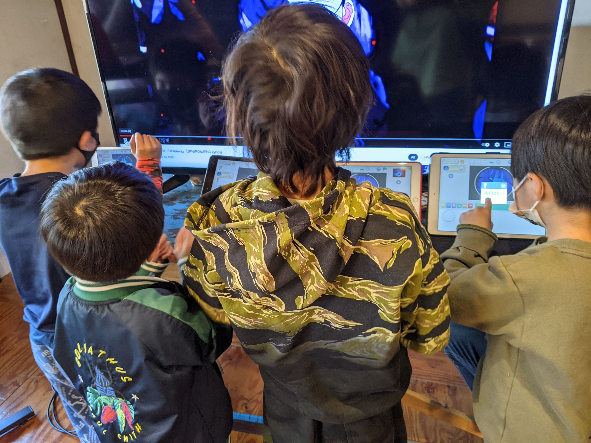

Proceed to [Archives](./SunflowerClassNotes-Archives.html) 》 
{: style="float: right;"}

<br clear="both">

<div id="toc">

* [August 14th](#august-14th)
  * [Recap for August 14th](#recap-for-august-14th)
* [August 7th](#august-7th)
  * [Recap for August 7th](#recap-for-august-7th)
* [July 31st](#july-31st)
  * [Recap for July 31st](#recap-for-july-31st)
* [July 26th Makeup](#july-26th-makeup)
  * [Recap for July 26th](#recap-for-july-26th)
* [July 24th](#july-24th)
  * [Homework due July 24th](#homework-due-july-24th)
  * [Recap for July 24th](#recap-for-july-24th)
* [July 17th](#july-17th)
  * [Recap for July 17th](#recap-for-july-17th)
* [July 10th](#july-10th)
  * [Recap for July 10th](#recap-for-july-10th)
* [July 3rd](#july-3rd)
  * [Recap for July 3rd](#recap-for-july-3rd)
* [June 26th](#june-26th)
  * [Recap for June 26th](#recap-for-june-26th)
* [June 19th](#june-19th)
  * [Recap for June 19th](#recap-for-june-19th)
* [June 12th](#june-12th)
  * [Recap for June 12th](#recap-for-june-12th)
  * [Ghost Baloon](#ghost-baloon)
  * [Moving Ball](#moving-ball)
  * [Walking and Talking](#walking-and-talking)
  * [Jukebox](#jukebox)
  * [Black Ninja](#black-ninja)
  * [Pong](#pong)
* [June 5th](#june-5th)
  * [Recap for June 5th](#recap-for-june-5th)
* [May 31st](#may-31st)
  * [Recap for May 31st](#recap-for-may-31st)
* [May 29th](#may-29th)
  * [Recap for May 29th](#recap-for-may-29th)
* [May 22nd](#may-22nd)
  * [Recap for May 22nd](#recap-for-may-22nd)
* [May 15th](#may-15th)
  * [Overview for May 15th](#overview-for-may-15th)
  * [Importing Characters](#importing-characters)
  * [The Backpack](#the-backpack)
  * [Ghost game](#ghost-game)
  * [Moving a Sprite and Using the Fill](#moving-a-sprite-and-using-the-fill)
  * [Using the Fill](#using-the-fill)
* [May 8th](#may-8th)
  * [Recap for May 8th](#recap-for-may-8th)
* [April 24th](#april-24th)
  * [Recap for April 24th](#recap-for-april-24th)
  * [Happy Golden Week](#happy-golden-week)
* [April 17th](#april-17th)
  * [Recap for April 17th](#recap-for-april-17th)
* [April 10th](#april-10th)
* [April 3rd](#april-3rd)
  * [Recap for April 3rd](#recap-for-april-3rd)

</div>


-   Click on the [> Date]() or <span style="color: #3399cc;  border-left: 9px solid #3399cc!important;border-radius: 4px 4px; font-weight: bold">BLUE</span> borders to toggle the <span style="background-color:#ffeca0; border-left: 10px solid #3399cc !important;border-radius: 4px 4px;"><b> &nbsp;<span style="font-size: 70%">▶︎</span>&nbsp;&nbsp;Details&nbsp;&nbsp;&nbsp;&nbsp;</b></span>

* **NOTE May 31st**: *Please note that some of the Turbowarp project embeds have stopped appearing. Please use the "open in Turbowarp" links while we work on fixing the problem.*

<details markdown=1>
<summary markdown=1>## August 14th
</summary>

## August 14th

### Recap for August 14th

Today 3 beginner Scratch students worked on an easy Cat Training project, based on a  student's original project. we taught the cat to sit, lie down, run, and roar. 




Student N worked on a Red Light project. The player uses the right arrow to move right. First we made the bus reappear at the left when we hit the edge. 

```
when [right arrow v] key pressed
move (10) steps
if <(x position) > (270)> then
switch backdrop to (Blue Sky v) ::looks
set x to (-278)
broadcast [switch v]
end
```
{: .msb}

Then we used a variable ('red bue or yellow') to keep track of the condition of the light, and we detect if we are touching the light while the light is red. If he hits the red light, the game over message appears. 


```
if <<touching (Light  v) ?> and <(red blue or yellow) = (red)>> then 
switch backdrop to (Blue Sky2 v) ::looks
broadcast (a v) and wait
 else 
next costume
end
```
{: .msb}




</details>


<details markdown=1>
<summary markdown=1>## August 7th
</summary>

## August 7th

### Recap for August 7th


Today we had only 3 students.

Two of the Scratch kids did the Nature Watching project. The fist step is erasing the "binocular" of a solid foreground so that we can see what is behind. Even I had a little trouble doing this until another teacher helped me. Once we had that, the rest of the project proceeded smoothly. We make the binoculars follow the mouse, and then add a game scene that includes various animals moving for us to watch. The student added a play button that dissolves using the ghost effect to reveal the game scene. 





The other student worked on an electricity game. 




Originally his project just sent out various balls that travelled from the anode to the cathode. I suggested he add an element that the player could use to direct the balls. In doing that we noticed that his balls were bouncing off at weird angles because he was turning the balls, not pointing them in a different direction. At first this was a random direction, but I suggested it might look more realistic to have them bounce at the correct angle. However, doing this involves some special math. It is not difficult and next class I will show the the correct formula. 



</details>


<details markdown=1>
<summary markdown=1>## July 31st
</summary>

## July 31st

### Recap for July 31st

Today we walked through a basic Pacman game. Kids went through it at different paces, with some just completing the first few steps, others nearly reaching the end. However, we will continue with this project as it teaches valuable skills.



One notable project was this variation on the classic game:




After that kids worked on their ongoing projects. Kids are developing more confidence and the ability to come up with and develop their own ideas independently, though there is a tendency for kids to also get lost playing games rather than coding. The fact that they are enjoying Scratch and engaged with it is great, and we will try to encourage a healthy balance between exploring and creating!


</details>

<details markdown=1>
<summary markdown=1>## July 26th Makeup
</summary>

## July 26th Makeup

### Recap for July 26th

Student M did a makeup class today. He came up with the idea of making  a roulette game. This gave us a chance to use the wait until and repeat until blocks blocks.

{: .jsgif .autoimage}





</details>


<details markdown=1>
<summary markdown=1>## July 24th
</summary>

## July 24th

### Homework due July 24th

### Recap for July 24th

Today we had only 2 students. Student H worked on the Chase Game tutorial. He was very creative in modifying the cat character, and made a rather fun project.



Student R and I had an extensive conversation about the [Tech Kids Grand Prix](https://techkidsschool.jp/grandprix/), which he plans to participate in. We discussed the basic criteria of the contest, Vision, Product, and Presentation, and I told him that first we will work on Vision. This is the moment where we seek inspiration and creativity to create an original and inventive project. 

One way to do this is to look at what other people have done, and he looked at several projects by other participants. Then I asked him to critique the projects, to develop his analytical ability and help him be able to see projects from an outside  point of view such as a judge or a player. I asked him to rate the projects according to the contest criteria, and then we focused on what he particularly liked about one project. Then we decided to build our own test project that would include these qualities. 

To come up with a theme for this test project, I encouraged him to come up with a topic that is interesting and inspiring for him. This led him to suggest electronics. After asking him to tell me a little about this, we talked about what is electricity. With some improvements for realism, we had a basic model of electricity in a wire, and we then began to develop how this could be a game. We made a rough mockup of the screen, and then once we were happy with that, I gave him the homework of making a more accurate mock up. We talked about how the user would interact with the game, and what the object of the game would be.

All in all, in one class, we were able to run throught the basic first steps involved in creating an original project. The test project is not intended as his final project, but I think it will help him understand the steps that help take something from nothing, to first idea, to first model, to first prototype. This was a great first step and he did a great job moving through it though we were going rather quickly.


</details>


<details markdown=1>
<summary markdown=1>## July 17th
</summary>

## July 17th

### Recap for July 17th

Today kids worked on their own projects.

Student Y started a shooting game. He began to learn how to make bullets using clones, and how to make actors disappear when they are hit.



Student N began a version of pacman. He made little munching characters, and we worked on drawing a maze for the background. We also made the main actor move right and left, and then blocked its motion when it reached the edge so it wouldn't fall of the edge.



Student M learned how to change the position of the actors using the x and y boxes in the actor area. This was necessary because he couldn't drag his characters because part of his game codes them to disappear if touched. 


Student R started planning a Minecraft quiz game. We talked about learning to plan on paper before trying to code, which he began to do. I also helped him import some images from the web that couldn't be copied the usual way. 


Student H worked on importing characters from other projects into his project.

Kids also enjoyed coding and playing at a video sensing project and a Jelly project. I showed them a simplified version, and perhaps next week we will try to code it together.





</details>

<details markdown=1>
<summary markdown=1>## July 10th
</summary>

## July 10th

### Recap for July 10th

Today we worked on the Mario Galaxy four project. 





Everybody was able to get to the first step. We did have a few technical issues but we resolve them and that will make going forward easier from now on. After the break some kids expolored for their next project while others finished projects that they had been working on before. 












</details>


<details markdown=1>
<summary markdown=1>## July 3rd
</summary>

## July 3rd

### Recap for July 3rd


Soccer Game
  : During the makeup class for student R, I showed him how to clean up his project by combining stacks. Instead of several green flag stacks and several forever loops, we combined them all. The next day we worked on finishing the soccer game level. One problem was that the ball would get stuck in a corner sometimes; we prevented this by moving the ball away when it touched the goalkeeper. 



Jukebox
  : Student M did a great job making the last few songs on his jukebox work. 
  


Another Jukebox
  : Student Y was inspired from watching this Jukebox to begin making his own. 


Crazy Animation
  : Student N has been learning how to make animations, and produced this Crazy Animation Project.



Learning ABC
  : He also taught Abu, his favorite character, to speak.




Clickers
  : A popular game this week was a clicker game, which several students played or worked on. These are very simple. Just click until you drop. Simple, but popular.




</details>

<details markdown=1>
<summary markdown=1>## June 26th
</summary>

## June 26th

### Recap for June 26th


Music Box
  :  Student M made all his music covers clickable. We simplified his idea so that every character disappears. This means we can use the same code for every character. When clicked, they each disappear and a large background for that song will appear. 



Pong and Jumping
  ; Student N added a second level to his pong game, where the color of the apple changes. He plans to make the second level more difficult. 

He also created a jumping project. By using touching color, he makes the sprite fall into the white hole. 


```
when @greenFlag clicked
forever // if it is not touching the ground, fall
    if <not <touching color [#663b00]?>> then
        wait (.01) seconds
        change y by (-10)
    end // when low enough , return home
    if <(y position) = [-227]> then
        go to x: (-175) y: (-104)
    end // if too far right, return home
    if <(x position) > [243]> then
        go to x: (-175) y: (-104)
        broadcast [message1 v]
    end
end
```
{: .msb}


Various Projects 
Student Y started various projects today:

...a video motion detection project




...A flying cat tutorial. 



and this




Car Project
  : Student H explored making various projects scratch and scratchjr, including a sports car. He explored recording various sound effects to make the car sound (not audible below). The project is still unfinished.

 


Goalie
  : Today Student R worked on making his goalie be able to defend the goal. He understood that he had to make the character move from side to side, but needed some help realizing that the character starts from the middle, so the first motion is just halfway. This was more difficult because of what appears to be a bug in Scratch. The following code should work without the first wait, but it doesn't.

  This project is coming along. Next we will have to do some cleaning up, such as what to do when teh ball goes out of bounds, and how to register the score. It also needs better instructions for the user.

```
when backdrop switches to [Soccer v]
wait (1) seconds // this seems unnecessary, but
goto x: (-50) y: (-6) // without it this doesn't happen
repeat (100000)
    wait (1) seconds
    glide (1) secs to x: (100) y: (-6)
    wait (1) seconds
    glide (1) secs to x: (-100) y: (-6)
end
```
{: .msb}





Space Invaders
Scratch Jr. Students Y and R worked on a simplified version of Space invaders. This is really an exercise in using messages to have one character control another. The kids seem to understand the concept, but have difficulty knowing exactly where to put the elements. Nonetheless they are good at adding their own creative elements, such as this interesting missile, and are excited about making the project:




</details>


<details markdown=1>
<summary markdown=1>## June 19th
</summary>

## June 19th

### Recap for June 19th

Jukebox
  : Student M made great strides on his Jukebox Project. He learned how to make all the characters disappear when you touch one character and then how to make them reappear when you touch the stage.


 

Talking and Cat and Apple
  : Student N finished his Talking Project. We talked about how to use messages to create the main Loop.



{: .jsgif}

He also started a Chase Game tutorial, which he called Cake and Apple. He started to add a new level when the score reaches 30



Soccer Game
  : Student R and I talked about how to make the second level of his game, the soccer game. To make the ghost play, we needed blocks for left and right movement. We fixed sum code because of a Japanese ー instead of a hyphen -. We had to repurpose the w key ofr this screen to shoot the ball, not move up, so we added a a test for which layer you were on and changing he function accordingly.



The ball is shot using this block:




Prolific Output
  : Student Y has been quietly working on many projects. I am not sure which of these were made last class, but recently made ones include:

* A partially completed Animate My Name


* A more complete variation of this


* A simple text to speech project


* A project about a witch going running


* A Jellyfish Catching a Starfish


* A Ninja Project


Math Project
  : Student H modified the pong game to use a baseball as a ball. He also started working a math project. 



</details>


<details markdown=1>
<summary markdown=1>## June 12th
</summary>

## June 12th

### Recap for June 12th

### Ghost Baloon
Student R's project had a bug. His character changed the background. However, the Party background kept reappearing. The problem was that his code didn't reset the score after switching to the party:
  
```
when @greenFlag clicked
forever
    if <(スコア) > [100]> then
        switch backdrop to [Party v]
    end
    set [スコア v] to [0] // He needed to add this block
end
```
{: .msb}  

After figuring that out he added the second stage of his project, including adding a goalie. We added  blocks that moved to the second stage right away, to make it easier to debug. We added initializations so the goalie would appear in the right place. He made the goalie move from side to side.




### Moving Ball 
Student N first did a tutorial involving clicking a moving ball.



### Walking and Talking
Soon after though he switched to a tutorial using voices. We added a simple animation to show the characters speaking. 

```
when @greenFlag clicked
go to x: (10) y: (-37)
show
repeat (4)
    switch costume to [costume2 v]
    wait (.1) seconds
    switch costume to [costume1 v]
    wait (.1) seconds
end

```
{: .msb}

Since the characters started walking, we then make the characters walk using messages.

```
when I receive [go walk v]
repeat until <touching [edge v]?>
    move (10) steps
    wait (.1) seconds
end
hide

```
{: .msb}


We talked about initializing the characters. We made the characters hide at the edge, and then return from the other edge. 
 
```

when I receive [come back from walk v]
go to x: (-240) y: (-37)
show
glide (1) secs to x: (0) y: (-37)
wait (4) seconds
```
{: .msb}




### Jukebox
Student N. made a music jukebox project. He wanted each song to play until the end and then play the next songs, so we used `play sound [] until done`{: .msb} blocks. 



He also started a project using Pokemon cards and we worked on resizing the cards.


### Black Ninja
Student Y gathered a collection of Black Ninjas from the internet and worked in the editor to break them into individual sprites. Then he taught the ninja to change costume and move.


```
when [right arrow v] key pressed
switch costume to [haruki-right v]
move (10) steps

when @greenFlag clicked
switch costume to [haruki v]

when [left arrow v] key pressed
move (-10) steps
```
{: .msb}




### Pong
Student H worked on a pong tutorial. He added several balls to make the game more interesting, and we made the scoring work.



</details>


<details markdown=1>
<summary markdown=1>## June 5th
</summary>

## June 5th

### Recap for June 5th

Today there were just two students. 

Ghost Balloon Crossing
  : Student R Continued making his ghost balloon crossing game. He made each ball produce a different effect when it touched the ghost. 

* purple rotate once
* pink: push
* green: enlarge
* yellow: rotate many times
* blue: send to beginning

He also added a score variable and made the background switch to a new level when the score reached 50.

There were some coding errors in his version that we will fix next week. Here is a corrected version:




Dragon and Castle
  : Student H worked on porting his ScratchJr. **Dragon and Castle** project to Scratch. He was able to make the rocket move up if the right character was pressed, and to make the rocket turn left smoothly. His homework is to continue the path of the rocket.


```
when I receive [fire rocket v]
point in direction (0) 
repeat (10) // moves 100 steps up
    move (10) steps
end
repeat (10) /// turn left 90 degrees
    turn @turnLeft (9) degrees::motion
end

when @greenFlag clicked
point in direction (0) //rocket has been adjusted to point up in direction 0
switch costume to [rocketship-a2 v] // adjusted costume
go to x: (166) y: (4)
```
{: .msb}




</details>

<details markdown=1>
<summary markdown=1>## May 31st
</summary>

## May 31st

### Recap for May 31st

Today was a Makeup class for 2 students.

Flying Raptor?
  : Student M remixed the flying cat project and is working on adding more characters to it for his Challenge submission.




Hacking Scratch Loops
  : Student Y was playing around with the character editor by mangling the basic Flying Cat character. 



I showed him how to turn this into a basic animation, and he had a lot of fun hacking an animation"bug" in Scratch. 

```
when gf clicked
forever
next costume
wait (.1) seconds // ballerina
```
{: .msb}

The ballerina animation is changing every tenth of a second. Usually, Scratch prevents you from putting anything but a number into wait blocks.  However, the student changed the '.1' to '.e', probably by accident. You can see what happened in the cat. 




As it turns out, Scratch does allow scientific notation, as in '.1e1' to mean .1 X 10^1, or 1. Therefore, aside from the numbers, the letter e is allowed as input. Furthermore, by design or as a bug, it even allows some nonsense values like just plain 'e' or '.E' or 'eeee', which is why the cat works. The taco and the man are flashing at '.1E1' and '.01e2' seconds each, i.e. at 1 second intervals.

```
// for other characters 
wait (.e) seconds // cat
wait (.1E1) seconds // man
wait (.01e2) seconds //taco
```
{: .msb}
</details>

<details markdown=1>
<summary markdown=1>## May 29th
</summary>

## May 29th

### Recap for May 29th
Today I introduced the **Junior Coders Beginner's Challenge** [please see this page for details](./BeginnerChallenge.html). The goal is to motivate students  to do the Scratch tutorials. Students all began or continued working on their first entries, with most completing at least one tutorial today. Here is a Scratch studio with all the [Beginner's Challenge Projects](https://scratch.mit.edu/studios/29818873/). Today's Projects:
















</details>


<details markdown=1>
<summary markdown=1>## May 22nd
</summary>

## May 22nd

### Recap for May 22nd

Castle and Dragons
  : Student H came up with a project based on the castle and dragons app. He was able to get some sprites and we discussed how to make it so when you press the opening screen the rocket shoots up. This involves message blocks:

```
when this sprite clicked
broadcast [message1 v]  
```
{: .msb}

```
when I receive [message1 v]
point in direction (0)
repeat (100)
    move (1) steps
end
```
{: .msb}

We also had a problem that the rocket he had was in the wrong direction,s o it has to be rotated so it would be looking up when we go up. This is what it will look like.




Kimetsu No Yaiba Race 
  : Student M worked on a project where there is a race between sprites. First we created a repeat loop that moves the character from the start to the finish. Then we put this in a forever loop to keep the race going. Next week we will create a finish line that will stop the race.


```
when @greenFlag clicked
forever
    go to x: (-189) y: (-89)
    repeat (45)
        move (10) steps
    end
end
```
{: .msb} 





Cat Flying
  : Student N worked on making this cat flying tutorial. First he created a loop to make the building go from one side to the next. Then we added speed variable and we controlled the variable using keyboard inputs. 

```
when @greenFlag clicked
set [speed v] to [-10]
forever
    show
    set x to (250)
    repeat (50)
        change x by (speed)
    end
    hide
end

when [s v] key pressed
set [speed v] to [-20]

when [a v] key pressed
set [speed v] to [-5]

```
{: .msb}





Flying Bird
  : Student Y worked on some tutorials, including one to make this bird fly and speak.



He is currently working on a Pong game.

</details>


<details markdown=1>
<summary markdown=1>## May 15th
</summary>

## May 15th


### Overview for May 15th
All of our kids (in both our classes) were either ready or nearly ready to move to the next level. Yesterday, some kids were doing makeup classes so almost everyone was in the same room. This meant that yesterday was the perfect opportunity to do a group introduction to Scratch (the daddy-app of ScratchJr.) for everyone at the same time. Using Scratch will greatly improve their potential, and eliminate the limitations of ScratchJr. I am very glad we have reached this milestone. 

The first thing most students learn when starting Scratch is how to make a sprite move when you press a key. The first project most kids do is the Animate My Name Project. Some kids worked on other things.


### Importing Characters
Student M worked on importing characters for his project.




### The Backpack
Student N learned how to use the Scratch "backpack" to copy his favorite sprite from one of his other projects into this project. 



### Ghost game
More advanced Student R worked on a "Chicken Crossing " type game. 



This project uses the w and s keys to move the ghost.

```
when [w v] key pressed
change y by (10)

when [s v] key pressed
change y by (−10)

```
{: .msb}


We talked about what should happen when the ghost hits one of the balls. We wanted the character to spin.

```
when I receive [turn ghost v]
turn @turnRight (100000) degrees::motion
```
{: .msb}

This didn't work. Why? The "rotation style" is important, or the character can't spin. We have to explicitly set it to "all around". The game also includes music. This is initialized here.

```
when @greenFlag clicked
set rotation style [all around v]
point in direction (0)
play sound [Jim Yosef & Anna Yvette - Linked [NCS Release] (320 kbps) v] until done
```
{: .msb}

This makes the ghost return to the bottom when he touches the line.
```
when @greenFlag clicked
forever
    if <touching [Line v]?> then
        go to x: (-9) y: (-130)
    end
end
```
{: .msb} 

For the balls, we worked together on making the balls return when they reached the edge. This is also where the balls tell the ghost to spin if he is touched.

```
when @greenFlag clicked
point in direction (-90)
forever
    if <touching [edge v]?> then
        go to x: (215) y: (-119)
    else
        if <touching [Ghost v]?> then
            broadcast [turn ghost v]
        end
    end
    move (5) steps
end
```
{: .msb}


### Moving a Sprite and Using the Fill
Student Y made a simple project to move a sprite.


```
when [right arrow v] key pressed
move (10) steps
```
{: .msb}




### Using the Fill
One difference between Scratch and ScratchJr. is that the fill tool works differently. Student Y encountered the problem that, in ScratchJr., you can fill in partial shapes, but in Scratch you can only fill in closed curves. You can see this in the triangular shape at the bottom of this project.




</details>


<details markdown=1>
<summary markdown=1>## May 8th
</summary>

## May 8th

### Recap for May 8th
Intro to Scratch
  : Today was an introduction to Scratch day for students M and N. There was some setup involved, such as installing Chrome, adding the "Scratch Addons" extension to help them use scratch. I have assigned each student a login ID and password, that they should use for all their classwork. Using an assigned account allows me to better manage and track their progress. Once they were successfully logged in, we went to we started a blank project we walked through the first tutorial. 

  : Students M and N then learned how to use the move block, play sounds. We worked through adding sounds from the music library and from files on your hard drive. Likewise for costumes, we learned how to add costumes from the costume library and the kids started working on drawing their favorite characters.



{: .jsgif .autoimage}
  : * Student M played with the image editor to make a cat in a basket!

Cat and Panther Game
  : Student R, a more advanced scratch student continued worked on a chase game involving a cat chasing a panther protecting a crystal from a cat and getting points. He had some questions about how to play sounds and how to change the background. He was able to make it keep score.
  
```
when gf clicked
forever 
if <touching (1 v) ?> then 
change [スコア v] by (1)
end
if <(スコア) > (49)> then 
switch backdrop to (1 v) ::looks
hide
play sound (1 v) until done
end
end

```
{: .msb}


We worked together on code that would allow it the game to stop once it reached a certain score. We will need to talk about how to reset the game when it starts/finishes. We made a list of the things would be that would happen when the target score was reach, and we used a conditional if block with a test operator block to code the motion.




ScratchJr.
  : The scratch junior kids worked on making mazes. Student Y continued working on his maze from last week. Student R made a new maze based on the linear maze turning a linear maize into a traditional pathway maze. Student H worked on various projects on his own.

{: .jsgif}
  : * This is a linear maze

{: .jsgif}
  : * Here we surround the linear maze with blue walls

{: .jsgif}
  : * Next we remove the original maze, leaving just the walls

{: .jsgif}
  : * Here is a more complicated example. The black is the solution path, and the blue are false paths. The red is the walls. 
  

{: .jsgif}
  : * If we remove the black and blue lines, we get the final maze.

  
</details>


<details markdown=1>
<summary markdown=1>## April 24th
</summary>

## April 24th

### Recap for April 24th

Students H and M continued making variations of the *Usseewa* projects. This included adding dancing characters that if you touch will do extra actions. We also began exploring other music to include in their project. 

Student H plans to a Brontosaurus versus Tyrannosaurus game next.

Student N 
  : For homework, Student N made a storyboard involving several projects representing levels. Some of these were mario type jumping games with coins and so on. Others had original ideas, like having a character can disappear and then appear alternately. This required some fancy messaging. This student has been moving along quickly and is now ready for Scratch.

{: .jsgif}

Makeup Class
  : There was also interest in a Mario Clone devised by one of our teachers. During a makeup up class on Monday, I walked through this project with student Y (slowly, via Zoom). This is a work in progress and will continue next class. Here is the prototype:

{: .jsgif}

### Happy Golden Week

Here is some fun to wish everyone a wonderful golden week. Watch it to the end!!



See you after the holiday.

</details> 


<details markdown=1>
<summary markdown=1>## April 17th
</summary>

## April 17th


### Recap for April 17th

Today's project was Flappy Bird. 

{: .jsgif}

Kids were able to make a simple version of the project. Making the moving striped rectangles involves some tricks with the drawing gui. We also recorded a special scream from the Usseewa for the character to 

Kids also continued working on their Useewa Projects, including recording the final part of usseewa and making projects with the new sounds.

One student recorded a segment of "_This is Me_" from the movie **The Greatest Showman** for a new project.

One student suggested for next week's project we tell a story using a comic 4-frame format and started working on that project.

</details>


<details markdown=1>
<summary markdown=1>## April 10th
</summary>

## April 10th

Usseewa Day! (In case you have been living under a rock in Japan for the past few months, Usseewa is an extremely popular "pop" song by the singer Ado.) The kids in this class are obsessed with it (for this week), so today's project was to use the song in a project. The first step was to record the song using ScratchJr. and this led to a great exercise in cooperation, planning, timing, attention to detail, and other skills related to coding. 

{: .jsgif}

For example, this was the work flow we developed:

1. Cue up the song at the start time.
2. Run through the song to determine timing of the next endpoint. ScratchJr. can only record 30 seconds at at time, so we have to choose an endpoint near the 30 second mark. 
3. Choose the endpoint.
4. Get everyone in position to record.
5. Call for silence.
6. The countdown was 3, 2, 1, press record, wait 1 beat, start music.
7. When the music reached the endpoint, students have to press the stop record button the right time. I also tried to stop the song at that time.

We had to go through this steps several times as sometimes the recording didn't work, but we were able to get through 5 iterations.

We also used the internet to take pictures from the song video to use as characters in the project. The kids then started working on their project.

All in all the kids were very focused and motivated this week. I think they need to work a little more on developing the projects next week.

</details>


<details markdown=1>
<summary markdown=1>## April 3rd
</summary>

## April 3rd

### Recap for April 3rd 

As was true last week, kids were into continuing to develop their previously learned skills, and sharing projects with each other to copy. One child made an attempt at the project of the day.

This week's project was a classic **Chicken Crossing** game. Players the chicken to get past the cars. It includes several levels of successive difficulty. 

 

One child started to make an attempt at this project, but in the end the kids became quite busy project sharing and discussing their other recent projects. They then started recording themselves talking, and eventually recorded the currently popular song *Usseewa* into a project. Their homework is to turn this into a project. 

(Note: we don't usually allow internet use unless it is directly related to a project. You might want to remind your child of that.)

Looping Stars
  : One child submitted an interesting experiment as homework. Clicking the black button sends the yellow star back and forth. However, each new level introduces more copies (2, 4, 6, 8) of the back and forth loop, which speeds up the movement. This kind of controlled speeding up is not possible otherwise in ScratchJr.

{: .jsgif}

</details>


