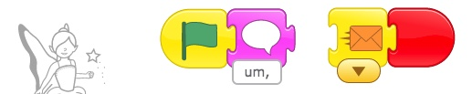

《 Return to [Page 1](./a_mon0500pm.html)

* [May 11th](#may-11th)
  * [May 4th Homework Review](#may-4th-homework-review)
  * [Main Idea: Control Buttons](#main-idea-control-buttons)
  * [Using Controls: Race to the Finish](#using-controls-race-to-the-finish)
    * [Part One of The Race to the Finish.](#part-one-of-the-race-to-the-finish)
    * [Part Two of The Race to the Finish: The Game](#part-two-of-the-race-to-the-finish-the-game)
  * [Preview for May 18th: Follow the Maze Project](#preview-for-may-18th-follow-the-maze-project)
  * [May 11th Homework: Finish the Follow the Maze](#may-11th-homework-finish-the-follow-the-maze)
  * [May 11th Zoom Issues](#may-11th-zoom-issues)
* [May 4th](#may-4th)
  * [Animate My name](#animate-my-name)
  * [Student Homework Notes](#student-homework-notes)
  * [Homework Part 1: Keep working on Alien Planet](#homework-part-1-keep-working-on-alien-planet)
  * [Homework Part 2: A Story Based on the Hare and Tortoise](#homework-part-2-a-story-based-on-the-hare-and-tortoise)
    * [Instructions](#instructions)
    * [Sample Screenplay](#sample-screenplay)
* [April 27th](#april-27th)
  * [Skills Review](#skills-review)
  * [Teacher Says with Zoom](#teacher-says-with-zoom)
  * [Alien Planet](#alien-planet)
  * [How to send projects](#how-to-send-projects)
  * [Update ScratchJr](#update-scratchjr)
  * [April 27 Homework](#april-27-homework)
  * [Addenda](#addenda)
    * [Addendum: Skill Review Checklist](#addendum-skill-review-checklist)
    * [Addendum: Alien Planet Project Assignment](#addendum-alien-planet-project-assignment)
    * [Addendum: Sending Projects](#addendum-sending-projects)
    * [Addendum: Code for Alien Planet](#addendum-code-for-alien-planet)
* [April 20th](#april-20th)
  * [Sending Messages by Making a Conversation](#sending-messages-by-making-a-conversation)
  * [Continue the conversation](#continue-the-conversation)
  * [The KEYS to Messages](#the-keys-to-messages)
    * [Advanced Keys](#advanced-keys)
  * [April 20 Homework](#april-20-homework)
  * [Going to a different Screen](#going-to-a-different-screen)
  * [The Dragon Maze almost solved](#the-dragon-maze-almost-solved)
  * [Zoom problems](#zoom-problems)
    * [Following the Conversation](#following-the-conversation)
    * [Sharing Screens](#sharing-screens)
  * [Next Class: Review](#next-class-review)
  * [Feedback](#feedback)
* [April 13th](#april-13th)
  * [Using Zoom](#using-zoom)
  * [Game: Black](#game-black)
  * [ScratchJr: Messages](#scratchjr-messages)
    * [Making the maze](#making-the-maze)
    * [Tic Is Trapped!](#tic-is-trapped)
  * [Disappearing Dragons](#disappearing-dragons)
  * [April 13 Homework](#april-13-homework)
* [April 6th](#april-6th)
  * [Postponing the Homework](#postponing-the-homework)
  * [Discord to Zoom](#discord-to-zoom)
  * [Dragon Maze Demo](#dragon-maze-demo)
* [March 30th](#march-30th)
  * [Thank you. Discord.](#thank-you-discord)
* [March 23rd](#march-23rd)
  * [First Class](#first-class)

* Click on the [> Date]() or BLUE borders to toggle the <b>  &nbsp;▶︎&nbsp;&nbsp;Details&nbsp;&nbsp;&nbsp;&nbsp;</b>

## May 11th

## May 11th

### May 4th Homework Review

I will send emails with more detailed comments individually later. 

### Main Idea: Control Buttons 

**Control Buttons** were the main idea of this class. Control buttons make one character control another character.

**Screen 1** of the [3-Button-Race and Follow The Maze Sample Projects](./scratchProjects/3ButtonRaceFollowTheMazeHW.sjr) gives an example. It also has a simple exercise for you to do if you think you need more **practice**. 

Making a control is a 2 step process. Here is what to do:

1. Make the button. It can be anything. 

   * When you touch the CONTROLLER it sends a message. Add this:

2. Go to the character that receives that message. 

   * When THE CONTROLLED gets the message, it acts. Add this:

That's it!!! 

In my example, **Monkey** controls **Frog**, and **Penguin** controls Cat. 

If you need **practice**, try to make the **Flag** control **Tac**. 

### Using Controls: Race to the Finish

To get some practice with **Control Buttons** we worked with  [my version of the Race to the Finish Project](./scratchProjects/20200511DavidRace2FinishGame.sjr) from BootUp. (*I recommend you download it if you have questions about what we did.*) Notice how similar it is to the Hare and Tortoise homework.

#### Part One of The Race to the Finish. 

Students had to try to copy **Screen 1**. This is just like Hare and Tortoise: 

 

#### Part Two of The Race to the Finish: The Game

In class, we then made this into a game. Look at **Screen 2**. It has 2 controls. The CAT BUTTON controls the **Cat**, the BIRD BUTTON controls the **Bird**. Could you do it? Look at it again and fix it if you have to.

 

Notice that when I click the green boxes, the characters move to the right one step. Tap the buttons together with a friend and see who can win the race.

We then made a crazy version on **Screen 3**.

### Preview for May 18th: Follow the Maze Project
In the next class, we will make 4 controls for one character. Download and see **Screen 2** of the [3-Button-Race and Follow The Maze Sample Projects](./scratchProjects/3ButtonRaceFollowTheMazeHW.sjr). They will make the character move up, down, right, and left. Here is a picture of the finished game. Can you figure out how it works? 

It has an extra twist at the end. Can you figure out how the **Cake** appears? *Hint: It uses a hidden control.*

* I made one **Arrow**. Then I copied it and rotated it to make the other 3. Here is the **Left Arrow**:

* Then I added code for each arrow. Here is the code for the **Up Arrow** 
  
  * Arrow: yellow touch trigger, send message
  * Cat: get message, do action

### May 11th Homework: Finish the Follow the Maze

**Screen 2** has 4 Arrow Controls. The **Up Arrow** works like above, but your Homework is to make the other **Arrows** work.

1. Use different color messages
2. Make the controls a little smaller 
3. Change the Maze (in the background)!!
   
   * Use this kind of maze if you want it simple. See the dots in the middle of the squares?

   * **Useful Tip**: When you adjust the dots/lines for your maze, make the dots in the **CENTER** of the light grey grid squares, **NOT on the lines** of the grid squares.

      * YES: {: width="100px"}
      *  No: {: width="100px"}

Now you have a **Follow the Maze Game**! 

Easy Peasy! 

### May 11th Zoom Issues

Apologies if you had problems getting my attention after I muted everyone. I was trying to control background noise by muting everyone and turning people back on. It wasn't so successful. Sorry.

It is difficult to keep background noise down. If you are having a side conversation or you have background noise in your house, it is helpful to mute your microphone so others don't hear it. Then, if you want to speak or turn it back on again. 

Sometimes I am paying attention to one student, and the part of my screen that shows students or incoming chats may not be easy for me to see. Please keep trying. This is just a limitation of doing remote classes. Thanks for being patient! Gambare!

## May 4th

## May 4th

### Animate My name

I had students make their own project based on the [Bootup Animate My Name](https://www.youtube.com/watch?v=mQzWGY4xuSY) project, which you can [download here](https://drive.google.com/open?id=0B342uiaCLSS3YzJTUmlha1FQRjF1cldPdjQtUVhGUjFROEFz)  ScratchJr must be open when you open the sjr file. 2) You must have the latest version installed. If you still have problems let us know.") using the [skills we should all know at this stage][]. Students created characters based on the letters in their name.
We talked about what each letter was doing. Then students created their own.

As a follow, we changed it so instead of all the characters moving at once, they moved in turn. Some kids got creative and had the letters say things and do funny things along the way.

### Student Homework Notes

I went over last week's homework with the students. I gave each student some next steps to keep working on. The most common thing was to make the conversations longer and go back and forth.

### Homework Part 1: Keep working on Alien Planet

Continue adding and revising Alien Planet. Think about:

-   Make the characters talk to each other. Try to turn it into a story.
-   Make the character's actions meaningful.

### Homework Part 2: A Story Based on the Hare and Tortoise

<!--  -->

#### Instructions

-   The goal is to create a similar project by yourself.
-   You can download the [movie here](./images/2020-05-04/Homeworkfor05-11.gif). It is just an example.
-   You can use regular scratch backgrounds, or make your own.
-   Choose any characters, or **make your own**.
-   I have made a sample "screenplay" (below), but **you can use your own**.
-   Use messages to make the characters speak **in turn**.
-   Control the speed of the characters.
-   You can make the characters walk in funny ways.
-   My horse is in the tree. Where do you think the characters should be placed?

#### Sample Screenplay

1. Character2 and the Character1 introduce themselves and decide to have a race
    1. Background: the entrance to the race
    2. Characters: Character1, Character2, Character3
    3. Script:
    - Character1: You are slow. I am the fastest.
    - Character2: Actually, I am faster than you. Let's race!
    - Character1: Yeah? Okay, let's race.
    - Character3: I will be the judge. When I say, go, start running.
    - Character3: Ready...Steady....Go
    - _Character2 runs slowly, and the Character1 runs quickly off the screen. When he does he disappears we go to the next screen._

In class we will continue this story. Any ideas?

## April 27th

## April 27th

### Skills Review

We did a [guided walkthough][] of the [skills review sample project][]  ScratchJr must be open when you open the sjr file. 2) You must have the latest version installed. If you still have problems let us know.") using the [skills we should all know at this stage][]. Can you do them all? You have learned a lot already!!!

[guided walkthough]: ../lessons/20200427SkillsTest.html
[skills we should all know at this stage]: #addendum-skill-review-checklist
[skills review sample project]: ./scratchProjects/Project120200427SkillsTest.sjr

### Teacher Says with Zoom

I talked about the game [Zoom version of the Teacher Says game](../lessons/TeacherSays.html), which we played once before. In this version, I walked through the project and students sent reactions, either 1 👍 or 2 👏, showing which button does **the next action**. Everyone did great using the zoom reaction buttons. Just using your hands was okay too.

<!-- move to lessons -->
### Alien Planet

I showed everyone the [Alien Planet Project](./scratchProjects/Y1R31Alienplanet.sjr). I gave students an assignment modelled on the Alien Planet ([see addendum](#addendum-alien-planet-project-assignment)) . See [this addendum](#addendum-code-for-alien-planet) for the code.

### How to send projects

When you are done, you can [email it to me](mailto:teacher@kyotolesson.com) from the scratch project page. See the [addendum on sending projects](#addendum-sending-projects) for a How-to.

### Update ScratchJr

ScratchJr just updated their program using the [skills we should all know at this stage][]  ScratchJr must be open when you open the sjr file. 2) You must have the latest version installed. If you still have problems let us know."). I suggest you update it on your device, here:

-   <a href="https://itunes.apple.com/us/app/scratchjr/id895485086?ls=1&amp;mt=8">App Store</a>

-   <a href="https://play.google.com/store/apps/details?id=org.scratchjr.android">Google Play</a>

-   <a href="https://chrome.google.com/webstore/detail/scratchjr/oipimoeophamdcmjcfameoojlbhbgjda">Chrome Web Store</a>

-   <a href="https://www.amazon.com/gp/product/B01AKGTD2E">Amazon</a>

### April 27 Homework

Keep working on [The Alien Planet assignment](#addendum-alien-planet-project-assignment). [Email](mailto:teacher@kyotolesson.com) the result.

### Addenda

*Click the header to see the addendum.*

#### Addendum: Skill Review Checklist

#### Addendum: Skill Review Checklist
<!-- Heading above is required by jekyll to create toc, but actually appears (manually copied) in summary. display summary + *  css removes it from here-->

Skills Review Checklist:

-   [ ] Choosing and changing the background
-   [ ] adding and changing lines and shapes
-   [ ] adding and making characters bigger or smaller
-   [ ] making characters visible or invisible
-   [ ] making characters move in different ways
-   [ ] making characters act at the start, or when they are touched
-   [ ] making characters speak and make sounds
-   [ ] sending and receiving messages
-   [ ] moving to different screens/pages

You have learned a lot already!!!

Go back to [Skills Review](#skills-review)

<!-- End Addendum: Skill Review Checklist -->
<!-- move to lessons -->

#### Addendum: Alien Planet Project Assignment

#### Addendum: Alien Planet Project Assignment

1. Create your own background like the one in the project. It can be anything you like, but at least:
    - [ ] draw several lines
    - [ ] use the fill tool to fill in areas.
2. Create at least 3 and up to 8 characters. For each one:
    - [ ] Edit the character to make them alien.
    - [ ] Add fills, strokes, and whatever else you want.
    - [ ] Size and place the character at their start point
3. Each character can have more than one green flag or other **trigger** at the same time. See [Alien Bat](#slide-03).
4. Make each character do one or more things with the **start trigger** and the **touch trigger** and the **bump trigger**. Here are some choices:
    - [ ] Make the character move and dance. Use all the blue blocks.
    - [ ] Include sounds and speech bubbles for the characters and have the character make the sound, either at the beginning or when touched, or any other time.
    - [ ] Use repeat/loop (yellow) and repeat forever (red) blocks. See the Alien Cat for an example of both.
    - [ ] Change the speed of the character
    - [ ] Have the character become invisible and visible. See [Alien Bat](#slide-03).
    - [ ] Have the characters talk to each other. This project has no example, but we have covered it before. Here is an easy example of a [simple conversation](./scratchProjects/card08-greet.pdf)

#### Addendum: Sending Projects

#### Addendum: Sending Projects

Even though receiving projects does not seem to work on the iPad, sending does seem to work.

1. Click here to get to send screen.
   {:imagesize: width="auto" max-width="initial" height="200px" max-height="250px" }
   ![upper right corner, inside your project][]{: imagesize }
2. You should see a project page.

![the project page][]{: imagesize }

3. Rename it with your name, so I know who is sending it!
4. Click ”For Parents”.
5. You will have to solve a math problem

![a math problem][]{: imagesize }

6. Solve it and click "Send email"

![Share by email][]{: imagesize }

[upper right corner, inside your project]: images/2020-04-27/sendingProjectByEmail.PNG
[the project page]: images/2020-04-27/SendingEmail.jpg
[a math problem]: images/2020-04-27/mathProblem.jpg
[share by email]: images/2020-04-27/SendThroughEmail.jpg

Here is my [direct email](mailto:teacher@kyotolesson.com) or email alan or the school.

<!-- move to lessons -->

#### Addendum: Code for Alien Planet

#### Addendum: Code for Alien Planet

<!-- These have to be links  -->

{: target="_blank"}
{: #slide-01}

{: target="\_blank"}
{: #slide-02}

{: target="\_blank"}
{: #slide-03}

{: target="\_blank"}
{: #slide-04}

{: target="\_blank"}
{: #slide-05}

{: target="\_blank"}
{: #slide-06}

{: target="\_blank"}
{: #slide-07}

{: target="\_blank"}
{: #slide-08}

<!-- necessary space-->
[{{ page.gilabel-01 }}](#slide-01) | [{{ page.gilabel-02 }}](#slide-02) | [{{ page.gilabel-03 }}](#slide-03) | [{{ page.gilabel-04 }}](#slide-04) | [{{ page.gilabel-05 }}](#slide-05) | [{{ page.gilabel-06 }}](#slide-06) | [{{ page.gilabel-07 }}](#slide-07) | [{{ page.gilabel-08 }}](#slide-08)

## April 20th

## April 20th

### Sending Messages by Making a Conversation

The main topic today was how to send a message and receive a message to start a conversation.

-   First, Fairy says something and **then** sends (ORANGE) message

-   The Frog receives it and responds

### Continue the conversation

We also talked about how to make a longer conversation:

1. Fairy Starts (speaks and sends ORANGE message. You need to connect it!)
   
1. Froggie replies
   
1. Then Sends a New RED Message (remember to connect it!)
   
1. Fairy receives the red message. Says something. Then she continues by sending a YELLOW message back to Froggie (connect it).
   

### The KEYS to Messages

-   Each message has 2 parts, sending and receiving.
-   One character sends. The other receives, and acts.
-   They can send a new message back....

#### Advanced Keys

-   One character can send more than one message, for example to different characters, or the same character.
-   The same message can go to more than one character, too. That is, more than one character can receive the message when it is sent.
-   Sometimes you even send messages to yourself!

See [Dragon Maze Part 2](../lessons/DragonMazePart2.html) for examples.

### April 20 Homework

The homework was to make a longer conversation by sending several messages back and forth between characters as above. If you need something for the characters to say, [here are some jokes](../lessons/JokesForBadJokes.html) to use.

### Going to a different Screen

We also talked about adding new Screens/Pages to a Project:

1. Create a new Screen
   
2. Go back to 1st Screen
3. The screen appears in the (red) buttons
   
4. Add it to the actions
   

### The Dragon Maze almost solved

Some students worked very hard on the Dragon Maze, but they had a problem. I have made special [Dragon Maze Part 2](../lessons/DragonMazePart2.html) directions on making the Dragon maze work. It uses sending messages. The directions are very detailed, so take it slow. If you have questions, we will go over it in class next week.

### Zoom problems

We had some difficulty because Zoom cut off the meeting at a certain point. Zoom told us this would not happen, so we didn't expect it. Sorry about that. It will be fixed next week.

If it DOES happens again sometime, please just wait a few seconds and use the Zoom link again. I will start the call again and wait for people to join again, like we did this time. As above, this should not be a problem next week.

#### Following the Conversation

Remember that other people can hear what you are saying at home. If you need to have a side conversation, feel free to mute your microphone temporarily.

Sometimes I am focused on one or other students. You may want to listen, as it may answer questions you have too. Or you can wait by working on your own project while I take care of them. Try to think about what your next question will be. If you don't know what to do, speak up or send me a chat message.

Sometimes I will need to mute you to make it easier for everyone to hear the conversation. You may get a message in Zoom asking for permission, that you will need to respond to.

#### Sharing Screens

Everyone seems to be able to share screens finally. I know it is a little tricky, but it is part of doing class remotely. Sharing the screen is important for me so I can see your progress and offer help, so thank you for cooperating and bearing with it! Talking via Zoom is more difficult than regular conversation, but if we try we can find ways to make it easier and better.

### Next Class: Review

The next class will be mostly a review and testing class. I expect a lot of back and forth, so be ready to talk! I also hope to do some activities as a group. Can you use all of the skills we have used so far?

-   [ ] Choosing and changing the background
-   [ ] adding and changing lines and shapes
-   [ ] adding and making characters bigger or smaller
-   [ ] making characters visible or invisible
-   [ ] making characters move in different ways
-   [ ] making characters act at the start, or when they are touched
-   [ ] making characters speak and make sounds
-   [ ] sending and receiving messages
-   [ ] moving to different screens/pages

You have learned a lot I hope!!! You can use this class to catch up on things you have missed, and if you feel advanced, you can get more practice, and I will also ask you to help other students, so be ready to explain what you know!

### Feedback

I always welcome feedback, about anything in the class. I look forward to seeing everyone in person as soon as it is safe to do so!! :-)

## April 13th

## April 13th

### Using Zoom

See [Topic: Using Zoom](../lessons/usingZoom.html)

### Game: Black

See [Topic: Game: Black](../lessons/gameBlack.html)

### ScratchJr: Messages

#### Making the maze

_Skill: Modifying a path in the background_

We went over how to use the select arrow to modify the path of a line in the background.

{:height="200px"}

Children made a maze, where the character walks on the line, as in Black. Then they added a dragon and a cake.

{:height="200px"}

They made their character walk the maze and try to eat the [dragon](hjh).

[{:height="59px"}](./images/2020-04-13/Screen%20Shot%202020-04-14%20at%2011.44.42%20AM.png)

#### Tic Is Trapped!

_Skill: Sending Messages_

But the dragon sends a message:

{:height="59px"}

and Tic is sent home:

{:height="59px"}

### Disappearing Dragons

_Skill: Making Characters Disappear_

Tic goes to get the cake first. The cake makes the dragon disappear.

-   Cake sends a message.

{:height="59px"}

-   Dragon gets the message.

{:height="59px"}

### April 13 Homework

The homework is to play with Zoom and the Maze. Practice:

-   _Skill: Modifying a path in the background_
-   _Skill: Sending Messages_
-   _Skill: Making Characters Disappear_

We will use these in our next lesson: Bad Jokes!

## April 6th

## April 6th

Class Outline & homework: [Topic; Prep for Disappearing Dragon](../lessons/jc_a_003.html)

### Postponing the Homework

Because this class was partially a remote class, I wasn't able to fully cover the material needed for the homework, so I suggest students **postpone** the homework I assigned this time. Instead, Parents should install [Zoom](https://zoom.us/) on their device and if possible spend some time familiarizing themselves and their child with how to use it. This should include creating an account email and password. This way we can be ready for a remote class as early as next week.

### Discord to Zoom

Because of concerns about the Corona Virus this class was a combination of student's participating in person and via a Discord session. Though it was the first time doing a remote class, and as a result of patience and cooperation of students and families, I think we were able to have a successful class. However, we did notice some areas where it could be improved, and have discovered that [Zoom](https://zoom.us/) will be able to provide us and students with a better experience. Next class we will start using Zoom.

### Dragon Maze Demo
ScratchJr
First, I demonstrated a ScratchJr project demonstrating a character eating a cake in order to make a dragon disappear and being able to exit a maze. The purpose was to show how to use Action Blocks for making characters visible or invisible, sending messages, or initiating actions on Bumps. The rest of the class was a detailed and progressive practice in using each of these blocks by creating 4 characters who used these actions [in various ways](./../lessons/jc_a_003.md). While somewhat silly and arbitrary, the exercise was intended to help the children get ample practice using the blocks, as well as beginning to understand programing logic and sequencing. For reference I have put the details .

With these blocks described [here](./../lessons/jc_a_003.html) we have all we need to create the Disappearing Dragon Maze, which we will begin next week.

## March 30th

## March 30th

Class Outline & homework: [Topic: Simple two-line maze](../lessons/jc_a_002.html)

### Thank you. Discord.

Thank you everyone for providing a snack. This week we installed Discord on all the computers, but parents will need to provide an email and password. Please write these down, as it is easy to forget.

## March 23rd

## March 23rd

Class Outline & homework: [Introduction to the computer and ScratchJr](../lessons/jc_a_001.html)

### First Class

This class went very well. The kids were active and eager to participate. Don't forget to provide a snack for your child!!

<!-- 

 -->