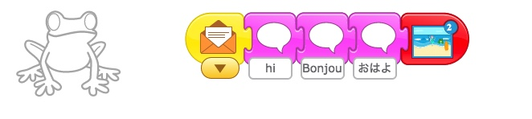

《 Return to [Page 1](./a_mon0500pm.html)

* [July 27th](#july-27th)
  * [July 27th Homework Review](#july-27th-homework-review)
  * [Homework for August 3rd: Flying Project](#homework-for-august-3rd-flying-project)
* [July 20th](#july-20th)
  * [July 20th Homework Review](#july-20th-homework-review)
  * [Review Things that make projects better (Stars!)](#review-things-that-make-projects-better-stars)
  * [Teamwork 5000 Redux](#teamwork-5000-redux)
  * [July 20th Double Hangman](#july-20th-double-hangman)
  * [July 20th Homework](#july-20th-homework)
* [July 13th](#july-13th)
  * [July 13th Homework: Diagonal Movement and Alien Planet](#july-13th-homework-diagonal-movement-and-alien-planet)
    * [Stars and Wishes: Common Wishes](#stars-and-wishes-common-wishes)
  * [Finish the Alien Planet](#finish-the-alien-planet)
  * [July 13th Homework: Naughty/Nice Wizard](#july-13th-homework-naughtynice-wizard)
  * [July 13th Homework](#july-13th-homework)
* [July 6th](#july-6th)
  * [Review Project: "Pass It On"](#review-project-pass-it-on)
  * [Switching Costumes Project](#switching-costumes-project)
  * [The Aliens Have Landed Part 1: *The Space Ship Problem*](#the-aliens-have-landed-part-1-the-space-ship-problem)
    * [Space Ship Problem: Diagonal movement](#space-ship-problem-diagonal-movement)
    * [Space Ship Problem: Shrinking Cat](#space-ship-problem-shrinking-cat)
  * [Hangman](#hangman)
  * [July 6th Homework](#july-6th-homework)
* [June 29th](#june-29th)
  * [Review Project: "A Day At the Beach"](#review-project-a-day-at-the-beach)
  * [Pass It On from BootUp](#pass-it-on-from-bootup)
  * [Hangman](#hangman-1)
  * [June 29th Homework](#june-29th-homework)
* [June 22nd](#june-22nd)
  * [Review Collaborative Project: "Teamwork 5000"](#review-collaborative-project-teamwork-5000)
  * [Debugging Exercises for "A Day at the Beach"](#debugging-exercises-for-a-day-at-the-beach)
    * [Answers for Debugging "A Day at the Beach"](#answers-for-debugging-a-day-at-the-beach)
  * [Storyboarding](#storyboarding)
  * [June 22nd Homework](#june-22nd-homework)
* [June 15th](#june-15th)
  * [Review Projects](#review-projects)
  * [Collaborative Project: "Teamwork 5000"](#collaborative-project-teamwork-5000)
  * [July 15th Homework: Finish the Project](#july-15th-homework-finish-the-project)
  * [Upcoming Project Preview: Good Wizard Bad Wizard](#upcoming-project-preview-good-wizard-bad-wizard)
* [June 8th](#june-8th)
  * [June 8th Homework Review](#june-8th-homework-review)
  * [Individual stories](#individual-stories)
  * [June 8th Homework](#june-8th-homework)
* [June 1st](#june-1st)
  * [Message Mania Part 1](#message-mania-part-1)
  * [May 25th Homework Review](#may-25th-homework-review)
  * [3 Little Pigs in ScratchJr](#3-little-pigs-in-scratchjr)
  * [June 1st homework](#june-1st-homework)
* [May 25th](#may-25th)
  * [Homework Review](#homework-review)
  * [Message Mania Part 1](#message-mania-part-1-1)
    * [[UPDATE to Message Mania Part 1]](#update-to-message-mania-part-1)
  * [May 25th Homework](#may-25th-homework)
  * [Also Coming Up on June 1st](#also-coming-up-on-june-1st)
* [May 18th](#may-18th)
  * [May 18th: Homework Review](#may-18th-homework-review)
  * [May 18th: Follow the Maze Project](#may-18th-follow-the-maze-project)
  * [Drawing Square Mazes](#drawing-square-mazes)
  * [Next Major Project Preview: 3 Little Pigs](#next-major-project-preview-3-little-pigs)
  * [May 18th Homework](#may-18th-homework)
    * [Finish up projects from May 11th](#finish-up-projects-from-may-11th)
    * [Intro to Message Mania](#intro-to-message-mania)
      * [Warm-up: Planning for **Message Mania for 3**](#warm-up-planning-for-message-mania-for-3)
      * [Advanced: **Message Mania for 6**](#advanced-message-mania-for-6)
    * [Bonus Puzzle](#bonus-puzzle)
* [May 11th](#may-11th)
  * [May 4th Homework Review](#may-4th-homework-review)
  * [Main Idea: Control Buttons](#main-idea-control-buttons)
  * [Using Controls: Race to the Finish](#using-controls-race-to-the-finish)
    * [Part One of The Race to the Finish.](#part-one-of-the-race-to-the-finish)
    * [Part Two of The Race to the Finish: The Game](#part-two-of-the-race-to-the-finish-the-game)
  * [Preview for May 18th: Follow the Maze Project](#preview-for-may-18th-follow-the-maze-project)
  * [May 11th Homework: Finish the Follow the Maze](#may-11th-homework-finish-the-follow-the-maze)
  * [May 11th Zoom Issues](#may-11th-zoom-issues)
* [May 4th](#may-4th)
  * [Animate My name](#animate-my-name)
  * [Student Homework Notes](#student-homework-notes)
  * [Homework Part 1: Keep working on Alien Planet](#homework-part-1-keep-working-on-alien-planet)
  * [Homework Part 2: A Story Based on the Hare and Tortoise](#homework-part-2-a-story-based-on-the-hare-and-tortoise)
    * [Instructions](#instructions)
    * [Sample Screenplay](#sample-screenplay)
* [April 27th](#april-27th)
  * [Skills Review](#skills-review)
  * [Teacher Says with Zoom](#teacher-says-with-zoom)
  * [Alien Planet](#alien-planet)
  * [How to send projects](#how-to-send-projects)
  * [Update ScratchJr](#update-scratchjr)
  * [April 27 Homework](#april-27-homework)
  * [Addenda](#addenda)
    * [Addendum: Skill Review Checklist](#addendum-skill-review-checklist)
    * [Addendum: Alien Planet Project Assignment](#addendum-alien-planet-project-assignment)
    * [Addendum: Sending Projects](#addendum-sending-projects)
    * [Addendum: Code for Alien Planet](#addendum-code-for-alien-planet)
* [April 20th](#april-20th)
  * [Sending Messages by Making a Conversation](#sending-messages-by-making-a-conversation)
  * [Continue the conversation](#continue-the-conversation)
  * [The KEYS to Messages](#the-keys-to-messages)
    * [Advanced Keys](#advanced-keys)
  * [April 20 Homework](#april-20-homework)
  * [Going to a different Screen](#going-to-a-different-screen)
  * [The Dragon Maze almost solved](#the-dragon-maze-almost-solved)
  * [Zoom problems](#zoom-problems)
    * [Following the Conversation](#following-the-conversation)
    * [Sharing Screens](#sharing-screens)
  * [Next Class: Review](#next-class-review)
  * [Feedback](#feedback)
* [April 13th](#april-13th)
  * [Using Zoom](#using-zoom)
  * [Game: Black](#game-black)
  * [ScratchJr: Messages](#scratchjr-messages)
  * [April 13 Homework](#april-13-homework)
* [April 6th](#april-6th)
  * [Postponing the Homework](#postponing-the-homework)
  * [Discord to Zoom](#discord-to-zoom)
  * [Dragon Maze Demo](#dragon-maze-demo)
* [March 30th](#march-30th)
  * [Thank you. Discord.](#thank-you-discord)
* [March 23rd](#march-23rd)
  * [First Class](#first-class)

* Click on the [> Date]() or BLUE borders to toggle the <b>  &nbsp;▶︎&nbsp;&nbsp;Details&nbsp;&nbsp;&nbsp;&nbsp;</b>

## July 27th 

## July 27th 

### July 27th Homework Review 

The Teamwork 5000 Redux homework student made were very interesting and we moved slowly and methodically, so in the end we spent the better part of the entire class giving stars and wishes and debugging. Before running their code, I asked the kids to tell me who their characters were and what happens in each screen to reinforce their project planning and storyboarding. 

### Homework for August 3rd: Flying Project 

I then introduced the Bootup Flying project. 



The homework is to imitate (using just the video as a guide) *the first screen*, including 4 animals flying, and touch actions for each of them. You can use your own characters and motions, but keep the basic idea.

* Extra credit: try to figure out how to make the transition from screen 1 to screen 2.

## July 20th 

## July 20th 

### July 20th Homework Review 
As usual we did a homework review. Kids are getting more specific with their comments, which is good.

### Review Things that make projects better (Stars!)

Students Brainstormed a list of things that make for a good project

* Creativity
* Teamwork
* No crazy stuff (it should make sense)
* No violence/killing (Be kind)
* Details 
* Interesting characters and backgrounds
* Make clear who is speaking or acting
* Use word bubble and sounds
* Use color
* Make an exit screen
* Beautiful story
* Navigation buttons

### Teamwork 5000 Redux

By popular demand, instead of doing a new Bootup Project, kids wanted to make another Teamwork 5000 project. Each child came up with some ideas and in the end we had four components for kids to tie together into a story:

* Like a movie
* Look at an angel
* Go to a monster house
* Computer Robots

In class kids did a storyboard, and reviewed it with me. Once it was complete, they started their projects.

### July 20th Double Hangman

Again we ended the class with a game of hangman. This time we played double hangman, with 2 boards going at the same time. Double the fun!

### July 20th Homework

The homework is complete the Teamwork 5000 Redux Project and email it to me.

## July 13th 

## July 13th 

### July 13th Homework: Diagonal Movement and Alien Planet 

We reviewed the Diagonal Movement Puzzle and Alien Planet Project. In one solution, as in the "P1 Spaceship" in the code for the Alien Planet (below), is to have several green flag blocks that all start at the same time. That means the spaceship moves up and across and shrinks at the same time, that is to say diagonally and away. Another answer to the puzzle was, instead of many green flags, to have the character/space ship send a message to itself, and have several "receive message blocks" do movements or other actions at the same time.  



<!-- 
{ % include niceimage-gallery.html folder="/scratchProjects/Y1R31Alienplanet/" %}

{ % include image-gallery.html folder="/scratchProjects/Y1R31Alienplanet/" %}
-->

#### Stars and Wishes: Common Wishes

We looked at all the projects, and kids came up with Stars and Wishes for the projects. Part of the Here are some common "wishes" for projects. Remember to put them into your next project:

* Draw your own interesting character or background. (For example, using colors and shapes well)
* Make clear who is speaking when there is sound. (For example, have characters move when they speak.)
* Make sure people can follow the action of the story. (Make each action separate)
* Use word bubbles to explain the action.
* Use text panels, like a "The End" screen to carry the project forward.
* Add screen navigation buttons

Kids are getting better at using the drawing screen, and the characters are looking better and better.

### Finish the Alien Planet

Some kids took on the extra credit project and gave the alien various objects. Those that didn't can finish their projects for the homework. 

### July 13th Homework: Naughty/Nice Wizard

The assignment was to take the basic idea of the Naughty Wizard Video and make their own version.The basic story is there is some kind of conflict, and either a naughty or nice wizard is involved in solving it or making it worse.  

First the kids worked on a storyboard. I wanted kids to use the [switching constumes](#switching-costumes) technique we learned two weeks ago when applying the "Wizard"'s magic. 

### July 13th Homework

The homework is:
1. Finish the Alien Planet projects, including making the improvements (wishes) that people suggested in class.
2. Finish you Naughty/Nice Wizard thinking about the "Common Wishes" list above.

## July 6th 

## July 6th 

### Review Project: "Pass It On"

We reviewed homework projects. Students were very kind in giving out "Stars and Wishes", that is talking about what they liked and would improve in each project.

### Switching Costumes Project

Once common challenge in ScratchJr. is making a character suddenly change. We watched a video about [several ways to do that](https://www.youtube.com/watch?v=7jv5r9aafZA&feature=youtu.be). 



We then walked through a project showing two ways to make a character change costumes using the [Switching Costumes Project](./scratchProjects/20200706HidingDisappearing.sjr)

1. Using a new screen

If you place the character at the same place in both screens (at the end of one, and the beginning of the other) they will appear to magically change.

2. Using a message

If you send a message that goes to both characters, you can make one disappear, and the other appear at the same time. 

If you add a 3 "smoke screen" that appears and disappears as the characters change, it can seem like magic.

### The Aliens Have Landed Part 1: *The Space Ship Problem*

We then watched a video describing out next project, "The Aliens Have Landed" from Bootup.



#### Space Ship Problem: Diagonal movement

In the beginning of the video the space ship  moves diagonally up and across the screen. I challenged the group to show me how to do it. Kids came up with some interesting suggestions, and eventually we got to a solution (though there is a simpler one: see screen 1 of the Homework). The secret is having both actions take place at the same time in separate "threads".

#### Space Ship Problem: Shrinking Cat

However, in the video, the space ship also gets smaller. How do we do this? One suggestion was made, but the **Red Shrinking Cat** (screen 2 of Homework) doesn't quite work. This is the homework challenge (screen 3).

### Hangman

After cleanup we had enough time for a fun game of Hangman. 

### July 6th Homework

* Download [the Switching Costumes](./scratchProjects/20200706HidingDisappearing.sjr) project to ScratchJr. Do you understand it?

* **Solve the Space Ship Problem** (in screens 3 and 4). [Here is a guide for you to download](./scratchProjects/20200706SpaceShipProblemHW.sjr). It has 4 screens:
   1. **Diagonal Movement** from class, and a simpler one without loops.
   2. **The Red Shrinking Cat** that didn't work. (has loops)
   3. Fix this **Red Cat** to make it not bump. Click the box for a hint.
   4. An example of how to change direction. Can you make the pig do it too?

* **Extra Credit**: Do you see how I made the hint appear and disappear? Can you copy that somewhere?
* **Extra Credit**: Watch the Aliens have landed video (above) and try to make it (without having the source code). What would you give (of yours!) to an alien?

## June 29th 

## June 29th

### Review Project: "A Day At the Beach"

We reviewed the A Day At the Beach projects that students completed. It was interesting how each child had their own ideas about a day at the beach. We also reviewed:

* Editing a character with a neck that was too long. We studied how to tap and drag to move sections on a image to a new location.

### Pass It On from BootUp

We watched the Pass it On from Bootup video. This video presents four situations which students are asked to continue. 



Each child chose one project and based on that choice:

* Reverse Engineered the first part based on the video. They were allowed to make whatever changes they wanted.
* Continue the story.

We were unable to download the file from the original site. You may be able to download it from our site: [Pass It On](./scratchProjects/Y1R49Passiton.sjr)

* Making two characters (a pirate and their boat) move together at the same time by using the same message sent to both.

### Hangman

As students worked on the project I demonstrated techniques to solve problems that came up, including a lot of spelling questions. This lead to a rousing game of Hangman. 

### June 29th Homework

Continue working on Pass It On, and send it to my by email. 

## June 22nd

## June 22nd

### Review Collaborative Project: "Teamwork 5000"

First we reviewed student homeworks. 

### Debugging Exercises for "A Day at the Beach"

We did a debugging project. I showed students the [A Day at the Beach Project](./scratchProjects/Y1R47AdayatthebeachMod.sjr) from BootUp ans students had to answer the following questions:

1. Why does the car leave without Scratch Cat?

2. Why do we have two Scratch Cats when the surfboard is left on the beach?

Have students reverse engineer it. Click below for answers.

#### Answers for Debugging "A Day at the Beach"

#### Answers for Debugging "A Day at the Beach"

1. We need to make Scratch Cat hide before the car drives away

2. We need to hide the Surfing cat sprite as soon as the “send red message” block is used, not after

### Storyboarding

Students then Storyboarded their own day at the beach story. Each student and I reviewed each student's project together to make sure it was complete, and they began to code it.

### June 22nd Homework

The homework is to finish the project and email it to me.

Also, optionally, students can download  [A Day at the Beach Project](./scratchProjects/Y1R47AdayatthebeachMod.sjr)  project and try to debug these two other problems we didn't look at:

1. Why don’t we switch to the third backdrop when Scratch Cat decides to surf?

2. Why doesn’t the crab talk while moving on the screen?

## June 15th

## June 15th

### Review Projects

We reviewed the 3 little pigs projects that were submitted as homeworks. Kids seem to enjoy sharing their work very much, and we also attempted to solve minor problems in class. 

### Collaborative Project: "Teamwork 5000"

Today's main project was to work on a project as a class as a story game. The rules were:

* Each person adds one idea. Each person gives one "step".

Possible "steps" are (rules in parentheses were not actually used):

-   Add character
-   Trigger block + up to 3 actions, for example:
    -   green flag + move right and down and repeat 3 times
    -   touch trigger + disappears
    -   etc.
-   send message and receive message plus 2 actions
-   character says something
-   background and character images:
    -   We make the image together.
    -   Take turns adding strokes or figures.
-   Once step is added it cannot be changed without the original creator's agreement

- You may add to them.
- You may make them do unexpected things...that's okay.
- You may only work with the same character 2 times in a row.

### July 15th Homework: Finish the Project

Everyone had made several contributions. We named the project "Teamwork 5000". The homework is to:

 * [Upload this project](./scratchProjects/Teamwork5000.sjr), and continue it on your own. 
 * You may not take away from the project but you can add to it. 
 * You may only add up to 2 more characters. 
 * You may add a background. 
 * You should try to add new screens and use the same characters again.

### Upcoming Project Preview: Good Wizard Bad Wizard

At the end of class we also previewed the next project after this, "Good Wizard, Bad Wizard".

## June 8th

## June 8th

### June 8th Homework Review

Today we reviewed the 3 Little Pigs Project that students submitted. They were all very creative in their work. We had the chance to do some practice debugging as a group when one of the projects didn't work as expected. It was a great thinking exercise and I think the kids enjoyed it.

### Individual stories

I then gave the students the in class assignment, which was to tell a new story. This time it could be any story they wanted. First students worked with pen and paper outlining the story, then started in on ScratchJr. Some of them based it on stories they knew, some made entirely original stories. As students were working I went around the room and helped them with problems or questions they had.

### June 8th Homework

This week's homework is to finish their Individual Story Project and email it to me. 

## June 1st

## June 1st

### Message Mania Part 1

We watched the video about [Message Mania Part 1](#update-to-message-mania-part-1){: .innerlink}

### May 25th Homework Review

We reviewed the homework assignments the kids submitted. They were great and kids enjoy talking about their projects with the class. Kids worked together to fix some problems.

### 3 Little Pigs in ScratchJr

Some kids told their own version of the 3 Little Pigs. The assignment was to plan, on paper, without using ScratchJr, how they would tell the story. This included:

+ Designing the characters and houses
+ Plotting out the actions
+ Writing dialogue

The purpose was to think about the project before actually starting to code it. I reviewed their plans, and when they were ready they started coding. Here is my example of what my plan and first screen look like. See [here](../lessons/3LittlePigsInScratchJr.html) for more information.

### June 1st homework

The homework is:

1. Complete and submit their final project to me.

2. (**DO NOT USE SCRATCHJR. PLANNING ONLY.**) Think about other stories you might want to tell in scratch. Be ready to tell the story in class! 

## May 25th

## May 25th

### Homework Review

We reviewed homework. Great work telling me what your stories were about! 

Everyone was using English well. Gambatte! Ooops, I mean Try Hard! ;-)

### Message Mania Part 1

We ran through the Message Mania HW assignment.  The purpose of the HW was to:

* Plan/think about the story before you code it. That is why the assignment was NOT to do it in ScratchJr.

My explanation was poor. I blame Zoom ;-) 

Many children did this: 

* One character has: Green flag, orange message, red message, yellow message.

{: height="100px"}

What I wanted was:

* Each character has a green flag. No message. Messages will be sent by Buttons.
* Each character receives 3 messages
* Each reactions is a different type

{: height="100px"}

The purpose of the project was:

* to show that messages can go to more than one character at a time. 
* to continue getting practice coding messages and buttons.
* Clicking a button can make several characters move at once.
* Help some students use Messages instead of Wait buttons to control sequence and timing. 

#### [UPDATE to Message Mania Part 1]
I could see that some kids were struggling with this so I called in the Big Dogs. Here is a video showing what to do. If you have any questions, let me know. 



[A direct link](https://youtu.be/WA4_xoRt1r) to the video.

### May 25th Homework

* Work on HW I gave you in class (if I did). 
* Continue adding to Message Mania.
* Send me your Message Mania project. 
* Download and install MY SAMPLE Message Mania. Try to understand it and we will work on it next week.

If you don't know what to do, just PLAY with ScratchJr. There is no correct answer! It's all good! 

Ideas: 

* Turn Message mania into a story. What happens next? What is the situation? What is the goal?
* Think about characters/actions you want first. Then code it.
* Send messages to more than one character at a time. Why would you do this?
* Use different color messages to control sequence of events. One character orange. Then red, etc.

### Also Coming Up on June 1st

Do you know the story of the 3 little pigs? If not, try to read it.

## May 18th

## May 18th

### May 18th: Homework Review

I reviewed the homework submissions, and further comments will be sent via email. We are still working on a better system for this, so bear with us.

### May 18th: Follow the Maze Project
In this class, we continued working on the [Follow the Maze Project](./scratchProjects/3ButtonRaceFollowTheMazeHW.sjr), described on May 11th in  [homework below](#preview-for-may-18th-follow-the-maze-project){: .innerlink}. I didn't discuss the *surprise* at the end. That is a bonus question for this week.

Kids projects were full of interesting variations. Please email me your finished projects so I can look them over.

### Drawing Square Mazes

I really liked the questions kids had today. One question what how to create a nice maze, and we reviewed useful tips on how to draw straight lines, including keeping dots in the center, so that the characters have the most space to walk in: 

   * YES: {: width="100px"}
   *  No: {: width="100px"}

I also explained how to make maze using "squares with holes", the 3rd kind of maze we have made so far: 

<!-- These have to be links  -->

{: target="_blank"}
{: #slide-09 }

{: target="_blank"}
{: #slide-10 }

{: target="_blank"}
{: #slide-11 }

<!-- necessary space-->

[{{ page.gilabel-09 }}](#slide-09) 
[{{ page.gilabel-10 }}](#slide-10)  
[{{ page.gilabel-11 }}](#slide-11) 

Another great question was about how to make the arrows, which is shown below in the [homework for May 11th, below](#preview-for-may-18th-follow-the-maze-project){: .innerlink}, as well.

Lastly, we also talked about how to modify characters, to make buttons have the characters in them as in:

{: width="50%" } 
 

 <!-- move to lessons -->
### Next Major Project Preview: 3 Little Pigs

Most kids seem to be understanding how to use messages. We now have a basic understanding of almost all the buttons, and are ready to try more creative and advanced projects. Our next big project we will focus more on the creative side, telling stories, creating effects that help us tell the story. Our sample project will begin like this. Can you figure it out?

{: width="50%" }

### May 18th Homework

This week's homework has 3 parts, but **you don't have to do them all**. 

#### Finish up projects from May 11th
* Keep working on your projects and be prepared to tell me about your project using a small description. It doesn't have to be written. The focus in on the relationship between words/stories and the code. We will do more of this next week.

<!-- move to lessons -->
#### Intro to Message Mania 

##### Warm-up: Planning for **Message Mania for 3**

Do not use ScratchJr for this. Just plan it out. Write down or draw what will happen. Don't use ScratchJr.

* Design 3 characters. 
  * draw them or describe them in words
* Give each character has a "receive message" block for 3 colors. For example, for character 1 (you don't have to use my example actions!!) I am writing/drawing:
  * red: say my name and introduce myself.   * 
  * orange: move to the edge of the screen and get stuck.
  * yellow: ask a question. What will the question be??
* NO action can be repeated. 

We will do it in class next week as a warmup. Did I mention not to use ScratchJr for this?

##### Advanced: **Message Mania for 6**

If you are motivated, you can go to the advanced version: **Message Mania for 6**. It is the same as above but with 6 characters and colors.

#### Bonus Puzzle 
At the end of the Follow the Maze Project, the cake appears when Cat enters the last square. I used a special trick to do that. It uses Controls in a special way. Can you figure it out? Click below  for a hint:

Click for Hint

<!-- does not show -->
<title> Click for hint</title>

What is the light blue notch (line) at the edge of the entrance?

This is what the model project looked like:

 

## May 11th

## May 11th

### May 4th Homework Review

I will send emails with more detailed comments individually later. 

### Main Idea: Control Buttons 

**Control Buttons** were the main idea of this class. Control buttons make one character control another character.

**Screen 1** of the [3-Button-Race and Follow The Maze Sample Projects](./scratchProjects/3ButtonRaceFollowTheMazeHW.sjr) gives an example. It also has a simple exercise for you to do if you think you need more **practice**. 

Making a control is a 2 step process. Here is what to do:

1. Make the button. It can be anything. 

   * When you touch the CONTROLLER it sends a message. Add this:

2. Go to the character that receives that message. 

   * When THE CONTROLLED gets the message, it acts. Add this:

That's it!!! 

In my example, **Monkey** controls **Frog**, and **Penguin** controls Cat. 

If you need **practice**, try to make the **Flag** control **Tac**. 

### Using Controls: Race to the Finish

To get some practice with **Control Buttons** we worked with  [my version of the Race to the Finish Project](./scratchProjects/20200511DavidRace2FinishGame.sjr) from BootUp. (*I recommend you download it if you have questions about what we did.*) Notice how similar it is to the Hare and Tortoise homework.

#### Part One of The Race to the Finish. 

Students had to try to copy **Screen 1**. This is just like Hare and Tortoise: 

 

#### Part Two of The Race to the Finish: The Game

In class, we then made this into a game. Look at **Screen 2**. It has 2 controls. The CAT BUTTON controls the **Cat**, the BIRD BUTTON controls the **Bird**. Could you do it? Look at it again and fix it if you have to.

 

Notice that when I click the green boxes, the characters move to the right one step. Tap the buttons together with a friend and see who can win the race.

We then made a crazy version on **Screen 3**.

### Preview for May 18th: Follow the Maze Project
In the next class, we will make 4 controls for one character. Download and see **Screen 2** of the [3-Button-Race and Follow The Maze Sample Projects](./scratchProjects/3ButtonRaceFollowTheMazeHW.sjr). They will make the character move up, down, right, and left. Here is a picture of the finished game. Can you figure out how it works? 

It has an extra twist at the end. Can you figure out how the **Cake** appears? *Hint: It uses a hidden control.*

* I made one **Arrow**. Then I copied it and rotated it to make the other 3. Here is the **Left Arrow**:

* Then I added code for each arrow. Here is the code for the **Up Arrow** 
  
  * Arrow: yellow touch trigger, send message
  * Cat: get message, do action

### May 11th Homework: Finish the Follow the Maze

**Screen 2** has 4 Arrow Controls. The **Up Arrow** works like above, but your Homework is to make the other **Arrows** work.

1. Use different color messages
2. Make the controls a little smaller 
3. Change the Maze (in the background)!!
   
   * Use this kind of maze if you want it simple. See the dots in the middle of the squares?

   * **Useful Tip**: When you adjust the dots/lines for your maze, make the dots in the **CENTER** of the light grey grid squares, **NOT on the lines** of the grid squares.

      * YES: {: width="100px"}
      *  No: {: width="100px"}

Now you have a **Follow the Maze Game**! 

Easy Peasy! 

### May 11th Zoom Issues

Apologies if you had problems getting my attention after I muted everyone. I was trying to control background noise by muting everyone and turning people back on. It wasn't so successful. Sorry.

It is difficult to keep background noise down. If you are having a side conversation or you have background noise in your house, it is helpful to mute your microphone so others don't hear it. Then, if you want to speak or turn it back on again. 

Sometimes I am paying attention to one student, and the part of my screen that shows students or incoming chats may not be easy for me to see. Please keep trying. This is just a limitation of doing remote classes. Thanks for being patient! Gambare!

## May 4th

## May 4th

### Animate My name

I had students make their own project based on the [Bootup Animate My Name](https://www.youtube.com/watch?v=mQzWGY4xuSY) project, which you can [download here](https://drive.google.com/open?id=0B342uiaCLSS3YzJTUmlha1FQRjF1cldPdjQtUVhGUjFROEFz)  ScratchJr must be open when you open the sjr file. 2) You must have the latest version installed. If you still have problems let us know.") using the [skills we should all know at this stage][]. Students created characters based on the letters in their name.
We talked about what each letter was doing. Then students created their own.

As a follow, we changed it so instead of all the characters moving at once, they moved in turn. Some kids got creative and had the letters say things and do funny things along the way.

### Student Homework Notes

I went over last week's homework with the students. I gave each student some next steps to keep working on. The most common thing was to make the conversations longer and go back and forth.

### Homework Part 1: Keep working on Alien Planet

Continue adding and revising Alien Planet. Think about:

-   Make the characters talk to each other. Try to turn it into a story.
-   Make the character's actions meaningful.

### Homework Part 2: A Story Based on the Hare and Tortoise

<!--  -->

#### Instructions

-   The goal is to create a similar project by yourself.
-   You can download the [movie here](./images/2020-05-04/Homeworkfor05-11.gif). It is just an example.
-   You can use regular scratch backgrounds, or make your own.
-   Choose any characters, or **make your own**.
-   I have made a sample "screenplay" (below), but **you can use your own**.
-   Use messages to make the characters speak **in turn**.
-   Control the speed of the characters.
-   You can make the characters walk in funny ways.
-   My horse is in the tree. Where do you think the characters should be placed?

#### Sample Screenplay

1. Character2 and the Character1 introduce themselves and decide to have a race
    1. Background: the entrance to the race
    2. Characters: Character1, Character2, Character3
    3. Script:
    - Character1: You are slow. I am the fastest.
    - Character2: Actually, I am faster than you. Let's race!
    - Character1: Yeah? Okay, let's race.
    - Character3: I will be the judge. When I say, go, start running.
    - Character3: Ready...Steady....Go
    - _Character2 runs slowly, and the Character1 runs quickly off the screen. When he does he disappears we go to the next screen._

In class we will continue this story. Any ideas?

## April 27th

## April 27th

### Skills Review

We did a [guided walkthough][] of the [skills review sample project][]  ScratchJr must be open when you open the sjr file. 2) You must have the latest version installed. If you still have problems let us know.") using the [skills we should all know at this stage][]. Can you do them all? You have learned a lot already!!!

[guided walkthough]: ../lessons/20200427SkillsTest.html
[skills we should all know at this stage]: #addendum-skill-review-checklist
[skills review sample project]: ./scratchProjects/Project120200427SkillsTest.sjr

### Teacher Says with Zoom

I talked about the game [Zoom version of the Teacher Says game](../lessons/TeacherSays.html), which we played once before. In this version, I walked through the project and students sent reactions, either 1 👍 or 2 👏, showing which button does **the next action**. Everyone did great using the zoom reaction buttons. Just using your hands was okay too.

<!-- move to lessons -->
### Alien Planet

I showed everyone the [Alien Planet Project](./scratchProjects/Y1R31Alienplanet.sjr). I gave students an assignment modelled on the Alien Planet ([see addendum](#addendum-alien-planet-project-assignment)) . See [this addendum](#addendum-code-for-alien-planet) for the code.

### How to send projects

When you are done, you can [email it to me](mailto:teacher@kyotolesson.com) from the scratch project page. See the [addendum on sending projects](#addendum-sending-projects) for a How-to.

### Update ScratchJr

ScratchJr just updated their program using the [skills we should all know at this stage][]  ScratchJr must be open when you open the sjr file. 2) You must have the latest version installed. If you still have problems let us know."). I suggest you update it on your device, here:

-   <a href="https://itunes.apple.com/us/app/scratchjr/id895485086?ls=1&amp;mt=8">App Store</a>

-   <a href="https://play.google.com/store/apps/details?id=org.scratchjr.android">Google Play</a>

-   <a href="https://chrome.google.com/webstore/detail/scratchjr/oipimoeophamdcmjcfameoojlbhbgjda">Chrome Web Store</a>

-   <a href="https://www.amazon.com/gp/product/B01AKGTD2E">Amazon</a>

### April 27 Homework

Keep working on [The Alien Planet assignment](#addendum-alien-planet-project-assignment). [Email](mailto:teacher@kyotolesson.com) the result.

### Addenda

*Click the header to see the addendum.*

#### Addendum: Skill Review Checklist

#### Addendum: Skill Review Checklist
<!-- Heading above is required by jekyll to create toc, but actually appears (manually copied) in summary. display summary + *  css removes it from here-->

Skills Review Checklist:

-   [ ] Choosing and changing the background
-   [ ] adding and changing lines and shapes
-   [ ] adding and making characters bigger or smaller
-   [ ] making characters visible or invisible
-   [ ] making characters move in different ways
-   [ ] making characters act at the start, or when they are touched
-   [ ] making characters speak and make sounds
-   [ ] sending and receiving messages
-   [ ] moving to different screens/pages

You have learned a lot already!!!

Go back to [Skills Review](#skills-review)

<!-- End Addendum: Skill Review Checklist -->
<!-- move to lessons -->

#### Addendum: Alien Planet Project Assignment

#### Addendum: Alien Planet Project Assignment

1. Create your own background like the one in the project. It can be anything you like, but at least:
    - [ ] draw several lines
    - [ ] use the fill tool to fill in areas.
2. Create at least 3 and up to 8 characters. For each one:
    - [ ] Edit the character to make them alien.
    - [ ] Add fills, strokes, and whatever else you want.
    - [ ] Size and place the character at their start point
3. Each character can have more than one green flag or other **trigger** at the same time. See [Alien Bat](#slide-03).
4. Make each character do one or more things with the **start trigger** and the **touch trigger** and the **bump trigger**. Here are some choices:
    - [ ] Make the character move and dance. Use all the blue blocks.
    - [ ] Include sounds and speech bubbles for the characters and have the character make the sound, either at the beginning or when touched, or any other time.
    - [ ] Use repeat/loop (yellow) and repeat forever (red) blocks. See the Alien Cat for an example of both.
    - [ ] Change the speed of the character
    - [ ] Have the character become invisible and visible. See [Alien Bat](#slide-03).
    - [ ] Have the characters talk to each other. This project has no example, but we have covered it before. Here is an easy example of a [simple conversation](./scratchProjects/card08-greet.pdf)

#### Addendum: Sending Projects

#### Addendum: Sending Projects

Even though receiving projects does not seem to work on the iPad, sending does seem to work.

1. Click here to get to send screen.
   {:imagesize: width="auto" max-width="initial" height="200px" max-height="250px" }
   ![upper right corner, inside your project][]{: imagesize }
2. You should see a project page.

![the project page][]{: imagesize }

3. Rename it with your name, so I know who is sending it!
4. Click ”For Parents”.
5. You will have to solve a math problem

![a math problem][]{: imagesize }

6. Solve it and click "Send email"

![Share by email][]{: imagesize }

[upper right corner, inside your project]: images/2020-04-27/sendingProjectByEmail.PNG
[the project page]: images/2020-04-27/SendingEmail.jpg
[a math problem]: images/2020-04-27/mathProblem.jpg
[share by email]: images/2020-04-27/SendThroughEmail.jpg

Here is my [direct email](mailto:teacher@kyotolesson.com) or email alan or the school.

<!-- move to lessons -->

#### Addendum: Code for Alien Planet

#### Addendum: Code for Alien Planet



## April 20th

## April 20th

### Sending Messages by Making a Conversation

The main topic today was how to send a message and receive a message to start a conversation.

-   First, Fairy says something and **then** sends (ORANGE) message

-   The Frog receives it and responds

### Continue the conversation

We also talked about how to make a longer conversation:

1. Fairy Starts (speaks and sends ORANGE message. You need to connect it!)
   
1. Froggie replies
   
1. Then Sends a New RED Message (remember to connect it!)
   
1. Fairy receives the red message. Says something. Then she continues by sending a YELLOW message back to Froggie (connect it).
   

### The KEYS to Messages

-   Each message has 2 parts, sending and receiving.
-   One character sends. The other receives, and acts.
-   They can send a new message back....

#### Advanced Keys

-   One character can send more than one message, for example to different characters, or the same character.
-   The same message can go to more than one character, too. That is, more than one character can receive the message when it is sent.
-   Sometimes you even send messages to yourself!

See [Dragon Maze Part 2](../lessons/DragonMazePart2.html) for examples.

### April 20 Homework

The homework was to make a longer conversation by sending several messages back and forth between characters as above. If you need something for the characters to say, [here are some jokes](../lessons/JokesForBadJokes.html) to use.

### Going to a different Screen

We also talked about adding new Screens/Pages to a Project:

1. Create a new Screen
   
2. Go back to 1st Screen
3. The screen appears in the (red) buttons
   
4. Add it to the actions
   

### The Dragon Maze almost solved

Some students worked very hard on the Dragon Maze, but they had a problem. I have made special [Dragon Maze Part 2](../lessons/DragonMazePart2.html) directions on making the Dragon maze work. It uses sending messages. The directions are very detailed, so take it slow. If you have questions, we will go over it in class next week.

### Zoom problems

We had some difficulty because Zoom cut off the meeting at a certain point. Zoom told us this would not happen, so we didn't expect it. Sorry about that. It will be fixed next week.

If it DOES happens again sometime, please just wait a few seconds and use the Zoom link again. I will start the call again and wait for people to join again, like we did this time. As above, this should not be a problem next week.

#### Following the Conversation

Remember that other people can hear what you are saying at home. If you need to have a side conversation, feel free to mute your microphone temporarily.

Sometimes I am focused on one or other students. You may want to listen, as it may answer questions you have too. Or you can wait by working on your own project while I take care of them. Try to think about what your next question will be. If you don't know what to do, speak up or send me a chat message.

Sometimes I will need to mute you to make it easier for everyone to hear the conversation. You may get a message in Zoom asking for permission, that you will need to respond to.

#### Sharing Screens

Everyone seems to be able to share screens finally. I know it is a little tricky, but it is part of doing class remotely. Sharing the screen is important for me so I can see your progress and offer help, so thank you for cooperating and bearing with it! Talking via Zoom is more difficult than regular conversation, but if we try we can find ways to make it easier and better.

### Next Class: Review

The next class will be mostly a review and testing class. I expect a lot of back and forth, so be ready to talk! I also hope to do some activities as a group. Can you use all of the skills we have used so far?

-   [ ] Choosing and changing the background
-   [ ] adding and changing lines and shapes
-   [ ] adding and making characters bigger or smaller
-   [ ] making characters visible or invisible
-   [ ] making characters move in different ways
-   [ ] making characters act at the start, or when they are touched
-   [ ] making characters speak and make sounds
-   [ ] sending and receiving messages
-   [ ] moving to different screens/pages

You have learned a lot I hope!!! You can use this class to catch up on things you have missed, and if you feel advanced, you can get more practice, and I will also ask you to help other students, so be ready to explain what you know!

### Feedback

I always welcome feedback, about anything in the class. I look forward to seeing everyone in person as soon as it is safe to do so!! :-)

## April 13th

## April 13th

### Using Zoom

See [Topic: Using Zoom](../lessons/usingZoom.html)

### Game: Black

See [Topic: Game: Black](../lessons/gameBlack.html)

### ScratchJr: Messages

We begin showing how messages can be used we began by [making a Dragon Maze](../lessons/DragonMazept1.html)

### April 13 Homework

The homework is to play with Zoom and the Maze. Practice:

-   _Skill: Modifying a path in the background_
-   _Skill: Sending Messages_
-   _Skill: Making Characters Disappear_

We will use these in our next lesson: Bad Jokes!

dJokes

## April 6th

## April 6th

Class Outline & homework: [Topic; Prep for Disappearing Dragon](../lessons/jc_a_003.html)

### Postponing the Homework

Because this class was partially a remote class, I wasn't able to fully cover the material needed for the homework, so I suggest students **postpone** the homework I assigned this time. Instead, Parents should install [Zoom](https://zoom.us/) on their device and if possible spend some time familiarizing themselves and their child with how to use it. This should include creating an account email and password. This way we can be ready for a remote class as early as next week.

### Discord to Zoom

Because of concerns about the Corona Virus this class was a combination of student's participating in person and via a Discord session. Though it was the first time doing a remote class, and as a result of patience and cooperation of students and families, I think we were able to have a successful class. However, we did notice some areas where it could be improved, and have discovered that [Zoom](https://zoom.us/) will be able to provide us and students with a better experience. Next class we will start using Zoom.

### Dragon Maze Demo
ScratchJr
First, I demonstrated a ScratchJr project demonstrating a character eating a cake in order to make a dragon disappear and being able to exit a maze. The purpose was to show how to use Action Blocks for making characters visible or invisible, sending messages, or initiating actions on Bumps. The rest of the class was a detailed and progressive practice in using each of these blocks by creating 4 characters who used these actions [in various ways](./../lessons/jc_a_003.html). While somewhat silly and arbitrary, the exercise was intended to help the children get ample practice using the blocks, as well as beginning to understand programing logic and sequencing. For reference I have put the details .

With these blocks described [here](./../lessons/jc_a_003.html) we have all we need to create the Disappearing Dragon Maze, which we will begin next week.

## March 30th

## March 30th

Class Outline & homework: [Topic: Simple two-line maze](../lessons/jc_a_002.html)

### Thank you. Discord.

Thank you everyone for providing a snack. This week we installed Discord on all the computers, but parents will need to provide an email and password. Please write these down, as it is easy to forget.

## March 23rd

## March 23rd

Class Outline & homework: [Introduction to the computer and ScratchJr](../lessons/jc_a_001.html)

### First Class

This class went very well. The kids were active and eager to participate. Don't forget to provide a snack for your child!!

<!-- 

 -->