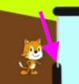
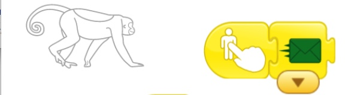
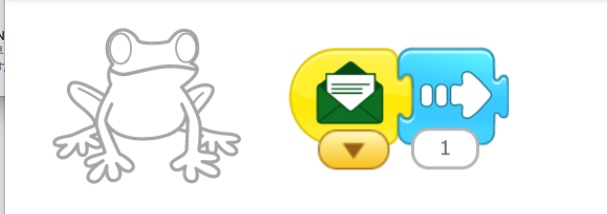
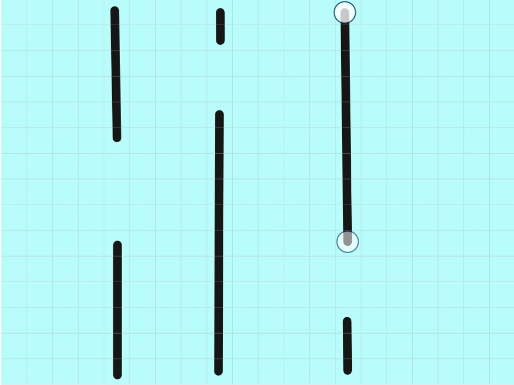
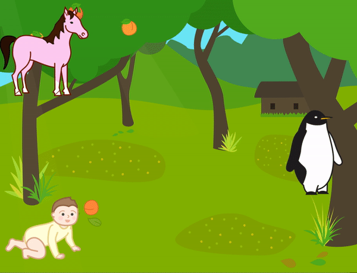
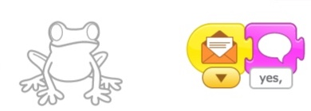
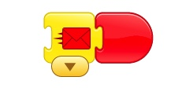
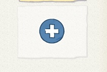
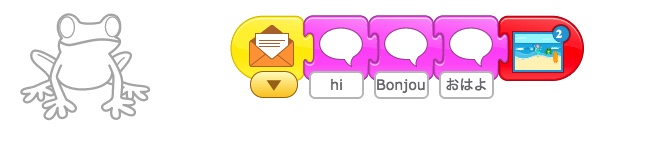
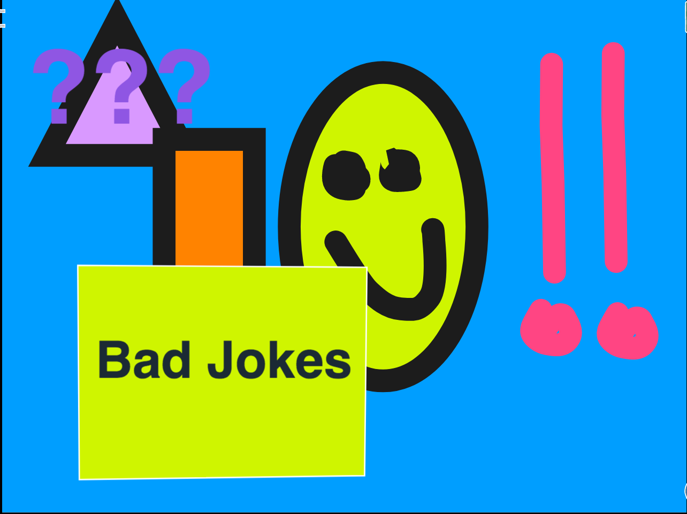

《 Return to [Page 1](./a_mon0500pm.html)

<div id="toc">


* [December 28th](#december-28th)
  * [Homework due January 4th](#homework-due-january-4th)
  * [Recap for December 28th](#recap-for-december-28th)
* [December 21st](#december-21st)
  * [Homework due 2021!](#homework-due-2021)
  * [Recap for December 21st](#recap-for-december-21st)
* [December 14th](#december-14th)
  * [Homework due December 21th](#homework-due-december-21th)
  * [Recap for December 14th](#recap-for-december-14th)
* [December 7th](#december-7th)
  * [Homework due December 14th](#homework-due-december-14th)
  * [Recap for December 7th](#recap-for-december-7th)
    * [Pixlr for removing backgrounds](#pixlr-for-removing-backgrounds)
    * [Assorted Projects](#assorted-projects)
    * [Pong](#pong)
    * [Magic: The Gathering Intro](#magic-the-gathering-intro)
    * [Bringing Lego Man into our Shooting Game](#bringing-lego-man-into-our-shooting-game)
* [November 30th](#november-30th)
  * [Homework due December 6th](#homework-due-december-6th)
  * [Recap for November 30th](#recap-for-november-30th)
    * [Group Photo Shoot](#group-photo-shoot)
* [November 23rd](#november-23rd)
  * [Homework due November 30th](#homework-due-november-30th)
  * [Recap for November 23rd](#recap-for-november-23rd)
* [November 16th](#november-16th)
  * [Homework due November 23rd](#homework-due-november-23rd)
  * [Recap for November 16th](#recap-for-november-16th)
* [November 9th](#november-9th)
  * [Homework due November 16th](#homework-due-november-16th)
  * [Recap for November 9th](#recap-for-november-9th)
  * [Platformer Template](#platformer-template)
* [November 2nd](#november-2nd)
  * [Homework due November 9th](#homework-due-november-9th)
  * [Recap for November 2nd](#recap-for-november-2nd)
* [October 26th](#october-26th)
  * [Homework due November 2nd](#homework-due-november-2nd)
  * [October 26th Class Summary](#october-26th-class-summary)
* [October 19th](#october-19th)
  * [Homework due October 26th](#homework-due-october-26th)
  * [October 19th Class Summary](#october-19th-class-summary)
* [October 16th](#october-16th)
  * [Summary October 16th Class Summary](#summary-october-16th-class-summary)
* [October 12th](#october-12th)
  * [Homework for October 19th](#homework-for-october-19th)
  * [Moving to Tynker](#moving-to-tynker)
  * [The Tynker Class Page and Homework](#the-tynker-class-page-and-homework)
* [October 5th](#october-5th)
  * [Homework for October 12th](#homework-for-october-12th)
  * [Simple Pong Game](#simple-pong-game)
  * [The Music Tutorial](#the-music-tutorial)
  * [A Remix](#a-remix)
* [September 28th](#september-28th)
  * [Homework for October 5th](#homework-for-october-5th)
  * [Review of Behavior](#review-of-behavior)
  * [Motion Exercises](#motion-exercises)
  * [Controlling characters depending on a choice.](#controlling-characters-depending-on-a-choice)
  * [An easy mouse game](#an-easy-mouse-game)
  * [Sharing Projects](#sharing-projects)
* [September 25th](#september-25th)
  * [Homework for September 28th and October 2nd](#homework-for-september-28th-and-october-2nd)
    * [Exercise 1](#exercise-1)
    * [Exercise 2](#exercise-2)
    * [Exercise 3](#exercise-3)
  * [Basic Motion Blocks](#basic-motion-blocks)
  * [A more advanced student](#a-more-advanced-student)
* [September 21st](#september-21st)
  * [Next Week: Sept. 28th Homework](#next-week-sept-28th-homework)
  * [Crazy Pong Game](#crazy-pong-game)
  * [Pong  Princess version](#pong--princess-version)
  * [Side to Side movement](#side-to-side-movement)
  * [Next week: Group Project to Review All Blocks](#next-week-group-project-to-review-all-blocks)
* [September 14th](#september-14th)
  * [September 14th Note to students:](#september-14th-note-to-students)
  * [Homework due Sept 21](#homework-due-sept-21)
  * [Do scratch tutorials](#do-scratch-tutorials)
  * [Success 1: Birthday Cakes](#success-1-birthday-cakes)
    * [Birthday Candles Go On and Off](#birthday-candles-go-on-and-off)
  * [Success 2: Cool Name animation](#success-2-cool-name-animation)
  * [Squiggly Line/Costumes Project](#squiggly-linecostumes-project)
  * [Success 3: Mario](#success-3-mario)
  * [Success 4: The Fox Project](#success-4-the-fox-project)
* [September 7th](#september-7th)
  * [September 7th Homework and Note to Parents](#september-7th-homework-and-note-to-parents)
    * [September 7th Homework](#september-7th-homework)
    * [Note to Parents: Bring a Mouse](#note-to-parents-bring-a-mouse)
    * [Note to Parents: Install Chrome](#note-to-parents-install-chrome)
  * [September 7th Class Summary](#september-7th-class-summary)
  * [Making Music](#making-music)
    * [1. Add Music Extension](#1-add-music-extension)
    * [2. Use the music blocks](#2-use-the-music-blocks)
    * [3. Stopping  and Start](#3-stopping--and-start)
* [August 31st](#august-31st)
  * [August 31st Homework:](#august-31st-homework)
  * [Intro to Scratch](#intro-to-scratch)
  * [August 31st Sample Projects](#august-31st-sample-projects)
    * [Slash Knight](#slash-knight)
    * [Colorful Trails](#colorful-trails)
* [August 24th](#august-24th)
  * [August 24th Homework Review](#august-24th-homework-review)
  * [Scratch](#scratch)
  * [Scratch Accounts](#scratch-accounts)
  * [Scratch Jr. Coders 2020 Monday Class Studio](#scratch-jr-coders-2020-monday-class-studio)
  * [August 24th Homework](#august-24th-homework)
* [August 17th](#august-17th)
  * [August 17th Review and Homework](#august-17th-review-and-homework)
  * [Next Project Creating Rain](#next-project-creating-rain)
* [August 10th](#august-10th)
  * [August 3rd Homework Review](#august-3rd-homework-review)
  * [Original Project: A Walk In the Forest](#original-project-a-walk-in-the-forest)
  * [August 10th Homework](#august-10th-homework)
* [August 3rd](#august-3rd)
  * [August 3rd Homework Review](#august-3rd-homework-review-1)
  * [August 3rd Homework](#august-3rd-homework)
* [July 27th](#july-27th)
  * [July 27th Homework Review](#july-27th-homework-review)
  * [Homework for August 3rd: Flying Project](#homework-for-august-3rd-flying-project)
* [July 20th](#july-20th)
  * [July 20th Homework Review](#july-20th-homework-review)
  * [Review Things that make projects better (Stars!)](#review-things-that-make-projects-better-stars)
  * [Teamwork 5000 Redux](#teamwork-5000-redux)
  * [July 20th Double Hangman](#july-20th-double-hangman)
  * [July 20th Homework](#july-20th-homework)
* [July 13th](#july-13th)
  * [July 13th Homework: Diagonal Movement and Alien Planet](#july-13th-homework-diagonal-movement-and-alien-planet)
    * [Stars and Wishes: Common Wishes](#stars-and-wishes-common-wishes)
  * [Finish the Alien Planet](#finish-the-alien-planet)
  * [July 13th Homework: Naughty/Nice Wizard](#july-13th-homework-naughtynice-wizard)
  * [July 13th Homework](#july-13th-homework)
* [July 6th](#july-6th)
  * [Review Project: "Pass It On"](#review-project-pass-it-on)
  * [Switching Costumes Project](#switching-costumes-project)
  * [The Aliens Have Landed Part 1: *The Space Ship Problem*](#the-aliens-have-landed-part-1-the-space-ship-problem)
    * [Space Ship Problem: Diagonal movement](#space-ship-problem-diagonal-movement)
    * [Space Ship Problem: Shrinking Cat](#space-ship-problem-shrinking-cat)
  * [Hangman](#hangman)
  * [July 6th Homework](#july-6th-homework)
* [June 29th](#june-29th)
  * [Review Project: "A Day At the Beach"](#review-project-a-day-at-the-beach)
  * [Pass It On from BootUp](#pass-it-on-from-bootup)
  * [Hangman](#hangman-1)
  * [June 29th Homework](#june-29th-homework)
* [June 22nd](#june-22nd)
  * [Review Collaborative Project: "Teamwork 5000"](#review-collaborative-project-teamwork-5000)
  * [Debugging Exercises for "A Day at the Beach"](#debugging-exercises-for-a-day-at-the-beach)
    * [Answers for Debugging "A Day at the Beach"](#answers-for-debugging-a-day-at-the-beach)
  * [Storyboarding](#storyboarding)
  * [June 22nd Homework](#june-22nd-homework)
* [June 15th](#june-15th)
  * [Review Projects](#review-projects)
  * [Collaborative Project: "Teamwork 5000"](#collaborative-project-teamwork-5000)
  * [July 15th Homework: Finish the Project](#july-15th-homework-finish-the-project)
  * [Upcoming Project Preview: Good Wizard Bad Wizard](#upcoming-project-preview-good-wizard-bad-wizard)
* [June 8th](#june-8th)
  * [June 8th Homework Review](#june-8th-homework-review)
  * [Individual stories](#individual-stories)
  * [June 8th Homework](#june-8th-homework)
* [June 1st](#june-1st)
  * [Message Mania Part 1](#message-mania-part-1)
  * [May 25th Homework Review](#may-25th-homework-review)
  * [3 Little Pigs in ScratchJr](#3-little-pigs-in-scratchjr)
  * [June 1st homework](#june-1st-homework)
* [May 25th](#may-25th)
  * [Homework Review](#homework-review)
  * [Message Mania Part 1](#message-mania-part-1-1)
    * [[UPDATE to Message Mania Part 1]](#update-to-message-mania-part-1)
  * [May 25th Homework](#may-25th-homework)
  * [Also Coming Up on June 1st](#also-coming-up-on-june-1st)
* [May 18th](#may-18th)
  * [May 18th: Homework Review](#may-18th-homework-review)
  * [May 18th: Follow the Maze Project](#may-18th-follow-the-maze-project)
  * [Drawing Square Mazes](#drawing-square-mazes)
  * [Next Major Project Preview: 3 Little Pigs](#next-major-project-preview-3-little-pigs)
  * [May 18th Homework](#may-18th-homework)
    * [Finish up projects from May 11th](#finish-up-projects-from-may-11th)
    * [Intro to Message Mania](#intro-to-message-mania)
      * [Warm-up: Planning for **Message Mania for 3**](#warm-up-planning-for-message-mania-for-3)
      * [Advanced: **Message Mania for 6**](#advanced-message-mania-for-6)
    * [Bonus Puzzle](#bonus-puzzle)
* [May 11th](#may-11th)
  * [May 4th Homework Review](#may-4th-homework-review)
  * [Main Idea: Control Buttons](#main-idea-control-buttons)
  * [Using Controls: Race to the Finish](#using-controls-race-to-the-finish)
    * [Part One of The Race to the Finish.](#part-one-of-the-race-to-the-finish)
    * [Part Two of The Race to the Finish: The Game](#part-two-of-the-race-to-the-finish-the-game)
  * [Preview for May 18th: Follow the Maze Project](#preview-for-may-18th-follow-the-maze-project)
  * [May 11th Homework: Finish the Follow the Maze](#may-11th-homework-finish-the-follow-the-maze)
  * [May 11th Zoom Issues](#may-11th-zoom-issues)
* [May 4th](#may-4th)
  * [Animate My name](#animate-my-name)
  * [Student Homework Notes](#student-homework-notes)
  * [Homework Part 1: Keep working on Alien Planet](#homework-part-1-keep-working-on-alien-planet)
  * [Homework Part 2: A Story Based on the Hare and Tortoise](#homework-part-2-a-story-based-on-the-hare-and-tortoise)
    * [Instructions](#instructions)
    * [Sample Screenplay](#sample-screenplay)
* [April 27th](#april-27th)
  * [Skills Review](#skills-review)
  * [Teacher Says with Zoom](#teacher-says-with-zoom)
  * [Alien Planet](#alien-planet)
  * [How to send projects](#how-to-send-projects)
  * [Update ScratchJr](#update-scratchjr)
  * [April 27 Homework](#april-27-homework)
  * [Addenda](#addenda)
    * [Addendum: Skill Review Checklist](#addendum-skill-review-checklist)
    * [Addendum: Alien Planet Project Assignment](#addendum-alien-planet-project-assignment)
    * [Addendum: Sending Projects](#addendum-sending-projects)
    * [Addendum: Code for Alien Planet](#addendum-code-for-alien-planet)
* [April 20th](#april-20th)
  * [Sending Messages by Making a Conversation](#sending-messages-by-making-a-conversation)
  * [Continue the conversation](#continue-the-conversation)
  * [The KEYS to Messages](#the-keys-to-messages)
    * [Advanced Keys](#advanced-keys)
  * [April 20 Homework](#april-20-homework)
  * [Going to a different Screen](#going-to-a-different-screen)
  * [The Dragon Maze almost solved](#the-dragon-maze-almost-solved)
  * [Zoom problems](#zoom-problems)
    * [Following the Conversation](#following-the-conversation)
    * [Sharing Screens](#sharing-screens)
  * [Next Class: Review](#next-class-review)
  * [Feedback](#feedback)
* [April 13th](#april-13th)
  * [Using Zoom](#using-zoom)
  * [Game: Black](#game-black)
  * [ScratchJr: Messages](#scratchjr-messages)
  * [April 13 Homework](#april-13-homework)
* [April 6th](#april-6th)
  * [Postponing the Homework](#postponing-the-homework)
  * [Discord to Zoom](#discord-to-zoom)
  * [Dragon Maze Demo](#dragon-maze-demo)
* [March 30th](#march-30th)
  * [Thank you. Discord.](#thank-you-discord)
* [March 23rd](#march-23rd)
  * [First Class](#first-class)
* [Archives](#archives)

</div>

* Click on the [> Date]() or <span style="color: #3399cc;  border-left: 9px solid #3399cc!important;border-radius: 4px 4px; font-weight: bold">BLUE</span> borders to toggle the <span style="background-color:#ffeca0; border-left: 10px solid #3399cc !important;border-radius: 4px 4px;"><b>  &nbsp;<span style="font-size: 70%">▶︎</span>&nbsp;&nbsp;Details&nbsp;&nbsp;&nbsp;&nbsp;</b></span>


<details>
<summary>## December 28th
</summary>

## December 28th

### Homework due January 4th

The homework is to do the tutorial here:

<https://www.tynker.com/play/block-heads-version-2-partially-completed/5fe9dd92fc762c07fc1acfd0-788525XlWhzbbxd4ml.IpdPRLJ3Xsk>

themselves. I have updated it and added a new game. Now, levels 3 through 6 are the ones they should understand and complete. They can also work on their ongoing project.


### Recap for December 28th

Today we talked about two kinds of learning. 

* exploring by yourself 
* learning from others, aka copying


I highlighted the difference, since I was asked, between copying on a test and copying somebody by following their instructions. 

I asked kids if it was hard to find a goal or project to work on, and most said yes. I said that the goal of this class is to learn how to use every block in Tynker. To get started on that goal, we work through the tutorial about basic blocks.



<https://www.tynker.com/play/block-heads-version-2-partially-completed/5fe9dd92fc762c07fc1acfd0-788525XlWhzbbxd4ml.IpdPRLJ3Xsk>


This practical hands-on tutorial is about some easy blocks and how to use them. It includes three games to make.

Control blocks are where games start and change, and we went over the basic ones. Everyone should know these by now.

Using the tutorial, I spend some time talking about the difference between go to and glide blocks.

But probably the most important part was that today I explained about x, y, and positive and negative numbers, which are very important if you need to understand where actors are on the screen. Almost every game needs this, so this understanding is critical to moving ahead. The tutorial tries to get kids to demonstrate their understanding of this by making them move actors to different quadrants, i.e. both x and y positive, or x positive and y negative. 

Then kids finished a platform game that use these ideas. In the game, kids collect coins by moving or gliding the actor to places in different quadrants. This shows that even simple ideas can be very powerful if you use them correctly.

Since there was a lot of explanation involved, I was worried they might not understand, but at this point I could see that they were eager to make the game work and were very excited to see it working and to finish the challenge, capturing all the coins. Even the kids I thought weren't following were able to give me the correct answers! Hooray for them!

</details>

<details>
<summary>## December 21st
</summary>

## December 21st

### Homework due 2021!

Have a happy holidays! If you are inspired to code, do a tutorial, and plan your next project. Don't worry about coding it, just imagine what your project will be like. Is there anything in the tutorials that you can use in your project?

### Recap for December 21st

Tutorials
  : Tynker posted some new tutorials and a couple of students decided to take crack at them.


Searching for a new project
  : Ones student realized that the project he was working on was too ambitious for now, and decided to find something less difficult that they might be able to finish more quickly.

    
Platform Game
  : Two students decided to work on platform games. They started with a basic platform game, and we thought of ways to make it more interesting. One problem that comes up is how to make something happen when 2 characters approach each other. For example, in this student's project, when the hero approaches, the villain says they will give them a clue if they manage to defeat them. Here is one solution:
    
{: .jsgif}

The other student turned this into a conversation, where one character says "You will die", and the other says "Not if I kill you first!". Using messages, we can make this happen.

{: .jsgif}

{: .jsgif}

</details>


<details>
<summary>## December 14th
</summary>

## December 14th

### Homework due December 21th

Keep working on your project, or do a tutorial.

### Recap for December 14th

This class students worked individually on their projects. As it turns out, everyone is working on different things:

A Family Story
  : One student work on using pixlr.com to edit actor costumes. She cleaned up an image to remove the background using the magic wand and rectangle tools. 
    
  : Then she worked on creating a conversation between the actors.

Magic The Gathering
  : One student did a tutorial about functions, and studied an MTG game that uses functions to see if it could be a good project for them.

Pong Game
  : This student remixed a Pong game and discovered a bug: The game didn't stop even when the player lost. 
    
  : We then went over the code to see if we could fix it. We did!! 
    
Platform Game
  : One student is designing a Platform Game. He discovered  on his own an undocumented feature where you can shoot larger bullets by holding the key down. 
    
  : The student then worked on improving the placement of their actors. 
    
</details>

<details>
<summary>## December 7th
</summary>

## December 7th

### Homework due December 14th

Individual homeworks related to individual projects

### Recap for December 7th

#### Pixlr for removing backgrounds 

The first part of class was a demonstration of how to use the online drawing tool [pixlr](http://pixlr.com). This tool is useful in many way, one of which is removing backgrounds. Using it I removed the background from the photos we took last week so they would look nice as actor costumes in Tynker. One of the students this week also used it to create characters for her project based on images she downloaded from the interrnet.

#### Assorted Projects

Some students are still in the process of planning their next project. As it typical, there was a lot of trial and error, but the current leaders are a Pong-like game, and a Magic: The Gathering, aka MTG, type game. 

#### Pong

For the first, we are able to go to the community tab of our Tynker page and look for similar projects to give us some ideas. If we find an idea we like, we can incorporate it into our project, which is what we will do next week. Here is a sample Pong project, with music included:



#### Magic: The Gathering Intro

The MTG game is a bit challenging. While I don't think we are ready to code the entire game ourselves, I think we can go through the project in stages and learn a lot of about how to code this type of game. We did sort of create a plan for what the first steps of such a project would be, and I found some directions on how to play the game and a version of the game elsewhere that I could simplify for Tynker. Here is what it accomplishes so far:

1. Set the life points. These are shown on the screen, as well as what turn it is, and what stage of the game we are in.
2. Create a deck. This deck has 22 cards. The cards in the deck and the cards in our hand are stored in lists called Deck and Hand, respectively.
3. Draw 7 cards. This includes randomly removing cards from our deck list and putting them in our hand list. 
4. A simple loop then clones the template once for each card in our hand list, gives it the right costume, and puts in the right place on the game table. 


{: .jsgif}

* Here is how we create the Deck by adding items to the Deck list:


{: .jsgif}

* Then we draw 7 cards:


{: .jsgif}

* It uses this function which transfers the cards from the deck to the hand:


{: .jsgif}

+ This prepares the hand to be drawn and creates each card ("clone") and selects the image:


{: .jsgif}

* and this  makes sure the image is drawn in the right place:


{: .jsgif}

* All together it looks like this. Note that you can click and drag the individual cards to look at them more closely. Also, each time you run the program a different hand is created. It also shows the number of cards remaining in the deck.



Next class I will review this with the student, and we can think of ways we might change it and what to do next. The goal is not to understand all the details, but to see how the steps fit together logically and get a sense what the different types of blocks can do.

As we play the game, we will continue to bring cards from our deck to our hand, and we will also create a way to choose and play cards into our play area, "tap" them, and do combat with the computer. 

#### Bringing Lego Man into our Shooting Game

Lastly, I worked with one student to import the pictures we took last week into their project. The project as it is has too many characters though, so next week we will simplify it so we can get the basic game working, then later add the other characters in.

All in all a very busy class, but kids are working hard and each is learning at their own pace.


</details>


<details>
<summary>## November 30th
</summary>

## November 30th

### Homework due December 6th

Individual Homeworks. Keep working on projects.

### Recap for November 30th

Today most of the kids chose to start new projects. First kids worked on planning new projects. We ended up with a variety of types. We had a (not-so-simple) simple story, a shooting game, some platform games, and some character design play.

#### Group Photo Shoot 

The highlight of the class was a group photo shoot. As a team we all got together and took pictures of a lego boy which one student wanted to use as a character. Today I removed the backgrounds using pixlr, and so they are ready to be used as Actor costumes!



Next week we will work on incorporating these into the shooting game!


</details>

<details>
<summary>## November 23rd
</summary>

## November 23rd

### Homework due November 30th

The homework is either keep adding to the project we were working on, or start a new project! I am still deciding what we will do next week, but probably will focus on movement blocks.

### Recap for November 23rd

Kids continued working on the conversation project. First we continued adding more to the existing conversation and kids were quite creative and silly in their conversations, and they were having a lot of fun (and learning too). This class we also made the projects more realistic by adding animations to the actor using animate and wait blocks. Combining this with the say and send  and receive and say (from last week) creates a nice conversation:


{: .jsgif}

{: .jsgif}



Kids enjoyed exploring the different animations available, and also jazzing up the appearance of the actors using the character editor. 

If you'd like to see the projects the kids made this week, the classroom page features a showcase page where I have put some semi-completed projects. To see it:

1. Sign In to Tynker
2. Click on My Classes
3. Click on Monday Only
4. Click on Showcase

</details>


<details>
<summary>## November 16th
</summary>

## November 16th

### Homework due November 23rd

The homework is to continue the conversation in your conversation project.

### Recap for November 16th

Today we learned how to make a conversation using Tynker. The key is "Say Send" and "Receive Say"


We also talked about how to make the speech bubbles look more interesting, using various blocks. We used this to increase the size of the text in our conversations.


</details>

<details>
<summary>## November 9th
</summary>

## November 9th

### Homework due November 16th

Keep modifying your version of the class project. 


### Recap for November 9th

This class involved a step by step review of one student's version "Homework for 11/2: Platformer Guided Tour and Tutorial" 




It involved me asking a lot of questions to test and reinforce students' understanding of how to create and modify a platform game. I was really impressed that kids really seemed to understand almost everything they needed to get started. We did some some troubleshooting for parts of the game that didn't work as expected, and then added some further modifications, such as a changing background and mus

Inspired by this, kids worked on modifying their own version of the tour and tutorial. 


### Platformer Template

I have created a [basic platform template](https://www.tynker.com/play/template-for-platformer-game/5faa1a57917b660ea43ec872-870472XjXUOUxJ827BEY8mRzbYS2Ek) for students to use when they want to make a new game from scratch. The stage has been set up and the platform module has been added. It has score and health meters. It has one good guy who can make basic mostions. It has one bad guy, awards, health and power, and a small platform.




</details>


<details>
<summary>## November 2nd
</summary>

## November 2nd

### Homework due November 9th

Keep working on the "[Homework for 11/2: Platformer Guided Tour and Tutorial"](https://www.tynker.com/dashboard/student/#/my-classes/5f763eecc0055576f21cfa3b/lessons) (click the "completed projects" link in the middle of the classroom page) by adding platforms, awards, and if you are adventurous, enemies. Change the background too. Experiment and think about what kind of game you want to make.


### Recap for November 2nd 

Today we went through the "Homework for 11/2: Platformer Guided Tour and Tutorial". This was intended as an overview to show the key points. As we work on individual projects I will begin to explain in more detail. 



I created the basic setting, but we quickly reviewed together how to: 

* Connect the Platformer to the Main Character using Become good guy, set camera to me, and set up and run character blocks.


![on start](data:image/png;base64,iVBORw0KGgoAAAANSUhEUgAAALYAAADlCAYAAAD+6g1dAAAgAElEQVR4Xu2dB3RURRfH/6mkQ+iE3pEaSkAglNCbqChYECwICIgKwqdIkyZFOlIVRUUFERRUiPQSegstQGihhpBeNm3bd+5s3ubtZnez2Zbdzcw5HkneezN37vzmzp152f27QFW8ToyvsN67FBrn/Wx3/8vKQVSHVfGjAWTbnXHcILvzgIsAddPK7sP9S9GP9lnSc5S4+lT2E4fbPsfH3qxyOTG+wo/2DrXgNBHcb9ubI7k99uUBl4uTKpwNruzRxr7M0m9N5FPpuZaL40McxV5uZ/F4gINdPH7nrVrZAxxsKzuYV188HuBgF4/featW9oCjgh1mZb/YqnoFAFnef/RvXizkAYcDOzZNnmahvhd7NTKlizxHqsjJVSgzlUqXjLRs+bkvwrNXHb4liQGQUuwGOrABDge2A/tar+lyBSBTKCFXArkyJRIkigfJmYqItisTJgJIBpDrjP22Zp842Nb0rol1K5RAtkyJ1CyF5Hai/O/OqxMmAXhsYnUl8jEOtp0Pu1SuRHymIularHx5rw0JC3n0Nm7AONjG+anY70rLUSqvxMl2hK6Mf5/n34UPBwe7cB/ZzR2ZUiWux8mOtVke/xqAWLsxzA4N4WDb4aAYMilHpsSZh9JtnVcnvAMg08HMt5m5HGybudpyDaVmK3DgVs6iV35Mnpp3Bm65yp2kJg62gw7kswyF8vwT6Uf9NiR+46BdsKrZHGyrutd6ldPZ98M0eUrtuXFN+VFgQT9zsK3HntVrprPuyMfSXe1XJQzmx4Ca7uZgWx0/6zYQl6HI3RiZ3m7qX5JI67bkWLU7DtjlGgJQAonR5nvYknWZb41ZNdAR4KMU+ZmGC5+1M6siJ3vYMcCu3xcY+B0gywHWNAOkEtOHwZJ1mW6FxZ5UKoHHabK06nOe1eQvbvLdahmw/YNUsGWn6h+wSi0AWTaQeFP/PaX8AQ8fQJoJ5KTn39d6JND1S1Uba1tqgl22HkDPSbOAhBu66/bwBdzcVfYZqstiuNm2oowcJRYcyOk472DSCdu2bL+tmQ62qzvw2nYgqDWAvE+3y6XAyaXAmW+AUecAv0rAs6tA6Zoq+Kg8OA5sG6LpEYLzjZ2AVxnN36c9BO4dBloM0/z900ggPgpo9qbm76n9/yYAXoFAtzkq2OMigWrtVWnMrd1A/f4F6/pF63f2O146LaO/Jzn7UPptx28SRjmY6VYz13Sw+64AGr+aZ5gyH26lHNgUBgzepgKbFSWgkAM0Gejfm/sBcZfzO9VmNNBlRsFO5qQBj04BdXuJrimBBydU0b9ONyAnQ1UnmzguQNpj4Px6IGy2Vn1K4NEZoJo4Fc2rS3uiWc3d1qmYjv6uJ8iuNFv0LBgA/8ACkWDSp9RdXIH3TwAB1YGUGOD7TkC93sDAb1VwnVkDNH5FBXbaI2BTVyCgBjB8L+DqBhyaCVzYmD/KLd/Li7AS4JcBQG4GoFQAGU9V9wS/A3SfBxDo61upIjEVn/KAd1kg+S7wyq9AjY6qNOXEUqDLdNU9yfeAyB9UqU3UH0CL4brrsg5zNqs1Ol72rOFClmfzLxQyC2wh1Tj/LXD4S1U0/uCiCrSza4HnBqnAfnIO+O1F1SQYEaG67+wa4Oi8wiM25eOUJjR9Ix98Iccm0Al47cLAXpK3AuhYHcSTSDtftxmGlm/oYYoiu8bcp1X4BlLlWzMi9ikgoCpQGNiUDxOchsCmzedbuwGfCgXThx3DgTK1VGALEZtOR8ZEAt7lgKxkIPYCUL6Bqg1tsLe8DDw+W3B10I7+lmfNpjU+k8iVlWbGVQbwzKYN22ljpoM9+jzgWxFIuQ9s6gJUDwVe+VmViogjtjFgC84hwCkFqdAYeHkT4OKmmjipD1Rgy3OBDSFAVlL+5pQ2qyeXAW/tASo2NR5soa7MBDsdmqKZlZipQPkZT4P4n7OaE7HpWY3No2gQCMxf+gIv/6wCXwC7XANg+D7dqYj4msZ4KoFdIwG/KiqwWVECh2YAz3+iiti6UpFTK4FOU1T36ovYQl0HpwMXfygaRXZ4Nwdbc1BMi9gsiXEFBv8OVKejtLxCm7rTK1XHfW/vB+gNnzrHrga8FwG4eaiuH5uf/xxFaoJe13Hfpu6APAd4Kxyo8JzqGcrRaYPZ4VNVVKeNIb2RDGoFSOJV4A9YC9Dbi62DNFMRyvG16xLn+3YIrTEmcbAtBba4Hjpq8/QH0p8YMwaG7xHqEp+KGHrCr3L+6Yn5rTtsDRxsa4DtsDg4j+EcbA6289As6gkHm4PNwXZKD3CwnXJYecTmYHOwndIDHGynHFYesTnYHGyn9AAH2ymHlUdsDjYH2yk9wMF2ymHlEZuDzcF2Sg9wsJ1yWHnEtiHY2TLgx6jgrLtpVcz+HF6dgFjXtxtHenvRxyZ5KeABDraNwBagPpb0ireHu5fZKEpl2ehUdnsWh1u3KznYNgJ7/eXgLEtBLZgswD26eaS32TPFySrgYNsI7M8i+kqeoZuvpfmpiIOShaF7LF6vpe20dX0cbA62rZmzSXscbA62TUCzZSPpOUpEx8uOt1kePxBAki3btte2XA5+UD6yUUX3FpY2cPnl/lZLRT5p/i9PRUQDdvZh9v4Xf0j5qBi/UyTH3iaUS7/OM66U9qtK34pv8VLK08/idebQh3h5sSsPZGYlntt56Ive9gS3y4thX50NLF2zjV15ihvjUB6Qy3ORlhFrV3BzsB0KIfs1luB+lnxn3n8Rc6fZg5UcbHsYBSewQaGQIS7pFgfbCcaSd0HkAQ42x8EpPcDBdsph5Z3iYHMGnNIDHGynHFbeKQ42Z8ApPcDBdsphNb5TBIBcIUNy6n14lQow/sG8O93cSoH+vp3+c6GvcraTwsG2k4GwpRm50kx4+0lRuZo3ylf0RfkKpZGRkar6jvEiFqk0B4nxqUhKzERyvBRZGV7wpy/YL+bCwS7mAbB1826eEtRv6oeQds/Bz9cfHh4ecCXlNDNLdnYWMjLSceL4edyKSoWbgnSViq9wsIvP9zZv2b9sBkK71UGNGjXh7e1jlfYVCgWuRV3CoX2XkZ1aAZ6kQlwMhYOd5/RKVfzh4emGxw9SoSRJDSOLi4sLpszrgUpB/rhxJQ5rlxw38snCb/Py9kBQtQDExaZDkpFb+AMG7ihTIRsDBrVE+fL604T7D+7gn92/IzUtGT27D0RI61BIJBnYf+hv3LsXDS8vH0iluVAoFWjTqgPatwuDq6vu9CUhMR6//bwbckkttVW+fp74bE4PVKyc/1eWN689w/J5R5jPyZfTFvZCrbplMWtSOB7cSza5zxxsAB4eblj9y6twd3fDwun7Qc42ttBgrNg0CP4BpfAwJgUzJuw29tFC75u7oj+q1iiNPX9dx+8/Xiz0fn03+PjL0X1AddStU19vHZGXz2DVmnyty6Gvj0JYl35Y/91inD0fofO5T8bPRLMmrfTWefvOTRzccweZqaqo3efF5/DaOy3Zv+VyBdzcXJksz/wv9uHWjXi88GoTDBraAvduJ2L25P9M7i896FRgl/Jyh6urCyjSpSRlGR15aQO1cM1AuLi6YOnsQ7gaGavTqd4+HqA2pLlyjQj67rh2qFErELduxuPX786bNSDCw+IJs++fm/h1o2a9Zcp6s74mJxruJ33guGV7H3Tu2g6enp76wb50GhciT0MJJU6cPAgCu2P77pi7YDKexD7A64NHoGmTVpDL5fhjxyZcuXaB3dOtq37dd4VCjj17/sOV03J24tKjfwMMfb8Ndv8ZhW0/RWLCtK5o1iqIBZO70YksuBDsn4/9G/Fx5v2du9OATXB17lFXY+AoGmz76SLCd97AxOld0SS4ClxcVLfQtYtnHuHkkXsY82koXN3yLgDIyZbho3d2IDdHxu4lyGYs6o1a9cpq1E/3ffXFPrw9pi3q1C+H61fiUKVqAAg67XL7RgLWLokosBTLZArs+OUSi8pC8fMvha++GcBWAaEIka1GnUC8MrQFaJIJhZZssoPs0S5e/ukY8tbzKFu2vFETTojcBG2n0F6Yt2ASUtNSMH/2WpaKUBHfYwhsujc29hH++uMkctIqqsHeufUK/tpyBZ9M64rmrYIwdfw/GPJ2SwSHVMWh8Fv4ab1I4NUoqwve5BRgE5Qrvh8EPxEIQlcpOiTFZ+KtUarPLtASSJC4u6uWwf3/3kTPAQ3VnqHrlM9OHr1LDTalA7OX9WMRUlzo+QVT92PM5I4oE+jNltDAsj46wSb4kpOy0KI1aXqC1e3h6c4mmvZEohVk/uoXmI2CzSyCzzuC8VM6a/yeIhwVWmWWzDpUYIRrN5ajb/9Qg9Fa/NC5CyewdsNCFo3FYM+duRq+vqrcWHxPYWDTacmunf/h4U0/9B/UnKUi1HfycZmyPmxVpeg9eHgw0lKzMXHEX0avtIaYdwqwadCXfvcSAyriwF38+v15FtGEZXrMpx3RNrQmMiW5+PidHey+hWsHskhM+V1yUiYWrHmBbYRmTw5HzB3Nz58SaML1b1ecYJGZIE9KyGR1CG0T2AunH4CPrydLVxatG6iOrBSlOobVYefGFL3nTdmLAa82YdFXG2waMHG9u3dEYdvPkWxFopWJJtRP687g8N7b+HJJX9SsE6izDrlCis59yiMkJNjouGdpsKnhiONHcey/FNSpUx1TvuqpsRJRbk3BoFwFX5w98QDBbYLgljehZVIFg/7Anmij7RdudAqw9UVsAuDXjefQtGUQi5T0c3paNkqVcme5Mv1M+V1ivEQNrq7No76InZUpZSnApzPC2GQRb3ropKRBY9UJxNWLsVg65zCWbnyJRXZhVaAJQFFZKpVj/PDtGqmEBth5OamQo9JE+PjdHex+YcOla3LQi5iho5qgalANo8GwBthR1y9j19ZoeHnka9OT/8X237gahwqV/BjgFNFpbOgeWulmTtxjtP1OBTZ1hlKN7n0bFHDAk0dpbCMipADiG2jDMn/qPgalEJGFHbr4PoLsi696ol6jgnnqkb230aJNVQ2wxbbQpKG0hooQ2bXTmWMH7uCH1ac1bBeD/e/2a/hj8yWE9amP4aNDGBAC2C+/0RwDhzRlq9GEEX+p0yeqLCsnBSM/am/wiE/bYfrANjXHpvrvP7jLVhx3aEpy0x5i6caX2er3ybs7MGtpX7ba0f6Gri1aO5CBPWtyeMkFm3pOM5w2XpRafDa7O4uYBEH09Xg0a1mFRcaZE/Yg9nEaAsv5qE9OtFONk0didDpSOIkg6L5c0oe1RY4PKO2lBvvI3jt4Z2xb9rxCoWSnLJSySKUKTF3Qk0VsOiv/8tM9bMmlgUxOzCzQnhjsk0djsGHZCfXmS18qIsAuruyTqV2KBIUYbPGpyOj3J6FRw2bsVGTXP1twNGJvoaci4obXLzsBWuHE5fO5PdCwSUXs3XUDWzZdZBOfUkgx2PfvJZl09OcUqQg5i3bYuqIyRexD4dHsmEko4jNUIRWh4z7hZIRyvTVf55/dMsjy0ghtSo4dvINmwUFqsDMlUjRpUbkATNqbR4KT3tLR5k9fKiKcj1Nl9JKGNqpfb3hRvXkUN0Jn7wum7S/Q7rBRIShXwfi3jGKwu3bug4VLpuL2nfwTG3EDBHvbNp0KnTgUXLRfXLULrYkPPu2IlOQsTB61E3K5Ur2iCac7PBUB8O7YdujUo676OI+8TfDs3HIZu7Zd05lK0PJNOTJF0FETOqB9Z9VbMu0XBEKErlE7UGMQaQCWzD6EsZNCGdi0KSQAO4bVLjDYwnHfzMV9WIQXCtn45GEKvvw0HHT0Jy7d+zXAmyNas6VaSD9atq3G0hHxcd/9u8lsr6AdEakuqoNWK2OLAPbbb32IzqE9kZySiN+2fovzF09qVDF40Nvo3fMlo/6i797tJNDmWSjkT9pYUz69etExnD/1kF16YXBTllbRZKfTIto8bv/lEsJ36p5YhvrkNBFb6CTNcnp1S6WwlxfGDrb4PgJKgIpSjOIqgg0EvaHX7TXrlMXLbzQrLjNZu3v/uYmoS09taoPTgW1T7zlIY68OC0a1GqWLxVoKLj+uO2PztjnYNne57Rukt6HC32jYuvW/t13DnegEWzfrXH8rYnPvOVCDTVtWQY9+BY9DrdmF44fusZcuxVF4xC4OrxdTm02Dq7AjQ1uUiIN3ce6kalNYHIWDXRxeL8Y2KS2hU5tqNctYxYpnTzNAkfr+3eL9WmwOtlWG1/4rpdOSeg3Lo0r1AJSvYN6nXGiDGPskDXdvJuD2Tdvn07q8zcG2fwa5hSZ4gINtgtP4I/bvAQ62/Y8Rt9AED5Q4sGWybBPcpPsRdwsIoVrMGF6RhgdKFNi5uRm4mpuUnebqITeXA3+F1K2ZZ1kvTyvo2phrG3/eyT7Ma2hACeoL0lTJk8Dqvi5u+Z8lNBUCpTwHlZMeZbXxDPDmcJvqRes9V2Ii9uHMWElS6SBfFwumD0pZNsqmPpF09ali3nmZ9ca3xNZcosBOLlfH4gAGJt7lYNvh9OFgmzkoHGwzHWilxznYZjqWg22mA63wOEGdLok7++eB//UDYBevQl36dJwaGeAfZHHJ6TOKLIm1UpG2rt4WT3GsMN5OWSV9L7d2yZDEkXhpX3uBmuxz8e21INItoLrFwWaVexT8hiZzR1spzTK3Cv68iR5QZqfGp/8zlqLyY60q7E9L3bfP0rPugbW45LSJg12iHlMqoMhMeZq+6/3n6Vse7LnvLhxsex4e+7RNlhxzThI+McQ+rVNZxcG259GxU9s42HY6MNws8zzAwTbPf/xpO/UAB9tOB4abZZ4HONjm+Y8/bace4GDb6cBws8zzAAfbPP/xp+3UAxxsOx0YbpZ5HuBgm+c//rSdeoCDbacDw80yzwNOC7ariws2T2yHKoFeiLyXggkbI83zVAl+ekBIED4f1AiPErMwfPlp5Gp9Z7c9usapwY5e2xflA0rh4t1khE07bI/+dwibPuxfH3OHNkW2VI66o3dDokM70t464tRgR33TB5UDvXDhTjK6Tedgmwrf6N51sfDt5gzoemN2IyvH7A/0m2qK0c+VCLBPRyeh95dH0KhaAJ4mZyFFoinoU5i3qpbzRnqWDGlaQkD0HF1TKIHYJP1/g02Tq3IZVUokFHqOQCmqLYXZKr7u6+WOMr4eSJVIkaEjyhq6Tqlcg6r+iH6cjqFdamDVqFYc7KI434h7TfrrPhoYIWKTpgsVQVp69/lYvLnkFIPyn2mdULtS/oddKH+c+3sUVv5zC/PeaoaxfetpSFLffJyGzl8cwsqRLTG4Y3W45SnzUht/nX6Md1eewdbJ7dG7ZWU8SshErlyJOnn134uT4FJMCl4ICVI/9/vxhxi1+hxebFeV1VlaJBudminFkEUnQBNTXKjdle+3hHcptwLuW7ozmtmxddLzqCKSuY5Py8F7K8/iWFQ8mtcqY/D68LBaWDYimNlI/RL8pitik593TQ1FaOOCsoB0/6noRHRvXon1gYKLeFyW/x2NQc9XQ40KPhqr6rh+9Zjvqe3+c47hxI2if5KrRERsGn2pXMGcSoOlUCrR5YtDmDakMQOQCi2vXp5ubBBpQLpOO4QTC7vDI0++mZ53d3VFZo4Mk3+8jDWjW6mhEg/+5z9dRliziup6hbaFeuhn8USTK5ToOvUw/pzSge0HqGTmyOGTB632/sDLww0x3/UH/V+7UL1Tfr6Mkb3qoG5llRS0TK6Ee54mPMHd5MNwnFzUXe/1Fh//hysr+6CcvyezMys33xZdYFOKQqmKrvIwIRM3HqWjZ3AlNbhisFf8fQvBtcugS9MKzOcNxu5h//9zSkfmQ/HvjAiAGreUCLCv3E9FpykH0b5RORahCe5lu6LxSntVtBCiyacvNsT01xozh3791018+XoTNrifbLyIHw/m6zz+PKEdi7oU3dtO2o+nydm4vb4f/Lzc2QASQDRh6PoLc4/h/J1kRK/th7J+nth/KQ5DFp3Ey89XxcbxIax+ivIbxrWBp7srFmy/gQXbr2P3jE7o0Kh8gf1Bo6r+iFjQncH6w4F77LRn3ZjWeL1TDVCEp03yqUXdWV0Uud9ZcQZfv9OCwU5tvb3iDL77UNWWruuj15zDmg9as/o3H76PDzdcwKSXGrIgoAtsAULaWDYYswf+3u64sLQXSnm4YuGOGwxc8oWwz9EGm3xFG1Oyre+sozh3Jwk31/RjE8ucvVGJAFtwEEF8fmlPFoUp1RgSWp3lvhSNKdelNIAGnAZp7u/XmcMpojYau4fBKhQh1RAmDP1eGGAx2ARao3F7kJOrUKdFNNjz/7iO6uV9cGFZT7YKiGGiXJ7aL+9fiq0e4jaoHTHY4ReeMvB++CgEnRqrol73GUdwbH4Yq/eVhcdx8PIztreImN+NTWgC/bvxbYy6/sHac9ga8ZBFZH2bR6HfNIlpwpb29WATh3y8Zvdt1K3iZxDs347eV09USk2+33+PTQyaWJRWzd56rajBWrVSOesnaMSRQYjIAkxqsDtWZ6cm4kKRY/OR+7gSk4JF77RAjlSBpuPDNcD+ZeLz6N+migZ04ggrRGwhwonBpuV35m9X2UpBk4wAFGATpytkE8Ey8ftIFjmFQv26vKIXqpUvKEB67UEqXl98Sj1hhnx9Avsi49CyTiD2z+7CUjGK2BvzwDZ0nWyhtGpd+B2M6FEbS94L1hmxR/Wqw/ykKy0auvQU3u5Wi4GtK8cmX8zack096SOiEvD32SdsElG62G/WMZajm1JKBNi0iesx8wj6tKyMZSNaskg45/drGNmrLovYNx6pNoQe7q4I8PFgJxxClCLQJ2y8iE0HYyCcIix7Lxi98lINSkXotOTyyt4FUpGigE1pCUWpX47cx7j1F5gdtC/VPjWhPPzaqj5sqReiOw38rSfpGLzopGoJz4t4QqpB4BGA1Jf3Vp3Ft+PasLb0Xd8wrjWLuLQi0CZ73djWGNKxuk6whTSI6o5LyYabmwsTXf1m922s3n1bvZFOSMtB4w/D0bpeIHZ+EcpWRmGSCysg+THmmYRtboXVztSjRecGe3UfBq52ofSi9cR9LDIIm0caGJlCwQaUUgHaXEYs6KbePAp10H2LdtzAZ6800hlIaOl8vmE59AqurAahsIjdb/ZRUN4ubB4pNaJCtlAU7vj5QXVbQlpBYBLYGVmqo8scmYLZteXYQ5xd0kO9ORQbSbAQXEe/CjN4/eTC7mxF0S6GcmzyCx2lCuXy/VS8s/IMKAhQ/k+F+iVelQSwaa9DE1tcjl6Lx8B5+RLfRY3aTg32iYXdWH5JEbliGS+2eaMBWLPnNqZuvsKO+w7PC0OFvNMIch5dp/u7TD2E/w1qBNpQCsdddJ0iT48ZR0BHUu/1qF3guG/EqrNY/n4w6MhMnGML6QNtWmn5FVIRyntpya1W3hvrxqgiqVAIhH/PxbJURSgU6R58N4Cd4OiasLQfCPTzxB+fddCAkza4o9acAwHTIMjf4PVuzStiy6T2LKqSPy7HpKBpzdLsLJz2DOIoOufNphg/oL5O7raffITJP1zC6cU91D6+8TgdvqXc2B5D8AU9vOnjtnipXVV1PeQjum5qcVqwdTmE8unsXHmRX4pQWkBpSFxyNsv9xIWu0dHcs5ScAtdMHRRDz9FkvLisF4Nu5+nHmL/9BkuxZr7ehD0mPvclm2ni0P91vUAq7Dq1FZtUsM9i+74fH4JB7auxvcjgRSfYKrV2TGs2ecRHlfWr+LF9iqEXUlMHN8bklxuyDTuleHeeZpjswhIFtslesqMHxaci9HLnf5susaV+/rDmBcC2hdniM2dKHZ6l5mD75x0KgG2MLZQiUX79NCUbzT/6z6w/tuJgG+NxO7qHIvXdDf3ZRlVXKkJ7B9qA2arQkSj9kZSusuvME/bXgMYUShOvr+7LNsXC+bkxz+m7h4NtjveK6dl2DcqCjhxZDpxnA6UAdApB/9m6UH7ct1UVtukWypWYVLy2+KTRfwlIK9HBuWF4EC9hJ1Tm/mksB9vWFPD2bOIBDrZN3MwbsbUHONi29jhvzyYe4GDbxM28EVt7gINta4/z9mziAQ62TdzMG7G1BzjY5HELSk7DgpqRtobBmdor8WArczOglCRK4OXnYfbAZmdIXXzL+bpwyWmzXWluBSUabAFql4DKFpOcVqY9lXC4zcXS/OdLNNiK5PsSF/9KFpecVqbHSVwDa3I5PPP5NLmGEg+2NQCkCWONek0e5RL4IAfbCpGVg13MM0kphyzlYclVDbMWgNaqt5hxcYzmlXIoJIlP0//+gL4fI9aejXbx6Tr1iptfUFOLGynLtUrKQGDD3ZPn2BYfsEIqdHWnj0A5BNTUEy45bWtAHLQ9RUbCjYzwj98A4BBfrWvSV5w56Nhws83xgFIOeWbig4xdH5DctF2nIaqIzbXUzRnukvWsQgZ5/M15GQenT7P3jnOw7X2E7Mk+DrY9jQa3xWIe4GBbzJW8InvyAAfbnkaD22IxD3CwLeZKXpE9eYCDbU+jwW2xmAc42BZzJa/InjzAwban0eC2WMwDHGyLuZJXZE8e4GDb02hwWyzmAQ62xVzJK7InD3CwCx8NkpSjb/8kSTft78Uu/GnHu4M0alrULsO+3J6k7ByycLAND5ugp1jK3c1kEU1HA2PF+y2ZGJK2UplD9aOkgC3+1n5digT6Bo2pxS7txRQBBFk5ffcako8mqRA/LzdkZMlAMhW6iqUlqak+ak+Qmaafq5XzZrIbBK2+r+gVS/ppa88XJl9ti34ZNcFKAtik/z2sa00Nf9DgkhzdN//exrbP2qNbs0oaktIkR7014gG+H99WQw9Gl7DQwLZBTBRILBhEujMD5kRg5chgJkMnLiRV0W3aYSx+t4VFJaknvthQXZ8kR46GVf3Z91JP3nQJK0e20ugH9X/j/ruY9MMltWmUguyb3QWt62raS+JHpCNjSL5a3D9rS21zsAE2mILCq7ZDaMAeJWYyxdF6i20AAA5rSURBVFoqJGJEAy6ICZG24Zi++TLKgsBp84//UwsLiXUkhTro/6TbOGDuMWz8MATlAjyZfDQVQSOdvuWf8nZBrUx41hxJapLHENdHdapEWKMwd2gzBrlMoYS3pxvro7YoK/Xl0opeTPCICvlCCSVTISPddkPy1eLoL4At+FtbJcwcqW2joKabnD1ii8Ej7cQpP19hcsiCWJAgCkQRtv4Hu5mQKYkW0XMkffwkOUstMBo27RAi76Vo+FasBbPt+EOMXH2ugO8JCBp40iM//XUPpsFIgkMCiJaSpBYEU8kAUgUjEdDE9FzsOPmI9adBVX8mVUfqXqSCRoCJRZgEwwUwxYKvJLKqT56a/CQWGBWet1S/tNMho+B2drD1RWwaVFKcJck3inL0c0J6Dnw83Zi6ljDoFNEF5VxdEIglo7W11gmmPTM7gyQ1tIs1JKmfJGWxvlBkrj3qX3UO/WqHagUk9oSIrA0l/V4AU1uiW598tT6wrSG1bRTUJSFiUx8p1RjZq04Bn9x8nM4EiLSXb7rx3O1kkKAoRXABbF0QiMEWNMeFhmjDeHyBSrv8QXwmi/Y9W1SCdyk3JnxvaUnqF0KC1GDXG7NbnS6Jdc7P3kpi2pCUR9PkNQS2tkQ3ga1Lnlof2EVRJCZdd2OktjnYWh6gKEyKVLHJWfh7aie0b1SORTZaQrs3r8Ry0c5TDiH6STqqlPVWazmKtc61waUmxKmIIN1Mv6cJEejriaPzw1i+TWkMgUypCCl9mQq2IUlqIdJqb3C1UwvatL7fUyU9bQjsu3EStJqwlwmgGpKv1l7JtO0oTJGYhFmNldrmYIs8oL2ZES5RxP5+/z0mOa290RGnIsKg0j1ieOlnSjcil/fSKc285dgDtumiiK0rFaHUx5KS1I+TsjTqE5RzhYitbUNhOTbdT5Okz6xj2PRxiF55am2V3t//196i/RJLbXOwRR5YObIlhnWtpSEZTYO6YPt1fP3nTZ15MOWHvb88ymSnN4xrgyEdq7MahbxT7GDK03+Z8DxLMYRCGyc6SuvTqjL6ta7Cfk1v8eh0hI7hDlyOw+PELItKUqdlSjXqE8Cm1WnrpPYg9WA6oTh/OxnBdcqwpb/r1EPsTFtcSE2Xjv3oBEeAn95CGpKvFj9P/raW1DYHW4cHhJcLdKkwCWWjHSi6kcChE5dUiVT9UoQuU7sebi5Flrg2xQZDz9ALJJpM5pTC5KnNqduizzr7qYhFncUrcxwPcLAdZ6y4pUXwAAe7CM7itzqOBzjYjjNW3NIieICDXQRn8VsdxwMcbMcZK25pETzAwS6Cs/itjuMBDrbjjBW3tAge4GAXwVn8VsfxAAdbNFZcctpxwC3MUg62ykNMnTc7NQMeXp6F+azQ69LsXBev0n5ccrpQT1nvBg52HtSZyRLXgCBfuOb/IZPJXlfIoUh7InHxCeR66iY70cwHOdgA02MkqN08zPSm6HG5lMHNlXkt59Ii1cTBzgObK/MWiRu7v5mDzcG2e0hNMFApz4Ui4VbJVg2zljS0teo1YZxL1CMEtTzx1mbJgemjAdj9d7SRMu8TV0+fchYfJZlcao1cWCU5bcnE3eI9d8oKFZnJ0ZDLdru4eUrttYMKRW5M5uE535F9Lr69v77gXqZmS6sYS/rbli4KmaVr5PU5iQcUOem58pSYcQQ3FzB1kkHl3aAXJ3IostMY3BxsToRzeUAhgyz10TkOtnMNK+8NB5sz4JQe4GA75bDyTnGwOQNO6QEOtlMOK+8UB5sz4JQe4GA75bDyTnGwOQNO6QEOtlMOK+8UB5sz4JQe4GAbP6wDQoLw+aBGeETfvb38tF4tR+NrtNydpCixeWI7uLm64seD9/Dr0QeWq9wRaypusB1JcvrD/vUxd2hTJj1Sd/RupkhgL4VkTY4v7M4UHlb+cwszfr1qF6aRVhB9w70+YVmrGVmcYDua5PTo3nWZ9IguoVWrDZCRFQt6PqSkQBqbJCBb3IVWuM0T2hVPILAE2LaQnNY3SKQkoK1yoH0v2UcSGW6uQGxytl7lAVL5Jb1IkhARiqDhGP04HUO71AApERsDtrYktbGQ1a/ix2Q/zt9JNviItgS3GOw5W6OwZOdNULQk7ckUSf5nAoz1Bdn/LCUHijxFVPJfgI87k0OJepjvH8FIsic9SwaSNBHK2H718NVbKnHXBmP3FHmFM0utwlywLS05ffJmInq0qARBLk4skrr872i8HlqDqYaReFNQWW8m36FL4pmcS84+Mi8M5QNKaUBCcnx9vjyKq6t6s7oux6SgVkVfBhQVEigdOC+Cab0sGxHMlndqwyVPx0kX2GIpaLEktaH+LNsVjcbVA9RS1lK5ErUr+TIbniZno+3k/Rqg0O/1SXCPWHUWv016nmnfkKZNGV9PppxMdlM7JIFtjC9IB6hmRV8mBEv/vvoglflBXEgDaNz6CyBR2XlvNcPYvvU0JMVvPk7D8euJGNGztsZzVN+w5afxz7RO6n7SDVQfKRznSBVsRSR9nwt3k9HxufJ61dcKDRTmgG0NyelL91IY2ILQkhhsyh1JiIlg1C40gNrqvkIUk8mUyJUr4O7qwjRrqIxZdx4zX2uirouelykUDAz6d48Zh/H7/zqwAaafKZL75Ak8GQJbbBfl4hFRCXr7QylDo2r+eqWxF/15A19tu66xekR900dtM4k5USFJwPdWncWGca3Veo50jX5Pk5HsDZt+mOliGuMLocFrD1LZRpnU19KzpFACCPD2YHU+SshE/zkROLe0R4E2M3NkOBqVgL6tKqttJx8ei4pnfhS0Pwlg0sUUbJy//TqT7xYXfeprVgXbGpLT2sq1+sAmlbCeM48wp694X/WJtqFLT2H3+dgCfaZlND1bhrqVffHXlFAWycSThOqi6Fizgi8i5qtEUSnKfTSgPrt38+H7+HDDBUx6qSGmDWmsMxURywKKJalfC63OBlLXRBWDTVGLRF1JiPXG6r5sldlzPhZvLDml7o8hCW5xKhJ+4SleX3wSwmaXdN1bT9zHBGUL8wWB9NOhGBapr8SkMq3OCgGl2AS//TQDOz7viM5NKjAfLN55kwUHekZbOZmMJmFbErgVqwgL8obCikzy3NNfU/lUDPadpxn4du9dtmJtOfZQnRIVCrRwgzUitjmS08aCra1sq2vTRKnI4XlhbGC0ixhsoS4xHD8ciMFbXWuwqCeIqxraPIqFRcWS1Ib6IwZbl4S0tjygIQluse0Ld9zA/D+uQ7CXxoOETBe/18JoXwj+0qe8TCB+9cd1lorQxGk0dg8TkRUXsb8ox6YIHbW6DyqX8WLSgZT7kywg6cjT6jZv23XMebMpmyjaq6/RQFsCbKrD0pLT2kq3+iK2tha5LrCFiEWOunI/hTm+W7NKbOkTg62rLhJfHRZWky2zpAu/LvwORvSojSXvBRuM2IUp94r7IwZbl4S0IbC1lYx1nYqIwf5u310WQY31BY0t2Rq9VrV6JGXkgiS1n6sWwARlxWBTbtx0fLhesHVNWu10Y/OR+7h6P5Xl2PpUjYsEtzkRW2jIkpLTAti0AWr8YTha1wvEzi9C2awWw0jCoJ2mHASdZOyf3YWlDySaumD7DXX/xRGDoihtvNaPbaM+6xXydV1gCxGbwKal/c0lp7BubGuW4xvKsfWBras/RQXbGAlu8QQXg00Tc0zfusx2Y3whgC3k9OTXRTtu4PC8rmheq4xG6kAgTth4EZsOxrA9TBlfD6b1SROJQBXAT0zPVUdsOnnq/MUheLi7sk17bFKWxgqjS67bpmBbWnI6O1eO1zvVYH2g5Uosbq+9eRRvkOhYKuTT/aDcTChCxNblEFZXaHW2LApgi8Gh6y+1q6pT7loX2NpS0IJy77oxrfX2h8B+rrp/QQnpvOVaO2IXJsH9aofqbE8gnGPritjG+kI7Yms/Rz7oNv0wIhZ00xgjuk/Y8DWrWVotOU6/++zHS+jeopJ68yjesFMqQimUkLMXO9iWlpx+deEJnF7cQ50L0hsr31JuoPxSfNynDf7vxx9i1OpzGv6nyLF3Vhe2YSIn0i6/SllvthGateUaaGNHZ73ifP380p5sdaDNI+3it0xqz36m5+lYsGnN0kwZWFvjXFsKWgCbXnXr6w+1QbZoS0hrb7DEndInwT3zt2uY+Xpj0Esvqpf6N6xrTXbuTpN+yKKT+GpYM6N9IbQ5+eWG+PyV59gqRxs5Go+QemURl5qN5h/9h/8NagTaAApHofQcrU49ZhzBo8RMdsTYpEZpVh1NuA177xTY95BvKYLTKdD349tCCSX6zTrGNq4mF0ukItS4pSWn6UUF5cTilwvi/FSAUftFhS5HaL9sKKqzqA1zZbR19aeodojv1yfBXVidpvqCAgKlC/oK2UMMxCVnF/0EozCjTbluKbBNabuoz4jB1l6mi1oXv9/JPeBoYAu7dA62k4NpbvccCWzq666poWjfqByOXI0H5eO8cA/o9ICjgc2HkXvAKA9wsI1yE7/J0TzAwXa0EeP2GuUBDrZRbuI3OZoHONiONmLcXqM8wME2yk38JkfzgK3AVkr1v7Uqqs9cPLyL+gi/v6R5wBZgE9TytAc/SfZOmWuuf317zZ/mFlBjOIfbXE86+fPWBptBnXLvZ8n+aR9YSD7Nx7fH3HVuZWoP43A7OZzmdM/aYMuSY85Jwif2BJBijp1az5bx7bN0n3tgrTYWrJNX5UwesBHYIZb2mW+fpWc52Jb2qhPVx8F2osHkXVF7gKXAGXHWUw3LS0V4xObQ2cwDAtSS8Im9mRyem3fpBpZuXZ6VGi0Jn2gVsK1hr6X7z+uzvQfymOsNIIm+48jPiibkfxDRco1Y017LWclrKi4PMObyvryruGzg7XIPWMcDHGzr+JXXWswe4GAX8wDw5q3jAQ62dfzKay1mD3Cwi3kAePPW8cD/AQDkiTf7TPS2AAAAAElFTkSuQmCC)
{: width="50px"  .jsgif }


* Make the character move left, right, up, and down using "when ... pressed" blocks like:


![make character move](data:image/png;base64,iVBORw0KGgoAAAANSUhEUgAAAOQAAABlCAYAAABdu0/wAAAZuklEQVR4Xu2dCVhUVRvH/8OOiCsq7ruSueH6uS+JopYp5VK55J6KWaiVWqZppbnvtmhptqBWmqSopKCGuYCEYGpqaiKL7Mg6y/2e917uMAwDwwx3hhk4p6dHmHvOuef83/u773vec+cig1CcQufX+dzZEe3yf7e4f7JzcaP3tiezAeRY3ODYgJgCEikgE2Fs72432dWRfrXMkpHLISpOsZ9BaZn2YaOSRgFZ6Pw6+ywdRnGqGlBOkWb6rBemgGUpILu2qM6Vzu723SxrWMWPJiJOftVz/ZPu1jJeNk6mgCEKMCANUYvVZQqYWAEGpIkFZt0zBQxRgAFpiFqsLlPAxApYK5CDTKwL654pUJICCgB5AFRSy2R1QMamK9OlFoH1xxQwRIFcBXJz5aocJWwyOagyLt2X75x+KPU4gGQABKvRxeqANHqmrCFTQEIFVBygUHFQqAClCkjLUaU+TleGRcfarJt2MOEiAKMcBwNSQiOxriq3AjkKDpl5KtXjdFX48Vuq1e8dSwoBkGqIKgxIQ9RidZkCpVCAPGZ6rkr1IE0Z7rn+ySgAsaVoxldhQJZWKVaPKWCgAtlyDjFpqiet18T3AfBPaZozIEujEqvDFDBSAVpjxmcoFY1WxdPTZRH6umFA6lOIHWcKSKBA/FMV574irq0+T8mAlEBs1gVToDQK3HqieOyxNsETQEJx9SsskJSWzsyjGB6wkSlLoxero6VAVUcZ3Fxs4GBruV/Lsyaj0ZryTqIysuOGhAHFZV8rJJA08XvOXaFo0AtwcYOzo4M12c1ixpoQFwt5bCTaPQ1GPVcbixmXNQ8kPYdD+GP57kE7ExcCyNKeS4UE8paiCRx7+aJRfTfY2dpas/3KfexJqekID/wWPblLqObEPKUUBolNVyY2+Ci+M4CY8gHSuSYw6ivAxg6I/A6IPijFvHT2QVmtv5z6o1mfsahdo1qJ50lJz0TIlRt8He++neHkaF+qcV2Juot/HyXAwd4OXdo1R5P6bqVqZ62VTp8MRNvHB9CkRgW6ubUeDvTyA9JjgGMzAaXcbOahCO7Sf7yXnKf9PKx5PGTtNsCUIEBmC1zZBZxbbbLJ01sFbtfwQlfvSXrPcT/mCV5+ewNqVa+Kw5sWolpVZ71t/rh2Cws+/Vpdb+6EYZjmMwgqFYesnFw4OznA1qZihXehoaFwi9qBNnXs9OpjNRW6zQYGLAcUucDODoA806xDf5iqTGq6Ot4DQKLmic0DZLXGwPQLgoe8shM497HJJm8IkA9jE+GzYL1BQH5zJBjbvw/EeO/emDpmEBwd7ODq4ox9R0Ow7bsT2P+pL9q1bGSy+ZVHxxUSSM9pwOBVAoi7OgHybLNKSwnHI9F5kyZ+l3SgfIG8sBa4tBWo3RbIjANy0gwXolZLwMEViCu6z2pqINfuOYpDJy/i/dkvYfRzBW8SWbX7Jxw9cwV7V89BxzZNi51TTq4cCqUSNjYyVHFy1FmPvC39p+1pdX2eJ1fA1tbGpF651EC6NgCexgFcMd9KquouHNdX7F0AijLo38yEwv2VdExfvzIboFZrIPkfoP14YOj6cgOSdgGiY+UhHTc+GaGZ3DHOQ1ZrBEy7ANjaA3/tB4KWAM+MAUZsF8Tz9wEyYoHpfwhe8f4ZoEl/4efsJMCxuvAzOODSduDCGqDNSEEgR411X2468PMkoOebQIvnhHhfpQBq5F/wT+OBbwYAuRlqU5QVyCfJ6di4PwCnQyPVfXr17oilM8fg8Kk/seOHk4XM/s3H8/DL75d5GMWiKwQOu3EPs1d8UagtedL1iyeBICVP3atzGwzt3Qkrdx7ivfbm917H5CXbi3x+aKMfzlyKwi7/U0hOe8r3SX2tmDcWj+KS4ffZPvTv9gzWLZrEg/rFoSD+f/EmEnL1BhZ+tp9f+/6wbgEcHUpeO+sEUh312AIJ0YCbh2BTsv/x+cDjsPyoyBZ4cAFo3KsgQqKlC3koun7EknQL+O4FYNBKoMMrWmhxQlRVs2Xxx65+Dvh8CzSjHQUx+cQBd04CR6cDHV4FvNYIyya67sQ65eQhaYLxGcqn7ivjm2uGrcYBSXeaWVeBqvWA1PvAnj7A87uAtqMAgujzLkCnyUKMTpMP9AOGrsuHkJaxCsCGhJEJd6jdnsCMi4BzbcEQ8izAvorwc/xfQGaiAKRY+Pb565k/NwN/rJMMSNHTUYe9O7dFaMQtvu93pr2I+KRUPjSlQt6N1oz7PvHF2j1HcOPuI/7z1k3rIys7F9+umV9oTfr7n9excudh9PZsA5lMhrDoezxMk0cN4D0tAalZNIHU/nzpTB8sWr+/0Djol4Z1a2HDO5MxYdFmfnyHNvmhdo2qmPb+Ln58B9bOh0fzhhC9vO+r3nh99ECti7/oryUDqWNdSdfAD6OAyUEFdhK7jTwAtJ9QcEOmUFG0NeUXyHM51yo6iKu7gWfH6T5GyyC6WT+XvxSi64Pj8oHngIPjgRd257flhPBUPGc5ApmWo8KoL+NanHuAf8UJGwcktR6+BWj3MsAphRh84gmA7poUYnzeFRh3CGj0PwFQTePcPQ0ceR0QF9XU3n8sMNZfEPDiRiB0AzD+J6E9haVZSQKQlAnzHwPEXwfeCBcAvnsKODJVEiApyzpj+W7+4v3+swVo06w+jgWH8R6LgBzn3Ut9MYu/iydet/dX+AeGlriGpFBVLlfy2dwT5yOwfLs/78nefG0En1yiMmvsED7ja29nC7lCqQZV83Py1HRjmPnyc5g9zgtJqRl4ZfEWHnDy2Jv2B+CvWw+wdelUtGnaAN6zhQv15y2LUKdmNR7YmIRk9Rz1EakXSLLp0WmA9ybhmqCLnGw+8aQAXl4GEL4HoIjGzhEYuELwpN+NBBKiAN8bwhKEgHzGR7jRR/kDwR8Kn4thrugEtI9RX5oOYVdHwMUdmPEHQM7j+JvC2GgsUT8CJxcKUVffd8stZCXNKZrbcTnLa8nRtKCyA9mopwANlcs7gK6zAFvagOeAX2cL4QHd6e4FAb+/X5DUubgJCF0vhCy0qKb6J94Chm0oMB5lvqqQt5QJ4RAZhIAUvS8dF41DwJJh80tZQlaCYMrSHbj3KB6De7ZHddcq/LYIXeh+U57HqyP7QgTPUCAJkOkf7Cpy7WsCSV7xl62L4eIsrC01k06an4tj+Hr1XHRo0wQcx+GjXYf5mwclleiGsuarI5jx0nPo2LYJ3vxEyArTHLq3b8nDS9704Ma39Yar1E4vkKJNKSoa8qlg04C5wIhtgk3Fmyx1prY7hOULFTEyImhp6VPEQ3LA2RXA/xboPnZmOdBsYH4UxQk3cHtnYQ1aaCy2wPEFwN8/FYyjHD1klpyDf0TWzGn+aV+VHUgSWvRS2pdZdjJAe49UCM74yKJZVk0gj80GRu4sGt6QRwx6D2g9QhBbFE8iIB8npGCU71p1lpU8FwH5z4PCX1+j9dmat19Dg7o19QIphoXakoih8PMDuqJfVw8eGvJy2kBqbr8UlwXeeuAE9v8aguKApCeTxvptLAI/Ad/t2ZY4FfqX2rvq846lAlLMnGvaVBNIzcy6JpCaJyc4f/QBPKcCnV8vOixKxDz8o/hjqQ8LL2vEHmKvASd8gddDhOvr7HLBW4s3j3IEkr7Q/Ft07ocvf5v8UdmBpB7EMKE4q/KT9RTuatrbHsUBSeHIST/A0VUINygLO2a/SYBMf5qNSe9tQ3ZuHr/mq1nNBRPf3cZ7yF3LZ/LeRKkSMoZixlOfh9y+bDr+16l1EUXEdmIo/P1vF7BxX4BRQIprQPKAs8cNQWpGFsYv3MR7cvKQrZq4q0Pv4kxjyPaMXg8Z9iUQvEIIASkUpBDyyBTgxa+LbnVpR0Y3Dgshal4mkCckqHjPRjd0iozGHgQoGhOvJd6j6jgWc0XwknSz/nYokHwHoKwuLaFcGxZcf2J4TUsuCo/LEcg8JYcTN3LWj96XslgaIJsPBnwouUBZLQ4I+0q4g4nZs/vBwE+vAfRgwOTThY2jaRjKytKTPGLoQotyKnRHe/I38DQWoHNpesjZYYBLXWGNaWTISlsGIoB0Ospqnr0crc6YUoKGQLz5bwzemjQSE1/oV+waUjMZROs9Wt9R8kYsmsc1ISEP6fvqcIzz21hkP7S4BxcuX7+DuavUUY66u7q1quPwZj8+oUMelDwpFUoctW/dGO9sELa8DAlXS+UhqRKfKMl/sIK83aEJQl5Be+9Zc0+a2mkm+Ajsmi10ezrykMV5QToWsT9/CZQvhzrxR0mdscIaks6tXSoUkHzYek3wgMo8gBbTPgeABvSXCbiCeJ3uaLPChAX95e3A+U+F9DVtc4jbJHQXo7uWmD0VjXUnUFg7Utpacw05I1QQ+PFV4IcX1TIbsoakRhfCb+KtNd/w7WldOLBHO/iu3st7SbEQmPNeGYa+XTwgPhigvQ/5X1wSfFfv4ZMlBNn6RZP5vUax3HkYx2810PEhvTqgR4dW2O1/mv956uhBeO3drfxztz+uf0udnU1MycCr72wp8jn1GRAShhU7Dqn7py0Tumm0bFyP/4zOR8kbKtuWTkNnj2bqZI6YDCp6der+RK+H5JuJWwkcELQUuH2sqM3F7ikbqh2W0vIkZCVQp13+1obmc7OckOijfU5+S0THsT+3ABN+yb/2NObBJxVHA67uwOh9BZnX+CigbjvBM9OugJkfDKARSu8hS2tRM9YzFEgzDo0/FXllegZWqkIhtVKpkrRP7bHpBVJM6tRqBaTcK/7BAEMmTWGrU3WhhfbDBiUd03cOfQ8v6Gsv4XEGpIRiVqau9AJp4schK6rWDMiKalkTz0snkLryAiYeR0XrvtIA+bTlGNTvPqai2a/c5nP77+vA+TWFv+1BiTvaSqAQkJ5Npr1GVgxSoFIAyStCm8seow0Sh1UuQQF6PPLsh0wiiRWoPEBS6nwgu4Aku36iDwG3AyTrjnUkKFB5gKTZNuwOtBgibA6zYpwC9C2amMvArV+Na89alahA5QKSXQxMAQtXgAFp4QZiw6tcCjAgK5e92WwtXAEGpIUbiA2vcinAgKxc9maztXAFGJAWbiA2vMqlgNmBzFEAH93qmn0ts3ExryErvQE8Xf6zWd42zNlJuueyS39yVpMpYAIFzAqkCOOOjAnOMvF7cmWYFCfPxjzXH7MZlGUQkTW1KAXMCuTS6K7ZUsEoqihC+cmzYfpfMW5R0rPBMAWKKmBWIIdfHp150XYIvWVI0tJLGZR5oscRyfuVdJCsM6ZAKRRgQJZCJFaFKWAuBRiQ5lKanYcpoEcB+ittMWmKuGYfJ/QGNF6UfOYNtwiPunadpFZw2k0fk4Wsez1+ZiGrEQajv4jMimUokJylJBh7APhPc0QyF6+Pr9u6NmpvimHK6FWOEhdO4+94SNx1he6OU+XJ5Q8vrsgJ31vwZqwKPWOLnxy987LwC4Dp9V0u3huv2NVsRq+JY6UiK8ApocpJz1Om3p+XFazjHZIVee5WNDcGpBUZq8xD5ZTgshIz0n+d04De5Vbm/lgHkivAgJRcUsvukMuMZ0BasIkYkBZsHFMMjQFpClWl65MBKZ2WVtETA9KyzcSAtGz7SD46BqTkkkraIQNSUjktvzMGpGXbiAFp2faRfHQMSMkllbRDBqSkclp+ZwxIy7YRA9IY+3AqcIocqNIeQOaY/xeajOnH0Da2DpDZV+H/N7YwII1VzjztGJAG6kzfyezdhEPXltVhj1zI6K88m6nk5uTgQVwKwh5xiOVob9/wwoA0XDNztmBAGqI2x6FTrRS8MaYHXKvXgJ2dvSGtJambmZGOyMhIbD35GJyrjr8IrOcsDEhJzGCyTsodSBuZDHvmd0eDWs64di8F7+2PxOIxbTGkkzuiH6bBb29EiZPX1b40ar3r44Fhnu6QKzmE303GsgNRUHH0V4BLKCo5Xukkw/BB3eHg6FSa05ikzn/372D30Wu4m9fI4P4ZkAZLZtYGFgHk7V3D4VbNkQdy0PvB+GVJHwzqUBc5ciVazj6OTHpBTzGFgNRur0/BSQObYtusLupqCiWHpjMDkJ2rRKfmNZCYnov/ErOKdMO/QuQ5N/Tv2VHfKfjjGWnJOHfiMBLjY1C/cQt4jZ4EDhwiLp7F9avn4ejkDBlkyMnJQpOWz6CP1+hSgZ6eloJ1Xx3FP6q2pRqHZiUGpMGSmbWBRQB5Y7s33Gs6IfxuCgZ/EAz/xb1475WWJYfHvBM8KCUBqd1en4JbZnhiyuBmyFOo8O6+SMSmZCMwPA7i59cfpKHfkjNlAjIlMR4blkxX9+HRqSdem7cM10LP4OdvNuscYj/vlzDspan6hg8GpF6JrLaCWYF0cbJDmwausLUBYlNyEJOUDfJwxQFJnrHN3BN6PaShQBYHvOiZxRuDtlUN8ZBJCY9xeM9GtPDoiJDjB8EDOXcZAn78HJfO/oaufYfyHlEmkyHq6gX8/ut3Qp15y/QmihiQVsub3oEbBWRjtyoI2+gFBzsb7An6Fwv3RmBsn8b4cl43fh02YuV5xCRnI3yTF+xtbXA6Ih6eLWrwYalmuXonBd4rziFq2zCdHpKAbDXnOGZ4tcCqV4XvUMel5qDjmyd570ZFF9ANazsj4P1+aF6v4MUCVH/1wRt8SPpSr8JrLwKQVo9dW9YsNL4tx/7Bhz9EqT8zBEixkegpRSB/8/8Sf545hjnLNqFhs9Z8Ne06MpuSM7cMSL3XtdVWMApITQjuxWeiy9unsHd+d/j0aqQOM6cPaYHVr7UH5Ul8vwjH5hmdoVBwyFOqYGcjA3lLKnN2h+HD8c/qBJLWcrN2XsWhd3rD1kbGQ9hjURDuJ2SqBS/Jw1IlCnedHGwhk4H3tOdvJMK7S8HfjKTxXbqdBIKYbjRU6DNa6332802s+elmmYCk9ePm92erPaQuILXrMCCtlqcyD9woIOmsu+d0xYR+TaBUcWj9xnEEfzwITepU4T1Yu3mBCPigL3p7uBVaB1K4mpGjQEt3FxxZ0hd2tjJsDfgH4/o01gmkXKmCSgU42tvwnvfltaE4E5lQaNLaQA5ZHoKIzUP5sVy6nYxhK0Kw8MW2+GB8Ox5I8rjfvNlD5xpVDGXFdmUJWcW2DMgyX6OVqgOjgezlURvHP+jPi7X52G3MHd6KB4e8y5Qtl7Bpuidquzog8FocH9ISsHW0QlZqywPZtzHcaxRN6mhaYm/Qvzq3QHggd3ir2xOQ4u8EdGqmHNWr2PPhtZi1JW9OSSPtNaoIpBRrSAZkpeJIsskaDSR5t5s7hO0K7ZKUkYdaVR34jwnOJnVc1OHr9QepeJKei8Ed6vFhJAE5umfDQh5NBIOAIuAoXKWMazvfwCIJHjqu6RGHrzynThJpjotuFAdCHmD+F+HqLK7oMcUsrjk95LzlW/mtELaGlOxarhAdGQ0kzV5cNxanhOiBJg5oirVTOvIwNZ/1G0b1aIDP53bjQaPESZ9n3NCtVU2I61ERDFpDfv37ff5BASq/R8bjpTWhRU4X9NFAdftufqfVHvLmo3T0X3oW9nY2qFbFHrHJ2Xxbsf/igBTHYYqQVcyy9vN+GX28XqT3jCEq7AICvt/NsqwVAqmyTaJMQHp1roeDi3vzno480O7AO5ju1YIPDzUB8h3ZmveQugoB6dHIlQ8hqRAkf91PQ2+P2mqAz30yCB6NqvHneGPXVfhfKPQqSzVgYvuIf1N5yKlQG4VKxWd7dYWstKbU9pBiP0NXnOOfFhKLMVlW7TXkucDDOP3Lfp1adOs/DC9O9OW3QkoqLMtatovekluXCUgKW2/tHMGvFXPlKrSec5zPiPZsU6sQPDVc7HFq5QB+D5IAoYu8fi1nvt2KH6IRHJWAo8v68ms9On4qIq5Q0qWpWxWc+3QwDzp5TQpdxW0PErdz8xqF2r++5TLWT+tUaM1K/ZLHHLDsLLbO9OQTUtoPHtD4Tn80QD2OkavOI/RmoiRAdujWD+NmLoZCIcfZgB9x7kTh16MSjMN8psLZpare64UBqVciq61QJiANnTU9jZOQmqv/mVFDOzZTfWM8pCmGxoA0haqW0adZgbSMKRs/Cgak8dqxlqVTgAFZOp2E9aiBD5cb0LVBVZmHNEguq6rMgDTAXJYE5JbvgxH9tOCJo9JOg33bo7RKlU89BqSBur8zxgNdWhV+5tXALiSpvv6Xm6BngQ0tDEhDFTNvfQakgXoP7eyOaV7NDWwlbfWcPCX/DHBJX0sr7owMSGltIXVvDEgjFB3ftzH/Beoa+U8jGdGF0U3uPM7A4dBHoL1WYwoD0hjVzNeGAVkGrelJI3q43lxFfACjLOdjQJZFPdO3ZUCaXmOLOgMD0qLMUWQwDEjLto/ko2NASi6ppB2aHkhV8S+oMngmNsKXmlkxXgEGpPHamaOlSYHklHngMp/EqpTymLJOxsbWoZHMxc1dZit8rYsV4xRgQBqnm7lamQxIAcb42xm/LegDoOAJbeNn5uY6cuufMpe6LRmUxovIgDReO3O0NBmQipT7VzMD/Z4HEC/hROq5eG8MsKvZrJuEfVaqrhiQlm1uUwPZXerpu3hvvMKANF5VBqTx2pmjJQPSHCpb0DkYkBZkDB1DYUBatn2kGx2ngio3I0+Zcm9eVvCqr6TrmPUkpQI8kLZV60m+JlM+jac1pElCVlOMV0pRLbEvTpGTp0y9z2C0RONojIle3lLfhGOMNUHfphyvCYZrUV2awh4WNUFrH0zJb1Oy9tmx8TMFrEwBBqSVGYwNt2IrwICs2PZls7MyBRiQVmYwNtyKrQADsmLbl83OyhRgQFqZwdhwK7YC/we3Gbk42lYjHQAAAABJRU5ErkJggg==)
{: width="50px"  .jsgif }

* Use the Platform Editor

The meat of the lesson was how to add and edit the platforms to create your worlds. Kids had a lot of fun with this.


{: width="100px"  .jsgif }


{: width="100px"  .jsgif }

* Follow the character
  
Adding this block makes the camera follow our main character

![set local camera](data:image/png;base64,iVBORw0KGgoAAAANSUhEUgAAAX0AAAA4CAYAAAARmyg6AAAbQUlEQVR4Xu1dCVhU1ft+YWDYkR0RQRHEJXfNXbPSfvbLf5pllplmlqaluW+kuWFqamamkmk/LEtbXFIztU1zQVFBxA0XEJR9Z4ZlFvg/3xnvMAwDzAwDonPO8/jgzJx77vnec+57vvN+373XAnVTXMLGhh5DWS0atwAmhocMApBbi1b4oRwBjgBHgCOggYBFHaDhEjYm9Jifu083sZW10c3LFHIkZaWcn7iDE7/RIPIDOQIcAY6AFgImJ/2wsaGRfm61I3yhj4z4s1POTwwPeZKPHEeAI8AR4AjUHgHTk/6Y0MhAb/9ute+aqoXbaYnk7XPSNxWgvB2OAEfArBHgpG/Ww8+N5whwBMwNAU765jbi3F6OAEfArBGwIA2+Vlk22vBZAIFeJpR30hPPm7R/Zj3c3HiOAEfAbBF4kBFpEWZiDd5sAeWGcwQ4AhyBBoyAkBHJPH1TeuYN2GbeNY4AR4AjYNYIEPFzT9+spwA3niPAETA3BDjpm9uIc3s5AhwBs0aAk75ZDz83niPAETA3BDjpm9uIc3s5AhwBs0aAk75ZDz83niPAETA3BDjpm9uIc3s5AhwBs0aAk75ZDz83niPAETA3BDjpm9uIc3s5AkYiUCQvxj2RFZJFIshFVigrq80LM4zshJkeZmFhARulEr5KOXxLy2BjJTYaCU76RkPHD+QImA8CCUoZTjm7IcWxEcT2zuZjeAOzVCbJhV9+DgZI8uBtbWNU7zjpGwUbP4gjYB4IlKEMCUo5Drg3Bly9zcPoR8BKm8xkDMtON4r4Oek/AgPMu8gReFgIFMtLsMvFA/leTR9WF/h5q0DAOzkew6T5Bks9DZL0SSskDYsXjgBH4OEiEF2mxF9NAmBl6/BwO8LPXgkBknqGpyWihaVhr6VtUKRfilJIrOVQ2AHZklzIFQo+1I8xAiKRCCIF4CgVwdvZs04szVVKUOYqRkGxFNLiwjo5x8Ns1NrKCqIyS4ilgK+9aTEsLSvFUWtrxPkFP0wT+bmrQaBzwjX0MzCe3qBIX+KkgGeXADT384fY2vjoNJ8ljw4C8YnxuHoxFjaJMng6uZm04zmQwqN7M7QIbAl7W1uTtt2QGssvyMeFSxchvZwGP1svk3VNUarAIVt73PUNNFmbvCHTItA2KQ4DFUqDGm0wpC8tKYJ1e3c82adHtQaUyEpwLvo8WxS6d+pmchlIWapExIVzoL89Oj8JG7FxEXKDRsHMK8dci0XiiWvwE3sYhIRLCy8EPNuezYH8e1m4fThanUYoVypQ2NgSvQc/BSsrK4PaNUVlfebppauXkZmThU5tO8DdtXYLXrGsGId/OgDfQmeDNd6q7CVP/6CdPRJ8AkwBCW+jDhBok3gDg5SlBrVcr6Tv4N0Itq6OyL6RXCnHN6MgC579gtCxc6dqDUhKvod3576Pdq2ewOoFy2FpaWmQwTVVLi4pxnsLpqK4uARbV38JJwfHmg557H8vkEqYjXWFRWZWJv7Y9Rva2PvpjaWlyBJPLR0JS2sRO6astAzHF+2GUqaSBAtlxbAIckLPZ/tW2yYt7uu+2gCaV6FzlzAb6bsvw8NwK/62+ju9O/agoq55qo3jZ19vxJHjx7Bh6VoEBwRVOIVcLsfhf47i79PH0TIgCO+NfqfGuX7g531wybCCs5b+Xt11V51djyrpUziwi18jZEpluJtVZOjQPVL1Gzzpd37nWbgF+yD+j8u4c/RSBXDziyRoMrANAoMrTn7tEbifmozxsyehZ5fuWPTh/BovBENHkC62qYtnISc3l5P+A/CInM5GRWL7ms2wt7M3FNIa6xdICnBs50EEihvXWFeoQETWY/oQ5uVf33MWuQnpkKblqY+nl0WgpROeHNCr2jZpkf/w49nIK8hXj7eu7/Tu2IOKuuapNo6bdnyFX48dwoYlaxHconzeC3MwPjGBtabvXP993yG4pFnCTlxRyqruunscSd/LSYywN9pBpijDmP9dQonCME/Y0LF+mPXrlfStbK0hEltBUaKAskSul9295gyFvYcT7v5zBbd+izI56VPglwJbhhTahisUStja2kBkKYK+pE/nEllaVlp06Hu5XMbIyM7WTmdX6JwkOdD5qNA5qVhbGxaF12y8tLQUMrkMSmUpHOyrJmZ96wltU/1ZoQuQnJpSZ4ugMaQvdrBF34+Gw8LSEhc2H0FuQkYFrPUlfV3jre8c0MRIG3tt0qe62jgKpB+2ciOa+fqhsKiQLarCotOvRx98t+cH9O/RF/Mmz6zRwamK9Ku67uj6tRBZQlEk0zlPjfX0ba0t4ekoRlJOMWuXPns52SAx2ziv283BGm721pCXlunlufcIcMGCwYEolpdibPgl9teURds+TRttrCxxK0MKXTcrkx1WlhZIL1DhTZ8dxCI1Tsb0sV5I38LSAr1mvwg7d6fyPpYB6ZfvInbnSXSeMBCuLbyBBxmXxTkSXNhyDO1H94ezn7v6GNqG/7vkZyjlqu14bTz90xcisGH7ZuTm57K2Rv7fyxg1bCTT4y9cjkLI6sXq89IFNH7kGMTGXcOnWz6rgHPIlDno2bl7tZ4+EfamHVvZtpxKgH9zDH5qEPp174M1YetxMTZa3Wa3Dl0wZ9IMJCTdxZwVIZg8ZgIuX7+Cf8+dgoerO2ZMmIq/z5zAsRN/smMWTZuP3l174mrcNXy9O5z9pUKxi6njJiM5LUXdzs2E2+y49R9/ihPnTmLP4f3q87o4u+CTuUtY34RCksW2XeFV1tOF07gRo/Hd3l3489Q/6nbIhqd69MW23Ttw9MQf7Pug5oF4f8wEtGnZGqTPC7YKfdT2ZLUnd1Wk7966CdqO7A0ieCplylLci7iJxONX0HPWi8zpEEp+UhYivzis/mwo6RcUFGDbms1sziiUSkxZNEO92ysslOKrH77Bqcgzansnv/kuWgUFV4mpWCxW70hpXq3/emMlHO+l3Geefp9uPXE7MR6p6WmgOTN38kwmM9GC+/7C6fDzaWoU6ZPj0e2DwZWuu4hPD6Dj+Kfh2NhFhVcZkBOfhuitf6JUQx/Wl/TJs94yqh3zqO/nFqOllyq9Mz6rCAXFCnTwVXEFke+By+kY0aUxpCVKvP1tDPtuaEdvvN27aYXvqD6R98yBASAiFQrVX/H7bcQmF2DdK23Q3F3lWFECS45Ujr3RaXirly9EluUp33uiUhGbLMGHzzRHIzvVnFGWluHwlQx8fSoJW0e3h4ejGFeTJWjd2AGWlhaYv/cGrqWqZE1N+5LzShDkqXKqiLwX7LuBlS+1YscLhfryQ2QyknNLMHNQADIKZCgtK0NjZ1V88GJiPrydxfB1Uc1rWgxn77kODwcxFr0QBO8H9agd6lPIrzd0LiJ0bL2QvkuAF7q+9xzrbGFWAag3ltZWkKTkoDAjH/7927ARkKTlws7VASIba2TdSGZ/XZp5ssVAJi1GSU4hLmw+WmvSJ4+KNH7yqoc8+zyu3LzGyPKtEaPxwrPP490577PF4Ln+A+Hm4oK0zHSMHPIKYuOuIjcvF24ubsyz+ur77SCy3LRiPVskqpJ3Dv31O774ZjMjum4dOkMml0NsbY3/PjMYPx74Bf6+frCzsUVE1DmcOh/BiN61kQtCv1jNMBvU7xlIpFKcuXiWfaYL3svDC3t//5XFKUKmzMakBdNYn0e/9BqTHQ788Ruef/o5dH6iI1Zs/FQ9ueg/6xauwsnzp9k5nBycQHj8dGhPJUmAvNdvfvpWZ73p70zBxHlTKuE0fPAw/HvuJH48uIedc+hzQ9C1fWdmFy16RFB+TZqyvhP+29dsQeyNK2pbhY4aQ/rkXPRd+DIjfHIQyBu1aWTP5ta1PRFoMbCD6jNdwHIFMq/eR+zOf9XYGEr6JKVMG/8BC6iWyGTY+L8trK2vVm3Eii9WI/pqDF4c9ALDL/znnWjs5Y0vl36Gnft368R0/MixbF6SNDN/8izs3LerAo6EXeSlC4z0qYx4Ybh67n4ybykba2HHURvS7zLpuUrXnaJYBtegxgzL4lwJbF0c2XV5P+Imk8qEYijpE9ESURHJeTqJmd8nfHa1t4a1yAJn7uSge3MXRqzLDt3ChcQ8rBjaCk80cUR8ZiGm/aRydKj0b+nGFoNsqRxFciVaeNjDXizCrYxCRCXmYURXH3X7dG+Pg40IB2IyMLSjF6tH586WyHDwcjqGdWrMCJ8WDWmJAu6OYvb7qiO3MbGfP6h/QqHvQ/bfwJXkiqQv2JeeXwKvB8S85XgiRnRVLWLUR2qXdjl0nh8vpGBMT1/WrKK0jC2Awnk0caLfCYvRPZowG2nxTM0rgZ+bLSwtLNjCdCAmvcJ1L3yoF9Jv2isYrV7qzjyCu3/FsgCavLCETZhO7zwDt5Y+yLubwQidNFfSXguSc3Bu/SH0/ehl2DjbIf5YDO4ci6lghLGe/qnzZxjJTH/nA/znqUEsG2L01LfZxTbu1TGYOO+DKjVRutCJHGjC7Ph5J+4kJlRL+lRv/bYvVcE3LR2WjKHUueT0VCYx3bkbj7VbNzDSd3NxxfINqzBh1NsY/vxQpGWkYeyMCep+kRfwfsg0RvCLZ4Rg2uLZbEs/d/IMXI27jtmhC1jdZ3oPwIqNq9kC9t7o8bCxKZek4pPusguJgoWrNq1D66DgSjEPIhFd9arDSfB6BU+YMCANXEre76qNTI7Y8cv3+H7fbqxf/CkyszOZrdp91DljH3ypy9MXNHtiDvLgC+5lo/fcoWyHmfjvNdz96wqTd2BpgbNrD0Canl/hFMaQvnYfyQn4Ytk6fLR6MbN34/J1KC0tw6gpbzEHgQL9tmIbnZhqkj7FnmiMafeguaMQ5J3PPl6NNkGtcDLyDJZvWMnmDC0wtSV9wR7N647iaX1ChquuwwextXaj+sK7U3OWARW5oXy3ZCjpC0R+MSkP29/swOSLXy+lYdvpe1j43yB0a9YIN9OlcHcQs9/I0956MgnfjevISJo88vCI+xWGoVNTZ3Txd4ZMUYq2Pk5scaA2pDIl6DdaAGb+XL5Q0MEDW3tgytPNGBGTpu/TyAafv9qWEejMX67hdkYh0/zJ8z5wKQ19gtxYf66nSrDyyB1QIDinkHhB1RXB06/Kvn2X0jCkvReUZYCHgzUGtHJHibyUefvjejdlC8C4HTFs0ftmTAd2ndKicjVFosZpb3QqBgS7s0Xh15h0tmBQXTqGPm87lfTwSF+tpYoqZs0UZRUwT9+9tWpl0yz3I+JwY2+kerKZQtMXdE6SdohkNoWuRwv/APXWnLyjN4e/zrwtgWw1+7R9d7ja8xK+17zINQN7msfRhXri7ClsXvE58/CEIiw22rZrkr5wMQt6r2AD6cHTl85lu4ulsxZi6qKZlTAkG7w8PJmt5JEOHjBI5UEolZixZA7i4m9VOEZbB66uXnU40S5I6JtAchTo9m/ih7mTZjCdmXY1i9eFsoUwPSu9Uh+rI3z6TRfpU5ZX7zkvMi//5PI9zJtvP6Y/vNr5s5hQyoU76DHtBZWmH3YUuXcqekKGkj5hv/DDuXB0cAJJeLS4UgaXsPMTgqqCLbQrC527GLOXzdeJvYCprjEWssK0A7knI08z7ExJ+iTxCCRPuFFaK30WO9mqF9Mm3YPQ5pWe0JbIjCF9kkWup5WTmUDkmqSfKZGjVwsX5tmv+zMBG0a2ZVsCgZAFjMnTJ3lHuxDp5xUp2CJCC8eWE4kVqhABv9vXTy0XOdtaMflJIF/ypOf9J5D1YW9UKp4Kdmekv/t8Cr6PTK50Pk3S17bv0OV0/OcJT6bVaxZacIi4ifTp/0T61A5bfB7IR5o4afZDsx1hN3Lmjkq61i714unTSclL8OkWyLx90u892viyizM/MZNtG0vyi3DnSDSsbMUoypEgIzYJmtv12pC+kAonZDQcjziJVZvXqokwMzsLoz+s3tPXDNSFfbIBzk7OTI+/cDmaLR6L1y1HelZmpWyV6jx9WnyWrv+E7S4opnD77h28/9H0Cp6+NukLNiiVSnUcQfD0ST5YPutjRqp04fp4NYY2KdBYpKSnYtzMiUwaWrVgGQqLiphHGRzQsoIOXF29N156rcodkWYmC2XvUH+0PX0KNpL2r0n6gq01EX5VpK/L09cMSN47c5MtCqYM5ArZSZqavuDpp2dlYNmshXB3dQeNVxNvHyYVVoW9Nqa0sAtZQsJ56oX0NWQyRvq/R6tls4S/Y9kiQHETn64tTOLp60P65LkSmRMJn4nPwdPB7ozE394Rw2QQocwfHIieAS5M856y+ypGd2/CJJ2aPP1hHb3VHvYb26N1evqbR7VDk0Y2FUhf106D+lId6Ucn5aOTnzNkylKM/V8MizGEDg1GkUwl7wiePu04SF6ixUcn6Uen4plWHqzO5fsF+DsuC042Vrh0v4AtjlWVeiF9ITgkdrRh2x8KpokdVbprcuRt+PVpxVZtQe8XO9kh8cRVtpXsPu0FODVxVQfk4vZHqm3RV96hDIfJH01jQS/SmPs82QtzQkNYO/SZgoek6b8+9FUmpWhq+pTVQuQ3ZvgopuGTTkuS0KVrMaw98vRJsvh8+5csaEfB2ddefAWBzVqo+/nb30ewYfsmFiSlm2qIFG1tbFlwc9qSOUzrp/pCoLc6T18gfU1CWLdoJWYsncf0ddrikzREhNOxTXvQYws0PUFGmFIJs5FKr67dcfjvo+z/2ml+1dXT1vQFnMa+/AaaNfXHvJULWYCWvNZ3Xx+HrT98gxNnT6JLu05sMaI4B2n6hN2N23GV+lgT8evy9MlJ6P/xCFjZiZmXryxRsHlGc+vK7lPIjc8oJ30TefqCB67pFGhq+iRZ+TXxhUQqYQvxS4OHsliILuxnTZiGDxZNV89TcgRWblqrxpF2brsP/MziNYJUWBeePvVN+7pz8nEF3dhGWJbkF8LG2Z5p+qlRCbjyw0n1cOnr6fu52lbyYEmaIKlCl6e/YF8cdo7vCLGGWhCVlI/FB29WmCpEmETgFHSVlCjVQVgifSJbQdMnzZ+aooDvkoO3WLbQx0NaspgCBVtD9sdh/Yg2TPMnL5+0dxc7a6bpf/5XPMb2bFqhr9rzVZd9gnx14mY2+rVU3ViXX6RQ95EWNE15R5v0BXlHEydaPARNP0MiA2kpLvbWWLA/rkrirzfS7zFDpdVrltSoeFz78Qx6zvq/Spk9t367iLvHr6Jp71YIfrEb8/q19UN9SZ+8bbpQyEuisjn0cyQmJ+GTL9eou0NkOfaV0Sx1kYJlC9csVf9GxL46ZDkkEglmLJvHvqcgGpFsVOwlbP5kA+Lu3MSnW9az72ZNnIaBfZ9WH19UXMR0/eMR5UFDuqDfGPYaNn+3lZEu3WhD6Xa//LafBZQdHRwqSB6UhfP2rPcYqU96810oFArMXDYP+dICZs/5mIuVgqELP5yPsrJSndLJ7/8cw/ptGxnx0mJHcgtlB2mn+VVXj7J3dOFEMo5mZg8RlKe7BzZ/u5URPxXCdM6k6WwREIhLU4IyhvTpGM92fmg7ohcjflbKiJju4Mqu0+wmP/L0SYCNWPMrCjMLKpzGUHmHtHYae8qaEUifviPST8/MwLyVi9TZYXQiGnOaY0cpg0oH9iR90WKoOU+z83LUmWSE47noSLZD+mLpWnYDloCdMOdMpelrX3cx4cfRZcJA2HuWPxefpJ2LYcfUN7eRjfqSPmWukEYusrDA/H0qeYcyYiiguSPiPn6JSsXsQS3QN8gVArm/2tUHI7v5qGUR0vYp4KpZqF3K0CHvl3YA93OK4e9uhxupEkaEmtk7dBzVIX2fUkWF34SgLHnNU59uzoj/wVTCP3FZ+PyvBGx6XeX1Uz+pv9pFl30C6e+KTGaefuvGjmwRScougk8jWxaD0JZ3BE+fYgbTf7qGu9lF+OqN9mwn8e3Z+0zjXzykZaVspbl7ryOhipvM6oX0NQGhXH36Jy+SV8jVJ/lHuDNSUaxfDr++pF8dgVBaIklO2vnulPpGzwWnIuTGs0n94HvN72oiKOF3ysenbZr2sXSh1ibfXmifbBGKPv3T9x6F6upVhVNVmFSFt74YCvVqytMX5llJXpHeb2vSl/T17SthQ7IO3QlcacyNuD9E3/MaUq+qPP2q2qBdOmFb1b02+pK+IX3UrCvk01OQ+63wGCbx6CpEupkS3fcSkBZPXjWpDuTB11QoYEz/sqSyKtMga2pD1+/UD83grzFtCMeQvYUypV421Tvp18Yw7WNNQfqm7A9vq/4QqIn0jemJqUnfmD7U9zGGkn5N/atr0iddn4K1JGW88+3lmrrDf9eBACd9Pi0eSQQ46Ztm2B4l0ieJI3xsRybdkPa963yKaUAws1YeedIPeL4jmgb4m9mwcXOJ9KMOnkajItM9Tps8fZcuTdGya1uzATjq33MouZpV6dk7xgJQl54+SSyT+vsjt0hRZQ66sf02p+MeadKngQr6b2c4eJfnvpvT4Jm7rbcOXYQ0vfyBaabAw7dHEDza6v/kTlOc82G2kRGbyDLoTFXqkvRN1Udzb+eRJ33XQG/49zcfz8zcJ6xgf8H97EpPXTUFNnZujgga0gWWIlXGxuNcShVK0MJZlK16dIApCn+JiilQrNs2HumXqAjQUBoZPQiKnv7Hy+OPgKygCDm30+rMUMrtd/b3qPBwtjo72UNqWLgxUiZRPdXSVIU8/SNWVrjp38pUTfJ2TIzAI/+6RBPjwZvjCHAEaokAfzF6LQGsw8Mfixej1yE+vGmOAEfACASK5SX4wdUdBZ7mExsxAqaHcoh3cjyGSfMNfj1mvb4u8aEgw0/KEeAIGI0A3dSYoJTjgFtjwM3b6Hb4gaZFwCYzGcOy0+Ftbfg7vDnpm3YseGscgccSgQSlDKec3JDi1Ahi+/LHNzyWxjZgo0jS8cvPwQBJnlGET6Zx0m/AA8y7xhFoSAgUyYtxT2SFZJEIcpHIpI8xaEh2NsS+0AP+bJRK+Crl8C0tM1jS0bSJk35DHGHeJ44AR4AjUEcIcNKvI2B5sxwBjgBHoCEiwEm/IY4K7xNHgCPAEagjBOqE9Om5J0nZKecfPM3YuK5bAH5uPt3EVuUvLDauIX4UR4AjwBHgCAgImJz0GeFnpZyfuCOEXuKq+8WO+uHvEjYm9JifOyd+/eDitTgCHAGOQM0ImJz0b6cnnp8YXmvCF3ruEjY29Figl3+3mk3hNTgCHAGOAEegJgRMT/ppieTlP1nTifX9PWxMaGSgNyd9ffHi9TgCHAGOQHUIcNLn84MjwBHgCJgJAiS/c9I3k8HmZnIEOALmjYAQb7UIGxsaWassG20cLYCJ4SaUd0zdP/Med249R4AjYK4IqLh50P8DxXzIlNomeE4AAAAASUVORK5CYII=)
{: width="100px"  .jsgif }

* keep track of the score, health, and powerup of the characters


![set properties](data:image/png;base64,iVBORw0KGgoAAAANSUhEUgAAAQUAAAAuCAYAAAAhigzQAAAQ/klEQVR4Xu1caViUR7Z+e2FtVkFlU9wwGjUaV6KiETeImps8momTGKLj3LjEUaMzdxJN1LhEEjO4JEbMmGiio3HUZNQI7hrUeBGQKIoIiIIgIks3S0NDb/epIl/TDfT+NTfkqfrlY1Wdc+rtqrfOUh8COKb5SKK3nIFWY7t0gRDyxKUTAchsF8JmMgQYAtYiILB2ggXjfSRRcWfEXsFDIXKyYLiRIWolVFVFqfKTyxgx2I4im8kQsBoB3klBEr0lRewZaB8hcMsgxFBdnCpPXDrM6pWxCQwBhoBNCPBPClFxKWLfbkNtsqaVSSrpA+ItMFLgC1AmhyFgBgFGCmyLMAQYAgYIMFJgG4IhwBAwJAWSA7CrStAcUIEQYp+u/IUPsoJUXu1jG4AhwBBoHQFVXab87Mp5AgnPOQCGN0OAIdA+EdCqFFBX5n8roNUCHm/29gkHs5ohwBAgCGgb5GCeAtsLDAGGQBMCGjUjBbYfGAIMAT0EGCmw7cAQYAgYIMBIgW0IhgBDgJEC2wMMAYaAcQSYp8B2B0OAIcA8hXaxB7QAeH9samblFuokn8MLhO0CRWakDQgwT8EG0Bw5RdOA3r4qBHpqUFdV6khNBrIFQhFUGiEKa1xQounYul6NBj186xHioUF9TRm09vytjGYaBEInlNeJkFPtDYGze6v6fYVV6BMghlBZDWV9rV3YCIRiVNQB2ZU+ELh6tipLopGif5ALnDRyNChq7NInFIohVQB3pB4Quvm2KstZJcOgYGc4oxYNddX26ROJUKkQ4HaZC4SSTtbJYqRgHV4OHa3VIrK7Ci+O7IZOgSEQCtv2NlYo6nD3ZhqOpEqRLfdvsdRRXeoxY3Q3dA4IgVAs5h2Kovw8nLiUgfMFXoCTq4H8zs7VWDgxCF2794CbW+ukYa1BxYUPcOryTSTmukLgYkgM3gIZFo4PQO+wMLh5eFgrutXxxQ/v49zVmziW5Qyhm4/BGEIIb4/viKf7hMHTy5sXfY8K8nAl9TYO3QSEkpa/p1EljBR4wZ8XIdr6KqyYFoCBAwfyIs9WId8d+RE/3HWFwEmiE6FtqMHyyX4YPnSwrWItmnfz+lXEHi+Bxr1z03iNCpN6qfDGiyPh5ORikRxLB91K/19sPvkYcrGePq0WEaEKzJ0WDld3fgiIs+fOjVRsP/0QZQgwMHF4YC3++8Uh8PQyJAtL12FsXO6dDHx5MhcFKkN9JuW2NSn0CfZE144SnL1RAo2WxLDtpwkFAkwY2BmF5bXIfFiFWc+HYv3rA1BaVY8xK86jrl5t12JE8mJ8NOtphPbqY1KOVqtF2qXTuPZTgm6cl68/Js+Yg44BITDXb87IxMRT2H1VDqFnoG6oproY62c+hd5P9zM3XdeffOEEju/fgRlzl2NQ+DiL5mXfSsfHhzMgl4Q1jVcr8MpAJ0yPHm1WxuPC+zh/bD8KH2QjZvEaBIR0NzknPzcLmw6mosy5pwEJTXlKgzdeGmtWX3VlBZISDyM/5zZGTnzJ7DpLHj3Epn1JKBT0MJA9LrQW8/4wnnd9Mmk5Pt2diFy13vrMaWlrUvj+3VGIfKYTPvkhCx8dumPOvN9Uf9eO7kjfPAmKBjV6LUjA3Ak9sP71/lAo1eg5LwFyhco+exVSfLFgCDr4691arUgsfVyIrR/Mb9Hj1zkIiz/8AhWlj032i0SmXf8LP/2M+KRKCFybbi2tQobNcwYgKCTEojXWVEkRu/wNOnbp+p3w7xxs0bwnj4uwYtdV1Ljojdco8eqzznh5UrhJGVk3krHv83W6MQtWbkZwNz1yaWV2RVkJVn+dhFKB3rq0akztrcYsM6QgLSvBP96bq5M69bX5CB831aSNVZVSrNt1Bg81XQzGPd+lBvNnkr86aLzZoq9WXo3YrxKRXW+oz6Qie0jBy90J7i4i1NSpUGPhgUiLm4ieAR7YejwHqw/cMmlbgK8rnsjqefMoAju4oZhkl2xsLwwJxP7l4fTw916YiAFdvbF4WhjKqxuw5J/p9ttpISncTruCA/Eb8fyUVzEmagZkFaXY+9layGsqKSkU3c822e/TwUgi8Vdc+CCFpMRDOP39N4iImo7J0+dArVJBZEEewh5SuJF8ETm30lBTJUNuZjocTQqEnHfHrUT/IaPx89mjcDQp2KKvzUhBLBIg5dOJ6N5ZL+bUAkevFeFP21JwbOVojOrrD8GvFbWC0lpMWXcJe5YMx5CeTZlXcrjIjcu53dOfC8GuRcNQUqlAbb0aPTpLQCKMjw5nIu+xnPYVlddCXq/GU8GeuH5Pio1H7mDH/CHw92qMNZVqDb4+ex/vfZuBm1snIdjPHWn3pBjU3QfE7nuPazBmxQWq05idiasi6Lyrd8swPMwPIqEAGw5l4t3pfakMrp278QTPD+iIJzIFBi8/g7V/7I+Ycd3g4tSYICTrW/zPdKozYdUYSqBcI3au3JuBL0/nNVGUlaTwUsxfMDRiMp1/6sgeXDp5mB4EWfkTSgrG+s3dnvaSAnGpP/5rDJxd3bBo1TakJJ1C+s9nsWRtPNwkppN29pACqYYIBEJwHoOjSYH74bgb3NGkYIu+NiOF5/r4IeGDMdTGvJIaaLSAu7MItwoqkVtcg7df6EUP853CKhCX28NVjHM3SiBxE2NEmB8li7KqehSW1yF6bZKOFMi8DbMGULlkfoNKQw8Ycc8//j4Lq181jGd/uS9FiJ87JQRCIjJ5A4I6uNG5MVuTsWn2QAT4NGaxq2qVIJ4NabvP3afjjdnZL9RbN4+zZdMPWVgQ3QuebmIqv1hah+t5MkwdGkgP/9ztKTiw7Dm6NkICElcxlUHyDYeuPMTC6F50PYQgSSbFy02MHYn3sOV4ttWkkJ2Rim+3rcGAoREYETkVIpEIqZdOI+3yaUoK8upKk/2OJoULxw/g3LF/ITxyGqJfmYvt6xajtqbK4aTAAcl5Um1FCmUlRdjy/jyHewrc+qzR12akMHdCd/zjT4PoJo87mg21RoOK6gbsPvcAR94diXEDOiE5uwJT1iXhcux4kORiRn4lIt47j6zt0SBhQeyRLMQeMcwpzJvcEx+/+YzOPe/i744rsZEgCb6dp+5hflRPqDVaLNmVjmPXHlFvIXHVGJDKXeT7F/HLfRmN+YkHsyMxFy+Hh1Bd5N/v7c1AwqoIjOzjTz2MylqlUTs7ernQeWQNMVuS6UEnYcxrY7vi87cG07lh8xMwZ3x3nb2b/nMXa2b2o30DFp/Cutf6483IbnQtlzLLEDU4AIVltdh5Og+uTkLcKazGjymPDAMZCz2FKmk5PvmfN1sNgshB8PTuYLLfkaSgbxsJZTp0CsQX65YwUvj117Inp/CbJgVyM9/ZHgUnkWEd/X6JHDmPqjHp2ZblD+LS/3X3DWR+HkUPXGs5BY4UyMHq83Yi3JxEyNg2Ge4uYsSfvIcF0T11B5IQEvFCSI6C3PpkPAkJ9r4zAtOGBWHbjzn4w6guBrq2/vlZelAJKZAbfHIrdhIvInpwIJ1HvJONh5uIS9++pxedxKyxoTpSIGEMqUQ0b7fyKymhffZWy1Lef5KLMHvrNas9BTKhTl4D4qaTSoO7hycunjgIku3nbkdz/a0yyq//aU/4cP74fpr9b635+gdg0erP4OLqZlS9PeED8xRawtpmngJRTQ7N62NC0aDWYHRff3rAyK1I4vcx/TrisVSB9YcyqctOXGZyK5J4nHgKhFSI27zmwG2DVegfOnITk7lkPInpOU9BPw9BPBDiieh7ClwiU58UOK/k4N+eo3am50khkzd6Cs3tTEgtNkpci6aE0WoDsaH7WycMPIVPj96l4Q3xZD7YfwtKlQYajRZfnb1P1xje2w8R/fxR16BBzLhQ9A7ypHaMe/+iTaSgD5xKqcTXcStQkHsHb6/ahsAuhuUuc/3Nt5I9pEASbmeP7oN/p6DGsE1WThN/pJFw5+XZS+DsYvgwSV8/IwVTdN3Y95sMH4g7f2btWBA3m8THbs4idPJ2oYdl30/5IIebxN1cvoHE1p/9mEPLkJc2RmJAqLcuIfj3b27qUOBIgcwlbwFILsLXw5ketPX/zsTqmf2oDi45SROHO6fA292JegnVChW1g8xfEJ+KNTP7U/IingTJYZBwhIQC+5MKIK1p0OUU9O38/EQO5kzoTvMBzb0ZUko98vdRVAYhOrLWFTP6tsgpEKKpqlPCR+KMmw9kNNwhYQ73KsPP05muzVZSUKmUiN+wjOJGXj0+KrhH/82VJIn3YKq/LUqS3I/aUK9A/EfLaPjwzoYv4eJq+jEQI4V2TAo/f9KYK9Bv/77yEIt2XkfypgktKhOk/Ehu77cm9cDGmGfo7d/8UHCkQGSS7DwXnuw6k4ecRzXUVedCC65iMXVYELbPG0yJgTRCCAcvF2Bh/HXdja8vi5DD2JUXUFpZ36qda767RSsIpGy6+Vg2PvyuyZshJPTThnHo19Wb6iHrWTItTGfTN0uGY9Igw9ApIa0Yf9tzg1Zr9KsPZP47X6Vjz/kHVnsK5OY/snszMlKSdHM9vHwwZ9l6dA7uBnP95radPZ5Cc9kcgdXKq/CX1dsdWn3gdOsSje9vQXBoL5PLteedAieYu7n1qz3GlPKZU7BEX5uGD9yiiYtPMvKVcqXBWwXuhqYuZK3S3D6k/c1zCuSgk4dCxNU31zg7iisU9L0A8Wa4/AWXGyAkllVk+KGJLXaasoXYIRSAVmRaW3dzOw1kWZhoNIeFvf18koK1tvDhKVijkw9SsEYfH6Rgjb7/F1KwxkBzY5tXH+x5IahPCpY8lDJnW5v0M1IAIwV+d1q7JwUukcfHs2FCCjnxL4DE71xJkl+4HSCNkQIjBZ63VbsnBZKh554NL//6F/oOwp726ZyB9DHTwcsPcTS5yB5RbTNXIcMXCwab/fbB0cYkp2UgLqGwxbcPW+cOQkBQ00dSjrCDeAor96ShWqT3FFujxOyIjoga2Zd3lSR8+HBfGkqUen/jQKvGK0O9MT2yZYnZXgNI+BD7r2vIk3sZiHqhvytiop+1V3yL+YQUNh9MRkZ50+tjs0rs+fbBrHA2wGoE4hcMgY+Hs9Xz+JyQlluBTT/cbSFy89xBIN+POLq9EZdME8367fWxoZg2vLHMyXdbsCONVqP023+NCMYfx3TlWxWVRy68onLDb3DI17d/nmRYSuZL+Zr9t1rk0kzKZqTAF/T8yHk5PBivRjhmM1pq4abvs+h7k+aNvMqcPd70p8iW6jA27kTKI+y9mN+im5STyRsRF+em70fs1UXmX8x4Qh/GNW8k7CRP7vkm6OS75bSq1by5OosQG/MMLaHz2UhJ3OqvkRkp8PkT8COLvOPoFehBy7Zt2RRKDTIeyJBfavxPnfXt4oWngjwNPgzjw0ZSrXnwRE5fmxpr5F3MkF6+9I2HvY2UhB+W1eJaToVRUaT6NaK3H7zc7ddHlBRV1OFqVrlRfYQYyENAH0ljed3eViKrx6VMG/6kHyMFe6Fn8xkCvzMEGCn8zn5QthyGgL0IMFKwF0E2nyHwO0PAYaSgVkJVXZwKe/4MuEAIsWfgUIj4ibF+Zz8dWw5DwDEIOIQUCCFUFaXKTy4jf3Su8RM525qPJCrujNgrmBGDbfixWQwB6xFwBCmoZAWp8sSl9hICtxgfSfSWM2KfrkOtXx2bwRBgCFiNgENIQfqAeAnDrDbGyARJVFyK2LcbIwW+AGVyGAKmEGCkwPYHQ4AhoI+AtqEWAr5vYhXzFNguYwi0SwS0KgXUlfnfCiTRW1LsqhI0X75ACHniUv7CB77ta5c/FzOaIdAGCGjqMuWnV877P4B1aO52dHM4AAAAAElFTkSuQmCC)
{: width="100px"  .jsgif }

Now you have a basic functioning game world that you can edit, modify and play. Our next step is to learn how to make things happen in this world.

</details>


<details>
<summary>## October 26th
</summary>

## October 26th

### Homework due November 2nd 

The homework for this week is to do this "Homework for 11/2: Platformer Guided Tour and Tutorial". You can see it at the bottom of this picture. **Click the picture** to go to your Dashboard. 

[](https://www.tynker.com/dashboard/student/#/my-classes/)
{: .jsgif}

You may have to login. You may also have to click  "Friday and Monday Tynker Class" as you see below. 

[](https://www.tynker.com/dashboard/student/#/my-classes/)
{: .jsgif}

Kids may be able to get around Tynker by themselves, but since this is still new, it might be helpful if parents have to time to help them if they have questions. 

Once you have opened the project, save it!! 

Inside the project you can send me message from a **Project Chat**. To create a Project Chat, click the small  grey square next to your user name. Click the blue/green Share button in the Stream to start the Chat. Post a message at the bottom. See this video:

{: height="400px"}

I will automatically be able to see the Chat then. You can also add other students to the chat.


[This Accessing Tynker Page](../class_notes_lessons/../lessons/AccessingTynker.md) gives full directions on finding the homework in general. 

### October 26th Class Summary

This class more kids started working on tutorials. Kids are very ambitious and motivated at this point, and some of them realized this class that doing the tutorials is the way to start climbing the mountain. Making Platforem games like Super Mario seems to be a popular ambition, and so for this week I made Special Guided Tour to making Platform games that kids can use as a way to get there.

</details>


<details>
<summary>## October 19th
</summary>

## October 19th

### Homework due October 26th

The homework for this week:

1. Finish or start the tutorials you are working on. 
2. Homework and Student Projects. For help with this, go to [this page](../lessons/AccessingTynker.html)
   * I have sent students projects or tips on the [classroom page](https://www.tynker.com/dashboard/student/#/my-classes/).
   * Please find these and do the project.
   * Save your work, and send me a "Stream" Chat message about it. 
3. If you checked out projects like the Greeting Card Project and Cave World Problem, can you make your own modifications?


### October 19th Class Summary

Today most of the students were working on the Programming 100 Tutorial (see above). From time to time students needed a little help, but most of them worked through the tutorial at their own pace. Students also checked out projects the Greeting Card Project and Cave World Problems.

Some students worked on individual projects, such as a Mario Kart Clone or a My Life project.  Some students are very ambitious in their ideas at this stage, so the main idea today is to take it one step at a time. What happens next? Usually I have to break that down even further until we can figure out what blocks are involved. At that point the kids are usually able to move forward on their own. 


</details>

<details>
<summary>## October 16th 
</summary>

## October 16th 


### Summary October 16th Class Summary 


This was a makeup class for one student. She worked on making a game in Tynker based on this Mario Kart Project: 


<iframe src="https://turbowarp.org/embed.html#420456768"  height="456" width="500"  allowtransparency="true" frameborder="0" scrolling="no" allowfullscreen></iframe>


* [open in new tab](https://turbowarp.org/#420456768)


<!-- <script src=https://phosphorus.github.io/embed.js?id=420456768&auto-start=true&light-content=false></script>

<iframe src="https://phosphorus.github.io/embed.js?id=420456768&auto-start=true&light-content=false" width="482" height="393" allowfullscreen="true" allowtransparency="true" style="border:none;"></iframe>

<iframe src="https://scratch.mit.edu/projects/420456768/embed" allowtransparency="true" width="485" height="402" frameborder="0" scrolling="no" allowfullscreen></iframe>
{: .jsgif}

<iframe src="https://forkphorus.github.io/embed.html?id=420456768" width="482" height="393" allowfullscreen="true" allowtransparency="true" style="border:none;"></iframe>

{: .jsgif} -->


The student made a lot of progress and learned many skills, including:

* Creating a actor using the character studio
  * Animating the actor
  * Make them appear to walk by using a loop
  * Making sure the actor walks only so far with the repeat until block
  * testing for the position with the > condition block
  * adjusting the speed by setting the wait


* Having a title screen pop down 
  * Using the image editor to create the text
  * Hiding the actor at start 
  * Waiting, then showing the character 
  * Move the actor into position


* Adding Music 
  * Adding a background to the stage
  * using a forever loop
  * adding sounds using the gear icon


</details>

<details>
<summary>## October 12th
</summary>

## October 12th

### Homework for October 19th

The homework for October 19th is:

* Complete the Tynker project or tutorial you are working on. 
* Also, the [Magical Pen Basic Tutorial](https://www.tynker.com/dashboard/student/#/my-classes/). You can start it before class at home, but we will finish it in class.

### Moving to Tynker

Today we introduced Tynker. 

In Tynker the class information and homework is kept on the [classroom page](https://www.tynker.com/dashboard/student/#/my-classes/) or [here](https://www.tynker.com/dashboard/student/#panelCompleted). There are some tutorials (optional) at the top, and the weekly/class assignments are at the bottom. 
 

{: .jsgif}


Some kids did a great job on the tutorials this week. Other kids focused on [different projects on the community board](https://www.tynker.com/dashboard/student/#/community). They thought about what kind of projects they would like to do and got used to the new interface. This Golf game is popular, and some kids are learning how to modify it. 



### The Tynker Class Page and Homework

Our next project is the *Magical Pen Basic Tutorial* at the bottom of the classroom page. You can get a head start on it if you want! Here is what the final project will look like (hover over the stage to see it work) when it if finished:



</details>
 

<details>
<summary>## October 5th
</summary>

## October 5th

### Homework for October 12th

The homework for October 12th is to DRAFT your new project in scratch, without using scratch, on paper. This is a "thinking ahead" challenge.

Think about characters, objects, actions, scripts, etc.


### Simple Pong Game

Some students worked on the Pong Tutorial. The ball points in the 45 degree direction and keeps moving and bouncing off the edges


```
when gf clicked
point in direction (45)
forever 
move (15) steps
if on edge, bounce
end
```
{: .msb}

If it touches the paddle, it turns and keeps moving. 

```

when gf clicked
forever 
if <touching (paddle v) ?> then 
turn cw (180) degrees
move (15) steps
wait (0.5) seconds
end
end
```
{: .msb}


The paddle has to follow the mouse: 

```
when gf clicked
forever 
set x to (mouse x)
end
```
{: .msb}

The game stops if the wall is touched 

```
when gf clicked
forever 
if <touching (wall v) ?> then 
stop [all v]
end
end
```
{: .msb}

One next step is toa add sound...

```
if < > then 
play sound (1 v) until done :: music
end

```
{: .msb}


Also, adding a score element to the screen is nice{: .msb}
```


when gf clicked
set [Score v] to [0]

when gf clicked
forever 
if <touching (paddle v) ?> then 
change [Score v] by (1)
end
end

```
{: .msb}

### The Music Tutorial

Another students completed their own version of the music tutorial with a special button to start the music.

<iframe src="https://turbowarp.org/embed.html#432617711"  height="456" width="500"  allowtransparency="true" frameborder="0" scrolling="no" allowfullscreen></iframe>

* [open in new tab](https://turbowarp.org/#432617711)

### A Remix 

Lastly, one student chose a different way of exploring; He started with a project he liked, and by trying ot modify it learned how it worked. This was a great way to learn about tricks you might not have imagined. For example, we noticed this project has an intro screen that opens the first time the project is run, but not after that. It is a nice effect and depends on a clever, but simple, trick. Here's how it worked:

The key here is that the **firstOpen** flag is set to Yes before the project starts.  It is a lone block, not part 
of the regular execution, and so must be set manually. It will not be reset every time the program runs. 

```

set (firstOpen v) to [yes] 
```
{: .msb}

Then, because of the flag, it runs the intro:
```
when @greenFlag clicked
...
if <(firstOpen) = [yes]> then
    broadcast [intro v] and wait
ended

```
{: .msb}

When the intro is done, **firstOpen** is set to **no**
and stays that way on the next start (because it was manually set.)

```
when I receive [intro v]
do the intro
set [firstOpen v] to [no]
do more stuff
```
{: .msb}


Now that the student has learned it, he can use it in other projects.

The student tried to modify the project to add a tenth ball with his own "logo" on it. Designing the character was okay and making it appear was okay, but he found the ball wasn't doing anything. Why?? Because the code depends on creating 9 clones of one ball character, not separate ball characters. This is a technique we haven't learned yet. 

```
when @greenFlag clicked
erase all
ballColors::custom

define ballColors
...
repeat (9)
// this needs to be 10
    create clone of [myself v]
    next costume
    change x by (40)
end

```
{: .msb}

Because of this, the way to create a new ball starts with changing the 9 to a 10. But this still hasn't solved the problem completely. I wonder why? We will work on this next week!! Hint: it involves colors and lists!!


</details>
 


<details>
<summary>## September 28th
</summary>

## September 28th

### Homework for October 5th

The homework for October 5th is to continue working the tutorials in [this folder](https://scratch.mit.edu/studios/27602759/). 

Slightly more detailed instructions, as kids are still having trouble navigating the website:

* Click the link. You should see something like:

{: .jsgif}

* Be sure to login if you haven't...

{: width="50%" .jsgif}

* Click on the exercise you want to do, and you will see the project page. Click "Remix":

{: .jsgif}


* Exercise 2 looks like this. 

{: .jsgif}

The goal of the exercise is to choose the right block at right to put in at left. You have to choose the one that moves you to the right place. Notice the x and y values. You can see hint and instructions in this video:

  
[{: .jsgif} ](https://i.imgur.com/KZRfCfj.gif) 

* Keep adding new glide blocks that until the cat goes to the right place.  

Direct link to exercise 2: <https://scratch.mit.edu/projects/429161838/>. 

* This is what the answer will look like in the end (click the flag)


<iframe src="https://turbowarp.org/embed.html#429165733"  height="456" width="500"  allowtransparency="true" frameborder="0" scrolling="no" allowfullscreen></iframe>

* [open in new tab](https://turbowarp.org/#429165733)


### Review of Behavior


As I mentioned recently, the kids became a bit energetic last week for a while. To help reset the class time, I started the class with a review of some basic guidelines. We focused on ways to limit distractions, and what to do (and not do) when you are waiting for the teacher to get to you. We talked about staying in your seat, and talking quietly and respectfully to create a good learning environment. 


### Motion Exercises

Some students worked on the first motion exercise. Some students are using new computers and are still getting used to the "interface", so it was sometimes slow. They were able to finish the exercise anyway, and I will continue to work individually with the students to help them get used the interface.

### Controlling characters depending on a choice.

Some students started working on mazes, and a question about how to make a random number control an action came up. Here is a hint. We can go over this next week:

```
when this sprite clicked
set [var] to (pick random (0) to (1))
if <(var) > (.5)> then
broadcast (option 1 v)
else 
broadcast (option 2 v)
end
```
{: .msb}


### An easy mouse game

Another student came up with this great game idea on their own:

```
when @greenFlag clicked
forever
    go to [random position v]
    wait (1) seconds
end

when this sprite clicked
start sound [Magic Spell v]
next costume
```
{: .msb}


<iframe src="https://turbowarp.org/embed.html#430118416"  height="456" width="500"  allowtransparency="true" frameborder="0" scrolling="no" allowfullscreen></iframe>


* [open in new tab](https://turbowarp.org/#430118416)


An easy and fun game.

### Sharing Projects 

We talked a little about how to share projects with **Studios**, and we shared links to studios so people could follow each other. In the end I realized it was easier to have students follow each other directly, and I have manually make this happen. It will be easy to share projects from now on. I will explain more about this next week.

</details>
 
<details>
<summary>## September 25th
</summary>

## September 25th

### Homework for September 28th and October 2nd

The homework is to: 

* keep working on projects you started.
* complete one or more Motion exercises here: <https://scratch.mit.edu/studios/27602759/>. 

The exercises have various sets of blocks. The goal is to put the blocks together in the right order so that they look as in the videos below.

#### Exercise 1

* Look at [this first](https://forkphorus.github.io/app.html?id=429155328), then 
* do the [exercise](https://scratch.mit.edu/projects/429158314/)

#### Exercise 2

* Look at [this first](https://forkphorus.github.io/app.html?id=429165733), then 
* do the [exercise](https://scratch.mit.edu/projects/429161838/)

#### Exercise 3

* Look at [this first](https://forkphorus.github.io/app.html?id=429167079), then 
* do the [exercise](https://scratch.mit.edu/projects/429173104/)

### Basic Motion Blocks

One student was being introduced to Scratch for the first time after using ScratchJR. The main goal was to help her get used to the new program "interface". She also did some basic tutorials and learned how to use the motion, play a sound, and change size blocks as follows. It was a lot for one day, but she did very well!

```
When this sprite clicked
move (100) steps
if on edge, bounce
set rotation style [left-right v] 

when this sprite clicked
play sound (1 v) until done

when this sprite clicked
repeat (15) 
change size by (10)
end
repeat (15) 
change size by (-10)
end
```
{: .msb}


### A more advanced student

A slightly more advanced student started with some tutorials, but added a lot of his own ideas.

<iframe src="https://turbowarp.org/embed.html#429283651"  height="456" width="500"  allowtransparency="true" frameborder="0" scrolling="no" allowfullscreen></iframe>


* [open in new tab](https://turbowarp.org/#429283651)


 This project is wonderfully complex, with many great examples of "broadcasting". This is called sending messages in ScratchJr.

* making the character dance by changing the background, and then having this wonderful conversation:

```
// On the Dancer
when this sprite clicked
repeat (27) 
wait (1) seconds
next costume
end
broadcast (2 v)

// On the cat:

when i receive [2 v]
set voice to [kitten v] ::tts
speak [dude so cool] ::tts
broadcast (3 v)

// Dancer says thank you

when i receive [3 v] // small error in student project fixed here!
speak [thanks] ::tts
broadcast (5 v)

// Cat says you're welcome
when i receive [5 v]
speak [your welcome] ::tts
wait (5) seconds
speak [bye] ::tts
```
{: .msb}

* Using text to speech and starting the music

```
when this sprite clicked
set voice to [squeak v] ::tts //initialize
speak [I like to dance] ::tts
broadcast (1 v)


when I receive [1]
start sound [dance celebration] 
```
{: .msb}

* Buttons that send messages to change the music

```
// change background
when this sprite clicked
broadcast (7)

when I receive [7]
next backdrop
``` 
{: .msb}

* Using a variable to make the sounds change

This is especially difficult and I helped a bit. 

```
// initialize on dancer
when gf clicked
set [my variable v] to [0] // initialize

// on button click broadcast
when this sprite clicked
broadcast (8)

// on dancer receives broadcast
// and changes music
when i receive [8 v]
change [my variable v] by (1) // here we use the variable
stop all sounds
play sound (my variable v) until done // new variable -> new sound
```
{: .msb}


Altogether a great project. 

</details>


<details>
<summary>## September 21st
</summary>

## September 21st

 
### Next Week: Sept. 28th Homework

The homework is:

* Do one more tutorial
* Continue working on whatever projects you have started

### Crazy Pong Game

Today we focused on the Pong tutorial. We changed the background, and styled the ball and paddle.

<iframe src="https://scratch.mit.edu/projects/427629054/embed" allowtransparency="true" width="485" height="402" frameborder="0" scrolling="no" allowfullscreen></iframe>


The code also plays a sound if the ball touches the paddle.


```
when green flag clicked
forever
if on edge, bounce
move (15) steps
if <touching (Paddle v) ?> then
play sound (Boing v) until done
turn right (180) degrees
move (15) steps
end 
end 
```
{: .msb}


```
when green flag clicked
forever
if on edge, bounce
move (15) steps
if <touching (Paddle v) ?> then
play sound (Boing v) until done
turn right (180) degrees
move (15) steps
end 
end 
```


### Pong  Princess version

 


The ball moves at a diagonal, bouncing off the edges. It tells the the paddle (a princess!) when it has hit it.


```
when green flag clicked
point in direction (45)
forever
move (15) steps
if on edge, bounce
end 

when green flag clicked
forever
if <touching (Princess v) ?> then
broadcast (hit v)
turn cw (180) degrees
move (15) steps
end 
end
```
{: .msb}


```
when green flag clicked
point in direction (45)
forever
move (15) steps
if on edge, bounce
end 

when green flag clicked
forever
if <touching (Princess v) ?> then
broadcast (hit v)
turn cw (180) degrees
move (15) steps
end 
end
```

The paddle, in the form of a princess, follows the mouse with the set x to mouse x block. It also receives the message to speak.

```
when green flag clicked
forever
set x to (mouse x)
end 

when I receive [hit v]
say [Hello Crystal ] for (2) seconds
```
{: .msb}


```
when green flag clicked
forever
set x to (mouse x)
end 

when I receive [hit v]
say [Hello Crystal ] for (2) seconds
```

### Side to Side movement

Another project focused on adding many new characters. 


One character moves from side to side. It also knows how to bounce when it meets the dge. In addition, since it is going side to side, it wants a left-right rotation style (otherwise the character flips and comes back upside down),


```
when green flag clicked
set rotation style [left-right v]
forever
move (9) steps
if on edge, bounce
end
```
{: .msb}


```
when green flag clicked
set rotation style [left-right v]
forever
move (9) steps
if on edge, bounce
end
```

### Next week: Group Project to Review All Blocks 

The kids are very excited to start coding games and other advanced projects. Next week we will make a group project where the focus will be learning how each block works. We will focus on movement blocks, and all the blocks we have used so far. This will help up be able to think about what is possible in Scratch and design our own games!!


</details>
 

<details>
<summary>## September 14th
</summary>

## September 14th


### September 14th Note to students: 

Today's class was a bit challenging. Everyone was very eager to explore new Scratch projects, but I understand and it was natural if you had the feeling that some things are a little hard still. Hang in there!! 

I really encourage you to try the tutorials before getting too far into your own big projects. Of course it is exciting that there are lots of fancy projects and games to make, but you have to walk before you can run. 

For me, the important thing is that everyone made a lot of progress individually in this class! You can be proud of what you did! These notes are to highlight and help you see the progress you made. 

Again, please try the tutorials!!! It really will help!

### Homework due Sept 21 

The homework is to:

* Review the class notes
* Finish the Animate My Name Tutorial  
* Keep working you whatever projects you started

### Do scratch tutorials

I started the class by asking kids look at and copy the [animate a name tutorial](https://scratch.mit.edu/projects/editor/?tutorial=all) tutorial. Here is a slow video walkthrough:




Most kids were very eager to start their own projects, so I had them work on the tutorial and went around the room to hear their ideas for their individual projects (as int he homework) before they started working on them.

### Success 1: Birthday Cakes

One success was making a birthday song/cake project. The project had two goals:

1. Making birthday candles light and unlight
2. Clicking dots to make the music stop and start

#### Birthday Candles Go On and Off

Small Dot sprites on the radio act as buttons. When you click the buttons, they turn the music on and off. 


The Cake sprite has 2 costumes.


The pink dot code makes the music play, and sends a message to the cake.  [](# "I corrected the student's project so the candles go out *after* the music plays."). The broadcast message block is just like the send message block in Scratch Jr., but more powerful.


```
when this sprite clicked
play sound (Birthday v) until done
broadcast (message1 v)
```
{: .msb}


```
when this sprite clicked
play sound (Birthday v) until done
broadcast (message1 v)
```

<!--  -->

When the cake gets the message, it changes costume. This make it seems the candles are going out.


```
when I receive [message1 v]
next costume
```
{: .msb}
<!--  -->


```
when I receive [message1 v]
next costume
```

The red dot makes the music stop.


```
when this sprite clicked
stop all sounds
```
{: .msb}


```
when this sprite clicked
stop all sounds
```

<!--  -->

This is an excellent first project. Though you may have wanted to do more...it is a very good start. 

### Success 2: Cool Name animation

Letter sprites make the student's name appear sequentially. The key to this project is also using message blocks. On start, the letter sprites hide, wait, then each letter appears, waits, and **tells the next  sprite to appear**. 


```
when green flag clicked
hide
wait (1) seconds
show 
wait (1) seconds 
broadcast (appear sprite 2 v)
```
{: .msb}


```
when green flag clicked
hide
wait (1) seconds
show 
wait (1) seconds 
broadcast (appear sprite 2 v)
```

<!--  -->

Continuing down the line, the sprites appear in sequence,


```
when green flag clicked
hide 

when I receive (appear sprite 2 v)
show 
wait (1) seconds 
broadcast (appear sprite 3 v)
```
{: .msb}


```
when green flag clicked
hide 

when I receive (appear sprite 2 v)
show 
wait (1) seconds 
broadcast (appear sprite 3 v)
```

<!--  -->

ending in a cool pair of **sunglasses** (my favorite touch!). 


```
when green flag clicked
hide 

when I receive (appear letter last v)
show
```
{: .msb}


```
when green flag clicked
hide 

when I receive (appear letter last v)
show
```

<!--  -->

### Squiggly Line/Costumes Project

This emulated a more [advanced project](https://scratch.mit.edu/projects/418429641). Because of this, it was a bit tough, but they made a good start by using the "next costume" trick to change through a series of costumes. 


 

If you look at the original project this is exactly what it is, except repeated many times. The original project has 104 costumes!!

{: width="30%" height="400px"} 

<iframe src="https://scratch.mit.edu/projects/418429641/embed" allowtransparency="true" width="485" height="402" frameborder="0" scrolling="no" allowfullscreen></iframe>


These two are both great projects, and worth continuing!

### Success 3: Mario 

The king of all video games is of course Mario. Another student asked about how to make a character jump like Mario does. There is a simple way to **make Mario jump**:


```
when [up arrow v] key pressed
change y by (10)
wait (1) seconds
change y by (-10)
```
{: .msb}


```
when [up arrow v] key pressed
change y by (10)
wait (1) seconds
change y by (-10)
```


Of course there are more complicated ways that include moving forwards and gravity and other things, but as a beginning, this is a start.

Another important element of a Mario game is how to move the background. Using series of costumes this can look very smooth, but it takes a while to understand [how to do it](https://scratch.mit.edu/projects/76150/).

<iframe src="https://scratch.mit.edu/projects/76150/embed" allowtransparency="true" width="485" height="402" frameborder="0" scrolling="no" allowfullscreen></iframe>


### Success 4: The Fox Project

The Animate My Name tutorial seems very simple, it has a lot fo room for development. One student patiently followed the tutorial to create an alphabet beatbox. They added a background and the letters FOX. Pressing the letter F made music play, and the other letters changed color when touched.


```
when this sprite clicked
play sound (Dubstep v) until done
play sound (Dance Sitar v) until done
play sound (Chill v) until done
play sound (Drum v) until done
play sound (Dance Head Nod v) until done
play sound (Drum Jam v) until done
play sound (Cymbal Echo v) until done
play sound (Dance Snare Beat v) until done

when this sprite clicked
change [COLOR v] effect by (25) 
```
{: .msb}


```
when this sprite clicked
play sound (Dubstep v) until done
play sound (Dance Sitar v) until done
play sound (Chill v) until done
play sound (Drum v) until done
play sound (Dance Head Nod v) until done
play sound (Drum Jam v) until done
play sound (Cymbal Echo v) until done
play sound (Dance Snare Beat v) until done

when this sprite clicked
change [COLOR v] effect by (25) 
```


<!-- 

 -->

We had a lot of fun dancing to the music!!!

This project has room for development. For example, the colors of the characters could change when the music changes. That would be very flashy. The limit is your imagination.

</details>


<details>
<summary>## September 7th
</summary>

## September 7th

### September 7th Homework and Note to Parents

#### September 7th Homework

1. *On paper* (**NOT IN SCRATCH**) make a plan for a project you want to do in Scratch. 
  For example:
   1. What is the goal of the game/project? How do you succeed? What are the challenges? What is the story?
   2. What are the actions that players can take using the mouse and keyboard? 
   3. What sprites are there? Who are the actors and what are the objects you need?
   4. What backdrops do you need? What are the settings (places) where things happen?
2. (Optional) If you want to work in scratch, make improvements to the Colorful Trails Project. Show me what you can do! Do your best to figure out on your own things such as how to:
   1. Add buttons that do things
   2. Add music and sounds
   3. Add additional movements
   4. Add/Change costumes and backdrops.
   5. Create a second screen?
3. (Optional) There were lots of new ideas last week. It would be a good idea to review (at least the pictures of) what we did in class (below). Can you do everything we covered (see below)? 

#### Note to Parents: Bring a Mouse
Some children struggled using touchpads. I recommend having children **bring a computer mouse** to class.

#### Note to Parents: Install Chrome
Students are using different browsers. To avoid confusion we are wondering, if possible, if parents could **install Chrome** on their child's computer. Here is the [download link](https://support.google.com/chrome/answer/95346). 


### September 7th Class Summary

Today I began with a rough overview of Scratch:

We covered, briefly, how to:
* add a costume to the background and sprites
* save and import a photo.
* make sprites speak
* add music extension
* press a key (`b`) to **change the background** 

```
when [b v] key pressed
next backdrop
```
{: .msb}

```
when [b v] key pressed
next backdrop
```

* press a key (`s`) to **play sounds** 


```
when [s v] key pressed
set volume to (100) %
forever
play sound (Dance Slow Mo v) until done 
end
```
{: .msb}


```
when [s v] key pressed
set volume to (100) %
forever
play sound (Dance Slow Mo v) until done 
end
```

* Say words in different languages and accents


```
set voice to (squeak v) :: tts
set language to (Korean v) :: tts
set tempo to (10) :: music
change (pitch v) effect by (10)
change (pitch v) effect by (10)
speak (Mario, Mario) :: tts
```
{: .msb}


```
set voice to (squeak v) :: tts
set language to (Korean v) :: tts
set tempo to (10) :: music
change (pitch v) effect by (10)
change (pitch v) effect by (10)
speak (Mario, Mario) :: tts
```

A lot of new information, so we will go over all this again as the class continues.

### Making Music 
*Note that sounds and music are different for scratch. Sounds are recorded, music is played.*
#### 1. Add Music Extension
To make music using instruments you have to add [music extension](https://media.giphy.com/media/QTmDHXHASop0qWUDFn/giphy.gif)

 

#### 2. Use the music blocks
Then music blocks appear at the bottom of the block section and you can use them just like the sound blocks:


```
when [p v] key pressed
set volume to (100) %
repeat (10)
play drum (\(1\) Snare Drum v) for (0.25) beats :: music
play note (60) for (0.25) seconds
set instrument to (\(1\) Piano v)
end 
```
{: .msb}


```
when [p v] key pressed
set volume to (100) %
repeat (10)
play drum (\(1\) Snare Drum v) for (0.25) beats :: music
play note (60) for (0.25) seconds
set instrument to (\(1\) Piano v)
end 
```

<!--  -->


* remember, the music blocks and the sound blocks are different!!

#### 3. Stopping  and Start
The question "how to make the music stop" came up. One "quick" way to make the music stop is to set volume to zero by **pressing a key**:


```
when [p v] key pressed
set volume to (0) %
```
{: .msb}


```
when [p v] key pressed
set volume to (0) %
```


This doesn't work too well. To do it properly though is a bit difficult!!!! It requires the **forever repeat until costume trick**.


```
when green flag clicked
forever
repeat until <([costume name v] of (Control Music v)) = (stop)>
play sound (Dance Slow Mo v) until done
end 
end 
```
{: .msb}


```
when green flag clicked
forever
repeat until <([costume name v] of (Control Music v)) = (stop)>
play sound (Dance Slow Mo v) until done
end 
end 
```

<!--  -->

I will explain this in a future class!


</details>
 

<details>
<summary>## August 31st
</summary>

## August 31st


### August 31st Homework:

The homework is to look inside the Colorful Trails Project (see below) and think about:

1. How could we make Colorful Trails more interesting? (e.g. make it slower, add music, etc.)
2. How could we add more characters and backgrounds
3. How to make it so if I press "c" it clears the board.

Here is my [example remix](https://scratch.mit.edu/projects/421636996/). Loot at how I:

* changed the costumes to letters to spell out my name
* added music 
* added buttons to stop and go:

<iframe src="https://scratch.mit.edu/projects/421636996/embed" allowtransparency="true"  width="485" height="485" frameborder="0" scrolling="no" allowfullscreen></iframe>


### Intro to Scratch 

Today I gave a basic outline of the scratch website. I explained how to: 

* Find your User ID, Stuff, and mailbox

You can see in the picture below how to get **your profile** page, **your stuff** page, **account settings**, and how to **sign out**. The folder icon (With the orange S) also goes to **your stuff**.


* Find the [Jr. Coders 2020 Monday Class Studio](https://scratch.mit.edu/studios/27394220/) 


On your profile page is a section called "Studios I'm Following". I have  added the  [Jr. Coders Monday studio](https://scratch.mit.edu/studios/27394220/) is where I will occasionally post assignments and other items for the class. 


* Go to My Stuff

The **my stuff** page is where your projects and studios are found. You can see buttons (top right) for creating **new projects**, **new studios**.


* Remix, add to studio, favorite, see inside

From project pages you can:

1. Remix: Make your own copy of a project so you can edit it
2. Add a project to a studio, which is a way of collecting projects you like.
3. Favorite: This is another way to collect projects. This also appears on the **your stuff** page. 
4. See inside: This allows you to look at the code inside a project.
5. Run the project: Click one of the green flags.
6. Stop a project: click the red stop sign.


### August 31st Sample Projects 

#### Slash Knight 
We opened some sample projects. [Slash Knight](https://scratch.mit.edu/projects/419503825/) was especially popular.

<iframe src="https://scratch.mit.edu/projects/419503825/embed" allowtransparency="true"  width="485" height="485" frameborder="0" scrolling="no" allowfullscreen></iframe>

#### Colorful Trails
Another popular project was the [Colorful Trails Project](https://scratch.mit.edu/projects/10001052/).

<iframe src="https://scratch.mit.edu/projects/10001052/embed" allowtransparency="true"  width="485" height="485" frameborder="0" scrolling="no" allowfullscreen></iframe>


Kids made a remix of it, and we did a preliminary review of how to:

* create new backgrounds and characters 
* save our projects and the 
* different blocks 
  
without going into too much detail. 

</details>


<details>
<summary>## August 24th 
</summary>

## August 24th 


### August 24th Homework Review 

We did a brief review of what kids had been working on for the week based on the Walk Though the Forest project. I had planned to work on the Creating Rain Project (as I said last week), I told students that we might transition to using Scratch. The kids were very excited to see what it was like, so that became the focus of the day. 

### Scratch

Scratch is web based. We visited [the scratch website](http://scratch.mit.edu) and by pressing the "Create" button students could start exploring. Kids were very interested in choosing sprites: 

{: target="_blank_"}

and editing sprites: 

{: target="_blank_"}

### Scratch Accounts

To make it easier to manage the student accounts I have created accounts and passwords for each student. These will be send to each student separately. Once you have your login information, [login to the scratch website](http://scratch.mit.edu){: target="_blank_"} using the id and password. 

### Scratch Jr. Coders 2020 Monday Class Studio

Scratch lets you group related projects into Studios. I have created a studio just for the Jr. Coders 2020 Monday Class. For the student accounts I have set them to ["follow" this studio](https://scratch.mit.edu/studios/27394220/){: target="_blank_"}. 

Inside the studio you can see [my Sample Shared Project](https://scratch.mit.edu/projects/420090077/){: target="_blank_"}. We will look at this more closely next class, but here you can see how it looks:

<iframe src="https://scratch.mit.edu/projects/420090077/embed" allowtransparency="true" width="485" height="485" frameborder="0" scrolling="no" allowfullscreen></iframe>


### August 24th Homework 

For the next few weeks we will do a combination of finishing Scratch Jr. and Starting Scratch. The homework is to:

* Finish any Scratch Jr. projects you are working on
* Visit and/or Log into Scratch and start exploring and playing. 

</details>

<details>
<summary>## August 17th 
</summary>

## August 17th 

### August 17th Review and Homework 

There were only 2 kids today, so we just continued to work on the Walk through the forest project. The main idea of the project is that the character just continues to walk along on one screen and things come along and happen to him. The extended video below shows what I mean. See how the poison rain comes and he is touched by it. Some ideas of what could happen next:

* A mountain comes and he has to climb it.
* A fairy comes and offers him a glass of water.
* Many flies come and chase him out of the screen into another screen, or into a river.

Add your own!! 




### Next Project Creating Rain

Once we finish this project we will learn how to make rain.



</details>

<details>
<summary>## August 10th 
</summary>

## August 10th

### August 3rd Homework Review

As usual, we review the homework. The main goal of the project was to show how to create the illusion of movement using moving characters and screen transitions. 

### Original Project: A Walk In the Forest 
I created the A Walk In the Forest Project to help reinforce that idea. The project creates the illusion of continuous motion by having characters moving continuously behind a fixed character. I showed the students the project and their first challenge was to recreate the project. They had to discover:

* Adding 3 grass elements to the bottom of the screen and having them move right continuously makes it look like the cat is moving.
* Adding several trees also moving makes it look like he is walking in a forest. 

The next stage was making it look like he is coming out of the forest:

* The trees run through a few 20 step loops, one loop for each time across the screen.
* At the end, each tree has to move just the right amount to get to the left edge of the screen before disappearing.
* This takes a little math. They have to find the starting position of each tree, and add just that amount to the motion, then disappear.




### August 10th Homework
The homework is to now make the cat move onto a new environment, such as having rain appear (you can just see it start to happen in the image above), or animals flying. How can you make these appear at just the right moment, and make it seems like the cat is walking through them? Good luck!

Here is a full example. Notice how the clouds appear. For example, another character might appear from the right, and the two characters might fight in the center, then the character could move on. 




</details>

<details>
<summary>## August 3rd
</summary>

##  August 3rd 

### August 3rd Homework Review 


We reviewed Flying Project Homework. Some kids used the same background, but some chose a night scene or other scene. Most kids were able to create the first screen with ease, so we moved on to how to create the cool "rising into the sky" effect. 

First we tried it with the kids just looking at the result and trying to code it without any help. Then I helped overcome problems, and gave suggestions on how to improve it.

The transition involves several steps:

1. The [P1 Pilot](#imagegallery2-Y2R13Flying-P1_Pilot) is touched and he rises to the top of the screen and disappears. 

2. The second screen appears. the [P2 Pilot](#imagegallery2-Y2R13Flying-P2_Pilot)  is flying up in the air though the tops of the [P2 Trees](#imagegallery2-Y2R13Flying-P2_Tree3).

3. The key is that this background screen is the *visual continuation* of the screen below it. This creates the effect of rising into the sky.

4. To make the effect clearer, the top of the trees in screen one (these are part of the background) are added to the bottom of screen two (these are characters). 

5. When we get to screen 2, these [P2 Trees4](#imagegallery2-Y2R13Flying-P2_Tree4) go down, making it look like we are rising into the sky above the trees.

6. The effect is better when the trees go down slowly, and disappear at different times. 

7. We spent a lot of time figuring out how to draw [P2 Clouds2](#imagegallery2-Y2R13Flying-P2_Cloud2)   using circles. I didn't quite finish this but explained the basic idea. Drawing a circle with a border covered by a circle without creates the cloud shape in the project.

8. I also discussed how to make small stars by drawing a small line with just two dots and bringing the dots just over each other. This was used by one of the students who was using a night background.

9. You can see how the effect is created in the gallery below.




### August 3rd Homework

Now that we know how to make the "rising up" effect, you can finish making the Flying Project. That is the homework. Can you make the the plane fly up in screens 1, 2, 3, and then back down using screens 3, 4, 1?

* Next class: We work on using the same effect in other ways.


</details>


<details>
<summary>## July 27th 
</summary>

## July 27th 


### July 27th Homework Review 

The Teamwork 5000 Redux homework student made were very interesting and we moved slowly and methodically, so in the end we spent the better part of the entire class giving stars and wishes and debugging. Before running their code, I asked the kids to tell me who their characters were and what happens in each screen to reinforce their project planning and storyboarding. 


### Homework for August 3rd: Flying Project 

I then introduced the Bootup Flying project. 



The homework is to imitate (using just the video as a guide) *the first screen*, including 4 animals flying, and touch actions for each of them. You can use your own characters and motions, but keep the basic idea.

* Extra credit: try to figure out how to make the transition from screen 1 to screen 2.

</details>


<details>
<summary>## July 20th 
</summary>

## July 20th 


### July 20th Homework Review 
As usual we did a homework review. Kids are getting more specific with their comments, which is good.


### Review Things that make projects better (Stars!)

Students Brainstormed a list of things that make for a good project

* Creativity
* Teamwork
* No crazy stuff (it should make sense)
* No violence/killing (Be kind)
* Details 
* Interesting characters and backgrounds
* Make clear who is speaking or acting
* Use word bubble and sounds
* Use color
* Make an exit screen
* Beautiful story
* Navigation buttons


### Teamwork 5000 Redux

By popular demand, instead of doing a new Bootup Project, kids wanted to make another Teamwork 5000 project. Each child came up with some ideas and in the end we had four components for kids to tie together into a story:

* Like a movie
* Look at an angel
* Go to a monster house
* Computer Robots

In class kids did a storyboard, and reviewed it with me. Once it was complete, they started their projects.

### July 20th Double Hangman

Again we ended the class with a game of hangman. This time we played double hangman, with 2 boards going at the same time. Double the fun!


### July 20th Homework

The homework is complete the Teamwork 5000 Redux Project and email it to me.

</details>

<details>
<summary>## July 13th 
</summary>

## July 13th 


### July 13th Homework: Diagonal Movement and Alien Planet 

We reviewed the Diagonal Movement Puzzle and Alien Planet Project. In one solution, as in the "P1 Spaceship" in the code for the Alien Planet (below), is to have several green flag blocks that all start at the same time. That means the spaceship moves up and across and shrinks at the same time, that is to say diagonally and away. Another answer to the puzzle was, instead of many green flags, to have the character/space ship send a message to itself, and have several "receive message blocks" do movements or other actions at the same time.  




<!-- 
{ % include niceimage-gallery.html folder="/scratchProjects/Y1R31Alienplanet/" %}

{ % include image-gallery.html folder="/scratchProjects/Y1R31Alienplanet/" %}
-->

#### Stars and Wishes: Common Wishes

We looked at all the projects, and kids came up with Stars and Wishes for the projects. Part of the Here are some common "wishes" for projects. Remember to put them into your next project:

* Draw your own interesting character or background. (For example, using colors and shapes well)
* Make clear who is speaking when there is sound. (For example, have characters move when they speak.)
* Make sure people can follow the action of the story. (Make each action separate)
* Use word bubbles to explain the action.
* Use text panels, like a "The End" screen to carry the project forward.
* Add screen navigation buttons

Kids are getting better at using the drawing screen, and the characters are looking better and better.

### Finish the Alien Planet

Some kids took on the extra credit project and gave the alien various objects. Those that didn't can finish their projects for the homework. 

### July 13th Homework: Naughty/Nice Wizard

The assignment was to take the basic idea of the Naughty Wizard Video and make their own version.The basic story is there is some kind of conflict, and either a naughty or nice wizard is involved in solving it or making it worse.  

First the kids worked on a storyboard. I wanted kids to use the [switching constumes](#switching-costumes) technique we learned two weeks ago when applying the "Wizard"'s magic. 

### July 13th Homework

The homework is:
1. Finish the Alien Planet projects, including making the improvements (wishes) that people suggested in class.
2. Finish you Naughty/Nice Wizard thinking about the "Common Wishes" list above.


</details>


<details>
<summary>## July 6th 
</summary>

## July 6th 

### Review Project: "Pass It On"

We reviewed homework projects. Students were very kind in giving out "Stars and Wishes", that is talking about what they liked and would improve in each project.


### Switching Costumes Project

Once common challenge in ScratchJr. is making a character suddenly change. We watched a video about [several ways to do that](https://www.youtube.com/watch?v=7jv5r9aafZA&feature=youtu.be). 




We then walked through a project showing two ways to make a character change costumes using the [Switching Costumes Project](./scratchProjects/20200706HidingDisappearing.sjr)

1. Using a new screen

If you place the character at the same place in both screens (at the end of one, and the beginning of the other) they will appear to magically change.

2. Using a message

If you send a message that goes to both characters, you can make one disappear, and the other appear at the same time. 

If you add a 3 "smoke screen" that appears and disappears as the characters change, it can seem like magic.

### The Aliens Have Landed Part 1: *The Space Ship Problem*

We then watched a video describing out next project, "The Aliens Have Landed" from Bootup.




#### Space Ship Problem: Diagonal movement

In the beginning of the video the space ship  moves diagonally up and across the screen. I challenged the group to show me how to do it. Kids came up with some interesting suggestions, and eventually we got to a solution (though there is a simpler one: see screen 1 of the Homework). The secret is having both actions take place at the same time in separate "threads".

#### Space Ship Problem: Shrinking Cat

However, in the video, the space ship also gets smaller. How do we do this? One suggestion was made, but the **Red Shrinking Cat** (screen 2 of Homework) doesn't quite work. This is the homework challenge (screen 3).

### Hangman

After cleanup we had enough time for a fun game of Hangman. 

### July 6th Homework

* Download [the Switching Costumes](./scratchProjects/20200706HidingDisappearing.sjr) project to ScratchJr. Do you understand it?

* **Solve the Space Ship Problem** (in screens 3 and 4). [Here is a guide for you to download](./scratchProjects/20200706SpaceShipProblemHW.sjr). It has 4 screens:
   1. **Diagonal Movement** from class, and a simpler one without loops.
   2. **The Red Shrinking Cat** that didn't work. (has loops)
   3. Fix this **Red Cat** to make it not bump. Click the box for a hint.
   4. An example of how to change direction. Can you make the pig do it too?

* **Extra Credit**: Do you see how I made the hint appear and disappear? Can you copy that somewhere?
* **Extra Credit**: Watch the Aliens have landed video (above) and try to make it (without having the source code). What would you give (of yours!) to an alien?


</details>


<details>
<summary>## June 29th 
</summary>

## June 29th

### Review Project: "A Day At the Beach"

We reviewed the A Day At the Beach projects that students completed. It was interesting how each child had their own ideas about a day at the beach. We also reviewed:

* Editing a character with a neck that was too long. We studied how to tap and drag to move sections on a image to a new location.


### Pass It On from BootUp

We watched the Pass it On from Bootup video. This video presents four situations which students are asked to continue. 



Each child chose one project and based on that choice:

* Reverse Engineered the first part based on the video. They were allowed to make whatever changes they wanted.
* Continue the story.

We were unable to download the file from the original site. You may be able to download it from our site: [Pass It On](./scratchProjects/Y1R49Passiton.sjr)

* Making two characters (a pirate and their boat) move together at the same time by using the same message sent to both.

### Hangman

As students worked on the project I demonstrated techniques to solve problems that came up, including a lot of spelling questions. This lead to a rousing game of Hangman. 

### June 29th Homework

Continue working on Pass It On, and send it to my by email. 

</details>


<details>
<summary>## June 22nd
</summary>

## June 22nd

### Review Collaborative Project: "Teamwork 5000"

First we reviewed student homeworks. 

### Debugging Exercises for "A Day at the Beach"

We did a debugging project. I showed students the [A Day at the Beach Project](./scratchProjects/Y1R47AdayatthebeachMod.sjr) from BootUp ans students had to answer the following questions:

1. Why does the car leave without Scratch Cat?

2. Why do we have two Scratch Cats when the surfboard is left on the beach?

Have students reverse engineer it. Click below for answers.

<details>
<summary>#### Answers for Debugging "A Day at the Beach"
</summary>

#### Answers for Debugging "A Day at the Beach"

1. We need to make Scratch Cat hide before the car drives away

2. We need to hide the Surfing cat sprite as soon as the “send red message” block is used, not after

</details>

### Storyboarding

Students then Storyboarded their own day at the beach story. Each student and I reviewed each student's project together to make sure it was complete, and they began to code it.

### June 22nd Homework

The homework is to finish the project and email it to me.

Also, optionally, students can download  [A Day at the Beach Project](./scratchProjects/Y1R47AdayatthebeachMod.sjr)  project and try to debug these two other problems we didn't look at:

1. Why don’t we switch to the third backdrop when Scratch Cat decides to surf?

2. Why doesn’t the crab talk while moving on the screen?


</details>
<details>
<summary>## June 15th
</summary>

## June 15th

### Review Projects

We reviewed the 3 little pigs projects that were submitted as homeworks. Kids seem to enjoy sharing their work very much, and we also attempted to solve minor problems in class. 

### Collaborative Project: "Teamwork 5000"

Today's main project was to work on a project as a class as a story game. The rules were:

* Each person adds one idea. Each person gives one "step".

Possible "steps" are (rules in parentheses were not actually used):

-   Add character
-   Trigger block + up to 3 actions, for example:
    -   green flag + move right and down and repeat 3 times
    -   touch trigger + disappears
    -   etc.
-   send message and receive message plus 2 actions
-   character says something
-   background and character images:
    -   We make the image together.
    -   Take turns adding strokes or figures.
-   Once step is added it cannot be changed without the original creator's agreement

- You may add to them.
- You may make them do unexpected things...that's okay.
- You may only work with the same character 2 times in a row.

### July 15th Homework: Finish the Project

Everyone had made several contributions. We named the project "Teamwork 5000". The homework is to:

 * [Upload this project](./scratchProjects/Teamwork5000.sjr), and continue it on your own. 
 * You may not take away from the project but you can add to it. 
 * You may only add up to 2 more characters. 
 * You may add a background. 
 * You should try to add new screens and use the same characters again.


### Upcoming Project Preview: Good Wizard Bad Wizard

At the end of class we also previewed the next project after this, "Good Wizard, Bad Wizard".

</details>

<details>
<summary>## June 8th
</summary>

## June 8th

### June 8th Homework Review

Today we reviewed the 3 Little Pigs Project that students submitted. They were all very creative in their work. We had the chance to do some practice debugging as a group when one of the projects didn't work as expected. It was a great thinking exercise and I think the kids enjoyed it.

### Individual stories

I then gave the students the in class assignment, which was to tell a new story. This time it could be any story they wanted. First students worked with pen and paper outlining the story, then started in on ScratchJr. Some of them based it on stories they knew, some made entirely original stories. As students were working I went around the room and helped them with problems or questions they had.


### June 8th Homework

This week's homework is to finish their Individual Story Project and email it to me. 


</details>
<details>
<summary>## June 1st
</summary>

## June 1st


### Message Mania Part 1

We watched the video about [Message Mania Part 1](#update-to-message-mania-part-1){: .innerlink}

### May 25th Homework Review

We reviewed the homework assignments the kids submitted. They were great and kids enjoy talking about their projects with the class. Kids worked together to fix some problems.

### 3 Little Pigs in ScratchJr

Some kids told their own version of the 3 Little Pigs. The assignment was to plan, on paper, without using ScratchJr, how they would tell the story. This included:

+ Designing the characters and houses
+ Plotting out the actions
+ Writing dialogue

The purpose was to think about the project before actually starting to code it. I reviewed their plans, and when they were ready they started coding. Here is my example of what my plan and first screen look like. See [here](../lessons/3LittlePigsInScratchJr.html) for more information.

### June 1st homework

The homework is:

1. Complete and submit their final project to me.

2. (**DO NOT USE SCRATCHJR. PLANNING ONLY.**) Think about other stories you might want to tell in scratch. Be ready to tell the story in class! 

</details>

<details>
<summary>## May 25th
</summary>

## May 25th

### Homework Review

We reviewed homework. Great work telling me what your stories were about! 

Everyone was using English well. Gambatte! Ooops, I mean Try Hard! ;-)

### Message Mania Part 1

We ran through the Message Mania HW assignment.  The purpose of the HW was to:

* Plan/think about the story before you code it. That is why the assignment was NOT to do it in ScratchJr.

My explanation was poor. I blame Zoom ;-) 

Many children did this: 

* One character has: Green flag, orange message, red message, yellow message.

{: height="100px"}

What I wanted was:

* Each character has a green flag. No message. Messages will be sent by Buttons.
* Each character receives 3 messages
* Each reactions is a different type

{: height="100px"}


The purpose of the project was:

* to show that messages can go to more than one character at a time. 
* to continue getting practice coding messages and buttons.
* Clicking a button can make several characters move at once.
* Help some students use Messages instead of Wait buttons to control sequence and timing. 

#### [UPDATE to Message Mania Part 1]
I could see that some kids were struggling with this so I called in the Big Dogs. Here is a video showing what to do. If you have any questions, let me know. 



[A direct link](https://youtu.be/WA4_xoRt1r) to the video.

### May 25th Homework

* Work on HW I gave you in class (if I did). 
* Continue adding to Message Mania.
* Send me your Message Mania project. 
* Download and install MY SAMPLE Message Mania. Try to understand it and we will work on it next week.

If you don't know what to do, just PLAY with ScratchJr. There is no correct answer! It's all good! 

Ideas: 

* Turn Message mania into a story. What happens next? What is the situation? What is the goal?
* Think about characters/actions you want first. Then code it.
* Send messages to more than one character at a time. Why would you do this?
* Use different color messages to control sequence of events. One character orange. Then red, etc.

### Also Coming Up on June 1st

Do you know the story of the 3 little pigs? If not, try to read it.


</details>


<details>
<summary>## May 18th
</summary>

## May 18th

### May 18th: Homework Review

I reviewed the homework submissions, and further comments will be sent via email. We are still working on a better system for this, so bear with us.

### May 18th: Follow the Maze Project
In this class, we continued working on the [Follow the Maze Project](./scratchProjects/3ButtonRaceFollowTheMazeHW.sjr), described on May 11th in  [homework below](#preview-for-may-18th-follow-the-maze-project){: .innerlink}. I didn't discuss the *surprise* at the end. That is a bonus question for this week.


Kids projects were full of interesting variations. Please email me your finished projects so I can look them over.

### Drawing Square Mazes

I really liked the questions kids had today. One question what how to create a nice maze, and we reviewed useful tips on how to draw straight lines, including keeping dots in the center, so that the characters have the most space to walk in: 

   * YES: {: width="100px"}
   *  No: {: width="100px"}

I also explained how to make maze using "squares with holes", the 3rd kind of maze we have made so far: 


<div class="slider2">
<!-- These have to be links  -->
<div class="galleryslides">

[](./{{ page.giurl-09 }}){: target="_blank"}
{: #slide-09 }

[](./{{ page.giurl-10 }}){: target="_blank"}
{: #slide-10 }

[](./{{ page.giurl-11 }}){: target="_blank"}
{: #slide-11 }

</div>
<!-- necessary space-->
<div class="gallerymenu">

[{{ page.gilabel-09 }}](#slide-09) 
[{{ page.gilabel-10 }}](#slide-10)  
[{{ page.gilabel-11 }}](#slide-11) 

</div>

</div>


Another great question was about how to make the arrows, which is shown below in the [homework for May 11th, below](#preview-for-may-18th-follow-the-maze-project){: .innerlink}, as well.

Lastly, we also talked about how to modify characters, to make buttons have the characters in them as in:

{: width="50%" } 
 

 <!-- move to lessons -->
### Next Major Project Preview: 3 Little Pigs

Most kids seem to be understanding how to use messages. We now have a basic understanding of almost all the buttons, and are ready to try more creative and advanced projects. Our next big project we will focus more on the creative side, telling stories, creating effects that help us tell the story. Our sample project will begin like this. Can you figure it out?

{: width="50%" }


### May 18th Homework

This week's homework has 3 parts, but **you don't have to do them all**. 


#### Finish up projects from May 11th
* Keep working on your projects and be prepared to tell me about your project using a small description. It doesn't have to be written. The focus in on the relationship between words/stories and the code. We will do more of this next week.

<!-- move to lessons -->
#### Intro to Message Mania 

##### Warm-up: Planning for **Message Mania for 3**

Do not use ScratchJr for this. Just plan it out. Write down or draw what will happen. Don't use ScratchJr.

* Design 3 characters. 
  * draw them or describe them in words
* Give each character has a "receive message" block for 3 colors. For example, for character 1 (you don't have to use my example actions!!) I am writing/drawing:
  * red: say my name and introduce myself.   * 
  * orange: move to the edge of the screen and get stuck.
  * yellow: ask a question. What will the question be??
* NO action can be repeated. 

We will do it in class next week as a warmup. Did I mention not to use ScratchJr for this?

##### Advanced: **Message Mania for 6**

If you are motivated, you can go to the advanced version: **Message Mania for 6**. It is the same as above but with 6 characters and colors.

#### Bonus Puzzle 
At the end of the Follow the Maze Project, the cake appears when Cat enters the last square. I used a special trick to do that. It uses Controls in a special way. Can you figure it out? Click below  for a hint:

<details>
<summary>Click for Hint
</summary>

<!-- does not show -->
<title> Click for hint</title>

What is the light blue notch (line) at the edge of the entrance?



</details>

This is what the model project looked like:

 


</details>

<details>
<summary>## May 11th
</summary>

## May 11th


### May 4th Homework Review

I will send emails with more detailed comments individually later. 

### Main Idea: Control Buttons 

**Control Buttons** were the main idea of this class. Control buttons make one character control another character.

**Screen 1** of the [3-Button-Race and Follow The Maze Sample Projects](./scratchProjects/3ButtonRaceFollowTheMazeHW.sjr) gives an example. It also has a simple exercise for you to do if you think you need more **practice**. 

Making a control is a 2 step process. Here is what to do:

1. Make the button. It can be anything. 

   * When you touch the CONTROLLER it sends a message. Add this:



2. Go to the character that receives that message. 

   * When THE CONTROLLED gets the message, it acts. Add this:




That's it!!! 

In my example, **Monkey** controls **Frog**, and **Penguin** controls Cat. 

If you need **practice**, try to make the **Flag** control **Tac**. 


### Using Controls: Race to the Finish

To get some practice with **Control Buttons** we worked with  [my version of the Race to the Finish Project](./scratchProjects/20200511DavidRace2FinishGame.sjr) from BootUp. (*I recommend you download it if you have questions about what we did.*) Notice how similar it is to the Hare and Tortoise homework.

#### Part One of The Race to the Finish. 

Students had to try to copy **Screen 1**. This is just like Hare and Tortoise: 

 

#### Part Two of The Race to the Finish: The Game

In class, we then made this into a game. Look at **Screen 2**. It has 2 controls. The CAT BUTTON controls the **Cat**, the BIRD BUTTON controls the **Bird**. Could you do it? Look at it again and fix it if you have to.

 

Notice that when I click the green boxes, the characters move to the right one step. Tap the buttons together with a friend and see who can win the race.

We then made a crazy version on **Screen 3**.

### Preview for May 18th: Follow the Maze Project
In the next class, we will make 4 controls for one character. Download and see **Screen 2** of the [3-Button-Race and Follow The Maze Sample Projects](./scratchProjects/3ButtonRaceFollowTheMazeHW.sjr). They will make the character move up, down, right, and left. Here is a picture of the finished game. Can you figure out how it works? 


It has an extra twist at the end. Can you figure out how the **Cake** appears? *Hint: It uses a hidden control.*

* I made one **Arrow**. Then I copied it and rotated it to make the other 3. Here is the **Left Arrow**:


* Then I added code for each arrow. Here is the code for the **Up Arrow** 
  
  * Arrow: yellow touch trigger, send message
  * Cat: get message, do action


### May 11th Homework: Finish the Follow the Maze

**Screen 2** has 4 Arrow Controls. The **Up Arrow** works like above, but your Homework is to make the other **Arrows** work.

1. Use different color messages
2. Make the controls a little smaller 
3. Change the Maze (in the background)!!
   
   * Use this kind of maze if you want it simple. See the dots in the middle of the squares?


   * **Useful Tip**: When you adjust the dots/lines for your maze, make the dots in the **CENTER** of the light grey grid squares, **NOT on the lines** of the grid squares.

      * YES: {: width="100px"}
      *  No: {: width="100px"}


Now you have a **Follow the Maze Game**! 

Easy Peasy! 


### May 11th Zoom Issues

Apologies if you had problems getting my attention after I muted everyone. I was trying to control background noise by muting everyone and turning people back on. It wasn't so successful. Sorry.

It is difficult to keep background noise down. If you are having a side conversation or you have background noise in your house, it is helpful to mute your microphone so others don't hear it. Then, if you want to speak or turn it back on again. 

Sometimes I am paying attention to one student, and the part of my screen that shows students or incoming chats may not be easy for me to see. Please keep trying. This is just a limitation of doing remote classes. Thanks for being patient! Gambare!


</details>
<details>
<summary>## May 4th
</summary>

## May 4th

### Animate My name

I had students make their own project based on the [Bootup Animate My Name](https://www.youtube.com/watch?v=mQzWGY4xuSY) project, which you can [download here](https://drive.google.com/open?id=0B342uiaCLSS3YzJTUmlha1FQRjF1cldPdjQtUVhGUjFROEFz) [](# "If you have any difficulty opening projects in ScratchJr, please note two things. 1) ScratchJr must be open when you open the sjr file. 2) You must have the latest version installed. If you still have problems let us know.") using the [skills we should all know at this stage][]. Students created characters based on the letters in their name.
We talked about what each letter was doing. Then students created their own.

As a follow, we changed it so instead of all the characters moving at once, they moved in turn. Some kids got creative and had the letters say things and do funny things along the way.

### Student Homework Notes

I went over last week's homework with the students. I gave each student some next steps to keep working on. The most common thing was to make the conversations longer and go back and forth.

### Homework Part 1: Keep working on Alien Planet

Continue adding and revising Alien Planet. Think about:

-   Make the characters talk to each other. Try to turn it into a story.
-   Make the character's actions meaningful.

### Homework Part 2: A Story Based on the Hare and Tortoise

<!--  -->



#### Instructions

-   The goal is to create a similar project by yourself.
-   You can download the [movie here](./images/2020-05-04/Homeworkfor05-11.gif). It is just an example.
-   You can use regular scratch backgrounds, or make your own.
-   Choose any characters, or **make your own**.
-   I have made a sample "screenplay" (below), but **you can use your own**.
-   Use messages to make the characters speak **in turn**.
-   Control the speed of the characters.
-   You can make the characters walk in funny ways.
-   My horse is in the tree. Where do you think the characters should be placed?

#### Sample Screenplay

1. Character2 and the Character1 introduce themselves and decide to have a race
    1. Background: the entrance to the race
    2. Characters: Character1, Character2, Character3
    3. Script:
    - Character1: You are slow. I am the fastest.
    - Character2: Actually, I am faster than you. Let's race!
    - Character1: Yeah? Okay, let's race.
    - Character3: I will be the judge. When I say, go, start running.
    - Character3: Ready...Steady....Go
    - _Character2 runs slowly, and the Character1 runs quickly off the screen. When he does he disappears we go to the next screen._

In class we will continue this story. Any ideas?


</details>
<details>
<summary>## April 27th
</summary>


## April 27th

### Skills Review


We did a [guided walkthough][] of the [skills review sample project][] [](# "If you have any difficulty opening projects in ScratchJr, please note two things. 1) ScratchJr must be open when you open the sjr file. 2) You must have the latest version installed. If you still have problems let us know.") using the [skills we should all know at this stage][]. Can you do them all? You have learned a lot already!!!

[guided walkthough]: ../lessons/20200427SkillsTest.html
[skills we should all know at this stage]: #addendum-skill-review-checklist
[skills review sample project]: ./scratchProjects/Project120200427SkillsTest.sjr


### Teacher Says with Zoom

I talked about the game [Zoom version of the Teacher Says game](../lessons/TeacherSays.html), which we played once before. In this version, I walked through the project and students sent reactions, either 1 👍 or 2 👏, showing which button does **the next action**. Everyone did great using the zoom reaction buttons. Just using your hands was okay too.


<!-- move to lessons -->
### Alien Planet

I showed everyone the [Alien Planet Project](./scratchProjects/Y1R31Alienplanet.sjr). I gave students an assignment modelled on the Alien Planet ([see addendum](#addendum-alien-planet-project-assignment)) . See [this addendum](#addendum-code-for-alien-planet) for the code.

### How to send projects

When you are done, you can [email it to me](mailto:teacher@kyotolesson.com) from the scratch project page. See the [addendum on sending projects](#addendum-sending-projects) for a How-to.

### Update ScratchJr

ScratchJr just updated their program using the [skills we should all know at this stage][] [](# "If you have any difficulty opening projects in ScratchJr, please note two things. 1) ScratchJr must be open when you open the sjr file. 2) You must have the latest version installed. If you still have problems let us know."). I suggest you update it on your device, here:

-   <a href="https://itunes.apple.com/us/app/scratchjr/id895485086?ls=1&amp;mt=8">App Store</a>

-   <a href="https://play.google.com/store/apps/details?id=org.scratchjr.android">Google Play</a>

-   <a href="https://chrome.google.com/webstore/detail/scratchjr/oipimoeophamdcmjcfameoojlbhbgjda">Chrome Web Store</a>

-   <a href="https://www.amazon.com/gp/product/B01AKGTD2E">Amazon</a>

### April 27 Homework

Keep working on [The Alien Planet assignment](#addendum-alien-planet-project-assignment). [Email](mailto:teacher@kyotolesson.com) the result.

### Addenda

*Click the header to see the addendum.*


<details>
<summary>#### Addendum: Skill Review Checklist
</summary>

#### Addendum: Skill Review Checklist
<!-- Heading above is required by jekyll to create toc, but actually appears (manually copied) in summary. display summary + *  css removes it from here-->

Skills Review Checklist:

-   [ ] Choosing and changing the background
-   [ ] adding and changing lines and shapes
-   [ ] adding and making characters bigger or smaller
-   [ ] making characters visible or invisible
-   [ ] making characters move in different ways
-   [ ] making characters act at the start, or when they are touched
-   [ ] making characters speak and make sounds
-   [ ] sending and receiving messages
-   [ ] moving to different screens/pages

You have learned a lot already!!!

Go back to [Skills Review](#skills-review)

</details>
<!-- End Addendum: Skill Review Checklist -->
<!-- move to lessons -->
<details>
<summary>#### Addendum: Alien Planet Project Assignment
</summary>

#### Addendum: Alien Planet Project Assignment

1. Create your own background like the one in the project. It can be anything you like, but at least:
    - [ ] draw several lines
    - [ ] use the fill tool to fill in areas.
2. Create at least 3 and up to 8 characters. For each one:
    - [ ] Edit the character to make them alien.
    - [ ] Add fills, strokes, and whatever else you want.
    - [ ] Size and place the character at their start point
3. Each character can have more than one green flag or other **trigger** at the same time. See [Alien Bat](#slide-03).
4. Make each character do one or more things with the **start trigger** and the **touch trigger** and the **bump trigger**. Here are some choices:
    - [ ] Make the character move and dance. Use all the blue blocks.
    - [ ] Include sounds and speech bubbles for the characters and have the character make the sound, either at the beginning or when touched, or any other time.
    - [ ] Use repeat/loop (yellow) and repeat forever (red) blocks. See the Alien Cat for an example of both.
    - [ ] Change the speed of the character
    - [ ] Have the character become invisible and visible. See [Alien Bat](#slide-03).
    - [ ] Have the characters talk to each other. This project has no example, but we have covered it before. Here is an easy example of a [simple conversation](./scratchProjects/card08-greet.pdf)

</details>

<details><summary>#### Addendum: Sending Projects
</summary>

#### Addendum: Sending Projects

Even though receiving projects does not seem to work on the iPad, sending does seem to work.

1. Click here to get to send screen.
   {:imagesize: width="auto" max-width="initial" height="200px" max-height="250px" }
   ![upper right corner, inside your project][]{: imagesize }
2. You should see a project page.

![the project page][]{: imagesize }

3. Rename it with your name, so I know who is sending it!
4. Click ”For Parents”.
5. You will have to solve a math problem

![a math problem][]{: imagesize }

6. Solve it and click "Send email"

![Share by email][]{: imagesize }

[upper right corner, inside your project]: images/2020-04-27/sendingProjectByEmail.PNG
[the project page]: images/2020-04-27/SendingEmail.jpg
[a math problem]: images/2020-04-27/mathProblem.jpg
[share by email]: images/2020-04-27/SendThroughEmail.jpg

Here is my [direct email](mailto:teacher@kyotolesson.com) or email alan or the school.

</details>

<!-- move to lessons -->
<details><summary>#### Addendum: Code for Alien Planet
</summary>

#### Addendum: Code for Alien Planet



</details>


</details>


<details>
<summary>## April 20th
</summary>

## April 20th

### Sending Messages by Making a Conversation

The main topic today was how to send a message and receive a message to start a conversation.

-   First, Fairy says something and **then** sends (ORANGE) message


-   The Frog receives it and responds


### Continue the conversation

We also talked about how to make a longer conversation:

1. Fairy Starts (speaks and sends ORANGE message. You need to connect it!)
   
1. Froggie replies
   
1. Then Sends a New RED Message (remember to connect it!)
   
1. Fairy receives the red message. Says something. Then she continues by sending a YELLOW message back to Froggie (connect it).
   

### The KEYS to Messages

-   Each message has 2 parts, sending and receiving.
-   One character sends. The other receives, and acts.
-   They can send a new message back....

#### Advanced Keys

-   One character can send more than one message, for example to different characters, or the same character.
-   The same message can go to more than one character, too. That is, more than one character can receive the message when it is sent.
-   Sometimes you even send messages to yourself!

See [Dragon Maze Part 2](../lessons/DragonMazePart2.html) for examples.

### April 20 Homework

The homework was to make a longer conversation by sending several messages back and forth between characters as above. If you need something for the characters to say, [here are some jokes](../lessons/JokesForBadJokes.html) to use.

### Going to a different Screen

We also talked about adding new Screens/Pages to a Project:

1. Create a new Screen
   
2. Go back to 1st Screen
3. The screen appears in the (red) buttons
   
4. Add it to the actions
   

### The Dragon Maze almost solved

Some students worked very hard on the Dragon Maze, but they had a problem. I have made special [Dragon Maze Part 2](../lessons/DragonMazePart2.html) directions on making the Dragon maze work. It uses sending messages. The directions are very detailed, so take it slow. If you have questions, we will go over it in class next week.

### Zoom problems

We had some difficulty because Zoom cut off the meeting at a certain point. Zoom told us this would not happen, so we didn't expect it. Sorry about that. It will be fixed next week.

If it DOES happens again sometime, please just wait a few seconds and use the Zoom link again. I will start the call again and wait for people to join again, like we did this time. As above, this should not be a problem next week.

#### Following the Conversation

Remember that other people can hear what you are saying at home. If you need to have a side conversation, feel free to mute your microphone temporarily.

Sometimes I am focused on one or other students. You may want to listen, as it may answer questions you have too. Or you can wait by working on your own project while I take care of them. Try to think about what your next question will be. If you don't know what to do, speak up or send me a chat message.

Sometimes I will need to mute you to make it easier for everyone to hear the conversation. You may get a message in Zoom asking for permission, that you will need to respond to.

#### Sharing Screens

Everyone seems to be able to share screens finally. I know it is a little tricky, but it is part of doing class remotely. Sharing the screen is important for me so I can see your progress and offer help, so thank you for cooperating and bearing with it! Talking via Zoom is more difficult than regular conversation, but if we try we can find ways to make it easier and better.

### Next Class: Review

The next class will be mostly a review and testing class. I expect a lot of back and forth, so be ready to talk! I also hope to do some activities as a group. Can you use all of the skills we have used so far?

-   [ ] Choosing and changing the background
-   [ ] adding and changing lines and shapes
-   [ ] adding and making characters bigger or smaller
-   [ ] making characters visible or invisible
-   [ ] making characters move in different ways
-   [ ] making characters act at the start, or when they are touched
-   [ ] making characters speak and make sounds
-   [ ] sending and receiving messages
-   [ ] moving to different screens/pages

You have learned a lot I hope!!! You can use this class to catch up on things you have missed, and if you feel advanced, you can get more practice, and I will also ask you to help other students, so be ready to explain what you know!

### Feedback

I always welcome feedback, about anything in the class. I look forward to seeing everyone in person as soon as it is safe to do so!! :-)


</details>
<details>
<summary>## April 13th
</summary>


## April 13th

### Using Zoom

See [Topic: Using Zoom](../lessons/usingZoom.html)

### Game: Black

See [Topic: Game: Black](../lessons/gameBlack.html)

### ScratchJr: Messages


We begin showing how messages can be used we began by [making a Dragon Maze](../lessons/DragonMazept1.html)

### April 13 Homework

The homework is to play with Zoom and the Maze. Practice:

-   _Skill: Modifying a path in the background_
-   _Skill: Sending Messages_
-   _Skill: Making Characters Disappear_

We will use these in our next lesson: Bad Jokes! 




</details>
<details>
<summary>## April 6th
</summary>


## April 6th

Class Outline & homework: [Topic; Prep for Disappearing Dragon](../lessons/jc_a_003.html)

### Postponing the Homework

Because this class was partially a remote class, I wasn't able to fully cover the material needed for the homework, so I suggest students **postpone** the homework I assigned this time. Instead, Parents should install [Zoom](https://zoom.us/) on their device and if possible spend some time familiarizing themselves and their child with how to use it. This should include creating an account email and password. This way we can be ready for a remote class as early as next week.

### Discord to Zoom

Because of concerns about the Corona Virus this class was a combination of student's participating in person and via a Discord session. Though it was the first time doing a remote class, and as a result of patience and cooperation of students and families, I think we were able to have a successful class. However, we did notice some areas where it could be improved, and have discovered that [Zoom](https://zoom.us/) will be able to provide us and students with a better experience. Next class we will start using Zoom.

### Dragon Maze Demo
ScratchJr
First, I demonstrated a ScratchJr project demonstrating a character eating a cake in order to make a dragon disappear and being able to exit a maze. The purpose was to show how to use Action Blocks for making characters visible or invisible, sending messages, or initiating actions on Bumps. The rest of the class was a detailed and progressive practice in using each of these blocks by creating 4 characters who used these actions [in various ways](./../lessons/jc_a_003.html). While somewhat silly and arbitrary, the exercise was intended to help the children get ample practice using the blocks, as well as beginning to understand programing logic and sequencing. For reference I have put the details .

With these blocks described [here](./../lessons/jc_a_003.html) we have all we need to create the Disappearing Dragon Maze, which we will begin next week.

</details>
<details>
<summary>## March 30th
</summary>


## March 30th

Class Outline & homework: [Topic: Simple two-line maze](../lessons/jc_a_002.html)

### Thank you. Discord.

Thank you everyone for providing a snack. This week we installed Discord on all the computers, but parents will need to provide an email and password. Please write these down, as it is easy to forget.

</details>
<details>
<summary>## March 23rd
</summary>

## March 23rd

Class Outline & homework: [Introduction to the computer and ScratchJr](../lessons/jc_a_001.html)

### First Class

This class went very well. The kids were active and eager to participate. Don't forget to provide a snack for your child!!

</details>

## Archives 

* [2021 Archives ](./a_mon0500pm-Archives2021.html)
* [2020 Archives ](./a_mon0500pm-Archives2020.html)

<!-- <div class="bottomSpacer">

</div> -->