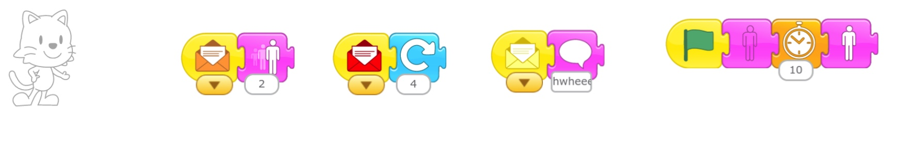
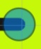

 
Proceed to [Archives](./a_mon0500pm-Archives.html) 》 
{: style="float: right;"}
 

* [July 7th](#july-7th)
  * [Review Project: "Pass It On"](#review-project-pass-it-on)
  * [Switching costumes](#switching-costumes)
  * [The Aliens Have Landed Part 1: *The Space Ship Problem*](#the-aliens-have-landed-part-1-the-space-ship-problem)
    * [Space Ship Problem: Diagonal movement](#space-ship-problem-diagonal-movement)
    * [Space Ship Problem: Shrinking Cat](#space-ship-problem-shrinking-cat)
  * [Hangman](#hangman)
  * [June 29th Homework](#june-29th-homework)
* [June 29th](#june-29th)
  * [Review Project: "A Day At the Beach"](#review-project-a-day-at-the-beach)
  * [Pass It On from BootUp](#pass-it-on-from-bootup)
  * [Hangman](#hangman-1)
  * [June 29th Homework](#june-29th-homework-1)
* [June 22nd](#june-22nd)
  * [Review Collaborative Project: "Teamwork 5000"](#review-collaborative-project-teamwork-5000)
  * [Debugging Exercises for "A Day at the Beach"](#debugging-exercises-for-a-day-at-the-beach)
    * [Answers for Debugging "A Day at the Beach"](#answers-for-debugging-a-day-at-the-beach)
  * [Storyboarding](#storyboarding)
  * [June 22nd Homework](#june-22nd-homework)
* [June 15th](#june-15th)
  * [Review Projects](#review-projects)
  * [Collaborative Project: "Teamwork 5000"](#collaborative-project-teamwork-5000)
  * [July 15th Homework: Finish the Project](#july-15th-homework-finish-the-project)
  * [Upcoming Project Preview: Good Wizard Bad Wizard](#upcoming-project-preview-good-wizard-bad-wizard)
* [June 8th](#june-8th)
  * [June 8th Homework Review](#june-8th-homework-review)
  * [Individual stories](#individual-stories)
  * [June 8th Homework](#june-8th-homework)
* [June 1st](#june-1st)
  * [Message Mania Part 1](#message-mania-part-1)
  * [May 25th Homework Review](#may-25th-homework-review)
  * [3 Little Pigs in ScratchJr](#3-little-pigs-in-scratchjr)
  * [June 1st homework](#june-1st-homework)
* [May 25th](#may-25th)
  * [Homework Review](#homework-review)
  * [Message Mania Part 1](#message-mania-part-1-1)
    * [[UPDATE to Message Mania Part 1]](#update-to-message-mania-part-1)
  * [May 25th Homework](#may-25th-homework)
  * [Also Coming Up on June 1st](#also-coming-up-on-june-1st)
* [May 18th](#may-18th)
  * [May 11th: Homework Review](#may-11th-homework-review)
  * [May 18th: Follow the Maze Project](#may-18th-follow-the-maze-project)
  * [Drawing Square Mazes](#drawing-square-mazes)
  * [Next Major Project Preview: 3 Little Pigs](#next-major-project-preview-3-little-pigs)
  * [May 18th Homework](#may-18th-homework)
    * [Finish up projects from May 11th](#finish-up-projects-from-may-11th)
    * [Intro to Message Mania](#intro-to-message-mania)
      * [Warm-up: Planning for **Message Mania for 3**](#warm-up-planning-for-message-mania-for-3)
      * [Advanced: **Message Mania for 6**](#advanced-message-mania-for-6)
    * [Bonus Puzzle](#bonus-puzzle)

* Click on the [> Date]() or BLUE borders to toggle the <b>  &nbsp;▶︎&nbsp;&nbsp;Details&nbsp;&nbsp;&nbsp;&nbsp;</b>

## July 7th 

## July 7th 

### Review Project: "Pass It On"

We reviewed homework projects. Students were very kind in giving out "Stars and Wishes", that is talking about what they liked and would improve in each project.

### Switching costumes

Once common challenge in ScratchJr. is making a character suddenly change. We watched a video about [several ways to do that](https://www.youtube.com/watch?v=7jv5r9aafZA&feature=youtu.be). 

<iframe width="100%" height="315" src="https://www.youtube.com/embed/7jv5r9aafZA" frameborder="0" allow="accelerometer; autoplay; encrypted-media; gyroscope; picture-in-picture" allowfullscreen></iframe>

We then walked through a project showing two ways to make a character change costumes using [this project](./scratchProjects/20200706HidingDisappearing.sjr)

1. Using a new screen

If you place the character at the same place in both screens (at the end of one, and the beginning of the other) they will appear toe magically change.

2. Using a message

If you send a message that goes to both characters, you can make one disappear, and the other appear at the same time. 

If you add a 3 "smoke screen" that appears and disappears as the characters change, it can seem like magic.

### The Aliens Have Landed Part 1: *The Space Ship Problem*

We then watched a video describing out next project, "The Aliens Have Landed" from Bootup.

<iframe width="100%" height="315" src="https://www.youtube.com/embed/aCoA8V1nx9Q" frameborder="0" allow="accelerometer; autoplay; encrypted-media; gyroscope; picture-in-picture" allowfullscreen></iframe>

#### Space Ship Problem: Diagonal movement

In the beginning of the video the space ship  moves diagonally up and across the screen. I challenged the group to show me how to do it. Kids came up with some interesting suggestions, and eventually we got to (see Homework). The secret is having both actions take place at the same time in separate "threads".

#### Space Ship Problem: Shrinking Cat

However, in the video, the space ship also gets smaller. How do we do this? One suggestion was made , but the **Red Shrinking Cat** (see screen 2 of Homework) doesn't quite work. This is the homework challenge.

### Hangman

After cleanup we had enough time for a fun game of Hangman. 

### June 29th Homework

* **Solve the Space Ship Problem** (in screens 3 and 4). [Here is a guide for you to download](./scratchProjects/20200706SpaceShipProblemHW.sjr). It has 4 screens:
   1. **Diagonal Movement** from class, and a simpler one without loops.
   2. **The Red Shrinking Cat** that didn't work. (has loops)
   3. Fix this **Red Cat** to make it not bump. Click the box for a hint.
   4. An example of how to change direction. Can you make the pig do it too?

* **Extra Credit**: Do you see how I made the hint appear and disappear? Can you copy that somewhere?
* **Extra Credit**: Watch the Aliens have landed video (above) and try to make it (without having the source code). What would you give (of yours!) to an alien?

## June 29th 

## June 29th

### Review Project: "A Day At the Beach"

We reviewed the A Day At the Beach projects that students completed. It was interesting how each child had their own ideas about a day at the beach. We also reviewed:

* Editing a character with a neck that was too long. We studied how to tap and drag to move sections on a image to a new location.

### Pass It On from BootUp

We watched the Pass it On from Bootup video. This video presents four situations which students are asked to continue. 

<iframe width="100%" height="315" src="https://www.youtube.com/embed/YdNbPbozgnY" frameborder="0" allow="accelerometer; autoplay; encrypted-media; gyroscope; picture-in-picture" allowfullscreen></iframe>

Each child chose one project and based on that choice:

* Reverse Engineered the first part based on the video. They were allowed to make whatever changes they wanted.
* Continue the story.

We were unable to download the file from the original site. You may be able to download it from our site: [Pass It On](./scratchProjects/Y1R49Passiton.sjr)

* Making two characters (a pirate and their boat) move together at the same time by using the same message sent to both.

### Hangman

As students worked on the project I demonstrated techniques to solve problems that came up, including a lot of spelling questions. This lead to a rousing game of Hangman. 

### June 29th Homework

Continue working on Pass It On, and send it to my by email. 

## June 22nd

## June 22nd

### Review Collaborative Project: "Teamwork 5000"

First we reviewed student homeworks. 

### Debugging Exercises for "A Day at the Beach"

We did a debugging project. I showed students the [A Day at the Beach Project](./scratchProjects/Y1R47AdayatthebeachMod.sjr) from BootUp ans students had to answer the following questions:

1. Why does the car leave without Scratch Cat?

2. Why do we have two Scratch Cats when the surfboard is left on the beach?

Have students reverse engineer it. Click below for answers.

#### Answers for Debugging "A Day at the Beach"

#### Answers for Debugging "A Day at the Beach"

1. We need to make Scratch Cat hide before the car drives away

2. We need to hide the Surfing cat sprite as soon as the “send red message” block is used, not after

### Storyboarding

Students then Storyboarded their own day at the beach story. Each student and I reviewed each student's project together to make sure it was complete, and they began to code it.

### June 22nd Homework

The homework is to finish the project and email it to me.

Also, optionally, students can download  [A Day at the Beach Project](./scratchProjects/Y1R47AdayatthebeachMod.sjr)  project and try to debug these two other problems we didn't look at:

1. Why don’t we switch to the third backdrop when Scratch Cat decides to surf?

2. Why doesn’t the crab talk while moving on the screen?

## June 15th

## June 15th

### Review Projects

We reviewed the 3 little pigs projects that were submitted as homeworks. Kids seem to enjoy sharing their work very much, and we also attempted to solve minor problems in class. 

### Collaborative Project: "Teamwork 5000"

Today's main project was to work on a project as a class as a story game. The rules were:

* Each person adds one idea. Each person gives one "step".

Possible "steps" are (rules in parentheses were not actually used):

-   Add character
-   Trigger block + up to 3 actions, for example:
    -   green flag + move right and down and repeat 3 times
    -   touch trigger + disappears
    -   etc.
-   send message and receive message plus 2 actions
-   character says something
-   background and character images:
    -   We make the image together.
    -   Take turns adding strokes or figures.
-   Once step is added it cannot be changed without the original creator's agreement

- You may add to them.
- You may make them do unexpected things...that's okay.
- You may only work with the same character 2 times in a row.

### July 15th Homework: Finish the Project

Everyone had made several contributions. We named the project "Teamwork 5000". The homework is to:

 * [Upload this project](./scratchProjects/Teamwork5000.sjr), and continue it on your own. 
 * You may not take away from the project but you can add to it. 
 * You may only add up to 2 more characters. 
 * You may add a background. 
 * You should try to add new screens and use the same characters again.

### Upcoming Project Preview: Good Wizard Bad Wizard

At the end of class we also previewed the next project after this, "Good Wizard, Bad Wizard".

## June 8th

## June 8th

### June 8th Homework Review

Today we reviewed the 3 Little Pigs Project that students submitted. They were all very creative in their work. We had the chance to do some practice debugging as a group when one of the projects didn't work as expected. It was a great thinking exercise and I think the kids enjoyed it.

### Individual stories

I then gave the students the in class assignment, which was to tell a new story. This time it could be any story they wanted. First students worked with pen and paper outlining the story, then started in on ScratchJr. Some of them based it on stories they knew, some made entirely original stories. As students were working I went around the room and helped them with problems or questions they had.

### June 8th Homework

This week's homework is to finish their Individual Story Project and email it to me. 

## June 1st

## June 1st

### Message Mania Part 1

We watched the video about [Message Mania Part 1](#update-to-message-mania-part-1){: .innerlink}

### May 25th Homework Review

We reviewed the homework assignments the kids submitted. They were great and kids enjoy talking about their projects with the class. Kids worked together to fix some problems.

### 3 Little Pigs in ScratchJr

Some kids told their own version of the 3 Little Pigs. The assignment was to plan, on paper, without using ScratchJr, how they would tell the story. This included:

+ Designing the characters and houses
+ Plotting out the actions
+ Writing dialogue

The purpose was to think about the project before actually starting to code it. I reviewed their plans, and when they were ready they started coding. Here is my example of what my plan and first screen look like. See [here](../lessons/3LittlePigsInScratchJr.html) for more information.

### June 1st homework

The homework is:

1. Complete and submit their final project to me.

2. (**DO NOT USE SCRATCHJR. PLANNING ONLY.**) Think about other stories you might want to tell in scratch. Be ready to tell the story in class! 

## May 25th

## May 25th

### Homework Review

We reviewed homework. Great work telling me what your stories were about! 

Everyone was using English well. Gambatte! Ooops, I mean Try Hard! ;-)

### Message Mania Part 1

We ran through the Message Mania HW assignment.  The purpose of the HW was to:

* Plan/think about the story before you code it. That is why the assignment was NOT to do it in ScratchJr.

My explanation was poor. I blame Zoom ;-) 

Many children did this: 

* One character has: Green flag, orange message, red message, yellow message.

{: height="100px"}

What I wanted was:

* Each character has a green flag. No message. Messages will be sent by Buttons.
* Each character receives 3 messages
* Each reactions is a different type

{: height="100px"}

The purpose of the project was:

* to show that messages can go to more than one character at a time. 
* to continue getting practice coding messages and buttons.
* Clicking a button can make several characters move at once.
* Help some students use Messages instead of Wait buttons to control sequence and timing. 

#### [UPDATE to Message Mania Part 1]
I could see that some kids were struggling with this so I called in the Big Dogs. Here is a video showing what to do. If you have any questions, let me know. 

<iframe width="560" height="315" src="https://www.youtube-nocookie.com/embed/WA4_xoRt1r8" frameborder="0" allow="accelerometer; autoplay; encrypted-media; gyroscope; picture-in-picture" allowfullscreen></iframe>

[A direct link](https://youtu.be/WA4_xoRt1r) to the video.

### May 25th Homework

* Work on HW I gave you in class (if I did). 
* Continue adding to Message Mania.
* Send me your Message Mania project. 
* Download and install MY SAMPLE Message Mania. Try to understand it and we will work on it next week.

If you don't know what to do, just PLAY with ScratchJr. There is no correct answer! It's all good! 

Ideas: 

* Turn Message mania into a story. What happens next? What is the situation? What is the goal?
* Think about characters/actions you want first. Then code it.
* Send messages to more than one character at a time. Why would you do this?
* Use different color messages to control sequence of events. One character orange. Then red, etc.

### Also Coming Up on June 1st

Do you know the story of the 3 little pigs? If not, try to read it.

## May 18th

## May 18th

### May 11th: Homework Review

I reviewed the homework submissions, and further comments will be sent via email. We are still working on a better system for this, so bear with us.

### May 18th: Follow the Maze Project
In this class, we continued working on the [Follow the Maze Project](./scratchProjects/3ButtonRaceFollowTheMazeHW.sjr), described on May 11th in  [homework below](#preview-for-may-18th-follow-the-maze-project){: .innerlink}. I didn't discuss the *surprise* at the end. That is a bonus question for this week.

Kids projects were full of interesting variations. Please email me your finished projects so I can look them over.

### Drawing Square Mazes

I really liked the questions kids had today. One question what how to create a nice maze, and we reviewed useful tips on how to draw straight lines, including keeping dots in the center, so that the characters have the most space to walk in: 

   * YES: {: width="100px"}
   *  No: {: width="100px"}

I also explained how to make maze using "squares with holes", the 3rd kind of maze we have made so far: 

<!-- These have to be links  -->

[{: height="200px"}]({{ page.giurl-09 }}){: target="_blank"}
{: #slide-09 style="margin-top:0px;"}

[{: height="200px"}]({{ page.giurl-10 }}){: target="\_blank"}
{: #slide-10 style="margin-top:0px;"}

[{: height="200px"}]({{ page.giurl-11 }}){: target="\_blank"}
{: #slide-11 style="margin-top:0px;"}

<!-- necessary space-->
[{{ page.gilabel-09 }}](#slide-09) | [{{ page.gilabel-10 }}](#slide-10) | [{{ page.gilabel-11 }}](#slide-11) 

Another great question was about how to make the arrows, which is shown below in the [homework for May 11th, below](#preview-for-may-18th-follow-the-maze-project){: .innerlink}, as well.

Lastly, we also talked about how to modify characters, to make buttons have the characters in them as in:

{: width="50%" } 
 

 <!-- move to lessons -->
### Next Major Project Preview: 3 Little Pigs

Most kids seem to be understanding how to use messages. We now have a basic understanding of almost all the buttons, and are ready to try more creative and advanced projects. Our next big project we will focus more on the creative side, telling stories, creating effects that help us tell the story. Our sample project will begin like this. Can you figure it out?

{: width="50%" }

### May 18th Homework

This week's homework has 3 parts, but **you don't have to do them all**. 

#### Finish up projects from May 11th
* Keep working on your projects and be prepared to tell me about your project using a small description. It doesn't have to be written. The focus in on the relationship between words/stories and the code. We will do more of this next week.

<!-- move to lessons -->
#### Intro to Message Mania 

##### Warm-up: Planning for **Message Mania for 3**

Do not use ScratchJr for this. Just plan it out. Write down or draw what will happen. Don't use ScratchJr.

* Design 3 characters. 
  * draw them or describe them in words
* Give each character has a "receive message" block for 3 colors. For example, for character 1 (you don't have to use my example actions!!) I am writing/drawing:
  * red: say my name and introduce myself.   * 
  * orange: move to the edge of the screen and get stuck.
  * yellow: ask a question. What will the question be??
* NO action can be repeated. 

We will do it in class next week as a warmup. Did I mention not to use ScratchJr for this?

##### Advanced: **Message Mania for 6**

If you are motivated, you can go to the advanced version: **Message Mania for 6**. It is the same as above but with 6 characters and colors.

#### Bonus Puzzle 
At the end of the Follow the Maze Project, the cake appears when Cat enters the last square. I used a special trick to do that. It uses Controls in a special way. Can you figure it out? Click below  for a hint:

Click for Hint

<!-- does not show -->
<title> Click for hint</title>

What is the light blue notch (line) at the edge of the entrance?

This is what the model project looked like:

 

<!-- 

 -->