* [Imagine just one dragon and one cake](#imagine-just-one-dragon-and-one-cake)
* [But, you have two dragons. You need to decide](#but-you-have-two-dragons-you-need-to-decide)
* [For example](#for-example)
* [How to Do It](#how-to-do-it)
  * [Setup](#setup)
  * [If Green Dragon Is Touched. One Character Sends Two Messages](#if-green-dragon-is-touched-one-character-sends-two-messages)
    * [The KEY to how it works](#the-key-to-how-it-works)
      * [Advanced notes:](#advanced-notes)
  * [Cake Is Touched. One Message to Two Characters](#cake-is-touched-one-message-to-two-characters)
  * [Blue Dragon Is Touched. Reusing Orange Message](#blue-dragon-is-touched-reusing-orange-message)
* [Last Step is Make **Tic** Walk the Path](#last-step-is-make-tic-walk-the-path)

## Imagine just one dragon and one cake
* If something hits the dragon, send a message to Tic to return home
* If something hits the cake, send a message to Dragon to disappear. Make yourself (cake) disappear.

## But, you have two dragons. You need to decide
1. If something hits the **Green Dragon** (on path), what happens?
2. If something hits the **Cake**, what happen?
3. If something hits the **Blue Dragon** (at exit), what happens?
4. Where do characters start?

## For example

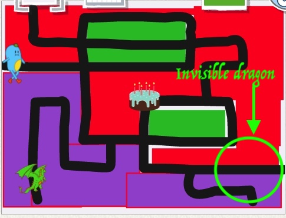

1. Green Dragon
   * If something hits the **Green Dragon**, send a message to **Tic** to go home, you disappear, but another dragon appears.
1. Cake
   * If something hits the cake, all dragons disappear.
1. Blue Dragon
   * If something hits the **Blue Dragon** (when he is visible), send a message to **Tic** to go home

1. Starting Setup
   * Start with **Blue Dragon** invisible
   * Start with everyone the right size and correct position
   * Don't worry about the path/background yet

## How to Do It

### Setup

* Forget about background for now
  
1. Start with everyone at the right position
2. Make everyone the right size
3. Start with **Blue Dragon** invisible

* Here is how to do it for the **Blue dragon** (he is red in this picture...)

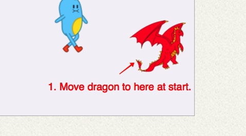
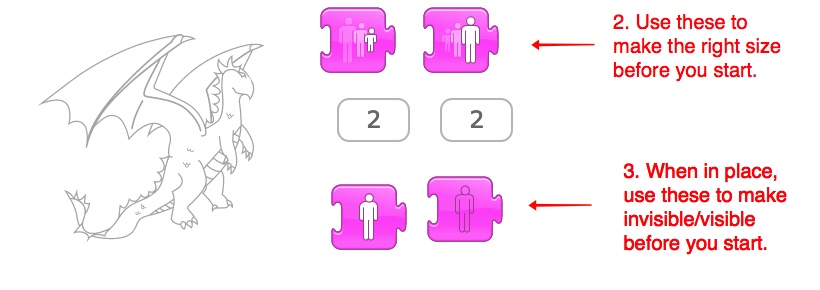

* Do the same with the other characters
* You will end up with this (without background):

### If Green Dragon Is Touched. One Character Sends Two Messages
This requires 2 messages:
* If something hits the **Green Dragon**, send a ORANGE message to **Tic** to go home, and then he disappears
* if something hits the **Green Dragon**, send RED message to other dragon to appear

    * **Green Dragon** sends 2 messages
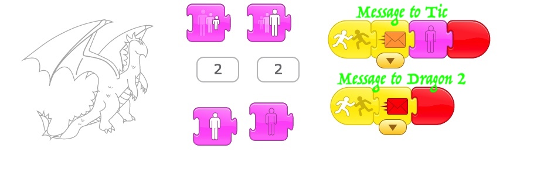
    * **Tic** gets ORANGE message to go home
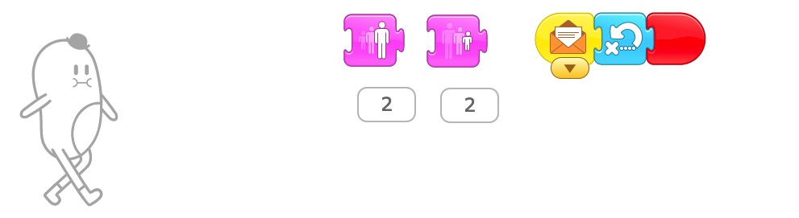
    * **Blue Dragon** gets RED message to become visible
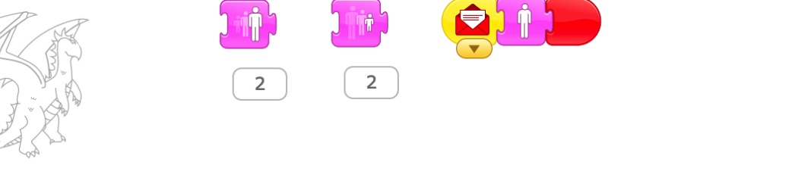

#### The KEY to how it works
* Each message has 2 parts, sending and receiving. 
* One character sends. The other receives, and acts.

##### Advanced notes:
* One character can send more than one message, for example to different characters, or the same character. 
* The same message can go to more than one character, too. That is, more than one character can receive the message when it is sent. (see **Cake** below)
* Sometimes you even send messages to yourself!

### Cake Is Touched. One Message to Two Characters
* If something hits the **Cake**, all dragons disappear.
    * Sends one YELLOW message
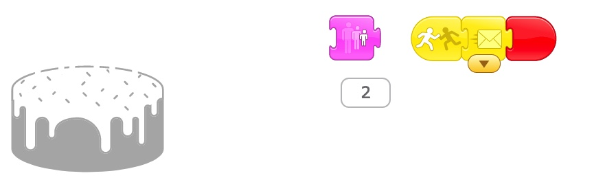
    * Two Dragons get the same YELLOW message
      * **Green Dragon** gets the YELLOW message to disappear
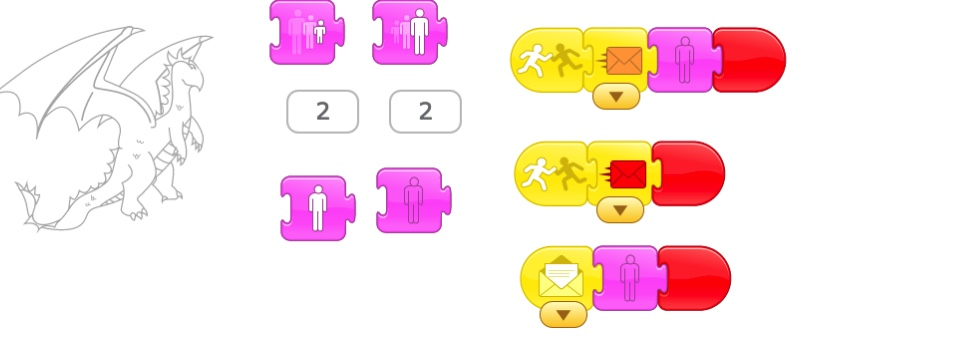
      * **Blue Dragon** gets YELLOW message to disappear
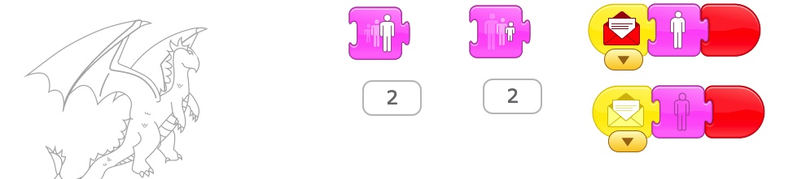

### Blue Dragon Is Touched. Reusing Orange Message
* If something hits the **Blue Dragon**, he sends a message to **Tic** to go home. 
* I could send a NEW message color, but I can also just USE THE SAME ORANGE MESSAGE that the **Green Dragon** sent to **Tic**. It will do the same thing to the **Tic**. 
* In other words, it doesn't matter WHO sends the ORANGE message to **Tic**, if he gets ANY orange message, he goes home!!!!
    * SO: **Blue Dragon** ALSO sends ORANGE message if he is touched!!!! (Note that HE DOES NOT DISAPPEAR like the other dragon did! He stays there until the cake tells him to disappear (see the YELLOW message)!)
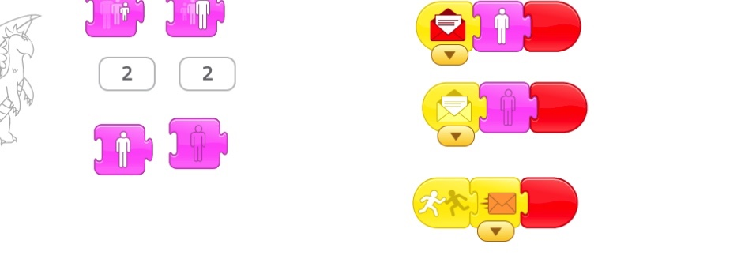

## Last Step is Make **Tic** Walk the Path

First, add the background with the paths. 

Now, where does **Tic** go first? 

What if you add three new characters, a red, blue, and yellow **Apple**:
* **Green Apple**: If you tap character, he sends GREEN message to Tic, and Tic walks to **GREEN dragon**.
* **Blue Apple**: If you tap character, he sends PURPLE message to Tic, and Tic walks to **BLUE dragon**.
* **Light Blue Apple**: If you tap character, he sends BLUE message to Tic, and Tic walks to **Light Blue Cake**, and then continues on to the exit. Hooray!

Can you program this?? Here is a clue: 

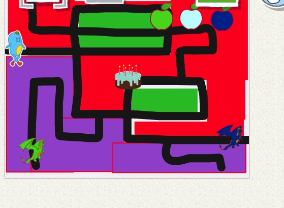
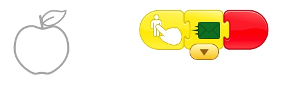
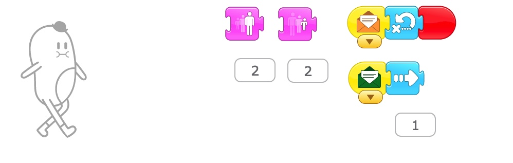