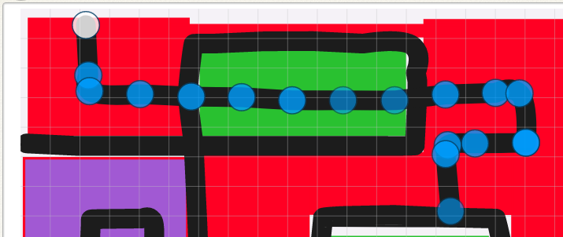
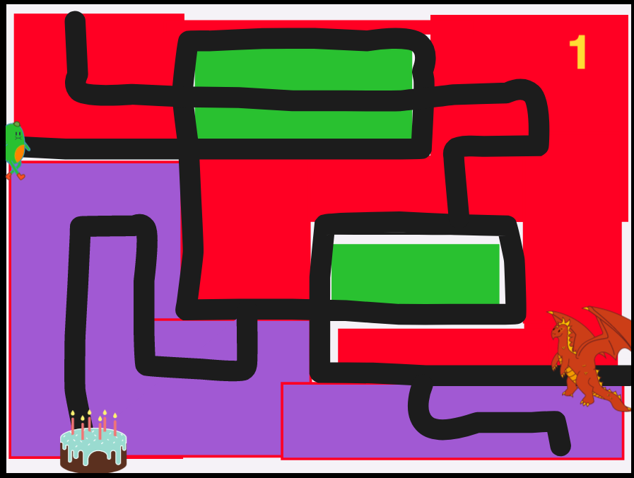
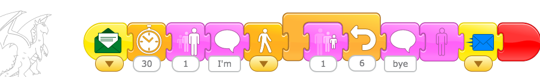

## Dragon Maze Part 1

### Making the Maze in the Background

_Skill: Modifying a path in the background_

1. First click the select arrow and then click a line. 
2. The line will appear with dots. 
3. Click on a dot to remove it. 
4. Remove all the dots except 2 to make a perfectly straight line. 
5. Drag the dots to modify the path of the line. 
6. Using a series of lines, make a maze in the background.

{:height="200px"}

### Walking The Path

Use the blue movement blocks to make the character walk the path. Count your steps.

### Add a Dragon and a Cake.

Add a dragon and a cake. If the character goes to the Dragon first, the dragon sends them home.

{:height="200px"}

They made their character walk the maze and try to eat the dragon.

[{:height="59px"}](./images/2020-04-13/ticWalksToDragon.png)

### Tic Is Trapped!

_Skill: Sending Messages_

But the dragon sends a message:

{:height="59px"}

and Tic is sent home:

{:height="59px"}

## Disappearing Dragons

_Skill: Making Characters Disappear_

Tic goes to get the cake first. The cake makes the dragon disappear.

-   Cake sends a message.

{:height="59px"}

-   Dragon gets the message.

{:height="59px