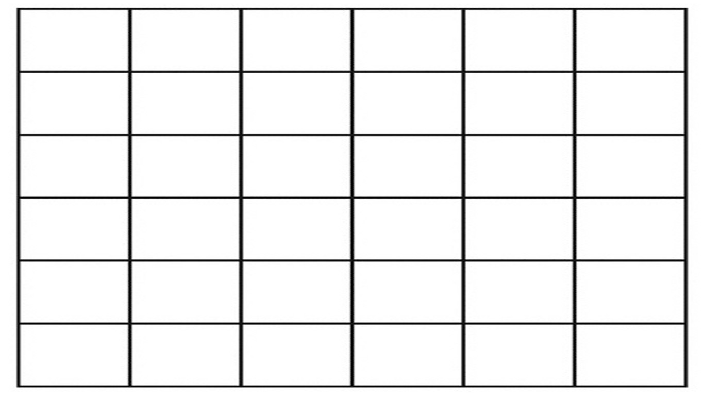
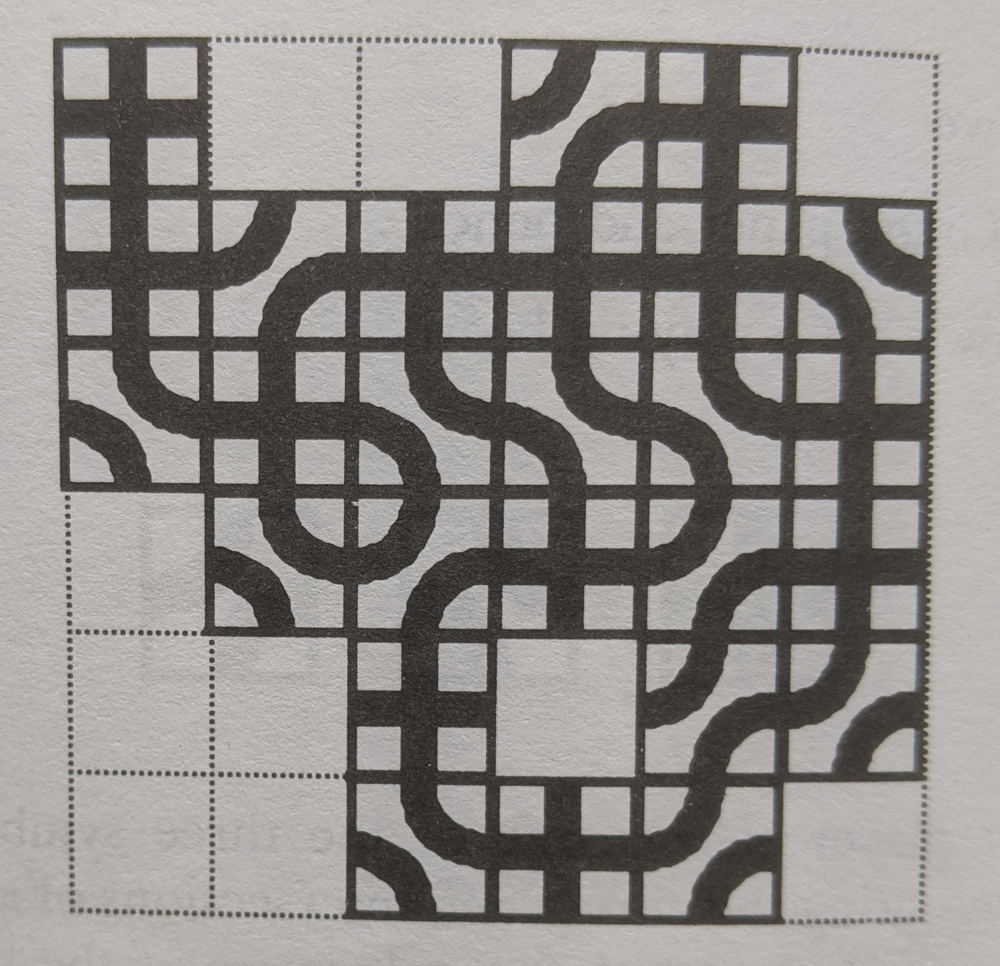

* [**Prep for Black**](#prep-for-black)
* [**Black**](#black)

## **Prep for Black**

I want to play a group game called black. To play it, we need to practice drawing 3 shapes, a cross, and two "cutout" shapes.

First here is the grid:

.

Let's practice. Everyone choose a different color. draw, anywhere you want. 

First I will draw the board.

## **Black**

Clear the board. Play the game taking turns.
Here is what a finished board might look like:

.

* You can choose one of the three shapes
* You must not continue the main road into the wall

