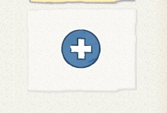

《 Return to [Page 1](./a_mon0500pm.html)

* [April 20th](#april-20th)
  * [Sending Messages by Making a Conversation](#sending-messages-by-making-a-conversation)
  * [Continue the conversation](#continue-the-conversation)
  * [The KEYS to Messages](#the-keys-to-messages)
    * [Advanced Keys](#advanced-keys)
  * [April 20 Homework](#april-20-homework)
  * [Going to a different Screen](#going-to-a-different-screen)
  * [The Dragon Maze almost solved](#the-dragon-maze-almost-solved)
  * [Zoom problems](#zoom-problems)
    * [Following the Conversation](#following-the-conversation)
    * [Sharing Screens](#sharing-screens)
  * [Next Class: Review](#next-class-review)
  * [Feedback](#feedback)
* [April 13th](#april-13th)
  * [Using Zoom](#using-zoom)
  * [Game: Black](#game-black)
  * [ScratchJr: Messages](#scratchjr-messages)
    * [Making the maze](#making-the-maze)
    * [Tic Is Trapped!](#tic-is-trapped)
  * [Disappearing Dragons](#disappearing-dragons)
  * [April 13 Homework](#april-13-homework)
* [April 6th](#april-6th)
  * [Postponing the Homework](#postponing-the-homework)
  * [Discord to Zoom](#discord-to-zoom)
  * [Dragon Maze Demo](#dragon-maze-demo)
* [March 30th](#march-30th)
  * [Thank you. Discord.](#thank-you-discord)
* [March 23rd](#march-23rd)
  * [First Class](#first-class)

* Click on the [> Date]() or BLUE borders to toggle the <b>  &nbsp;▶︎&nbsp;&nbsp;Details&nbsp;&nbsp;&nbsp;&nbsp;</b>
  

## April 20th

## April 20th

### Sending Messages by Making a Conversation

The main topic today was how to send a message and receive a message to start a conversation.

-   First, Fairy says something and **then** sends (ORANGE) message

-   The Frog receives it and responds

### Continue the conversation

We also talked about how to make a longer conversation:

1. Fairy Starts (speaks and sends ORANGE message. You need to connect it!)
   
1. Froggie replies
   
1. Then Sends a New RED Message (remember to connect it!)
   
1. Fairy receives the red message. Says something. Then she continues by sending a YELLOW message back to Froggie (connect it).
   

### The KEYS to Messages

-   Each message has 2 parts, sending and receiving.
-   One character sends. The other receives, and acts.
-   They can send a new message back....

#### Advanced Keys

-   One character can send more than one message, for example to different characters, or the same character.
-   The same message can go to more than one character, too. That is, more than one character can receive the message when it is sent.
-   Sometimes you even send messages to yourself!

See [Dragon Maze Part 2](../lessons/DragonMazePart2.html) for examples.

### April 20 Homework

The homework was to make a longer conversation by sending several messages back and forth between characters as above. If you need something for the characters to say, [here are some jokes](../lessons/JokesForBadJokes.html) to use.

### Going to a different Screen

We also talked about adding new Screens/Pages to a Project:

1. Create a new Screen
   
2. Go back to 1st Screen
3. The screen appears in the (red) buttons
   
4. Add it to the actions
   

### The Dragon Maze almost solved

Some students worked very hard on the Dragon Maze, but they had a problem. I have made special [Dragon Maze Part 2](../lessons/DragonMazePart2.html) directions on making the Dragon maze work. It uses sending messages. The directions are very detailed, so take it slow. If you have questions, we will go over it in class next week.

### Zoom problems

We had some difficulty because Zoom cut off the meeting at a certain point. Zoom told us this would not happen, so we didn't expect it. Sorry about that. It will be fixed next week.

If it DOES happens again sometime, please just wait a few seconds and use the Zoom link again. I will start the call again and wait for people to join again, like we did this time. As above, this should not be a problem next week.

#### Following the Conversation

Remember that other people can hear what you are saying at home. If you need to have a side conversation, feel free to mute your microphone temporarily.

Sometimes I am focused on one or other students. You may want to listen, as it may answer questions you have too. Or you can wait by working on your own project while I take care of them. Try to think about what your next question will be. If you don't know what to do, speak up or send me a chat message.

Sometimes I will need to mute you to make it easier for everyone to hear the conversation. You may get a message in Zoom asking for permission, that you will need to respond to.

#### Sharing Screens

Everyone seems to be able to share screens finally. I know it is a little tricky, but it is part of doing class remotely. Sharing the screen is important for me so I can see your progress and offer help, so thank you for cooperating and bearing with it! Talking via Zoom is more difficult than regular conversation, but if we try we can find ways to make it easier and better.

### Next Class: Review

The next class will be mostly a review and testing class. I expect a lot of back and forth, so be ready to talk! I also hope to do some activities as a group. Can you use all of the skills we have used so far?

-   [ ] Choosing and changing the background
-   [ ] adding and changing lines and shapes
-   [ ] adding and making characters bigger or smaller
-   [ ] making characters visible or invisible
-   [ ] making characters move in different ways
-   [ ] making characters act at the start, or when they are touched
-   [ ] making characters speak and make sounds
-   [ ] sending and receiving messages
-   [ ] moving to different screens/pages

You have learned a lot I hope!!! You can use this class to catch up on things you have missed, and if you feel advanced, you can get more practice, and I will also ask you to help other students, so be ready to explain what you know!

### Feedback

I always welcome feedback, about anything in the class. I look forward to seeing everyone in person as soon as it is safe to do so!! :-)

## April 13th

## April 13th

### Using Zoom

See [Topic: Using Zoom](../lessons/usingZoom.html)

### Game: Black

See [Topic: Game: Black](../lessons/gameBlack.html)

### ScratchJr: Messages

#### Making the maze

_Skill: Modifying a path in the background_

We went over how to use the select arrow to modify the path of a line in the background.

{:height="200px"}

Children made a maze, where the character walks on the line, as in Black. Then they added a dragon and a cake.

{:height="200px"}

They made their character walk the maze and try to eat the [dragon](hjh).

[{:height="59px"}](./images/2020-04-13/Screen%20Shot%202020-04-14%20at%2011.44.42%20AM.png)

#### Tic Is Trapped!

_Skill: Sending Messages_

But the dragon sends a message:

{:height="59px"}

and Tic is sent home:

{:height="59px"}

### Disappearing Dragons

_Skill: Making Characters Disappear_

Tic goes to get the cake first. The cake makes the dragon disappear.

-   Cake sends a message.

{:height="59px"}

-   Dragon gets the message.

{:height="59px"}

### April 13 Homework

The homework is to play with Zoom and the Maze. Practice:

-   _Skill: Modifying a path in the background_
-   _Skill: Sending Messages_
-   _Skill: Making Characters Disappear_

We will use these in our next lesson: Bad Jokes!

## April 6th

## April 6th

Class Outline & homework: [Topic; Prep for Disappearing Dragon](../lessons/jc_a_003.html)

### Postponing the Homework

Because this class was partially a remote class, I wasn't able to fully cover the material needed for the homework, so I suggest students **postpone** the homework I assigned this time. Instead, Parents should install [Zoom](https://zoom.us/) on their device and if possible spend some time familiarizing themselves and their child with how to use it. This should include creating an account email and password. This way we can be ready for a remote class as early as next week.

### Discord to Zoom

Because of concerns about the Corona Virus this class was a combination of student's participating in person and via a Discord session. Though it was the first time doing a remote class, and as a result of patience and cooperation of students and families, I think we were able to have a successful class. However, we did notice some areas where it could be improved, and have discovered that [Zoom](https://zoom.us/) will be able to provide us and students with a better experience. Next class we will start using Zoom.

### Dragon Maze Demo
ScratchJr
First, I demonstrated a ScratchJr project demonstrating a character eating a cake in order to make a dragon disappear and being able to exit a maze. The purpose was to show how to use Action Blocks for making characters visible or invisible, sending messages, or initiating actions on Bumps. The rest of the class was a detailed and progressive practice in using each of these blocks by creating 4 characters who used these actions [in various ways](./../lessons/jc_a_003.md). While somewhat silly and arbitrary, the exercise was intended to help the children get ample practice using the blocks, as well as beginning to understand programing logic and sequencing. For reference I have put the details .

With these blocks described [here](./../lessons/jc_a_003.html) we have all we need to create the Disappearing Dragon Maze, which we will begin next week.

## March 30th

## March 30th

Class Outline & homework: [Topic: Simple two-line maze](../lessons/jc_a_002.html)

### Thank you. Discord.

Thank you everyone for providing a snack. This week we installed Discord on all the computers, but parents will need to provide an email and password. Please write these down, as it is easy to forget.

## March 23rd

## March 23rd

Class Outline & homework: [Introduction to the computer and ScratchJr](../lessons/jc_a_001.html)

### First Class

This class went very well. The kids were active and eager to participate. Don't forget to provide a snack for your child!!

<!-- 

 -->