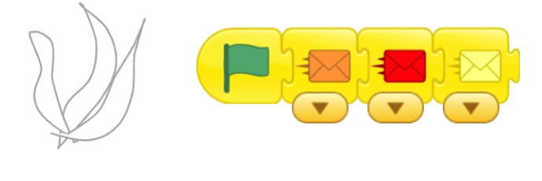
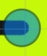
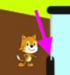
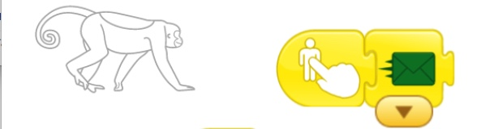
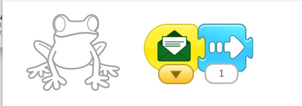
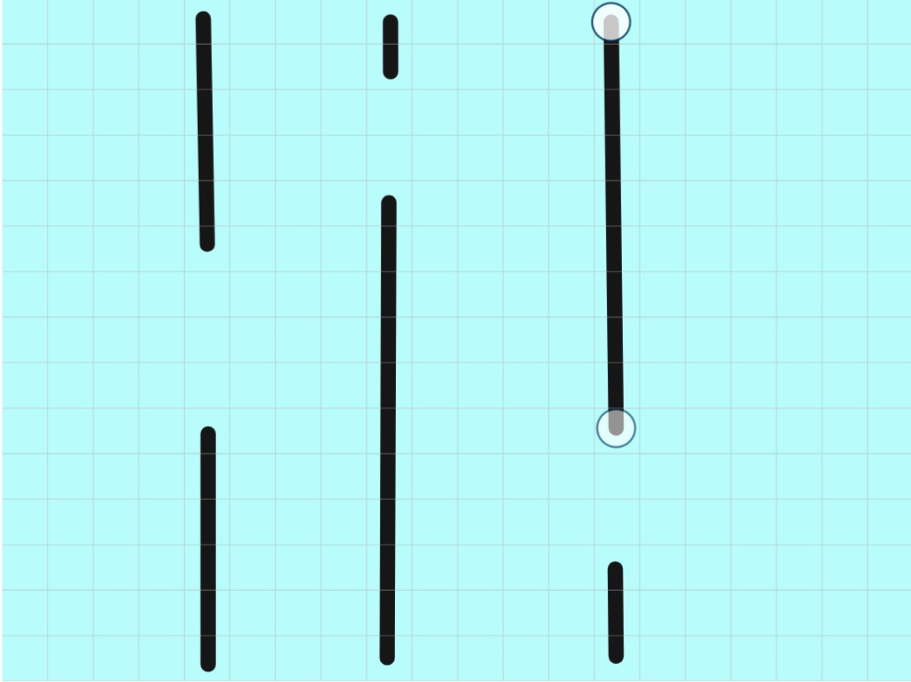
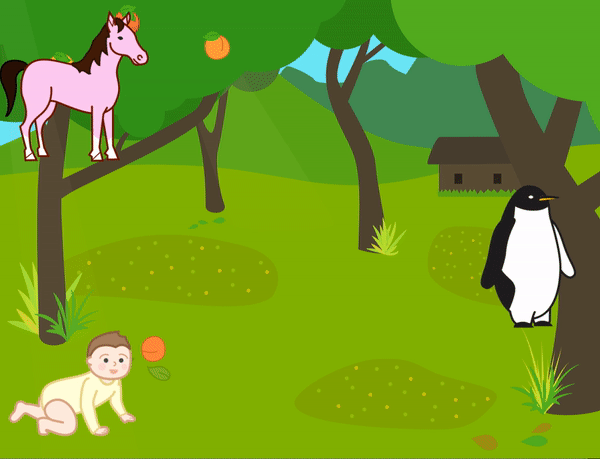

 
 
Proceed to [Archives](./a_mon0500pm-Archives.html) 》 
{: style="float: right;"}
 

* [May 25th](#may-25th)
  * [Homework Review](#homework-review)
  * [Message Mania Part 1](#message-mania-part-1)
    * [[UPDATE]](#update)
  * [May 25th Homework](#may-25th-homework)
  * [Also Coming Up on June 1st](#also-coming-up-on-june-1st)
* [May 18th](#may-18th)
  * [May 11th: Homework Review](#may-11th-homework-review)
  * [May 18th: Follow the Maze Project](#may-18th-follow-the-maze-project)
  * [Drawing Square Mazes](#drawing-square-mazes)
  * [Next Major Project Preview: 3 Little Pigs](#next-major-project-preview-3-little-pigs)
  * [May 18th Homework](#may-18th-homework)
    * [Finish up projects from May 11th](#finish-up-projects-from-may-11th)
    * [Intro to Message Mania](#intro-to-message-mania)
      * [Warm-up: Planning for **Message Mania for 3**](#warm-up-planning-for-message-mania-for-3)
      * [Advanced: **Message Mania for 6**](#advanced-message-mania-for-6)
    * [Bonus Puzzle](#bonus-puzzle)
* [May 11th](#may-11th)
  * [May 4th Homework Review](#may-4th-homework-review)
  * [Main Idea: Control Buttons](#main-idea-control-buttons)
  * [Using Controls: Race to the Finish](#using-controls-race-to-the-finish)
    * [Part One of The Race to the Finish.](#part-one-of-the-race-to-the-finish)
    * [Part Two of The Race to the Finish: The Game](#part-two-of-the-race-to-the-finish-the-game)
  * [Preview for May 18th: Follow the Maze Project](#preview-for-may-18th-follow-the-maze-project)
  * [May 11th Homework: Finish the Follow the Maze](#may-11th-homework-finish-the-follow-the-maze)
  * [May 11th Zoom Issues](#may-11th-zoom-issues)
* [May 4th](#may-4th)
  * [Animate My name](#animate-my-name)
  * [Student Homework Notes](#student-homework-notes)
  * [Homework Part 1: Keep working on Alien Planet](#homework-part-1-keep-working-on-alien-planet)
  * [Homework Part 2: A Story Based on the Hare and Tortoise](#homework-part-2-a-story-based-on-the-hare-and-tortoise)
    * [Instructions](#instructions)
    * [Sample Screenplay](#sample-screenplay)
* [April 27th](#april-27th)
  * [Skills Review](#skills-review)
  * [Teacher Says with Zoom](#teacher-says-with-zoom)
  * [Alien Planet](#alien-planet)
  * [How to send projects](#how-to-send-projects)
  * [Update ScratchJr](#update-scratchjr)
  * [April 27 Homework](#april-27-homework)
  * [Addenda](#addenda)
    * [Addendum: Skill Review Checklist](#addendum-skill-review-checklist)
    * [Addendum: Alien Planet Project Assignment](#addendum-alien-planet-project-assignment)
    * [Addendum: Sending Projects](#addendum-sending-projects)
    * [Addendum: Code for Alien Planet](#addendum-code-for-alien-planet)

* Click [> Date]() or BLUE borders to toggle the <b>  &nbsp;▶︎&nbsp;&nbsp;Details&nbsp;&nbsp;&nbsp;&nbsp;</b>
  

## May 25th

## May 25th

### Homework Review

We reviewed homework. Great work telling me what your stories were about! 

Everyone was using English well. Gambatte! Ooops, I mean Try Hard! ;-)

### Message Mania Part 1

We ran through the Message Mania HW assignment.  The purpose of the HW was to:

* Plan/think about the story before you code it. That is why the assignment was NOT to do it in ScratchJr.

My explanation was poor. I blame Zoom ;-) 

Many children did this: 

* One character has: Green flag, orange message, red message, yellow message.

{: height="100px"}

What I wanted was:

* Each character has a green flag. No message. Messages will be sent by Buttons.
* Each character receives 3 messages
* Each reactions is a different type

{: height="100px"}

The purpose of the project was:

* to show that messages can go to more than one character at a time. 
* to continue getting practice coding messages and buttons.
* Clicking a button can make several characters move at once.
* Help some students use Messages instead of Wait buttons to control sequence and timing. 

#### [UPDATE]
I could see that some kids were struggling with this so I called in the Big Dogs. Here is a video showing what to do. If you have any questions, let me know. 

<iframe width="560" height="315" src="https://www.youtube-nocookie.com/embed/WA4_xoRt1r8" frameborder="0" allow="accelerometer; autoplay; encrypted-media; gyroscope; picture-in-picture" allowfullscreen></iframe>

[A direct link](https://youtu.be/WA4_xoRt1r) to the video.

### May 25th Homework

* Work on HW I gave you in class (if I did). 
* Continue adding to Message Mania.
* Send me your Message Mania project. 
* Download and install MY SAMPLE Message Mania. Try to understand it and we will work on it next week.

If you don't know what to do, just PLAY with ScratchJr. There is no correct answer! It's all good! 

Ideas: 

* Turn Message mania into a story. What happens next? What is the situation? What is the goal?
* Think about characters/actions you want first. Then code it.
* Send messages to more than one character at a time. Why would you do this?
* Use different color messages to control sequence of events. One character orange. Then red, etc.

### Also Coming Up on June 1st

Do you know the story of the 3 little pigs? If not, try to read it.

## May 18th

## May 18th

### May 11th: Homework Review

I reviewed the homework submissions, and further comments will be sent via email. We are still working on a better system for this, so bear with us.

### May 18th: Follow the Maze Project
In this class, we continued working on the [Follow the Maze Project](./scratchProjects/3ButtonRaceFollowTheMazeHW.sjr), described on May 11th in  [homework below](#preview-for-may-18th-follow-the-maze-project){: .innerlink}. I didn't discuss the *surprise* at the end. That is a bonus question for this week.

Kids projects were full of interesting variations. Please email me your finished projects so I can look them over.

### Drawing Square Mazes

I really liked the questions kids had today. One question what how to create a nice maze, and we reviewed useful tips on how to draw straight lines, including keeping dots in the center, so that the characters have the most space to walk in: 

   * YES: {: width="100px"}
   *  No: {: width="100px"}

I also explained how to make maze using "squares with holes", the 3rd kind of maze we have made so far: 

<!-- These have to be links  -->

[{: height="200px"}]({{ page.giurl-09 }}){: target="_blank"}
{: #slide-09 style="margin-top:0px;"}

[{: height="200px"}]({{ page.giurl-10 }}){: target="\_blank"}
{: #slide-10 style="margin-top:0px;"}

[{: height="200px"}]({{ page.giurl-11 }}){: target="\_blank"}
{: #slide-11 style="margin-top:0px;"}

<!-- necessary space-->
[{{ page.gilabel-09 }}](#slide-09) | [{{ page.gilabel-10 }}](#slide-10) | [{{ page.gilabel-11 }}](#slide-11) 

Another great question was about how to make the arrows, which is shown below in the [homework for May 11th, below](#preview-for-may-18th-follow-the-maze-project){: .innerlink}, as well.

Lastly, we also talked about how to modify characters, to make buttons have the characters in them as in:

{: width="50%" } 
 

 <!-- move to lessons -->
### Next Major Project Preview: 3 Little Pigs

Most kids seem to be understanding how to use messages. We now have a basic understanding of almost all the buttons, and are ready to try more creative and advanced projects. Our next big project we will focus more on the creative side, telling stories, creating effects that help us tell the story. Our sample project will begin like this. Can you figure it out?

{: width="50%" }

### May 18th Homework

This week's homework has 3 parts, but **you don't have to do them all**. 

#### Finish up projects from May 11th
* Keep working on your projects and be prepared to tell me about your project using a small description. It doesn't have to be written. The focus in on the relationship between words/stories and the code. We will do more of this next week.

<!-- move to lessons -->
#### Intro to Message Mania 

##### Warm-up: Planning for **Message Mania for 3**

Do not use ScratchJr for this. Just plan it out. Write down or draw what will happen. Don't use ScratchJr.

* Design 3 characters. 
  * draw them or describe them in words
* Give each character has a "receive message" block for 3 colors. For example, for character 1 (you don't have to use my example actions!!) I am writing/drawing:
  * red: say my name and introduce myself.   * 
  * orange: move to the edge of the screen and get stuck.
  * yellow: ask a question. What will the question be??
* NO action can be repeated. 

We will do it in class next week as a warmup. Did I mention not to use ScratchJr for this?

##### Advanced: **Message Mania for 6**

If you are motivated, you can go to the advanced version: **Message Mania for 6**. It is the same as above but with 6 characters and colors.

#### Bonus Puzzle 
At the end of the Follow the Maze Project, the cake appears when Cat enters the last square. I used a special trick to do that. It uses Controls in a special way. Can you figure it out? Click below  for a hint:

 
Click for Hint

<!-- does not show -->
<title> Click for hint</title>

What is the light blue notch (line) at the edge of the entrance?

This is what the model project looked like:

 

## May 11th

## May 11th

### May 4th Homework Review

I will send emails with more detailed comments individually later. 

### Main Idea: Control Buttons 

**Control Buttons** were the main idea of this class. Control buttons make one character control another character.

**Screen 1** of the [3-Button-Race and Follow The Maze Sample Projects](./scratchProjects/3ButtonRaceFollowTheMazeHW.sjr) gives an example. It also has a simple exercise for you to do if you think you need more **practice**. 

Making a control is a 2 step process. Here is what to do:

1. Make the button. It can be anything. 

   * When you touch the CONTROLLER it sends a message. Add this:

2. Go to the character that receives that message. 

   * When THE CONTROLLED gets the message, it acts. Add this:

That's it!!! 

In my example, **Monkey** controls **Frog**, and **Penguin** controls Cat. 

If you need **practice**, try to make the **Flag** control **Tac**. 

### Using Controls: Race to the Finish

To get some practice with **Control Buttons** we worked with  [my version of the Race to the Finish Project](./scratchProjects/20200511DavidRace2FinishGame.sjr) from BootUp. (*I recommend you download it if you have questions about what we did.*) Notice how similar it is to the Hare and Tortoise homework.

#### Part One of The Race to the Finish. 

Students had to try to copy **Screen 1**. This is just like Hare and Tortoise: 

 

#### Part Two of The Race to the Finish: The Game

In class, we then made this into a game. Look at **Screen 2**. It has 2 controls. The CAT BUTTON controls the **Cat**, the BIRD BUTTON controls the **Bird**. Could you do it? Look at it again and fix it if you have to.

 

Notice that when I click the green boxes, the characters move to the right one step. Tap the buttons together with a friend and see who can win the race.

We then made a crazy version on **Screen 3**.

### Preview for May 18th: Follow the Maze Project
In the next class, we will make 4 controls for one character. Download and see **Screen 2** of the [3-Button-Race and Follow The Maze Sample Projects](./scratchProjects/3ButtonRaceFollowTheMazeHW.sjr). They will make the character move up, down, right, and left. Here is a picture of the finished game. Can you figure out how it works? 

It has an extra twist at the end. Can you figure out how the **Cake** appears? *Hint: It uses a hidden control.*

* I made one **Arrow**. Then I copied it and rotated it to make the other 3. Here is the **Left Arrow**:

* Then I added code for each arrow. Here is the code for the **Up Arrow** 
  
  * Arrow: yellow touch trigger, send message
  * Cat: get message, do action

### May 11th Homework: Finish the Follow the Maze

**Screen 2** has 4 Arrow Controls. The **Up Arrow** works like above, but your Homework is to make the other **Arrows** work.

1. Use different color messages
2. Make the controls a little smaller 
3. Change the Maze (in the background)!!
   
   * Use this kind of maze if you want it simple. See the dots in the middle of the squares?

   * **Useful Tip**: When you adjust the dots/lines for your maze, make the dots in the **CENTER** of the light grey grid squares, **NOT on the lines** of the grid squares.

      * YES: {: width="100px"}
      *  No: {: width="100px"}

Now you have a **Follow the Maze Game**! 

Easy Peasy! 

### May 11th Zoom Issues

Apologies if you had problems getting my attention after I muted everyone. I was trying to control background noise by muting everyone and turning people back on. It wasn't so successful. Sorry.

It is difficult to keep background noise down. If you are having a side conversation or you have background noise in your house, it is helpful to mute your microphone so others don't hear it. Then, if you want to speak or turn it back on again. 

Sometimes I am paying attention to one student, and the part of my screen that shows students or incoming chats may not be easy for me to see. Please keep trying. This is just a limitation of doing remote classes. Thanks for being patient! Gambare!

## May 4th

## May 4th

### Animate My name

I had students make their own project based on the [Bootup Animate My Name](https://www.youtube.com/watch?v=mQzWGY4xuSY) project, which you can [download here](https://drive.google.com/open?id=0B342uiaCLSS3YzJTUmlha1FQRjF1cldPdjQtUVhGUjFROEFz)  ScratchJr must be open when you open the sjr file. 2) You must have the latest version installed. If you still have problems let us know.") using the [skills we should all know at this stage][]. Students created characters based on the letters in their name.
We talked about what each letter was doing. Then students created their own.

As a follow, we changed it so instead of all the characters moving at once, they moved in turn. Some kids got creative and had the letters say things and do funny things along the way.

### Student Homework Notes

I went over last week's homework with the students. I gave each student some next steps to keep working on. The most common thing was to make the conversations longer and go back and forth.

### Homework Part 1: Keep working on Alien Planet

Continue adding and revising Alien Planet. Think about:

-   Make the characters talk to each other. Try to turn it into a story.
-   Make the character's actions meaningful.

### Homework Part 2: A Story Based on the Hare and Tortoise

<!--  -->

#### Instructions

-   The goal is to create a similar project by yourself.
-   You can download the [movie here](./images/2020-05-04/Homeworkfor05-11.gif). It is just an example.
-   You can use regular scratch backgrounds, or make your own.
-   Choose any characters, or **make your own**.
-   I have made a sample "screenplay" (below), but **you can use your own**.
-   Use messages to make the characters speak **in turn**.
-   Control the speed of the characters.
-   You can make the characters walk in funny ways.
-   My horse is in the tree. Where do you think the characters should be placed?

#### Sample Screenplay

1. Character2 and the Character1 introduce themselves and decide to have a race
    1. Background: the entrance to the race
    2. Characters: Character1, Character2, Character3
    3. Script:
    - Character1: You are slow. I am the fastest.
    - Character2: Actually, I am faster than you. Let's race!
    - Character1: Yeah? Okay, let's race.
    - Character3: I will be the judge. When I say, go, start running.
    - Character3: Ready...Steady....Go
    - _Character2 runs slowly, and the Character1 runs quickly off the screen. When he does he disappears we go to the next screen._

In class we will continue this story. Any ideas?

## April 27th

## April 27th

### Skills Review

We did a [guided walkthough][] of the [skills review sample project][]  ScratchJr must be open when you open the sjr file. 2) You must have the latest version installed. If you still have problems let us know.") using the [skills we should all know at this stage][]. Can you do them all? You have learned a lot already!!!

[guided walkthough]: ../lessons/20200427SkillsTest.html
[skills we should all know at this stage]: #addendum-skill-review-checklist
[skills review sample project]: ./scratchProjects/Project120200427SkillsTest.sjr

### Teacher Says with Zoom

I talked about the game [Zoom version of the Teacher Says game](../lessons/TeacherSays.html), which we played once before. In this version, I walked through the project and students sent reactions, either 1 👍 or 2 👏, showing which button does **the next action**. Everyone did great using the zoom reaction buttons. Just using your hands was okay too.

<!-- move to lessons -->
### Alien Planet

I showed everyone the [Alien Planet Project](./scratchProjects/Y1R31Alienplanet.sjr). I gave students an assignment modelled on the Alien Planet ([see addendum](#addendum-alien-planet-project-assignment)) . See [this addendum](#addendum-code-for-alien-planet) for the code.

### How to send projects

When you are done, you can [email it to me](mailto:teacher@kyotolesson.com) from the scratch project page. See the [addendum on sending projects](#addendum-sending-projects) for a How-to.

### Update ScratchJr

ScratchJr just updated their program using the [skills we should all know at this stage][]  ScratchJr must be open when you open the sjr file. 2) You must have the latest version installed. If you still have problems let us know."). I suggest you update it on your device, here:

-   <a href="https://itunes.apple.com/us/app/scratchjr/id895485086?ls=1&amp;mt=8">App Store</a>

-   <a href="https://play.google.com/store/apps/details?id=org.scratchjr.android">Google Play</a>

-   <a href="https://chrome.google.com/webstore/detail/scratchjr/oipimoeophamdcmjcfameoojlbhbgjda">Chrome Web Store</a>

-   <a href="https://www.amazon.com/gp/product/B01AKGTD2E">Amazon</a>

### April 27 Homework

Keep working on [The Alien Planet assignment](#addendum-alien-planet-project-assignment). [Email](mailto:teacher@kyotolesson.com) the result.

### Addenda

*Click the header to see the addendum.*

#### Addendum: Skill Review Checklist

#### Addendum: Skill Review Checklist
<!-- Heading above is required by jekyll to create toc, but actually appears (manually copied) in summary. display summary + *  css removes it from here-->

Skills Review Checklist:

-   [ ] Choosing and changing the background
-   [ ] adding and changing lines and shapes
-   [ ] adding and making characters bigger or smaller
-   [ ] making characters visible or invisible
-   [ ] making characters move in different ways
-   [ ] making characters act at the start, or when they are touched
-   [ ] making characters speak and make sounds
-   [ ] sending and receiving messages
-   [ ] moving to different screens/pages

You have learned a lot already!!!

Go back to [Skills Review](#skills-review)

<!-- End Addendum: Skill Review Checklist -->
<!-- move to lessons -->

#### Addendum: Alien Planet Project Assignment

#### Addendum: Alien Planet Project Assignment

1. Create your own background like the one in the project. It can be anything you like, but at least:
    - [ ] draw several lines
    - [ ] use the fill tool to fill in areas.
2. Create at least 3 and up to 8 characters. For each one:
    - [ ] Edit the character to make them alien.
    - [ ] Add fills, strokes, and whatever else you want.
    - [ ] Size and place the character at their start point
3. Each character can have more than one green flag or other **trigger** at the same time. See [Alien Bat](#slide-03).
4. Make each character do one or more things with the **start trigger** and the **touch trigger** and the **bump trigger**. Here are some choices:
    - [ ] Make the character move and dance. Use all the blue blocks.
    - [ ] Include sounds and speech bubbles for the characters and have the character make the sound, either at the beginning or when touched, or any other time.
    - [ ] Use repeat/loop (yellow) and repeat forever (red) blocks. See the Alien Cat for an example of both.
    - [ ] Change the speed of the character
    - [ ] Have the character become invisible and visible. See [Alien Bat](#slide-03).
    - [ ] Have the characters talk to each other. This project has no example, but we have covered it before. Here is an easy example of a [simple conversation](./scratchProjects/card08-greet.pdf)

#### Addendum: Sending Projects

#### Addendum: Sending Projects

Even though receiving projects does not seem to work on the iPad, sending does seem to work.

1. Click here to get to send screen.
   {:imagesize: width="auto" max-width="initial" height="200px" max-height="250px" }
   ![upper right corner, inside your project][]{: imagesize }
2. You should see a project page.

![the project page][]{: imagesize }

3. Rename it with your name, so I know who is sending it!
4. Click ”For Parents”.
5. You will have to solve a math problem

![a math problem][]{: imagesize }

6. Solve it and click "Send email"

![Share by email][]{: imagesize }

[upper right corner, inside your project]: images/2020-04-27/sendingProjectByEmail.PNG
[the project page]: images/2020-04-27/SendingEmail.jpg
[a math problem]: images/2020-04-27/mathProblem.jpg
[share by email]: images/2020-04-27/SendThroughEmail.jpg

Here is my [direct email](mailto:teacher@kyotolesson.com) or email alan or the school.

<!-- move to lessons -->

#### Addendum: Code for Alien Planet

#### Addendum: Code for Alien Planet

<!-- These have to be links  -->

{: target="_blank"}
{: #slide-01}

{: target="\_blank"}
{: #slide-02}

{: target="\_blank"}
{: #slide-03}

{: target="\_blank"}
{: #slide-04}

{: target="\_blank"}
{: #slide-05}

{: target="\_blank"}
{: #slide-06}

{: target="\_blank"}
{: #slide-07}

{: target="\_blank"}
{: #slide-08}

<!-- necessary space-->
[{{ page.gilabel-01 }}](#slide-01) | [{{ page.gilabel-02 }}](#slide-02) | [{{ page.gilabel-03 }}](#slide-03) | [{{ page.gilabel-04 }}](#slide-04) | [{{ page.gilabel-05 }}](#slide-05) | [{{ page.gilabel-06 }}](#slide-06) | [{{ page.gilabel-07 }}](#slide-07) | [{{ page.gilabel-08 }}](#slide-08)

<!-- 

 -->