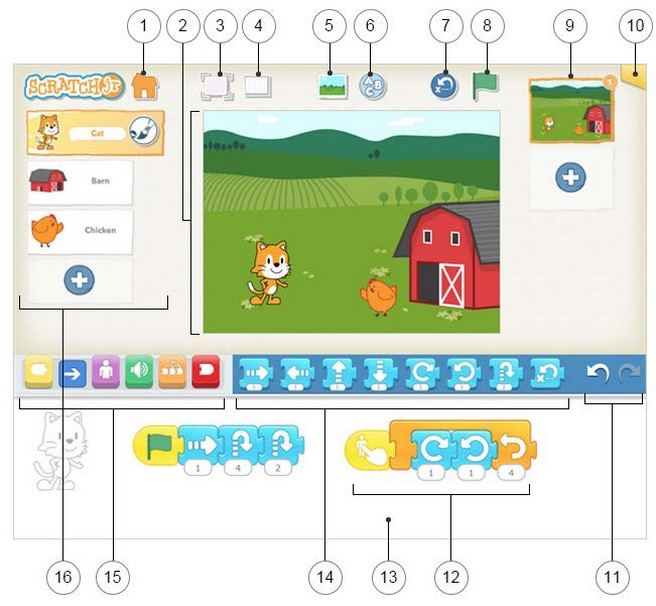

[Main Kyoto Coding Page](https://kyoto-lesson.github.io/)|Junior Coders:|[Monday PM index](../monday_pm)|[Lesson index](../lessons)

# a-001 Introduction to the computer and ScratchJr

* [a-001 Introduction to the computer and ScratchJr](#a-001-introduction-to-the-computer-and-scratchjr)
  * [Review Agenda](#review-agenda)
  * [Languages we speak](#languages-we-speak)
  * [Rules, Expectations, What To Do When](#rules-expectations-what-to-do-when)
    * [Rules](#rules)
    * [Expectations](#expectations)
    * [Procedures](#procedures)
  * [Name Game?](#name-game)
  * [We Are Working Together](#we-are-working-together)
  * [Teacher Says](#teacher-says)
  * [Using the tablet](#using-the-tablet)
  * [Open Scratch](#open-scratch)
  * [Snack](#snack)
  * [Homework](#homework)

## Review Agenda

Today was the first day of class. The first thing I did was review what we were going to do today.

-   Work together mostly
-   Learn some class rules
-   Learn about each other
-   Learn Special Computer words
-   Play some games. Today a lot!
-   Have a snack. (Please remember)
-   Learn how to use the tablet (turn it on, off, etc.)
-   Make sure your tablet is ready for this class
-   Meet a robot
-   Learn about ScratchJr

## Languages we speak

We then talked about which languages we speak.

-   We did a show of hands to see who speaks English, Japanese, or French. What about different combinations?
-   I mentioned that in class we will use mostly English, some French, and some Japanese.
-   I mentioned that I can also speak Portuguese and American Sign Language. One of the students speaks Korean, and he gave us an example.

## Rules, Expectations, What To Do When

### Rules
Since this was the first class, I wanted to establish some ground rules. These included:
-   Ask before you touch other computers.
-   Don't listen to videos or internet or video games unless directly related to a project and with permission.
-   Make it easy for others to work: be quiet, helpful, thoughtful
-   Treat all equipment properly and clean up carefully.
-   Take turns when speaking.
-   Listen when others are speaking.
-   Make this a fun place: Be respectful. Use nice language, touch, and manners.

###  Expectations
I also mentioned some of my expectation for the kids, which is to say rules that help me keep the class safe and focused on learning and having fun.
-   Listen when asked. Pay attention.
-   Do when asked. As soon as is reasonable.
-   Do as asked. Follow directions.

###  Procedures
I also went over some important class procedures, and why they were there
-   **When you need to go to the bathroom, go. When you get out, WASH YOUR HANDS! (Why?)** (Obviously this one is very important)
-   When you don't understand, ask
-   When you want to help, great! BUT, use words. Help without touching. (Why?)
-   When someone helps you, listen carefully and use their good ideas. Do it yourself!
-   When the teacher is busy, be patient.

## Name Game?

The first game we played was the classic "name game". Kids were very excited and eager to meet the challenge. The rules were:
-   Say the person's name and throw the newspaper to them.
-   If it falls, go back to the begining
-   Go in the same order each time

We did this a few times until everyone knew each other's name (especially me) and then we did it again to try for speed. We didn't go much faster, but had fun.

## We Are Working Together

I prepared for the next game by talking about computer language. For example:
-   There are _special Words_ for computers
-   Most of the _special words_ are in English
-   The meaning of _special words_ is sometimes different than the usual word, for example, _mouse_.

## Teacher Says

We played a game whose purpose was to make sure everyone knew some basic vocabulary for user actions, and how to perform the actions. Since I expected to have to use this vocabulary often, I wanted to be sure the kids would know it. The rules were:
- If I say "Teacher Says" it means everyone does what I say.
- If I don't say "Teacher Says", no one does anything.
- If I don't say it, and you do it, you have to kneel for one turn.
- If I  say it, and you don't do it, you have to kneel for one turn.

The kinds of vocabulary and actions we practiced were:
-   First Set: Tap, Hold, Let Go
-   **Tap** your _nose_
-   **Tap** your _nose_ _2 times_, _3 times_, _4 times_, etc.
-   **Tap**  *slowly, quickly, smoothly, roughly, soft, hard*
-   **Double Tap** your nose
-   same with _ear_, _knee_, _table_, som _classmate_, _computer_
-   **Tap and Hold**
-   **Double Tap and Hold**
-   **Let go**

-   Second Set: Drag and Scroll
-   **Tap and Drag on** on the table.
-   **this means TAP and HOLD and DRAG and (sometimes) LET GO**

In the future I plan to go over:

-   **scroll** on the table, face, leg, etc.
-   **scroll up**, **scroll down**, **scroll right**, **scroll left**

## Using the tablet

We made sure everyone could turn the tablet on, off, and get to the Scratch program.

## Open Scratch

We then started using the scratch program itself. Most of the kids knew how to open the program and start a new project.

Once we were at the main interface.

I went over the top row of buttons.

- I also made sure they knew the yellow start button
- I added a few of the blue motion buttons
- I finished with the red stop buttons.

Once the kids were at this stage they started to have questions, and some of the things we talked about were:

- How do you change the background?
- How do you rotate a sprite?
- How do you draw lines and shapes in the sprite?
- How do you take a picture and use it in your background or sprite?

## Snack

We had a somewhat late snack, and all the kids continued working through it. At the end, kids showed off their original creations to the group--with some inattention :-)

## Homework

The homework assignment was to make a scratchjr. project where the sprite would walk to each corner of the view area when the start button is pressed.

